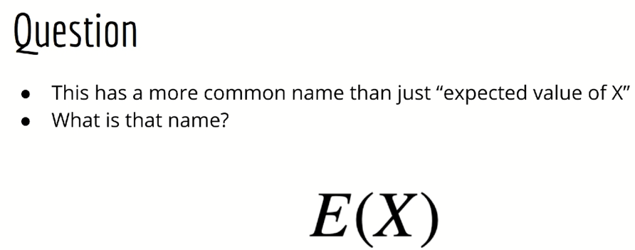
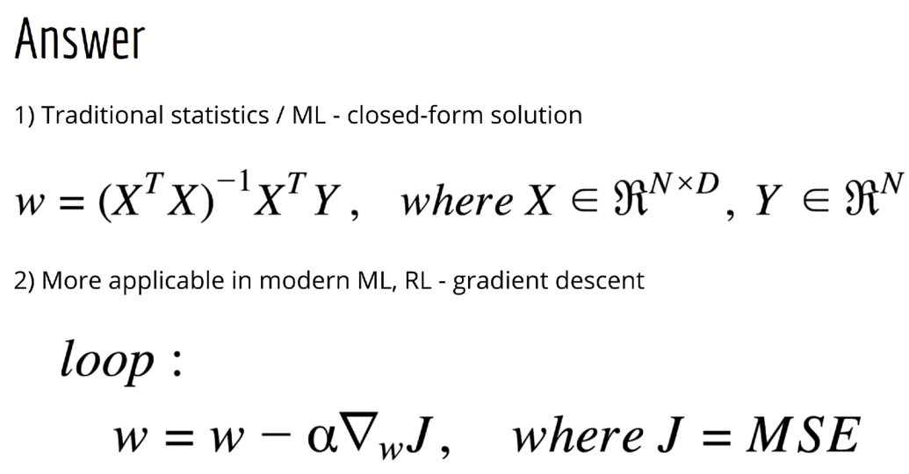

# Warmup

&nbsp;&nbsp;&nbsp;so the language of this class is going to be probability. Everything we do is based on undergraduate level probability we're going to start with a simple question. We have to probability distributions here P of A comma b and p of a vertical bar. B The question is what do we call these two kinds of distributions. In other words what did this comma and this vertical bar mean by the way.  
So the answer is p comma a B really means P of A and B. This is the joint distribution between the random variables A and B the other distribution is a conditional distribution. We read it as P of A given B it's the probability distribution of a given that we already know B all right.

&nbsp;&nbsp;&nbsp;Next question. Let's suppose I'm given some probability distribution p of x y. By the way. Now you know that this is a joint distribution between the random variables X and Y. Let's say I want to know the distribution p of Y. I have two questions for you here number 1. What do we call the process of finding B of Y using p of x and y. And what do we call P of Y. In this context. And number two how do we actually find P of Y. Using p of x and y.

&nbsp;&nbsp;&nbsp;This is a process called marginalization and in this context we would refer to p of Y as the marginal distribution. If X is a discrete random variable we would find it by taking p of x and y and summing over all possible values of X if X is a continuous random variable. We would find it by taking p of x and y and integrating over all possible values of x.

&nbsp;&nbsp;&nbsp;Next question which is somewhat related to the previous one I have here this weird e symbol and inside of it I have the random variable X as a side note I want to mention that you may see this in slightly different forms depending on where you look. I will just use a regular E since it's pretty unambiguous and they don't have any fancy e's in the program that I use to make these lectures but you can also have a bully or a fancy. All are valid. In addition you might see this with round brackets square brackets or squiggly brackets. All are fine. Finally yet another nuance you may encounter is that sometimes that you will be subscript ID by a letter corresponding to a random variable. Or it may be subscript it by whatever symbol you are using to represent the distribution of that random variable. And sometimes there will be no subscript at all. Usually that's because it's pretty obvious what distribution we're referring to. Again all are valid.  
So my question for you is given some probability distribution p of x.  
How can I calculate e of X and what do I call this value

&nbsp;&nbsp;&nbsp;so the answer is.  
This is called the expected value. We can calculate the expected value in a very similar way to marginalization. So if X is discrete we take the sum of X times P of X over all possible values of x if x is continuous. We take the integral of x times P of X over all possible values of X

&nbsp;&nbsp;&nbsp;the next question is another question about expected values. Here's a similar notation but now we have this vertical bar again with a Y on the right side of the bar. The question is again what does this mean and how do I calculated.

&nbsp;&nbsp;&nbsp;So this is called the conditional expectation. It's analogous to the previous expectation. We looked at the random variable is still X but now we take the integral over x times P of X. given y. In other words we use the conditional distribution instead of the marginal distribution.

&nbsp;&nbsp;&nbsp;Next question. Suppose I am given some function G and I want to know what is the expected value of G of X again. 

&nbsp;&nbsp;&nbsp;We differentiate between the discrete and continuous cases. If X is discrete this is the sum of G of X times P of X over all possible values of x if x is continuous. This is the integral of G of X times P of X over all possible values of x. This is sort of a generalization of the expected value of X since in the plain expected value. The function is just identity

&nbsp;&nbsp;&nbsp;next question. Suppose I have some constancy in some random variables X and Y I want to calculate the expected value of c times x plus y under some distribution. It is a matter what distribution it is but if you want one then let's say it's the joint distribution between X and Y. The question is using the fact that the expected value is a linear operator. How can I expand this expression.

&nbsp;&nbsp;&nbsp;In fact you did not even need to know that the expected value is a linear operator. In order to answer this question this can be derived from the answers to the earlier questions since the expectation is a linear operator. The expected value of a sum of random variables is equal to the sum of the individual expected values and we can bring the constancy outside the expectation.

&nbsp;&nbsp;&nbsp;The next question is this the expectation of X actually has a common name. What do we call it.

&nbsp;&nbsp;&nbsp;The answer is the mean. The expected value of x refers to the true mean of x.

&nbsp;&nbsp;&nbsp;The next question is this. We know that integrals and summations overran a variables can sometimes be intractable. This is different from taking derivatives which is completely mechanical and therefore easy. In fact we now have programming libraries that can do it automatically. Integration on the other hand is almost always impossible and is usually only tractable as an exception. So given this fact we typically want to estimate the expected value instead of doing some integral in order to calculate it. The question is if I can draw samples from the distribution p of x how can I estimate the expectation of X.

&nbsp;&nbsp;&nbsp;the answer is if I can draw samples from the distribution of x then I can just take the arithmetic average of those samples to get an estimate for the expected value of x. As for the previous questions the expected value of x is called the mean and thus this estimate is called the sample mean. We call this approach to estimating certain values. The Monte Carlo method.

&nbsp;&nbsp;&nbsp;for the next question. We're going to go back to probability distributions. Let's suppose I know the conditional distribution p of x given y and I know the marginal distribution p of Y. How can I use these to calculate P of Y given X.

&nbsp;&nbsp;&nbsp;The answer is by using Bayes rule. In general P of Y given X is equal to P of X and Y divided by P of X.. That is the joint distribution divided by the marginal distribution of x. Of course we were given neither of these. So we have to put them into terms of distributions we were given p of x and y is just p of X. given y times P of Y. And as you know p of x is a marginal distribution which means it's the sum are integral of the joint distribution over X Y which is just the same as p of x given y times P A Y that we have on top. Now again it's important to remember that in practice integrals and summations of this type are generally hard or impossible. We will see later in this course how they can be dealt with elegantly without having to resort to Monte Carlo methods.

&nbsp;&nbsp;&nbsp;for the final exercises in this warm up. We're going to switch gears a bit and talk about function approximation better known as machine learning. We're not going to look at any fancy machine learning models in this course just linear regression which is usually day one in most machine learning classes these days. So suppose I'm given a set of data points X1 y one X two y 2 all the way up to X and Y N. In this case we can say that the X's are D dimensional vectors and the whys of scaling this as you know the basic linear regression model is y hat equals w transpose X where y hat is the model's prediction for y given X and W is a D dimensional vector of model parameters the question is in a linear regression what lost function should I use to adjust w so that the Y has are close to the Y's in the data center.

&nbsp;&nbsp;&nbsp;The answer is the mean squared error it's the squared error between the Y and Y hat for each data point I sum for all eyes from 1 to N. Alternatively you could also save a sum of squared errors which is also fine. You just have to adjust the rest of your answers accordingly.

&nbsp;&nbsp;&nbsp;The next question is this given our lost function the means squared error. What are two ways I can find the optimal value of the weight vector w

&nbsp;&nbsp;&nbsp;here's the answer. The first method which is the 1 students usually learn about in traditional statistics or a machine learning course is called the closed form or analytical solution. We can get this by putting all of the X vectors into a giant matrix called the big X which is a shape and by D and putting all the y samples into a giant vector called the Big Y which is of shape and by 1 then we plug those into this formula and you get the weight vector w the second method which is more applicable in a modern machine learning including reinforcement learning is gradient descent. The idea is in a loop. We repeatedly find the gradient of the loss with respect to the parameters W and then take small steps in the direction of the negative gradient the size of the step is determined by the learning rate alpha.

&nbsp;&nbsp;&nbsp;it's important to note that gradient descent and gradient descent are actually one in the same. Suppose I take the negative of our loss call it a utility and say that we want to maximize this utility. Well if I take the gradient of this and go in the positive direction it's actually no different than going in the negative direction of the original gradient. Since you can just bring the minus sign outside this is usually a big point of confusion for beginners. So make sure you can see how this works.

&nbsp;&nbsp;&nbsp;The next question is this because we know that gradient descent is one method for solving for the optimal value of W.. Let's find the gradient of the mean squared error with respect to W. Of course this would be necessary in order to even do gradient descent.

&nbsp;&nbsp;&nbsp;So here's the answer for the gradient. One method is to state it in terms of individual samples X I and Y which is fine but in code since we normally calculate summations using for loops we would rather avoid for loops if possible since they are slower then more vector rise operations. And so if we use the matrix form of our dataset we can express the gradient as to over n times a big X transpose times big X times w minus big Y

