# Stock Trading Project Section Introduction

&nbsp;&nbsp;&nbsp;In this lecture I'm going to introduce you to the next project of this course, creating a reinforcement learning training by.  
usually when people think about applying machine learning to the stock market they usually think about it in terms of predicting the value of a stock which includes even just the direction like whether it will go up tomorrow or down tomorrow. Of course that information by itself doesn't do anything physically. You still need to sit down at your computer and make a trade. If we're talking about automated high frequency trading then that's a different story. Even so let's say your model predicts that the stocks you are looking at will go up tomorrow. Does that mean you'll make a trade. Maybe, but what if you're busy and you forget. Or what if you believe it's going to go up only slightly and then decrease rapidly then probably you don't want to buy that stock. This is the key difference between a traditional supervised and unsupervised learning versus reinforcement learning.  
Supervised learning only makes a prediction. It doesn't actually take any action based on that prediction. I can predict tomorrow's stock price but I still have to choose whether I will act on that information or not. Reinforcement learning on the other hand not only makes predictions but also takes actions in the environment that you provide. So in this section of the course we are going to study how a reinforcement learning algorithm might take such actions in a stock trading environment

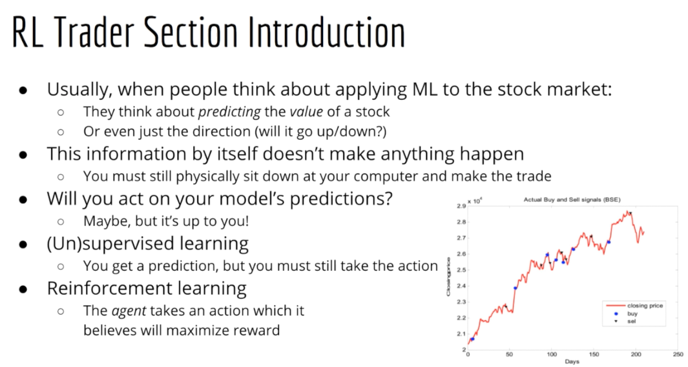

&nbsp;&nbsp;&nbsp;let's just go over a rough outline of how this is going to work. Currently you probably just think of stock prices as a simple time series data set. At this time it has this value at the next time it has this other value and so on. That sounds more appropriate for a recurrent neural network rather than reinforcement learning. So what makes this a reinforcement learning problem.

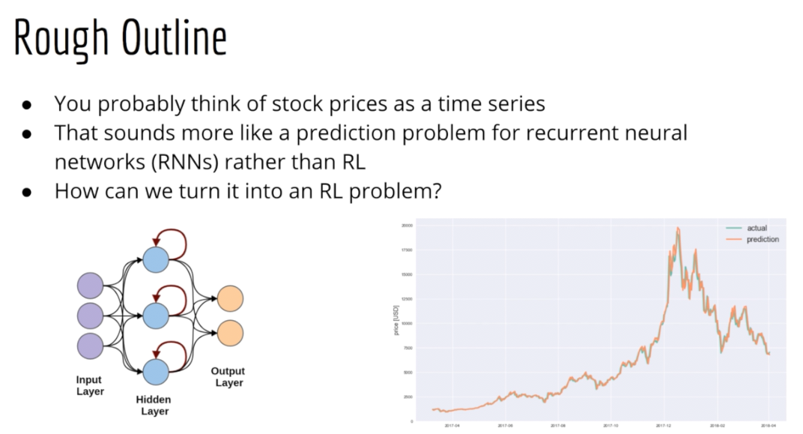

&nbsp;&nbsp;&nbsp;Well it's a matter of perspective. Imagine let's say you're hooked up to a stock trading API using this API you can call functions which do real world financial transactions. So if I call the buy function pass the argument GOOG and 10 that means I'm going to buy 10 shares of Google stock. If each share is worth fifty dollars that means five hundred dollars is going to be deducted from my bank account and instead I will now own it 10 shares of Google

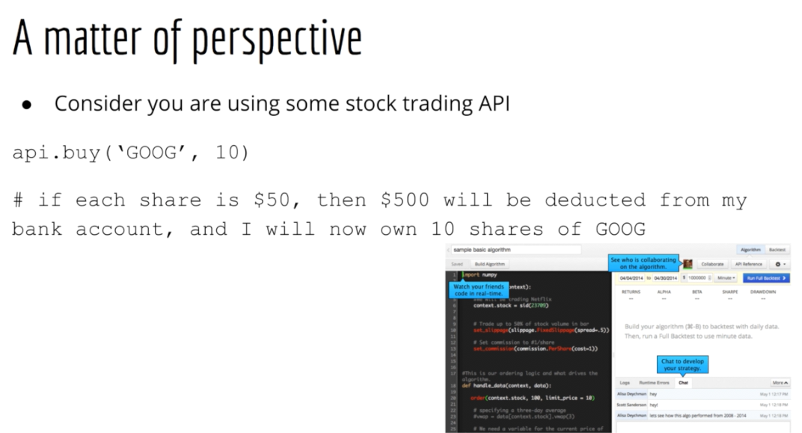

&nbsp;&nbsp;&nbsp;let's say I call the sell function and I pass in the argument AAPL with the number five. That means I just sold five shares of Apple stock. If one share of Apple is worth thirty dollars then I will now receive one hundred fifty dollars in my bank account and I will own five less shares of Apple stock than I did before.

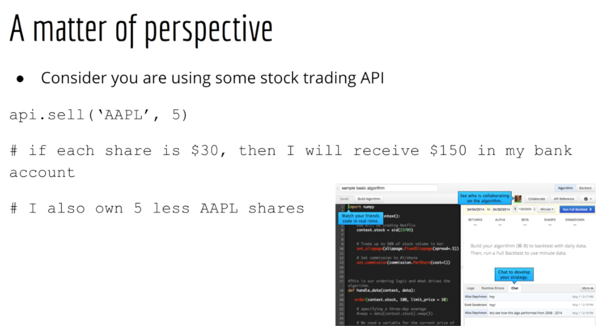

&nbsp;&nbsp;&nbsp;Importantly you can see that the act of calling these functions is an action you might think of your state as information such as recent stock prices. How much cash you have to buy my stocks. How many shares of each stock you own the values of those stocks and so on.  
The environment is the actual stock market. It's inherently random because you can't really predict what's going to happen to tomorrow's stock price but your actions affect the environment. In other words these are all the ingredients we need to specify our problem as a reinforcement learning problem. We can perform actions such as buy and sell in the environment and our state is made up of information about various stocks in our own portfolio and the environment is the stock market itself. The reward is some function of the money we made or lost

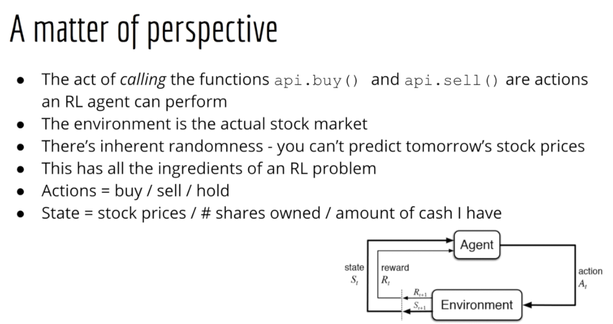

&nbsp;&nbsp;&nbsp;something useful to try.  
Which is probably something many of you have done already is to think about how you yourself are a reinforcement learning agent. When you are looking at a stock and trying to decide whether or not to purchase some shares you generally want to follow the rule buy low sell high. So for example here we can see a dip in value. This would be a really good time to buy. And here we see a peak. This would be a really good time to sell well. Only if you need the money. Hopefully you are investing in something where the general trend is always going up. So if you don't need the money then the best thing to do is just let it sit and continue to increase in value. Of course the problem is that in the real world you are trying to make these decisions without knowledge of the future. How do you know if the most recent price is a dip or a peak. In fact we do not. And so perhaps this is a job best left for the machines.

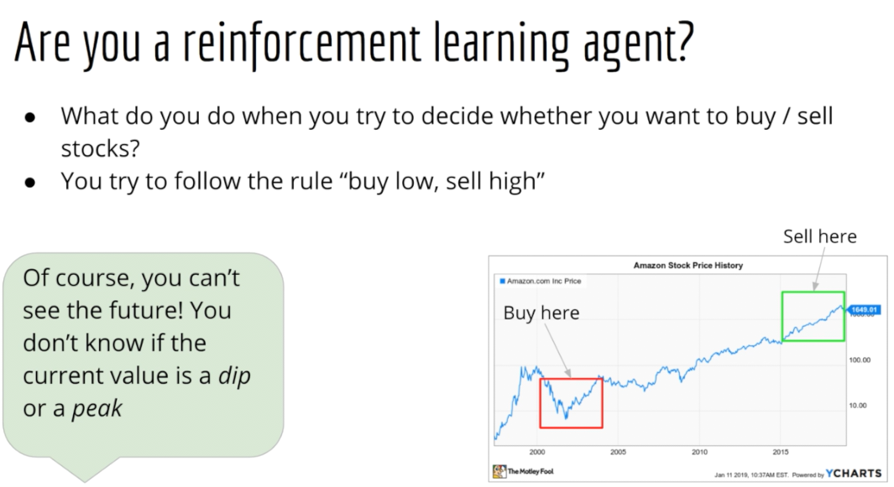

# Data and Environment

&nbsp;&nbsp;&nbsp;In this lecture we are going to describe the environment we'll be working with in the following lectures.  Firstly because we'll be working with historical stock data, this is a simulation. Of course you would not want to try such an experiment with real money. So really our job is to figure out how to build an environment object in code that simulates the stock market.

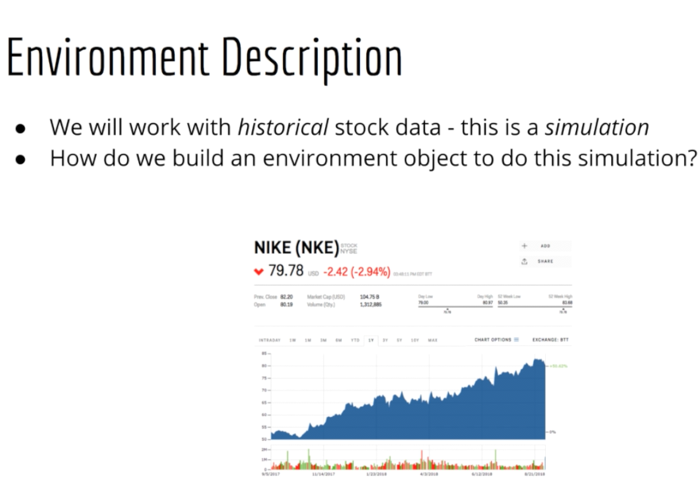

&nbsp;&nbsp;&nbsp;In general, here's how we can think of the API for an environment. By the way, if you're familiar with openAI gym then this is probably just review for you. But it's good to go over this anyway. So the idea is this.

First we are going to instantiate an environment object  
Then we are going to initialize a boolean done flag equal a false.  
We are also going to call `env.reset()` which puts us back into the starting position for this environment and returns the initial state. As a side note this state vector may not be at a good scale to pass into a neural network. As you recall remember that we like to normalize data before passing it into a neural network or linear regression. So keep in mind that you can do this as an optional step.  
Then we are going to enter a loop which only quits when done becomes true. Inside the loop, We are going to choose an action to perform in the environment. This might come from our agent but that's not a necessary detail at this stage because we are only thinking about the API for the environment. You could just as easily choose a random action although most likely this will lead to a suboptimal reward.  
The next step is to actually perform the action in the environment. We do that by calling `env.step()` and passing in the action as an argument. This will return a few things:  
First it returns the next state. Second it returns the reward for arriving in the next state. Third it returns a done flag to tell us whether or not the episode is over. Finally it returns and info dictionary which can tell us additional information about the environment.  
This one is not strictly necessary and in fact it's empty for many environments but for us we actually going to populate the info dictionary to tell us the current value of our portfolio. This is in part of the state but can be calculated from the state variables. Thus it's easier to simply calculate it inside the environment and return it along with everything else.  
Finally we assign the next day variable to the state variable in the case where on the next step the agent needs to use the state to choose an action

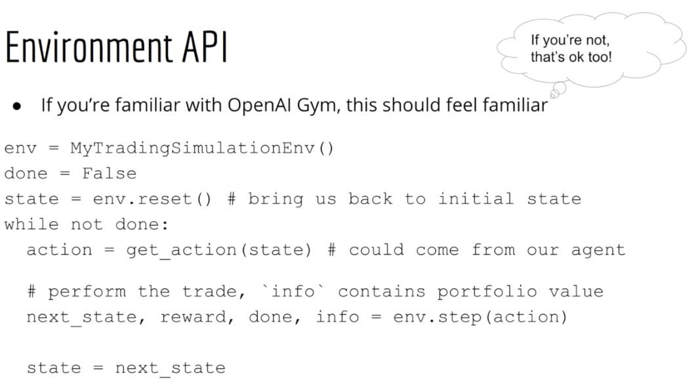

&nbsp;&nbsp;&nbsp;so that's pretty simple and you'll find that in general no matter what environment you are looking at it's going to have an API just like what we saw.  
The questions we really want to answer now are:  
what should the state be and what should the action be and what should the reward be.  
The reason we need to discuss these is because there are an endless number of possibilities and complications. We aren't necessarily going to have to simplify the problem a little bit but first let me explain to you why this simplification is necessary

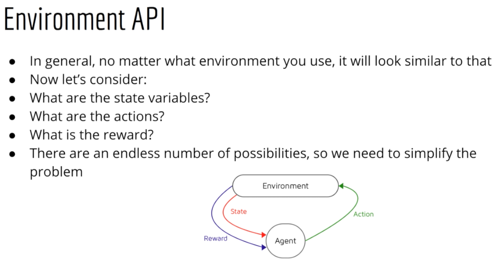

&nbsp;&nbsp;&nbsp;let's start with the state. There are many things you could consider here. First you can think of it exactly like a time series problem. Look at the pattern of stock movements in the past and from that make a decision. That's probably the first thing you and I would do when we decide if we're going to buy or sell a stock. However there are other things to consider. We also have to ask do we own enough cash to buy the stocks we want to buy and given the prices of existing shares I own Is it worth it to sell them in order to get more cash to buy a different stock. So in fact this can become a complex decision problem.

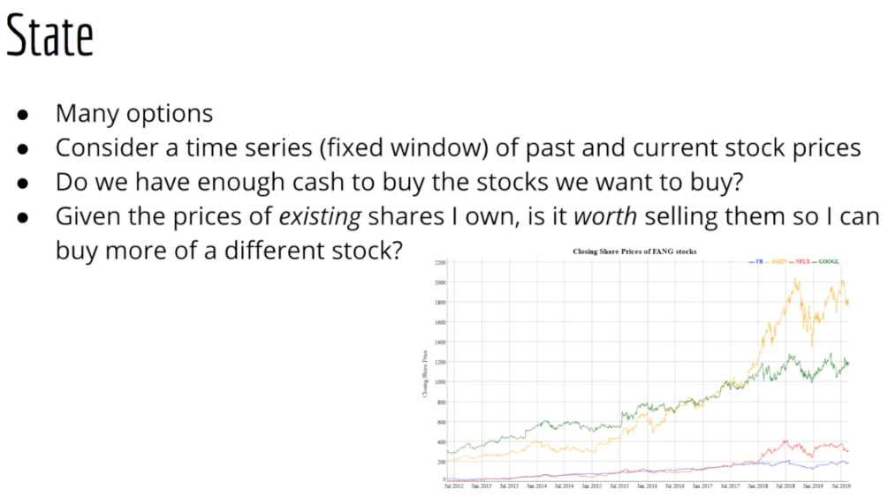

&nbsp;&nbsp;&nbsp;We are going to borrow some ideas from a paper called Practical deep reinforcement learning approach for stock trading.  
This approach used a more advanced reinforcement learning technique known as DDPG but we can apply a few of the ideas they proposed. So here's how we're going to represent our state.  
It will consist of three parts First we're going to record how many shares of each stock we own. So for example if I'm looking at Apple Motorola and Starbucks this means I own three shares of Apple five shares of Motorola and seven Shares of Starbucks.  
Second We're going to list out the current share price of each stock. So this means Apple is trading at fifty dollars per share. Motorola is trading at twenty dollars per share. And Starbucks is trading at thirty dollars per share.  
Finally the last value of the state is how much pure cash we have. That's cash that's not invested in any stock which just sits there and doesn't gain any interest so let's say we have one hundred dollars in cash then our total state vector will be 3 5 7 50 20 30 and 100 you should be able to confirm that if we have N stocks than the size of our state vector will be 2N+1

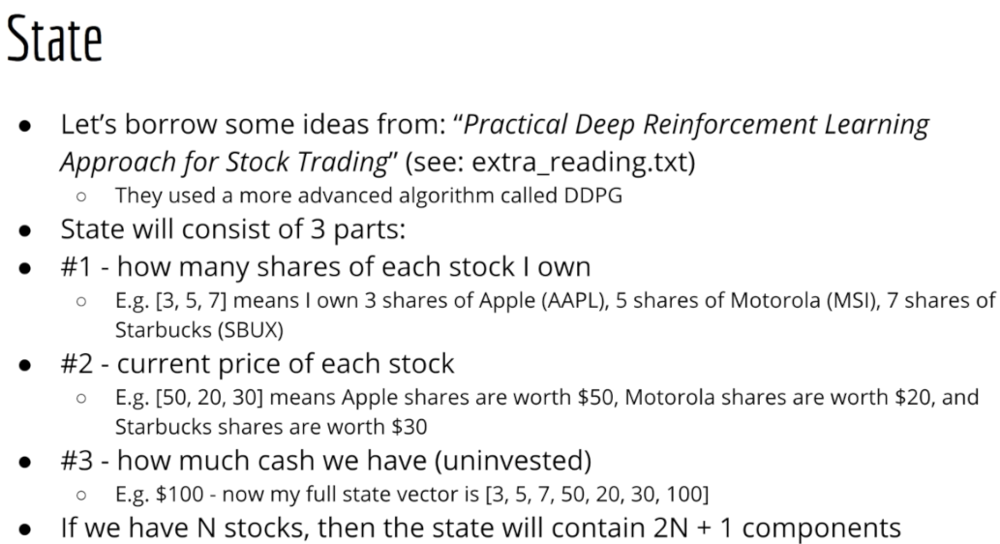

&nbsp;&nbsp;&nbsp;Next, Let's consider the actions. Again if we consider the sheer amount of possibilities the action space would be extremely large. For any given stock, I have three possible options. I can sell I can buy or I can hold Which means do nothing. Now you might think three is not bad. But now remember we have three stocks to consider. For each of these, I can exercise any of the three options above. So that gives me three to the power three possible actions or twenty seven actions.  
For example my action vector maybe sell sell sell which means sell my Apple shares sell my Motorola shares and sell my Starbucks shares or it might be buy sell hold which means by Apple shares sell Motorola shares and do nothing with my Starbucks shares however this is still not the end of the story because this doesn't say anything about how many shares to buy or sell. If I own ten shares of a stock I can sell anywhere from zero to 10 of those shares. Luckily we are going to simplify this problem a little bit.

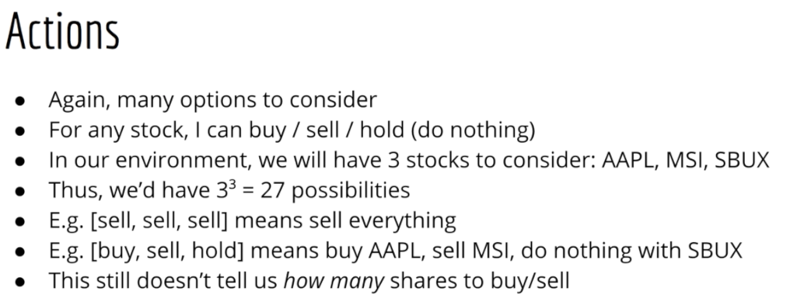

&nbsp;&nbsp;&nbsp;So here's how we're going to treat actions in our example. It's going to be extremely simplified compared to how things work in the real world but it's a decent start. First we're not going to consider any transaction costs. For example if you buy shares using your bank's investing platform usually that would cost you ten dollars or so. For us it will be zero.  
Next when we sell, We will always sell all of our shares for that stock. So let's say we own 10 shares of Apple stock and we decide to sell. That means we sell all 10 shares.  
secondly when we buy we are going to buy as many shares as possible for the stock we choose to buy. Now you might wonder if I choose multiple stocks to buy and I want to buy as many as possible. How can I do that. Well it's kind of ambiguous. You might think you want to choose the stocks in such a way that leads to using up as much cash as possible. But in fact this is actually a hard problem known as the knapsack problem.  
So what we're going to do is we're going to take a simple greedy approach loop through every stock and buy one share of each stock and keep doing that in a loop until we run out of money.  
Third we will also sell the stocks we want to sell before we buy anything that will leave us with more cash that we can use to buy new stocks.  
This may seem like a very cautious approach but in fact this already leaves us with 27 possible actions which means our neural network will have to approximate 27 different values which is pretty large already and so an action in this environment is not just making a single trade but rather it will involve doing all the steps in the specified order.

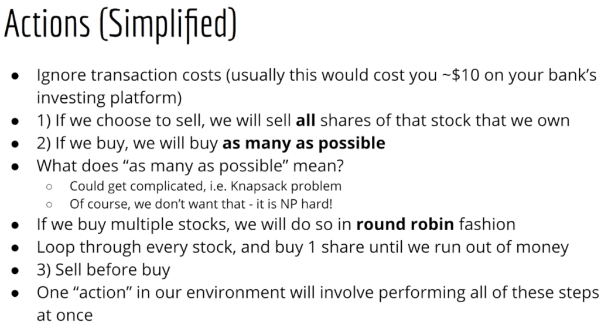

&nbsp;&nbsp;&nbsp;Finally we have the reward. This one is simple. The reward will just be the change in the value of our portfolio. Now it's We're thinking about how well we calculate the value of our portfolio as an example suppose we own 10 shares of Apple 5 shares a Motorola and 3 Shares of Starbucks. The corresponding share prices are 50 dollars for Apple twenty dollars for Motorola and thirty dollars for Starbucks. Let's also suppose we have one hundred dollars in cash not invested in any stock. Then the total value of our portfolio will be ten times 50 plus five times 20 plus three times 30 plus 100. That's equal to seven hundred ninety dollars. 

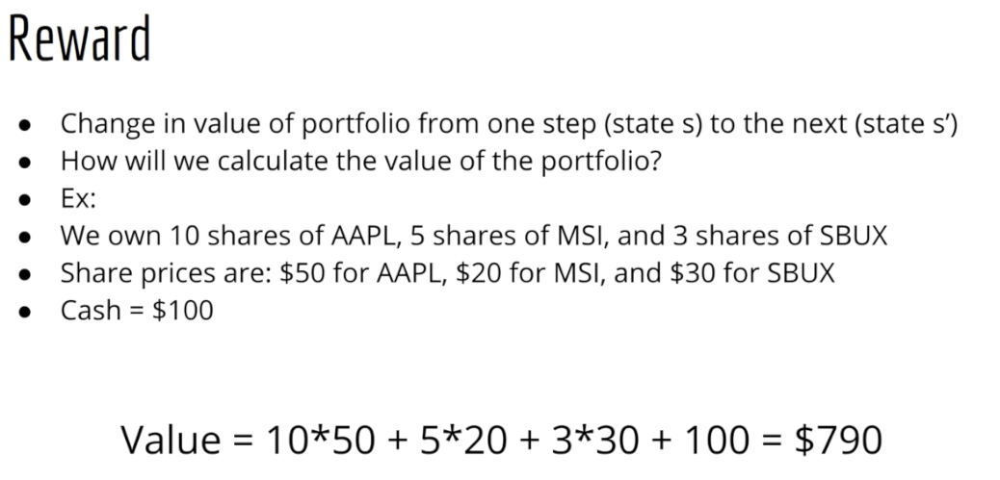

&nbsp;&nbsp;&nbsp;In general if we store the shares we own in a vector called `S` and we store the corresponding share prices in an array called `P` and we store the amount of cash we have in a variable called `C` then the total value of our portfolio can be calculated as follows. It is equal to the dot product of `S` and `P` plus `C` the reward then we'll just be the difference between these two. Comparing the most recent timestamp and the previous timestamp

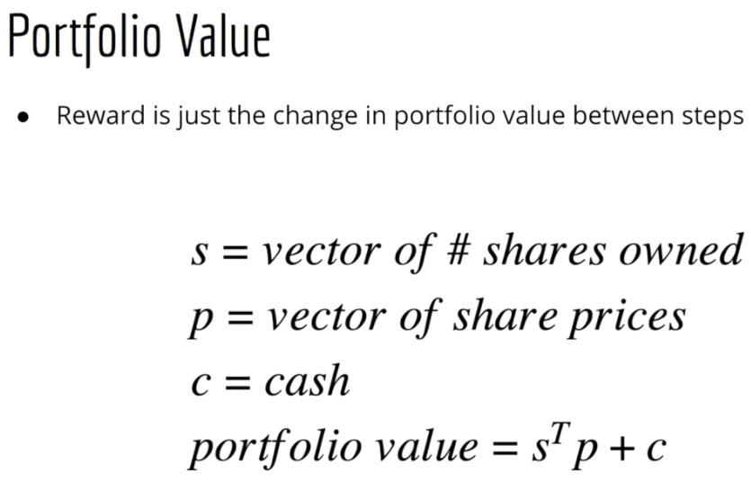

&nbsp;&nbsp;&nbsp;to summarize this lecture let's recap the important points about the environment and its implementation.  
First our environment will be an object that mimics the open AGM API so it will have functions like reset and step which returns all the information we need to implement our reinforcement learning program.  
Next for our environment we'll be considering three stocks Apple Motorola and Starbucks.  
Next, Our state is a vector with three pieces of information. First it includes the number of shares of each stock that we want to consider. Second it includes the share price for each of those stocks. Third it includes the amount of cash we have that's not invested in any stock.  
Next our actions are a simplified subset of the large number of actions we can perform in the real world. We also assume there are no transaction costs. Simply put we have three options for each stock buy sell or hold. We'll take an all or nothing approach where if we buy we're going to buy as many shares as possible and if we sell we're going to sell all of the shares we own. And these reactions can be applied in any combination for each stock we own. So if we're considering three stocks then we'll have three to the power three possible actions.  
You'll notice that even with just three stocks and a much simplified action space we still have quite a large number of actions so if we have N stocks we would have three to the power N possible actions. It grows exponentially with the number of stocks we own. So encoding the actions in this way will not scale. If we have many stocks to consider.  
Finally the reward is just the change in value of our portfolio from the previous steps to the current step. The value of our portfolio is just the price of each stock we own times the number of shares we own plus any uninvested cash we have.

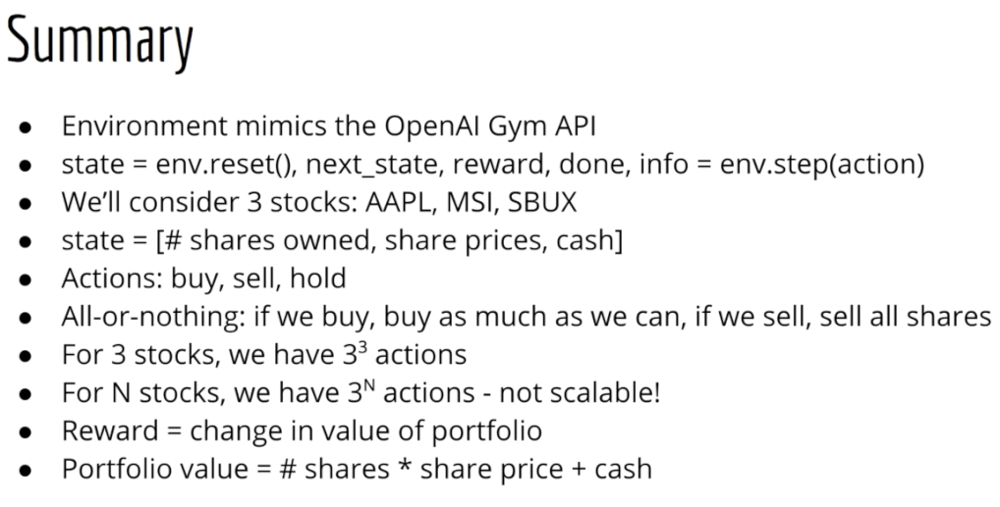

# How to Model Q for Q-Learning

&nbsp;&nbsp;&nbsp;In this lecture we are going to describe the architecture of our model since it's going to be a little different from how we previously described it in the theory sections. It's still going to be a linear regression and it's still going to model the action value `Q(s,a)`. But the idea is we're going to treat the model more like how it's done in a modern deep reinforcement learning. That is reinforcement learning with neural networks

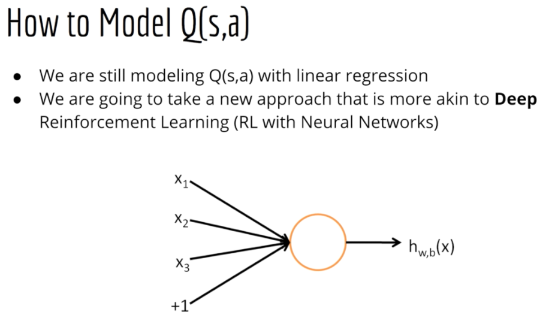

&nbsp;&nbsp;&nbsp;the big difference now is that instead of transforming the tuple `(s,a)` into a feature vector will only use the state as input and we'll have a separate output for each action. As a side note you could still transform the state `s` but the important point is that we do not incorporate the action into the feature vector.  
So as an example consider our trading environment. In this case our state is of size seven. There is three for the number of shares of each stock we own. Three for the share prices and one for the amount of cash we have on invested. The number of actions is three to the power three which is twenty seven. These represent the different permutations of buy sell and hold that we can perform for each stock. Thus our weight matrix will be of size seven by twenty seven and our bias vector will be of size twenty seven

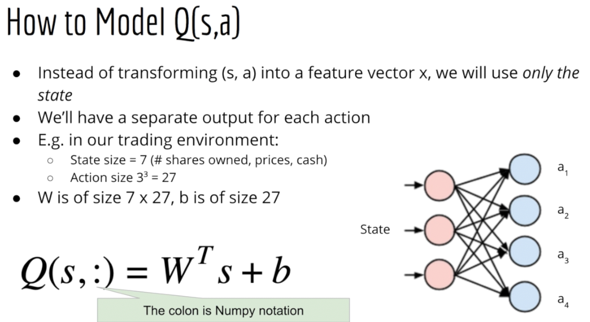

&nbsp;&nbsp;&nbsp;This has implications for the training process which I would like to describe in this lecture. Recall that in order to update our model with Q learning we're going to treat it like a supervised learning problem and do one step of gradient descent for each `(s,a,r,s')` tuple we encounter.  
The target, If we haven't reached the terminal state is `r + GAMMA * max Q(S', a')`the max over `a'`. If we have reached a terminal stage the reward is just `r`.  
The inputs of the model is just `s` which you can assume we've already done a feature transformation on if we need to. Importantly recognize that these targets are scalar is

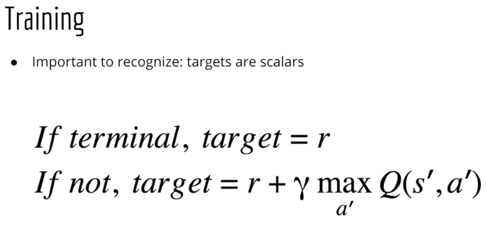

&nbsp;&nbsp;&nbsp;Now normally when we're doing linear regression and we have just one output we perform linear regression like so :  
the target is a scalar and the output prediction is also a scalar.  
W is a vector and the bias term is a scalar.  
So we do W equals W minus learning rate times the gradient of W and B equals B minus learning rate times the gradient of B. And so we just keep repeating that until our cost converges

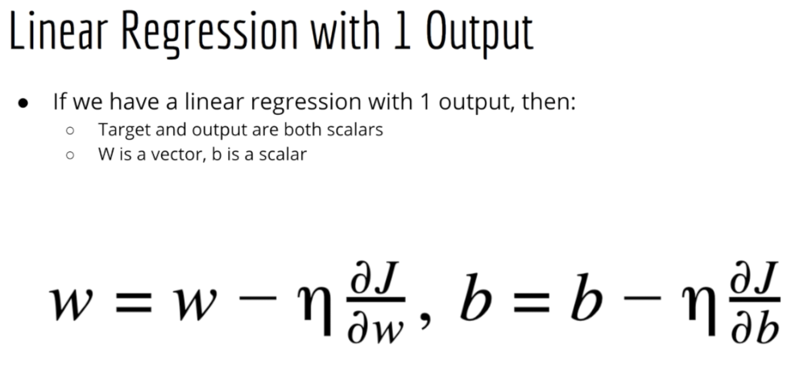

&nbsp;&nbsp;&nbsp;But what happens when we have multiple outputs? Our target is still a scalar `r + GAMMA * max Q(S', a')`the max over `a'`, but now the output prediction is a vector. We have an output prediction for `Q(s,a)` for all actions `a`.

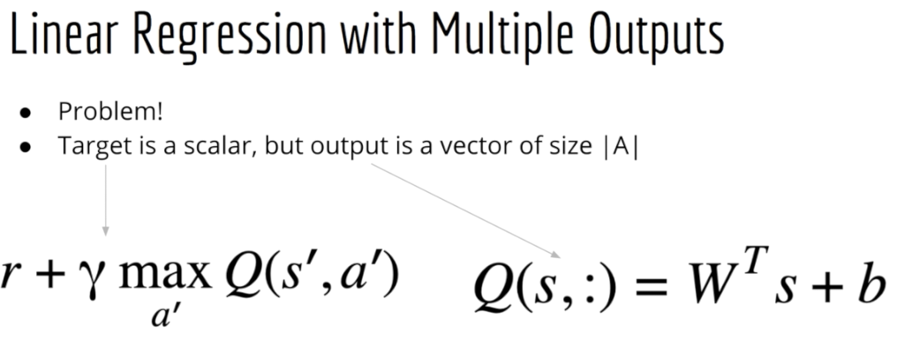

&nbsp;&nbsp;&nbsp;conceptually here's what we want to do:  
We have to ask ourselves Which action did we actually calculate the target for. We calculate it for `Q(s,a)` the prediction. This is the action we actually chose to perform in the environment. The target is not for the other actions. Therefore any weights corresponding to those actions should not be updated. Hence the updates should look like this where we find the gradients only for the action we performed and we update the weights corresponding to that action

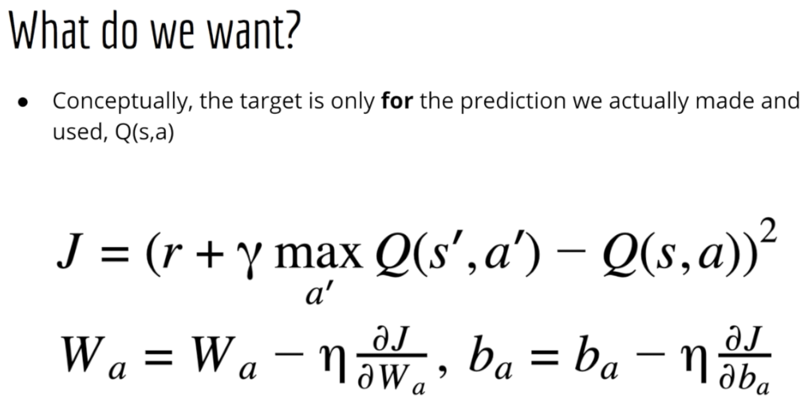

&nbsp;&nbsp;&nbsp;But that was just conceptual. You could implement it like that but I chose to implement it like this since it makes things a little nicer, if you want to extend this model in the future.  
For example you could do something like plug in a tensorflow model and build a neural network instead. So here's what we do. Since our model has K outputs we have K output predictions. Let's say for simplicity's sake that K equals 3. So we have 3 actions a1, a2 and a3 and let's say we perform the action a2 in the environment, so those are the weights we want to update and that's the action that the target corresponds to.  
But in a model like you would have with tensorflow or skitlearn your targets must have the same shape as your output prediction. Therefore we must have K targets as well. We know what the target for `Q(s,a2)` should be. That's the target we calculated earlier but in order for this to be equivalent to what we discussed previously we want the error for all the other actions to be 0 in order to achieve this, We can simply make the target for those actions equal to the prediction. In that way the weights for those actions will not be updated.

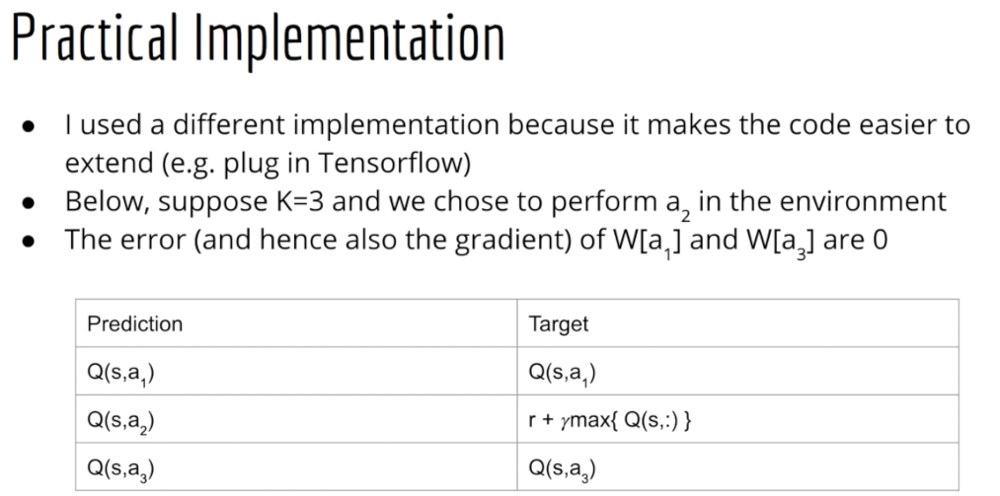

&nbsp;&nbsp;&nbsp;Another small modification We are going to make is that, instead of plain vanilla gradient descent we are going to use gradient descent with momentum.  
Momentum has been shown to speed up training significantly. The basic idea is this:  
Instead of only taking a small step in the direction of the gradient on each iteration we will keep around the old gradients in a term which will call the velocity of the momentum V of T in this way. We'll keep going in the direction we were previously going just like how momentum works in physics. At each step, V of T is updated by taking a small fraction of the old V, v of T minus one and then adding the new gradient `g(t)`. The momentum term `MU` is usually a number just below one like zero point nine or zero point nine nine. The parameter w changes by V of t on each iteration

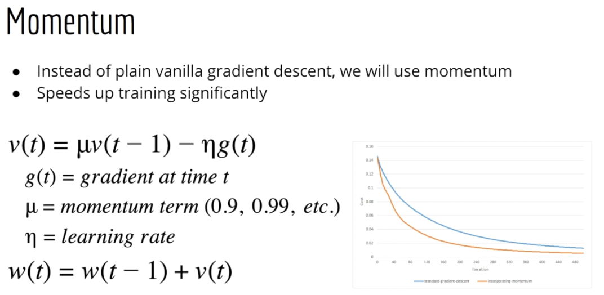

&nbsp;&nbsp;&nbsp;to give you an intuitive analogy. You can think of it as the difference between riding a bicycle and walking when you're walking, You take a step. After you step you land in a new place in order to keep moving You must take another step. Compare that to riding a bicycle on a horizontal road, every time you pedal you will accelerate forward. But importantly even if you stop pedaling you still keep moving forward although eventually you will slow down and stop. So your momentum gradually decreases over time unless you add new movement by pedaling more so you can interpret that as the gradient.

&nbsp;&nbsp;&nbsp;Now you might think this significantly deviates from how we derived the Q learning update. It's morphing into something different at each step of the way. But if you follow the logic it makes sense.  
First we looked at Monte Carlo methods which use the sample mean to estimate the expected value of the return. That seems logical because that's essentially the basis for Monte Carlo methods.  
Second we realize that we can convert the sample mean expressionism into an expression that resembles gradient descent with a learning rate of 1/N. In fact this is gradient descent where the latest sample is the target and the error function is just the squared error. Since it's just gradient descent, there is nothing wrong with us using a constant lending rate instead of the decent learning rate.  
In fact a constant lending rate is better since our policy changes over time in value iteration and hence the distribution of our samples is changing over time. So that seems logical as well.  
Third we go from Monte Carlo to temporal difference methods where we simply replace the target which was the full return into a once that prediction of the return. That's also a logical step. Nothing wrong with that.  
Finally since this is just gradient descent where we have some input and some target and the squared error there is also nothing wrong with us using variance of gradient descent which improve the learning process such as momentum.

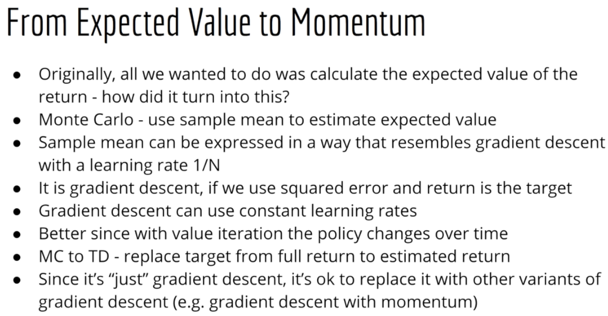

&nbsp;&nbsp;&nbsp;To summarize this lecture here's what we did. First we described a new way of using a linear regression model to approximate the Q table. We use only the state as input and the number of output nodes corresponds to the number of actions. In this way each output node corresponds to `Q(s,a)` for a different action.  
Then we looked at how we would update this model from two different perspectives. First we noted that the target is only a scalar while we have k different outputs. We know that the target corresponds only to the action we took. And so one thing we can do is index the weight matrix and bias vector by that action when we do the update.  
Another way to do it is to make a target which also has size K but make it so that the target equals the prediction for any action we didn't take.  
Finally we noted that instead of plain vanilla gradient descent we would use momentum to speed up training.

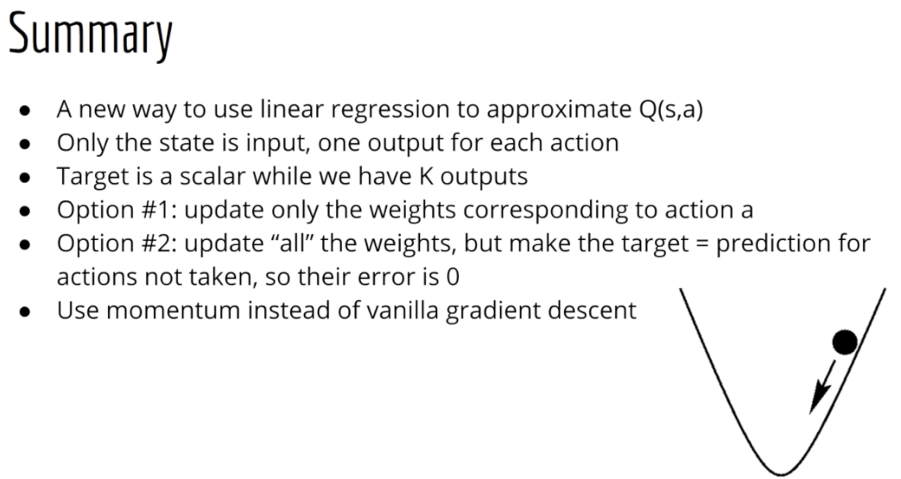

# Design of the Program

&nbsp;&nbsp;&nbsp;In this lecture we are going to discuss the layout and design of our reinforcement learning trading bot. First at a very high level we are going to have two modes of operation. Train and test. As usual we want all of our training data to be in the past and all of our test data to be stock prices that came after the training data. So we are going to train our agent to maximize its reward over an episode using only the training data. Then we are going to use this trained agent on the test data to see what the value of our portfolio is by the end of the test period.

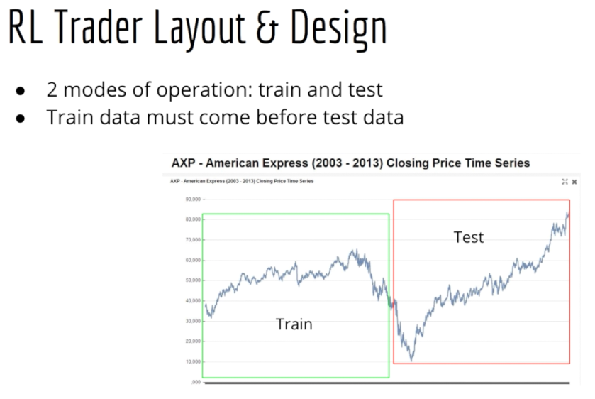

&nbsp;&nbsp;&nbsp;to start let's think about how this would work if we had access to all the objects we needed. Even without the agent this will help us organize the majority of our code. The main part of the code will look something like this.  
First create an instance of the environment.  
Next create an instance of the agent. Don't worry about what this does yet. Then in a loop we're going to have a function called play_one_episode which accepts the environment and the agent and returns the value of the portfolio at the end of the episode. When our loop is done we're going to save the portfolio values for later so that we can plot them and analyze them. So this is pretty simple but now we have to figure out what should go in the function play_one_episode.

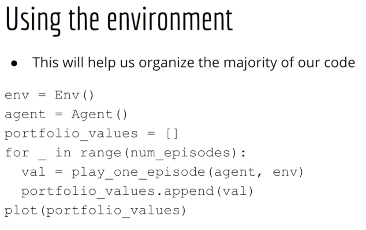

&nbsp;&nbsp;&nbsp;So here's what the play_one_episode function might look like. As always we start by resetting the environment to get back to the initial stage.  
Next we initialize our done flag to false and enter a loop that only quits when done becomes true. Inside the loop, We choose an action. Now at this point you know that this action is coming from our agent but will defer how the agent works until later.  
Next, We're going to call `env.step()` function to perform the action and get back the next day reward and so on.  
Next we're going to check if our script is in train mode if it is then we have to train our agent. This will be some variant of gradient descent as usual.  
Finally we'll set the current state to be the next state for the next iteration of this loop. When we're done we'll return the value of our portfolio

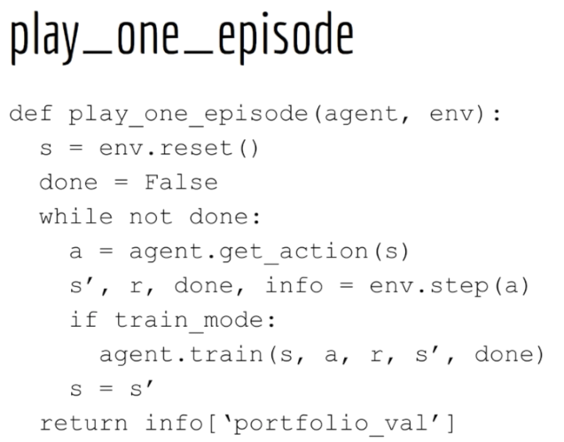

&nbsp;&nbsp;&nbsp;one additional detail to keep in mind is that our data is not yet normalized. You can imagine that our state which is composed of three parts can have vastly different ranges.  
The first part consists of the number of shares we own.  
The second part consists of share prices and the third part consists of how much cash we have sitting on invested. So we'll want to normalize this data. We can do this very simply.  
Whenever we get a new state, We'll have a scalar object from skitlearn which will take our state and standardize it to have zero mean and unit variance. So not a huge addition to our previous code

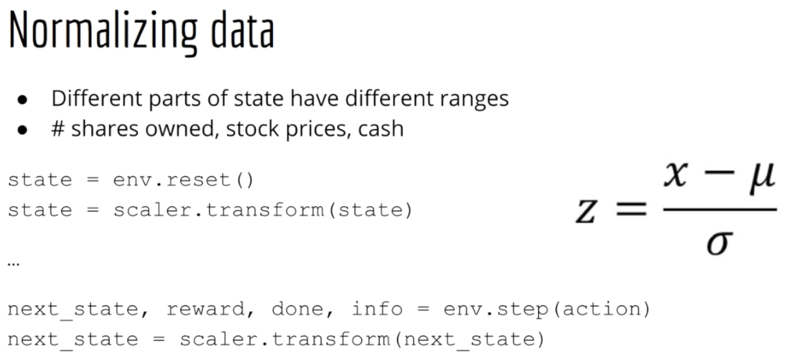

&nbsp;&nbsp;&nbsp;Next, Let's imagine what our environment objects will actually look like.  
First it's going to accept a time series of stock prices as input into its constructor. We'll also have a pointer to tell us what day it is, So we know the current stock prices.  
Well also want to know how much cash we initially start with our initial investment. From this we can do everything we need to do.  
Our reset function will bring our pointer back to the beginning of the time series and recalculate our state which of course should be all cash and no investment.  
In our step function, We'll taken an action and then buy and sell the stocks specified by the action. Then it'll set our pointer to the next day's stock prices. We'll also calculate the next day and the portfolio value. From this we can calculate the reward. The done flag will simply be set to true. If we reach the end of our time series. So that's basically it for the environment we have the Constructor a reset function a step function.

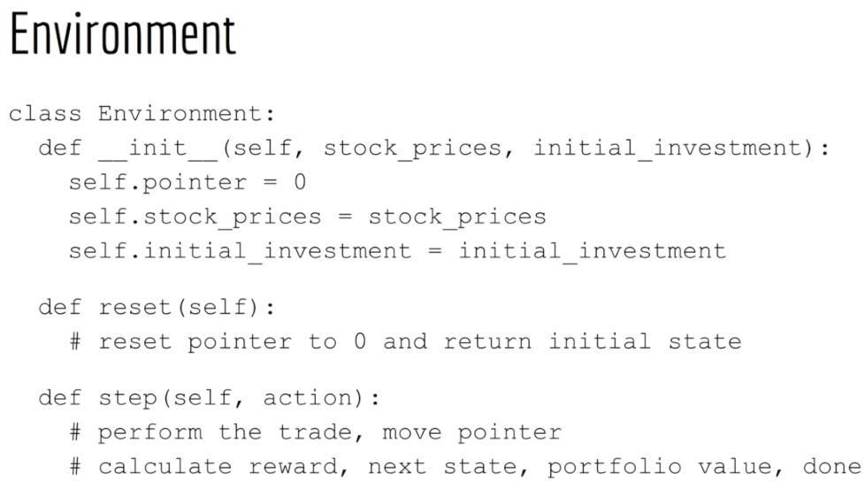

&nbsp;&nbsp;&nbsp;Finally let's consider our agent object which is complicated but no more complicated than the environment.  
So what are the essential functions of the agent?  
We'll need to get_action function which accepts as input state and decides what actions you perform in the environment. And because this is Q learning it's going to use the Q learning rule or some variant of it like Epsilon greedy. We'll need a gradient descent function which does the following.  
First it's going to take in a tuple of data state action reward next state and done flag. We can use this to calculate a supervised learning dataset which consists of input and target pairs which is what we need for our model. The input into our model is the state the target will be the reward if the next state is terminal or in other words done is true. If the next state is not terminal then we use the usual Q learning target `r + GAMMA * max Q(S', a')`the max over `a'`. Once we have our data set we can do one iteration of gradient descent as usual. As a side note we'll be incorporating momentum into our model as well which helps the model converge faster.

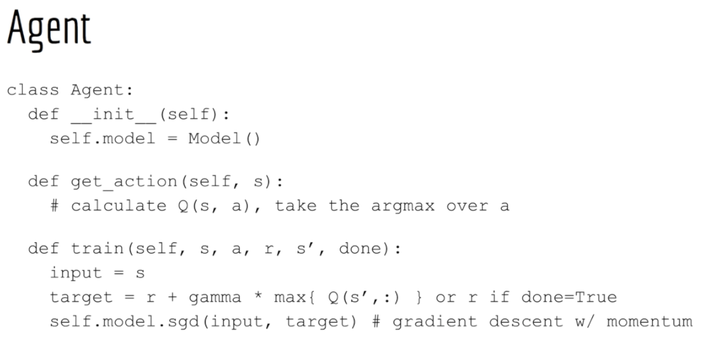

&nbsp;&nbsp;&nbsp;All right. So that's it for this lecture. There are certainly more details we haven't yet discussed since this was designed to just give you an overview. At this point, You understand that our script will have a train mode and a test mode. In both cases there will be a main loop where we call play one episode again and again. Playing one episode involves basically just going back and forth between the agent and the environment. The environment produces states and rewards, the agent takes in states and returns actions to perform in the environment. During train mode, the agent will store the state's actions and rewards and perform Q learning updates in order to train the Q function approximator.

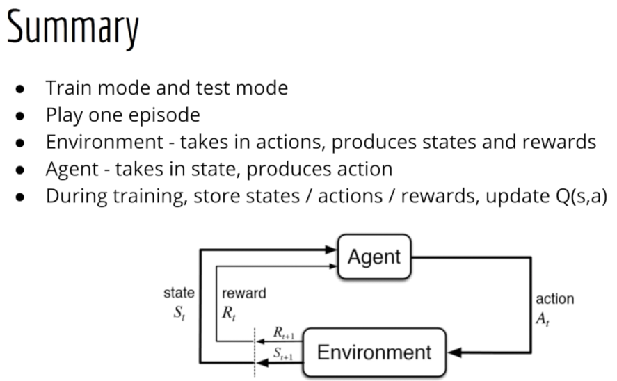

# Code

&nbsp;&nbsp;&nbsp;

