# What is Reinforcement Learning

&nbsp;&nbsp;&nbsp;In this lecture, we are going to answer the question: what is reinforcement learning? How is it different from supervised and unsupervised learning? What are its applications? We talked a little bit about these things in the introduction and in this lecture we are going to expand on those things.

The first thing you'll notice is how different reinforcement learning is from supervised and unsupervised learning. If you were to graphically show how close each of these are, you can see here that supervised and unsupervised learning aren't that different.

Some examples of supervised learning might be spam detection. When an email arrives in your inbox, your email application tries to classify whether it's spam or not spam. Another example is image classification. Given an image, we might want to determine what kind of object is in the image — for example, a car, truck, traffic light, pedestrian, bicycle, and so forth. You can imagine how that might be useful for a self-driving car.

How about unsupervised learning? Some examples of that might be clustering genetic sequences so you can determine the ancestry of different families or different types of animals. Another example is topic modeling. Given a set of documents, you can determine which documents discuss the same or similar topics. With the amount of data on the Internet growing every day, you can imagine that handling everything manually would be an infeasible task. Unsupervised learning is very useful in this case.

Whereas I've drawn supervised and unsupervised learning on the left, in contrast reinforcement learning is way out to the right to give you some idea of how different these paradigms are.

Some examples of reinforcement learning are playing human strategy games such as tic-tac-toe, Go, and chess. Another example is playing video games such as Starcraft, Super Mario, and Dota. Already you can see how reinforcement learning does things which sound a lot like things that humans can do, which can be very dynamic. Whereas supervised and unsupervised learning sound more like very simplistic static tasks which are unchanging.

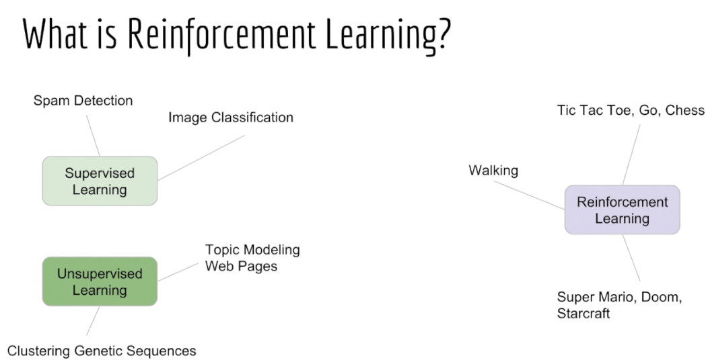

&nbsp;&nbsp;&nbsp;With supervised and unsupervised learning, we always imagine the same interface which we've modeled around scikit-learn for a supervised learning interface. We usually have the functions fit(X, y), which takes in the input samples X and the targets y, and predict(X), which takes in input samples X and tries to accurately predict y.

For an unsupervised learning interface, we usually just have a fit function which only takes in some input samples X. Remember that there are no targets in unsupervised learning. Sometimes we have a transform function which takes in some input samples X and turns it into a different representation that we call Z. Some examples of that might be to return a mapping to some vector or a cluster identity.

The main point of this is supervised and unsupervised learning are actually so similar that it makes sense to put them in the same library in the first place. And it makes sense for their APIs to take on this very simple and neat format.

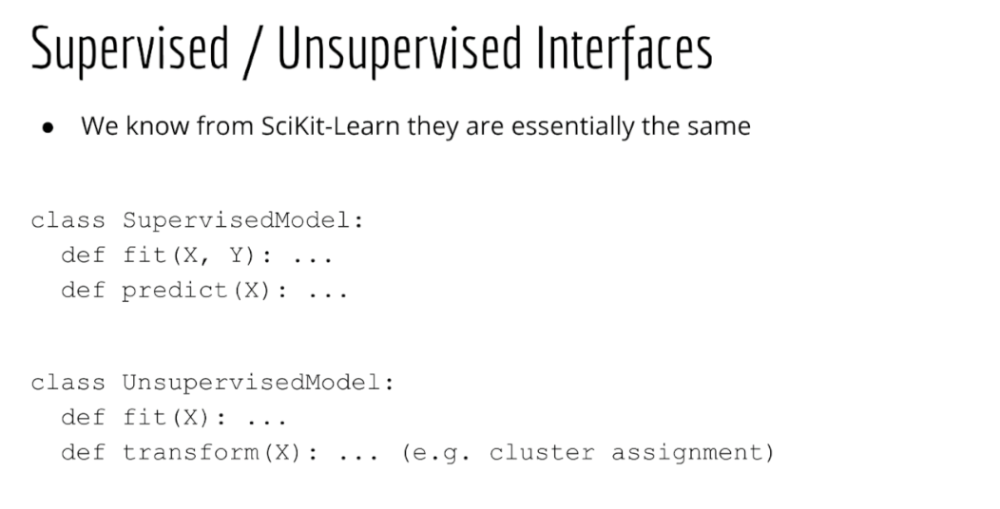

&nbsp;&nbsp;&nbsp;The common theme with both of these is that the interface to these is training data. You take in some training data, either X and y or just X, and you call a fit function. In the case of supervised learning, you can then make predictions on future data. But in both these cases your data X and your targets y are very simple: X is just an n-by-d matrix of input data and y is just an n-length vector of targets. This is why we say all data is the same.

This generic format doesn't change whether you're doing biology, finance, economics, or any other subject. Data is just data — a table of numbers. We can fit most of our algorithms in one neat library called scikit-learn.

While it might seem that I'm trying to make supervised and unsupervised learning seem very simplistic, these methods can actually be quite useful. Using these algorithms we can do things like face detection so that you can unlock your phone and speech recognition so that you can talk to your phone.

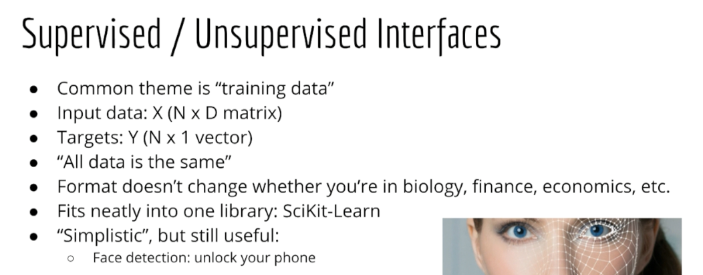

&nbsp;&nbsp;&nbsp;But reinforcement learning is different. Reinforcement learning can guide an agent for how to act in the world. So the interface to a reinforcement learning agent is much more broad than just data. It's the entire environment. That environment can be the real world or it can be a simulated world like a video game.

As an example, you could create a reinforcement learning agent to vacuum your house. Then it would be interacting with the real world. You could also create a reinforcement learning agent to learn how to walk. That would also be interacting with the real world.

You can be sure that the military is interested in such technologies. They want reinforcement learning agents that can replace soldiers not only to walk but fight, diffuse bombs, and make important decisions while they are out on a mission.

So you can see now why reinforcement learning is such a big leap from basic supervised and unsupervised learning. The interface isn't just tables of data but it could potentially be the entire world.

Your agent is going to have sensors: some cameras, some microphones, an accelerometer, a GPS, and so forth. It is a continuous stream of data coming in and it's constantly reading this data to make a decision about what to do in that moment. It has to take into account both past and future. It doesn't just statically classify or label things.

In other words, a reinforcement learning agent is a thing that has a lifetime and in each step of its lifetime it has to make a decision about what to do. A static supervised or unsupervised model is not like that. It has no concept of time. You give it an input and it produces a corresponding output.

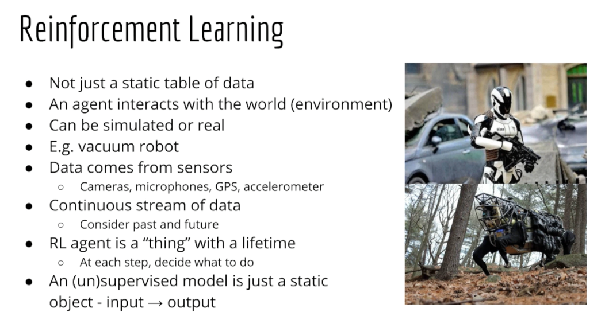

&nbsp;&nbsp;&nbsp;Now some of you, if you are creative, might think, well, a supervised algorithm should still be able to solve reinforcement learning tasks. For example, if X represents the state of mind then why the target should just be the correct action to take for that state. So whether I'm driving a car or playing a video game or playing chess, I will always do the right thing.

Here's the problem with that: a game like Go has 8 × 10^100 possible board positions. If you can't tell right away, that is an infeasible amount of input data. For comparison, our largest image benchmark has about 10^6 samples. So the number of samples for Go would be 94 orders of magnitude larger than ImageNet, which can already take about one day to train on state-of-the-art hardware.

To give you some idea, one order of magnitude larger would take 10 days to train, two orders of magnitude larger would take 100 days to train. So now imagine 94 orders of magnitude larger.

Also keep in mind there may not be such a thing as a correct action to take at all times. We don't want our AI to play the same way every single time; we want to allow for creativity and stochastic behavior.

A supervised model, even if it were feasible to train, would only have one target per input so it would never be able to do human-like things like say generate poetry.

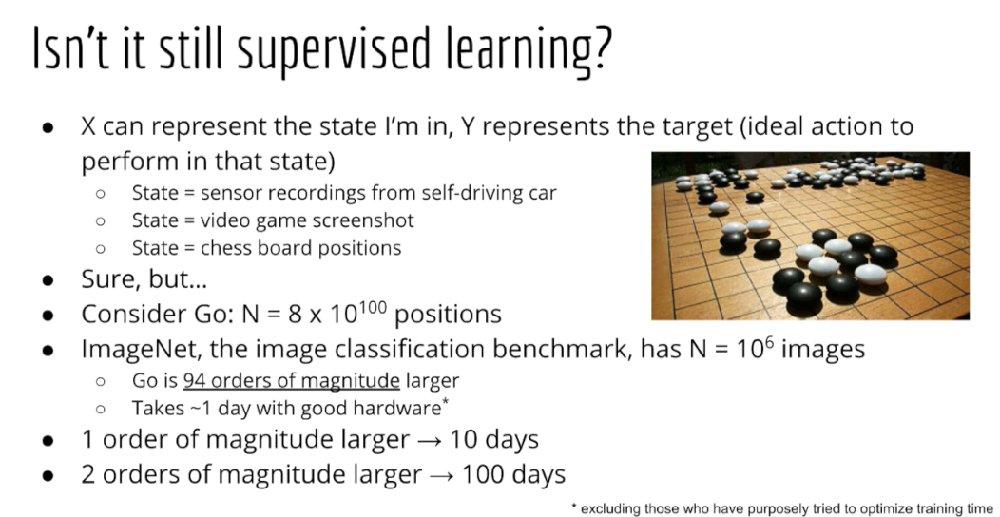

# From Bandits to Full Reinforcement Learning

&nbsp;&nbsp;&nbsp;In this lecture, I'm going to show you how to transition from the simple bandit problem we looked at earlier to a full reinforcement learning problem, which the rest of this course is devoted to. Let's start by looking at the bandit problem again but perhaps from a slightly different perspective with different terminology. The basic analogy in the bandit problem is that you are playing a bunch of slot machines and you're trying to decide which arm to pull. As you've hopefully learned by now the point is not so that you can actually walk into a casino and use these algorithms. Now, from my experience, not all students realize this but hopefully it's not too surprising. Part of your job as a machine learning engineer is to demonstrate a certain ability to think abstractly. That means after taking this action you should know how to apply it to online advertising and testing different features on your website and so forth. Connecting the math to your job or personal projects is a task that can only be done within your mind.

&nbsp;&nbsp;&nbsp;At this point, we are going to make things even more abstract.Instead of relying on an analogy which will never actually be used in real life, we're going to start using terminology that is more like what we use in full reinforcement learning.The first concept we're going to introduce is that of an action. Previously, we referred to this as pulling the bandit arm. Now we simply call it an action, and an action is something that you do or something that the agent does. If you have three advertisements you can possibly show to a user, then that means there are three possible actions. Action one means show advertisement one, action two means show advertisement two, and action three means show advertisement three. Note that actions can also be continuous although that is outside the scope of this course. For example, a continuous action could be how much torque to apply to a motor or how many degrees to rotate a steering wheel.

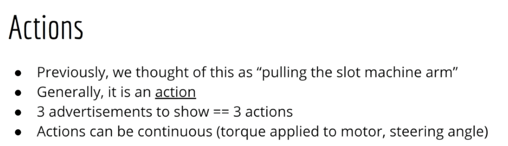

&nbsp;&nbsp;&nbsp;Since online advertising and running tests on websites are actual real-world examples, let's continue using those.
Recognize that in our previous formulation, all users are treated equally.
We don't differentiate between an old senior who rarely uses a computer and a teenager who uses multiple computers for most of the day.
Of course, that's unrealistic.
Most probably, an older person would be more interested in advertising for home insurance than a teenager who doesn't have any concept of owning a home.
Similarly, it should be obvious that there are certain demographics who would be more interested in Kylie Jenner's new makeup line than, say, online courses about machine learning.
Clearly, this information can't be captured in a single estimate of a click-through rate for each advertiser.
So what's the solution?

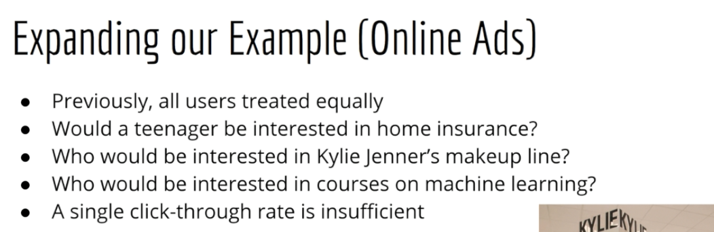

&nbsp;&nbsp;&nbsp;The solution is contextual bandits.
Although you should be more concerned with the technical details rather than what we name it.
Basically, we are going to introduce the concept of context.
Context is exactly what it sounds like.
We include contextual information in our decision-making process, for example, based on your previous search history.
We might be able to guess that you are a male teenager and not a soccer mom, although obviously we would never encode such labels exactly.
They are inherent in some latent representation of past observations.
In some cases, we might have true and explicit information where perhaps the user entered that information themselves.
For example, they might enter their birthday or their favorite hobby.
In addition, things like time of day and the day of the week might matter; your location in the world might matter.
If you've ever worked in the online advertising industry, then you are very familiar with having to deal with these input features.

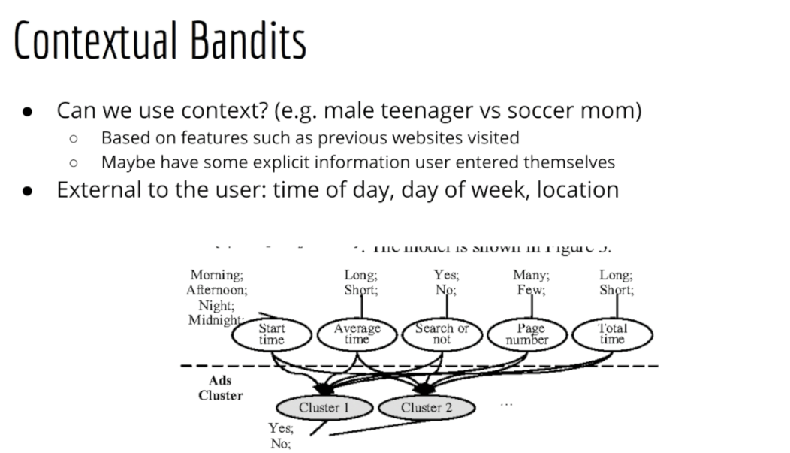

&nbsp;&nbsp;&nbsp;Luckily, we can abstract this idea too.
We call this the state.
State is also a pretty generic term so it might take some getting used to, but in general the idea of state is very flexible.
As mentioned previously, it can represent attributes of a user and of the world itself, like the time and position.
But in more general terms, it can represent any measurement made by a computer.
For example, you might have a controller reading the temperature and humidity of the room and deciding whether it needs to be warmed or cooled.
Those readings of the temperature and humidity make up the state.

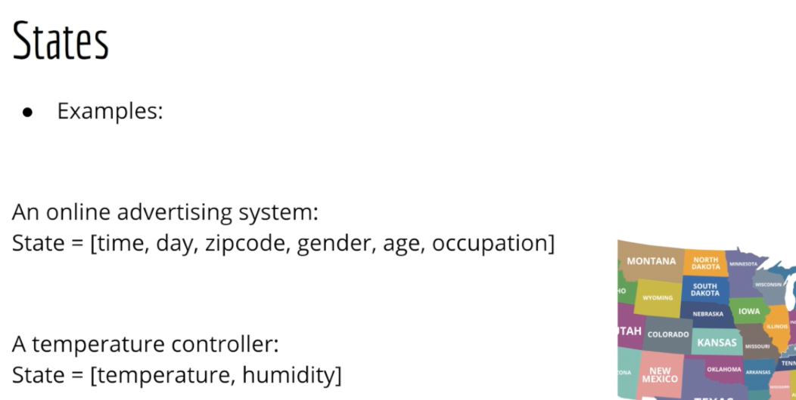

&nbsp;&nbsp;&nbsp;As an example of how you might build an algorithm to take into account the state in order to decide an action to maximize reward, we can use machine learning.
Suppose I represent my state as a feature vector X.
Now suppose I have some parameters or weights called W.
Then, as we know from our study of linear regression, I can take the dot product of X and W to get a predicted reward.
We can compare the predicted reward ŷ to the true reward that we eventually get, called Y, and then use the error between the two to update our model.
In particular, the weight vector W.
Now this is just a rough example. We're actually going to move on to something a bit more complex very soon.

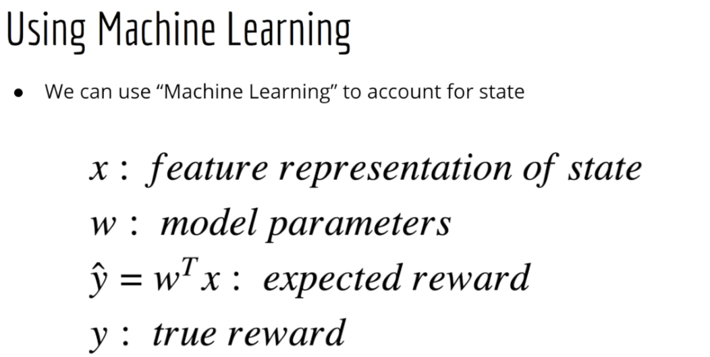

&nbsp;&nbsp;&nbsp;There's a big difference between the two previous examples of state that I just gave you.
What is the difference between a state vector representing the attributes of a user such as their age and gender and so forth versus a state vector representing the temperature and humidity of the room?
Well, the answer is that in one case the sequence of states that we see depend on one another, and in the other case they don't.
As an example of that, pretend you are a website like The New York Times.
Suppose that the user who just visited your website was a 40-year-old soccer mom.
Does that say anything about who the next visitor to your website might be?
Your next visitor might be a user from Russia that simply wants to read American news.
But more importantly, the fact that the previous visitor to your website was a 40-year-old soccer mom has nothing at all to do with what articles and advertisements you show to your Russian user.
There is simply no relationship between the two.

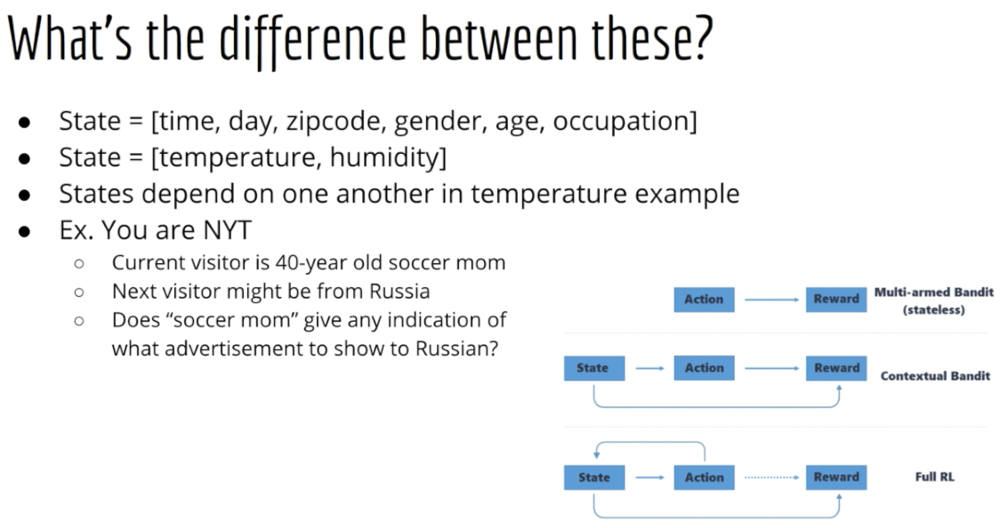

&nbsp;&nbsp;&nbsp;Now compare that to a situation where the sequence of observations that you measure is highly interconnected.
If you're looking at the temperature and humidity of the room, there is most certainly some structure in the sequence of observations that will help you determine how to control heating and cooling.
Obviously, the temperature isn't going to be 70 degrees in one instant and then zero degrees the next.
If you think about something like stock prices, we clearly need to look at not just the snapshot of the stock price at a single point in time but rather the sequence of stock prices.
Obviously, we're interested in things like is the stock going up or down.
And obviously, you don't know whether something is going up or down from just a single price.
Another example of this is board games like chess and Go.
Obviously, the state of the board, like where each of the pieces is, will be dependent on where they were previously and they will have a strong effect on where they are in the future.
So overall, I hope you're getting the idea that there are some environments where it's not just the state by itself that matters but rather the sequence of states.
This is what will bring us to our next topic: Markov Decision Processes.

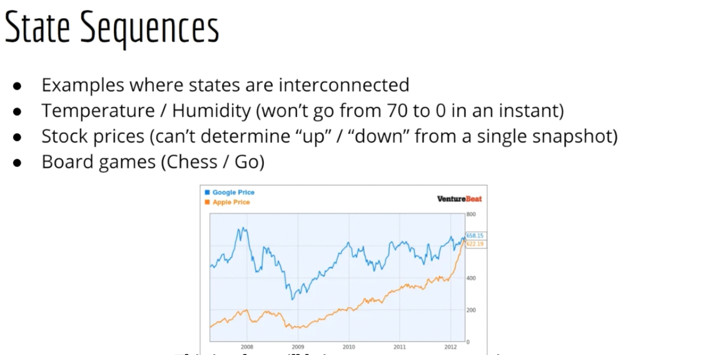

&nbsp;&nbsp;&nbsp;To summarize this lecture, here's what we talked about:
First, we looked at the multi-armed bandit problem once again and we defined some new terms to help us think about the problem more abstractly. Specifically, the multi-armed bandit problem is a problem of choosing an action to obtain the best reward.
Next, we discussed the contextual bandit problem where instead of just having to choose an action, we also have to pay attention to the state which helps us have more fine-grained control on which action to choose.
Finally, we did some foreshadowing and talked about the situation where instead of just random states which are not related to one another in terms of predicting a reward, we can have states which are interdependent.
This brings us to our next section on Markov Decision Processes.

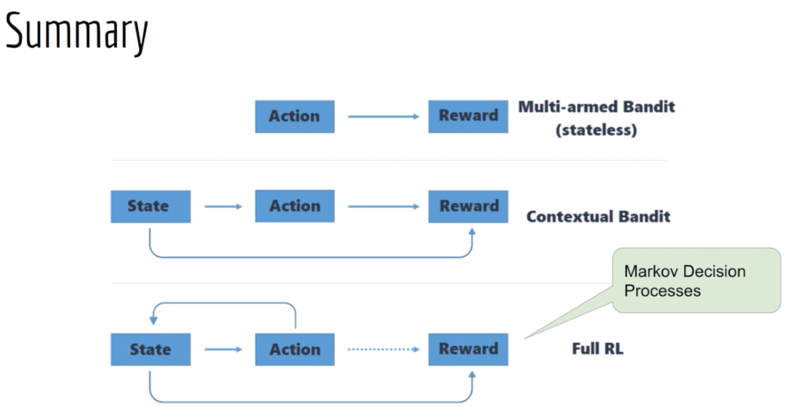

