# MDP Section Introduction

&nbsp;&nbsp;&nbsp;In this lecture, we are going to introduce the next section of this course, which is Markov Decision Processes.
We usually abbreviate this as MDP. The MDP is probably the most fundamental concept you'll learn in this course because it's the framework from which everything else is derived.
Any algorithm you learn about, whether it's Q-learning, Deep Q-learning, or any advanced version of Deep Q-learning, they're all derived from the MDP framework.
In other words, if you want to do anything in reinforcement learning, you have to know about MDPs.

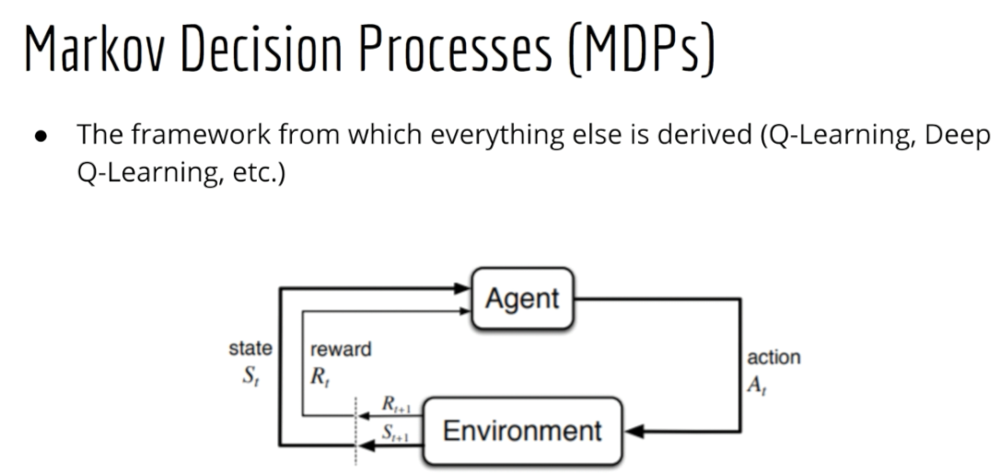

&nbsp;&nbsp;&nbsp;So let's outline what we will learn in this section.
Firstly, just so you know, what we're doing is entirely theoretical.
We are going to discuss the grid world environment. The grid world environment is very useful because it helps us visualize what's going on in reinforcement learning.
In particular, it makes the states and their transitions visible.
Now, you might object to that and say, "Well, Super Mario is obviously visible because in order to play Super Mario, you have to look at the screen."
Of course, that's not the kind of visible we are talking about.

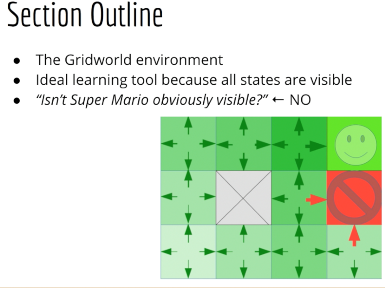

&nbsp;&nbsp;&nbsp;The next step will be to discuss the Markov property and Markov models.
What you can tell from its name is obviously important in learning about MDPs.
You might be familiar with Markov models from other fields since they are widely applicable.
For example, Google's PageRank algorithm was derived based on Markov models.
Hidden Markov models are an important algorithm for speech recognition and genomics — that's the study of DNA sequences.
Markov Chain Monte Carlo, or MCMC, is a popular statistical method that's become widely used due to its applicability in Bayesian machine learning.
Markov models are used in finance. One immediate application is the random walk hypothesis.
Finally, Markov models are useful in control systems, which is traditionally a subject of study under electrical or mechanical engineering rather than computer science.
What's very interesting, however, is that these two fields converge once you introduce uncertainty.
So if you took a course on stochastic control systems, you would also learn about MDPs.

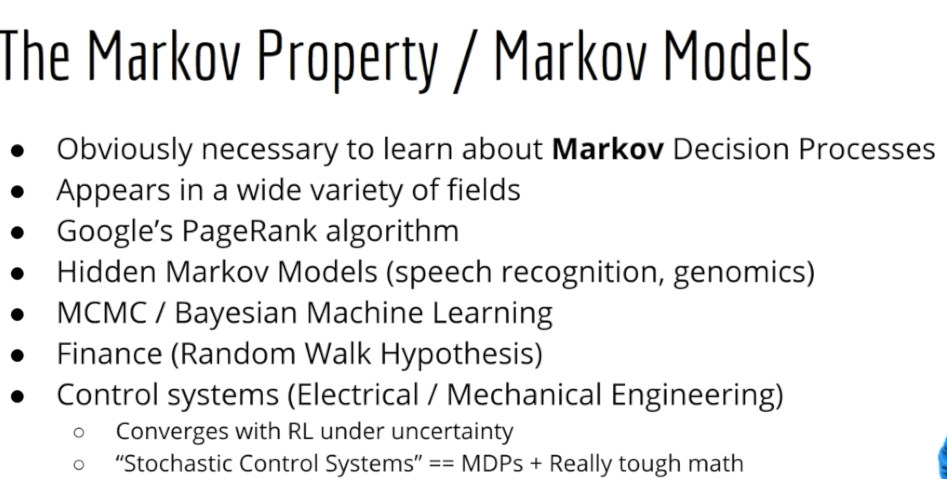

&nbsp;&nbsp;&nbsp;After we discuss the basics of what makes up an MDP, we can start defining some new terms and some new ideas which are built on top of these pieces that allow us to build intelligent agents.
Specifically, we're going to introduce the concept of the return, which is the sum of future rewards, and the value function, which is the expected sum of future rewards given a state.
We'll look at the very important Bellman equation, which is what allows us to solve for the value function and to create an agent that behaves optimally.
In fact, the one thing I always say is that if we had to summarize this entire course into a single sentence, we could say that this whole course is about how to solve for the value function.
Obviously, this doesn't make sense right now, but it will by the end of this course.

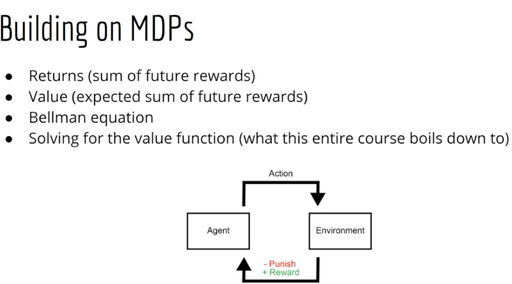

&nbsp;&nbsp;&nbsp;After this section, all of the subsequent sections will be devoted to specific solution methods for the Bellman equation.
What this will mean for you is that this section is entirely theoretical, so be prepared to just think mathematically for some time.
Obviously, this is necessary to build up the prerequisites for the subsequent sections where we discuss actual algorithms, at which point you will put those algorithms into code.
It is also at this point in the course that the handholding stops, so there will not be any fill-in-the-blanks code exercises.
Once you learn the material, you should have some design in your mind for how you will implement the algorithm in code.

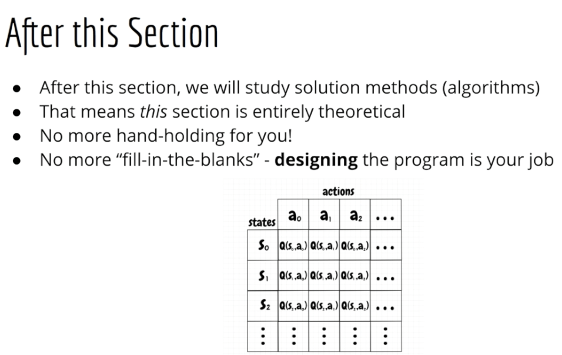

&nbsp;&nbsp;&nbsp;The last thing I want to discuss in this lecture is to remind you of my rule: All data is the same.
This is a rule that beginners often forget.
You have to separate the algorithm and the method from the application.
To give you my favorite example, consider linear regression.
Linear regression is used in many fields such as biology and finance.
But do we ever ask if there is a different kind of linear regression for biology than there is for finance?
Obviously not. The same linear regression algorithm can be applied no matter what industry you are in.
Similarly, since this course is about reinforcement learning algorithms such as Q-learning, it doesn't make sense to ask, "How do I use Q-learning in biology?" or "How do I use Q-learning in finance?"
The first step is to learn Q-learning in the first place, and after that, whatever your particular specialty is, it is your job to get the right data in order to apply those algorithms to your particular field.
You have to be a subject matter expert in your particular field, whether that's finance, biology, economics, online advertising, power systems, or whatever else.
Keep in mind that this is your responsibility.
The important thing to remember is that the Q-learning algorithm or the linear regression algorithm do not care what your data is.
Those algorithms remain the same.

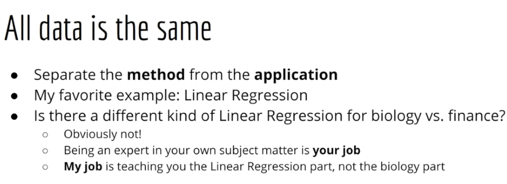

&nbsp;&nbsp;&nbsp;To give you a real-world example of this, consider that Google engineers use reinforcement learning both for optimizing their data centers and for YouTube recommendations.
Now let's ask where did those Google engineers learn how to do that?
Did they take a course called "How to use RL for optimizing your data center" or "How to use RL to make YouTube recommendations"?
Obviously, the answer is no.
They all read the same RL books and took the same RL courses.
It was their job to figure out how to apply RL to their particular subfield.
So I want you to keep that in mind, especially if you are a beginner and don't really have the ability yet to think abstractly.

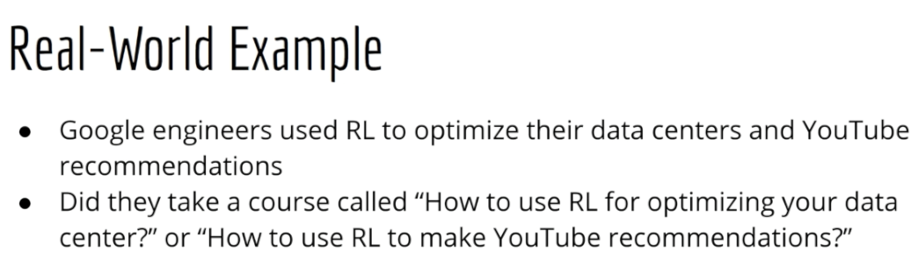

# Gridworld

&nbsp;&nbsp;&nbsp;In this lecture, we are going to describe the environment we'll be working with for a majority of the course, which is called Grid World.
We're also going to take this opportunity to define a few more essential terms.
So, what is Grid World? Grid World is the simplest environment you can use in reinforcement learning that allows you to think about and understand all of the concepts we're going to discuss.
If it were smaller, it might not get the points across in a way that makes sense. And if it were larger, it would be unnecessarily complicated.
So Grid World is the perfect size environment to learn about reinforcement learning.
You can imagine Grid World like a very simple video game. Hopefully, you've played video games yourself in the past, games like Pac-Man or similar.

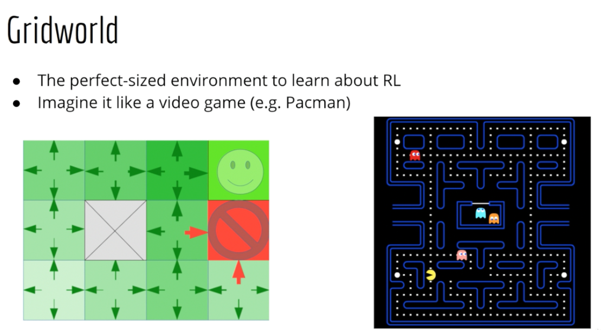

&nbsp;&nbsp;&nbsp;So, what does Grid World look like?
Grid World is a 3 by 4 table that your agent lives on.
Your agent starts the game at the bottom left corner.
Your agent can move up, down, left, or right — one square at a time.
The goal of the agent, although I use that term loosely, is to get to the top right corner, which is the winning state.
When the agent arrives in that state, it receives a plus one reward.
Just underneath the winning state, there is the losing state.
The agent wants to avoid that state, or in other words, it wants to avoid going to that location.
When the agent arrives in this state, it receives a minus one reward.
I use the terms winning and losing loosely as well.
Remember that in reinforcement learning, the agent doesn't have any concept of whether it's won or lost; it only receives a reward.
The only objective of the agent is to maximize the reward.
Thus, while the agent does not know what it means to win or lose, it does want to go to the top right box because that's where it gets plus one reward.

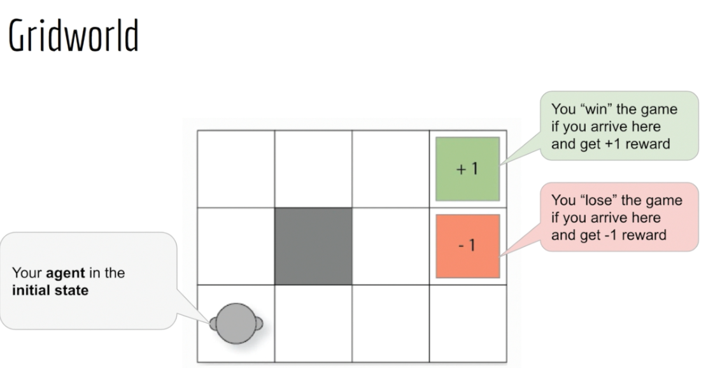

&nbsp;&nbsp;&nbsp;An important aspect of Grid World is that the states are very easily defined.
The state is simply the position of the agent.
So, for example, the tuple (2, 0) represents the initial state of the agent.
The winning state would be represented by the tuple (0, 3), and the losing state would be represented by the tuple (1, 3).
Note that there is a wall at the location (1, 1), which represents a state that the agent cannot occupy.

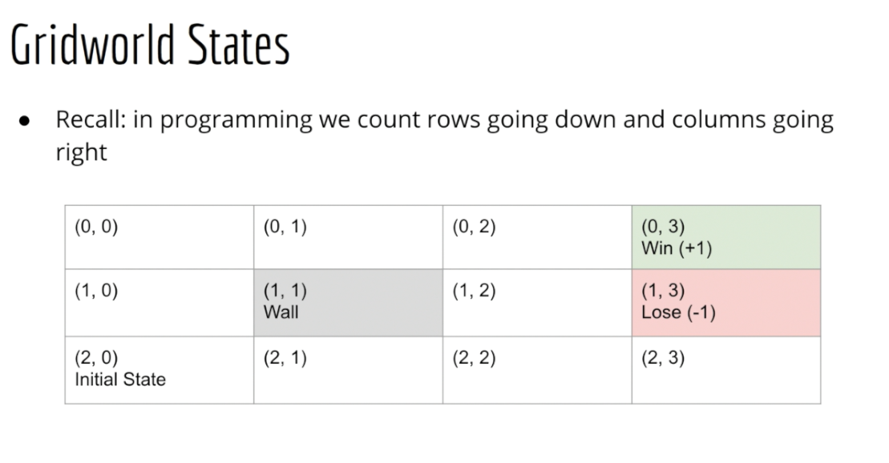

&nbsp;&nbsp;&nbsp;Earlier, I said that although a video game like Super Mario is a game that you can see, so that the state is "visible," this is not the same as saying the states are visible as in Grid World.
So if you didn't understand what I meant when I said that, let's think harder about why that is.
In Super Mario, which obviously you can see because it's displayed on your TV screen, the state is actually very complex.
One way of recording the state would be to simply take an image of the screen.
In fact, some algorithms use only screen recordings to train an agent.
This was how deep Q-learning became popular because researchers were able to train agents to play Atari games using only screen recordings.
If we represent each state of the game as an image of the screen, then you would get an image of size 256 by 224 by 3.
This gives us about 172,000 numbers to represent the state, which is much larger than the 12 states in Grid World, which can be represented by only two numbers: the horizontal coordinate and the vertical coordinate.
Another way to represent the state of the game would be if you had privileged information about the game program, for example, the position of Mario, the position of all the enemies, the position of other obstacles, and so forth.
Of course, each of these positions can range anywhere from 0 to 256 and 0 to 224, but a more likely scenario is that you use one-hot encoding.
So again, your state is a matrix of size 256 by 224, and that's just for the information about what's on the screen at that current moment.
You might have other information such as the velocity of various objects, how many lives you have left, how much time you have left before the level is over, and so forth.
Hopefully, you're getting the idea.
You can't see any of these thousands of numbers, unlike with Grid World.
Finally, note that we call the set of all possible states the state space.
For a screenshot, the state space would have a size approximately 256 to the power of 172,000, which, as you can see, is pretty much infinite for all intents and purposes.

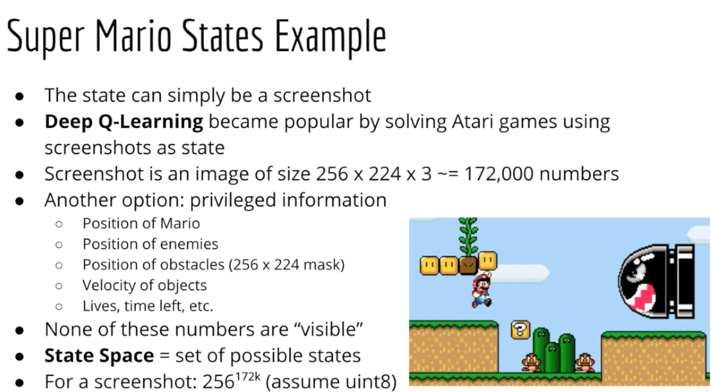

&nbsp;&nbsp;&nbsp;So now that we understand Grid World, let's look at more terminology.
The point of reinforcement learning, if you stare really hard at its name, is that you are going to try to reinforce the desired behavior of the agent.
And this is what we call the learning process.
This implies that the agent will not just play our Grid World game once, but rather it will play the game many times.
By playing the game many times, it gains experience, and we hope that by the end of it, the agent will have learned how to maximize its reward using that experience.
Now, I know that this probably seems obvious, but in fact, if you think about it, it's not.
It may seem obvious because it's very analogous to the real world, to how humans and animals learn.
But remember, computer code is inhuman.
And so these concepts are not just things we can take for granted.
Each time our agent plays a game in Grid World, it will end up either in the winning state or the losing state, and then that game is over.
Instead of calling this a game, which is an ambiguous term and can be used in many contexts, I'm going to call this an episode.
Thus, an agent will play many episodes in order to gain experience.
How do we know when an episode is over?
I said earlier that it lands in either the winning state or the losing state.
But let's define this more precisely.
In fact, just because you land in a state and get plus one reward or minus one reward, this does not automatically imply that the episode is over.
It could be that you get minus one reward in every state, no matter the state.
So it's important not to get our previous intuition mixed up with the mathematical definitions.
Getting a reward is just getting a reward.
It says nothing about whether an episode is over or not.
What does define whether an episode is over is whether you've reached a terminal state.
A terminal state is any state such that when you land in it, the episode is over.
An example of that would be you lose 100 percent of your health and lose a life, or you fall off a cliff.
In chess, this would be any state in which your king or your opponent's king is taken.
Alright, so you just learned three new terms: episode, terminal state, and state space.

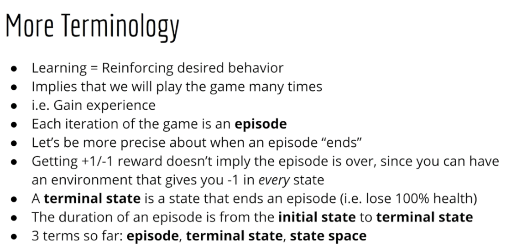

&nbsp;&nbsp;&nbsp;So Grid World and Super Mario are examples of episodic tasks because there are clearly defined episodes.
On the other hand, you can have tasks which are non-episodic, also called continuing tasks, because they can just keep going on forever.
One example of that is controlling the temperature of a room.
There is no meaningful end to this task.
Please note that the difference between these is actually not clearly well-defined.
If you think about it a little more, you realize that there are some subtleties which can make this difficult.
However, this will not be an important distinction in this course.
For most reinforcement learning algorithms, we will assume that we are learning an episodic task.

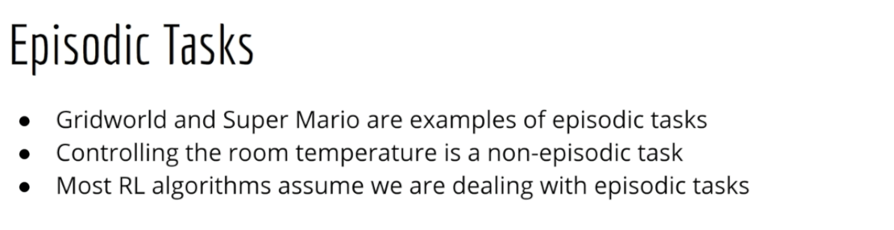

&nbsp;&nbsp;&nbsp;Another term I want to more clearly define is environment.
I've been using this term somewhat informally so far, but in fact, this is an actual term we use in reinforcement learning.
The environment describes the world that the agent lives in.
So Grid World is an example of an environment.
Super Mario is an example of an environment.
Pong is an example of an environment.
And Chess is an example of an environment.
To say we've solved that environment means that we're able to build an agent that achieves some reward that surpasses a threshold that we've set.
For example, we could say if we build an agent that gets over 20 points in Pong, then we'll consider it solved.
Obviously, one environment we are very interested in is the real physical world itself.
Of course, it's not even clear what the reward is in this environment.
Currently, we're focused on building robots that can walk, run, and drive cars.

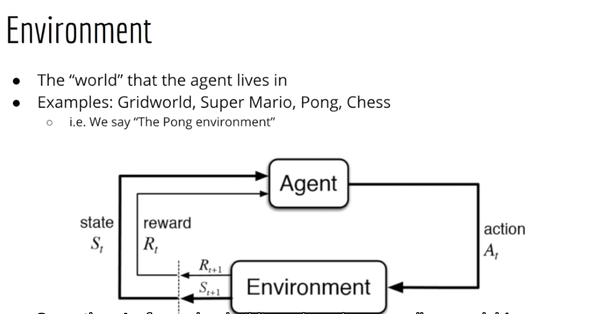

&nbsp;&nbsp;&nbsp;The final concept I want to talk about in this lecture is the policy.
Again, this is a concept we've discussed informally so far without naming it.
The policy is a kind of function, loosely speaking, that maps the state to an action.
In other words, you can think of it as the agent's brain.
On this slide, I've demonstrated a policy that an agent might want to use to maximize its reward in Grid World.
The important part of this is it always leads to the winning state.
So if we're to the left of the winning state, then obviously the correct action would be to go right.
If we're to the left of the losing state, then obviously the correct action cannot be to go right.
You'll notice that from the initial state, there are actually two equally good options, at least knowing what we know so far.
Specifically, we could go up, up, right, right, right, and this would lead to the winning state.
Or we could go right, right, up, up, right, and this would also lead to the winning state in the same number of steps.

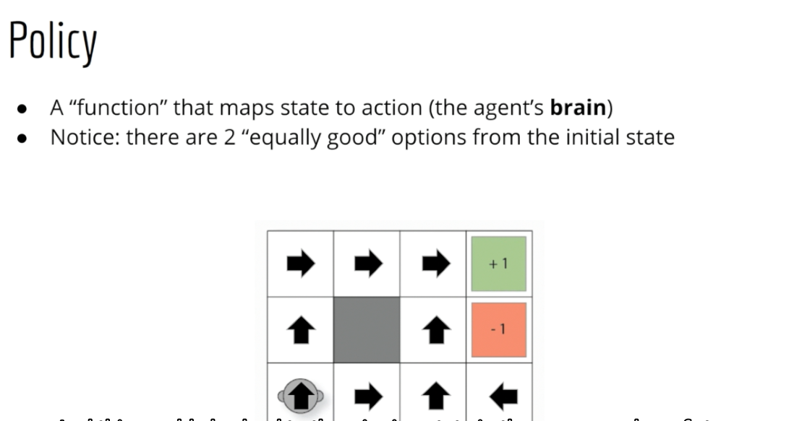

&nbsp;&nbsp;&nbsp;One point of confusion is how to represent the policy.
Is that a function we write in a computer program, or is it an equation, or is it a neural network?
In fact, it can be all of these things.
The policy can be deterministic or probabilistic.
In this section, we'll look at the most general case where the policy is probabilistic.
If we have a deterministic policy, we could represent it using the symbol `π(s)`, `π `as a function that takes in a state `s` and returns some action.
If we have a probabilistic policy, we could represent it using the symbol `π(a∣s)`. `π` is a probability distribution over the action `a` given a state `s`.

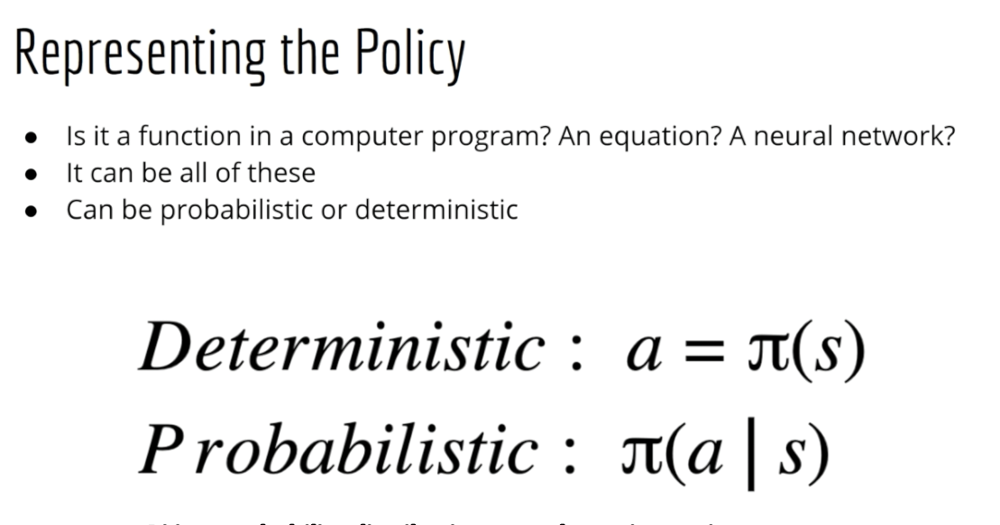

&nbsp;&nbsp;&nbsp;To give you an example of these, suppose that we are playing Grid World and we would like to know what should I do when I'm in state (0,0).
Well, I can pass state (0,0) into a dictionary, so (0,0) is a key in the dictionary and the corresponding value is which action to perform.
So that's how we might do it in code.
Note that this would be deterministic.
What if we did something like epsilon-greedy instead?
In that case, we might follow our dictionary 90 percent of the time, but 10 percent of the time, we choose an action at random by sampling from the action space.
Note that if we have four actions, this gives 92.5 percent probability to the action stored in our dictionary and 2.5 percent to the rest of the actions in the action space.
And to be clear, the action space, analogous to the state space, is the set of all possible actions.

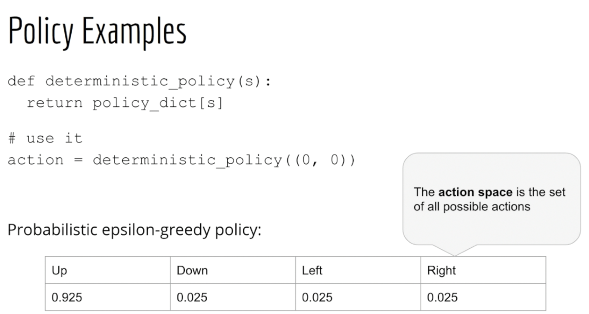

&nbsp;&nbsp;&nbsp;At this point, we've learned about a few more terms: environment, policy, and action space.
To summarize, here's what we've learned in this lecture:
First, we use Grid World as a backdrop since it serves as a nice visualization of all the concepts.
We learned about terms such as episode, which is comprised of one round of a game from initial state to terminal state.
We learned about terminal states, which is the final state before an episode is considered over.
We learned the environment, which represents what game we are playing.
We learned policy, which represents a function that acts as the agent's brain and tells it how to map states to actions.
We learned about state space, which is the set of all possible states, and we learned about action space, which is the set of all possible actions.

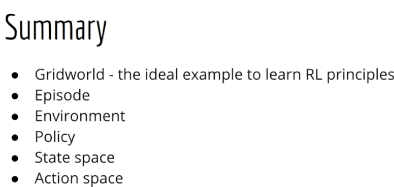

# Choosing Rewards

&nbsp;&nbsp;&nbsp;In the previous lecture, we talked about how our goal in training an agent is to get it to maximize its reward in Grid World.
We get a reward of plus one at the winning state and a reward of minus one at the losing state.
But this brings up another great point, which is how our rewards are decided.
In fact, rewards are engineered by the user.
You and I, our job is to design the reward in such a way that it results in the behavior that we want from our agent.
One great example of this is trying to get an agent to solve a maze.
Seems like a pretty trivial task: you get plus one reward if you find the maze exit and zero otherwise.
What's the problem with this approach?
Well, what happens if your agent simply wanders around aimlessly and never solves the maze?
Since the agent only knows about the reward, all it can ever know is that no matter what I do, I get zero reward.
Therefore, it doesn't matter what I do.
Somewhat depressingly, you may know people who think the same way.
Instead, a better approach may be to assign a minus one to every state that the agent lands in.
Now, you might think that's weird.
You might consider minus one to be losing, but remember the agent has no concept of what it means to win or lose; it sees only numbers.
As such, a minus one reward encourages the agent to not wander around because if all it does is go in random directions, it's going to continue to accumulate a negative reward.
If it exits the maze faster, that reward will get closer to zero.
So it's important for you as the machine learning engineer to structure your rewards in a way that is conducive to the agent solving the environment.

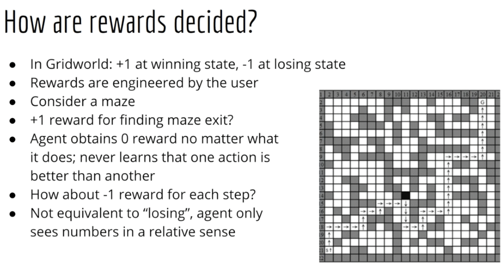

&nbsp;&nbsp;&nbsp;Remember that when you're programming an agent, the agent is not subject to the real-life rules of the game.
For example, suppose you're creating a robot that can play basketball.
By the way, this is totally outside our current capabilities, so just remember that this is a fictitious example.
We can't yet create robots that can play basketball.
But anyway, if we could, you'll get three points if you score beyond the three-point line and two points if you score inside the three-point line.
But what about things like stealing the ball?
What about blocking a shot?
These are considered good behaviors.
And so the agent should be rewarded for doing them.

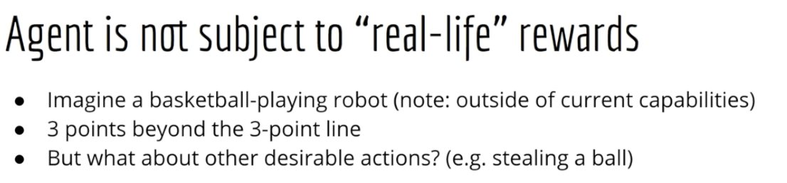

&nbsp;&nbsp;&nbsp;One interesting example of this is the task of walking, something many of us probably take for granted.
When we teach humans how to walk, they usually end up walking like other humans.
But what happens if we tell a robot, "Get from point A to point B. You'll get more reward the further you go"?
Well, now the robot can end up doing things that look very strange in the eyes of a human.
And perhaps that's not exactly the behavior we wanted.

&nbsp;&nbsp;&nbsp;But it's important not to take things too far.
One thing we learned from AlphaGo and AlphaZero is that they were able to come up with completely novel strategies.
They were also able to rediscover well-known human strategies.
As we know now, human strategies were actually suboptimal.
And that's how the AI was able to win.
If we had rewarded agents for performing human strategies, this would have been detrimental to discovering completely new and better strategies.
The point of this is you have to think hard about what it is that you actually want the agent to achieve.
How can you assign rewards such that the agent will achieve the goal and not do something that we don't actually want it to do, while leaving it with enough flexibility to discover approaches that are better than what currently exists?

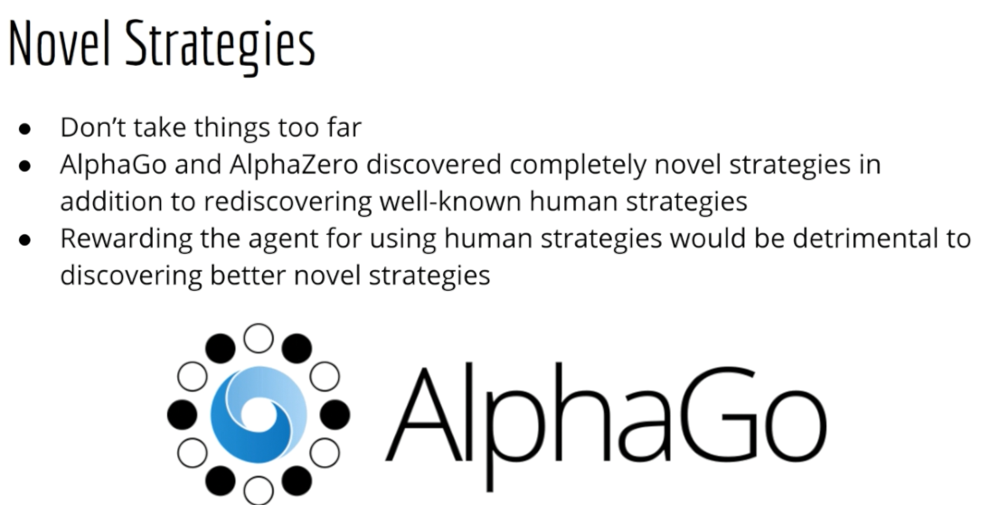

# The Markov Property

&nbsp;&nbsp;&nbsp;We're going to start this lecture with a famous quote:
"All models are wrong but some are useful."
This is a quote by George Box, usually taught to students of statistics, but it's particularly relevant to this lecture because this lecture is all about the Markov property.
What you'll learn in this lecture is that the Markov property seems completely unrealistic.
And despite that, it underpins multiple fields of machine learning including reinforcement learning.
In this way, we can think of the Markov property like this:
It's definitely wrong but it's also definitely useful.

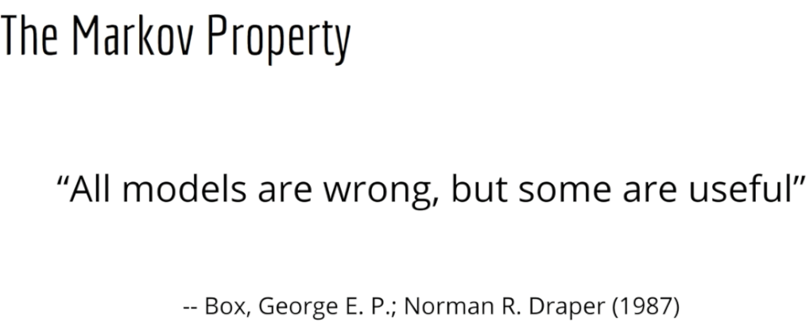

&nbsp;&nbsp;&nbsp;I always like to start my discussions of the Markov property with language modeling.
We can think of sentences as sequences of words.
We can think of sequences of words as simply sequences of states.
So for the purpose of this example, states are words.
A language model might sound complicated but in fact, it simply means to build a probability model for sequences of words.
Take the sequence:
The quick brown fox jumps over the lazy dog.
Let's suppose I'm given this entire sequence except for the last word.
And now I want to predict the next word.
Well, I look at my probability distribution.
What is the distribution over the word at time 9 given the words at times 1 to 8 are equal to "The quick brown fox jumps over the lazy"?
Obviously, building such a language model would require us to consider all possible sentences in the English language.

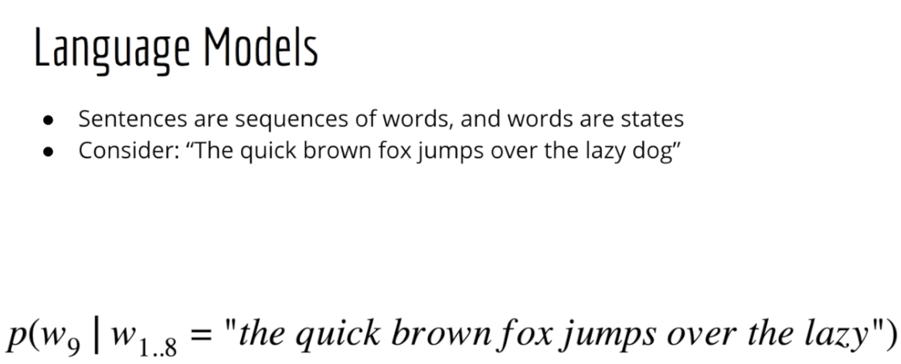

&nbsp;&nbsp;&nbsp;Of course, considering all possible sentences in the English language would be a monumental task even with a limited vocabulary of just 20,000 words.
Consider that a sentence might be anywhere from one to one hundred words long, although the world record for longest English sentence is in the thousands.
The number of possibilities is then 20,000 to the power of one plus twenty thousand, plus twenty thousand to the power three, and so on.
In other words, completely intractable.

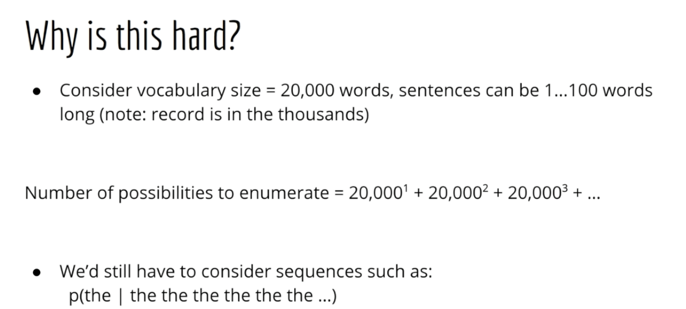

&nbsp;&nbsp;&nbsp;What the Markov property says is forget about any sequence longer than two.
For any sequence of words of length two, we call that a bigram.
So for our sentence The quick brown fox jumps over the lazy dog, we would have to consider the probabilities:

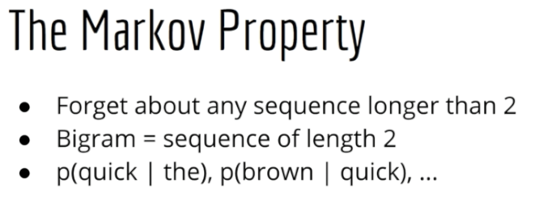

&nbsp;&nbsp;&nbsp;More generally, the Markov property can be stated like this:
Even though the state at time t could depend on the state at times t-1 all the way down to the state at time 1, let's assume that the state is independent of any state earlier than time t-1.
In other words, let's assume that the state at time t depends only on the state at time t-1.
We call this the Markov assumption or the Markov property more accurately.
This is the first order Markov assumption.
If we depend on two previous states, we call that the second order Markov assumption, and so forth.
Typically, we don't consider anything beyond the first order assumption in most machine learning models.

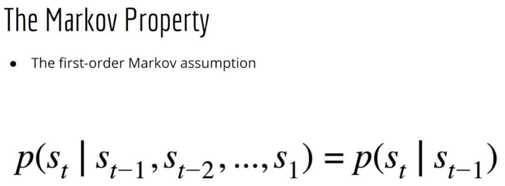

&nbsp;&nbsp;&nbsp;Now, of course, this assumption is somewhat restrictive.
Given only the word "lazy," what might the next word be?
Sure, you could say it might be "dog" because I already told you the entire sentence.
But using that information is cheating.
It could just as easily be "lazy programmer," "lazy uncle," or "lazy students."
Consider an extreme example.
What if my conditioning word is "the"?
Now it's nearly impossible to guess the next word in a sentence with any accuracy.

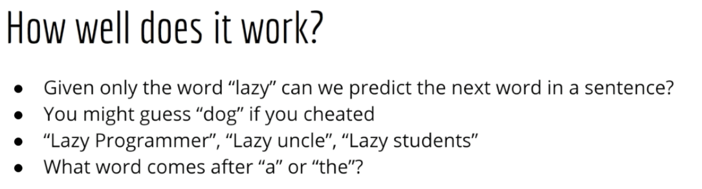

&nbsp;&nbsp;&nbsp;In reality, the Markov assumption is not as bad as it seems.
Markov models are the basis of hidden Markov models, which for a long time were state-of-the-art in speech recognition.
In addition, consider the fact that what you consider the state is completely up to you.
An example of that comes from deep Q-learning.
In deep Q-learning, which was applied to Atari games, I said earlier that they use screenshots from the game.
Of course, a single static screenshot cannot tell you much about the game, and it would be very difficult to decipher anything about the speed or direction of any of the objects in the game from only a single frame.
Instead, what the authors did was they took four consecutive screenshots and considered that to be the state.
So the lesson here is that what you consider the state is entirely up to you.
The state does not necessarily have to be the observation at a single point in time.

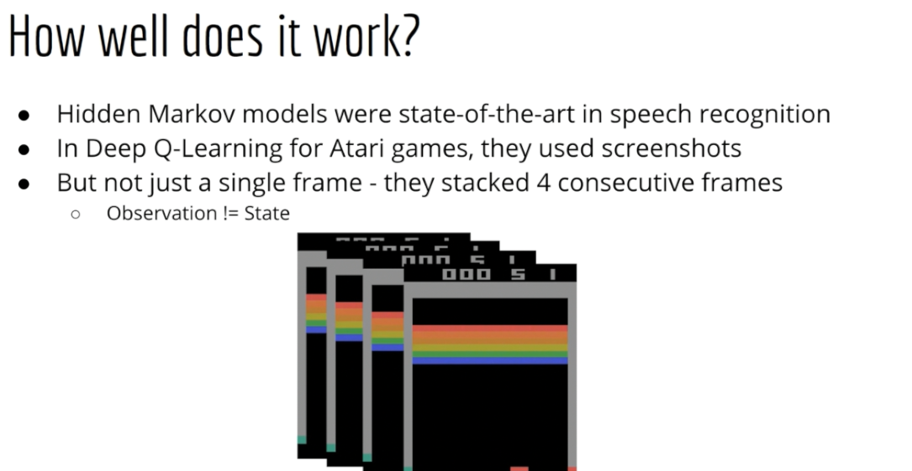

&nbsp;&nbsp;&nbsp;One of the key ingredients of the Markov model is the state transition matrix.
The reason it's a matrix is because in order to express the probability of going from one state to another, you need to have two inputs:

`The current state` and `The next state`
Or optionally, you can think of this as the previous state and the current state.
Either way, there are two inputs, so there are two dimensions.

`Aij` is the probability of going to state `j` from state `i`.
Notice that there is no time index on `A`.
This is because we assume that this relationship holds for all time.
Using maximum likelihood, we know that this probability can be estimated by counting the number of times we were in state `i` and transitioned to state `j`, and dividing that by the count of times we were just in state `i`.

Although in typical Markov model settings we are interested in measuring this probability, you'll see that this is not necessary for the algorithms we discuss later in this course.
The reason we wanted to mention the state transition matrix in this lecture is because we have something similar in MDPs (Markov Decision Processes) but with more ingredients.

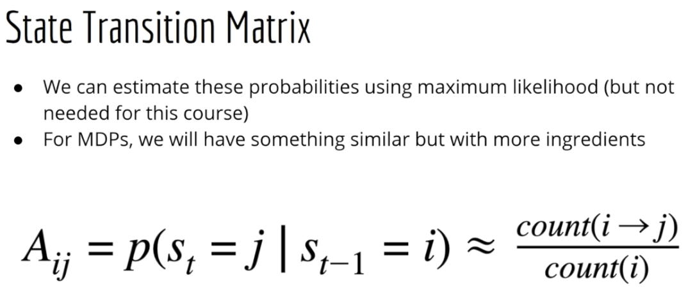

# Markov Decision Processes (MDPs)

&nbsp;&nbsp;&nbsp;In this lecture we are going to finally discuss the Markoff decision process or MVP.
This is mostly just a formality because at this point we've already discussed many of the components
that make up an MVP and after this lecture we will continue to discuss MVP as in terms of the specific
quantities we're interested in and how we can use them to solve a task.
We're going to start from what might seem like a bit of a hairy definition but you'll see that as we
break down this definition in this lecture it will begin to make a lot of sense.
So in a single sentence we can say that an MVP is a discrete time stochastic control process.
What is Gus more about what all these words mean later in this lecture.
But for now let's continue talking about what makes up an MVP

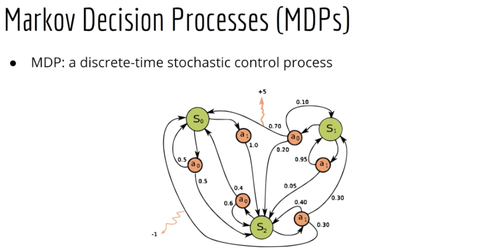

&nbsp;&nbsp;&nbsp;so in essence an MVP is made up of the ingredients that we've already been discussing.
First we have an Asian and an environment.
These represent two distinct entities in an MVP and we've already seen several examples.
The Asian is the brain or the controller.
This is the part that we as machine learning engineers are trying to build in order to accomplish something
useful in the environment the environment is the surrounding world.
This can be as simple as grid world or tic tac toe or chess but it can also be the physical world or
a simulation of the physical world.
One important task for reinforcement learning is locomotion that is learning to walk run and generally
maneuver around.
So that's an example of the environment being the real physical world between these two entities the
agent and the environment.
We have some signals that pass between them.
The agent takes actions in the environment which of course may have an effect on the environment and
that subsequently brings the agent to a new state for example if you're playing tic tac toe and the
board is empty that's one state.
If your action is to put an X down in the middle that brings you to another state in return the environment
returns some information to the agent in particular the environment gives the agent both the next day
and the corresponding reward.
Remember the reward is just a number you can't apply any connotations of his word.
It's not like a reward like here's a cookie.
It's just a number.
It can be positive negative or zero.

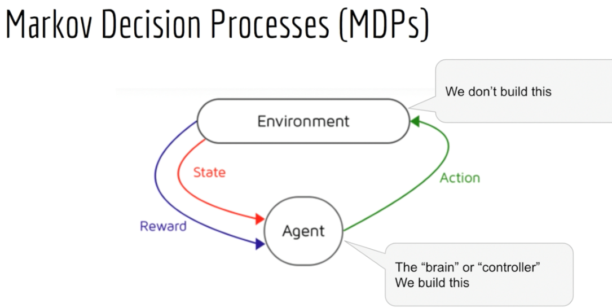

&nbsp;&nbsp;&nbsp;One important thing to get right in reinforcement learning is your time indices.
Let's focus on the sequence of events that will happen in a single step of an episode.
Suppose that an agent reads the state at the current time t.
We call that as of T.
The agent uses its policy py of a given s to choose which actions to perform based on the state it's
currently in.
We call that a t notice that they have the same time index the action a t gets transmitted to the environment.
Which brings us to the next time step.
So the increment in the time step is implicit in the environment after performing the action of T in
the environment.
We arrive in the next state as if T plus 1 and we receive the reward R of T plus 1 altogether.
This forms a tuple which we might think of as a single transition or a single step of an MVP.
The tuple is :

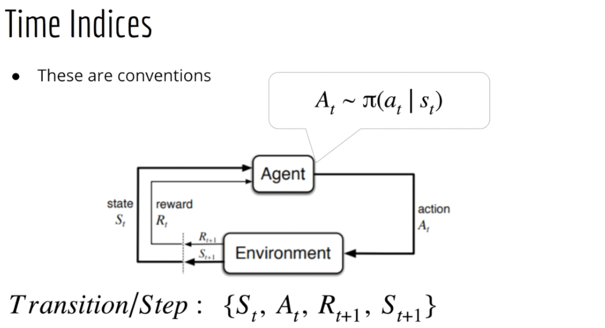

&nbsp;&nbsp;&nbsp;There are several other ways to make up this tuple including adding the next action so we can say s
t a 50 after plus 1 as of C plus 1 and a 50 plus 1 you'll see later that this is involved in one of
the control algorithms we will study yet another method of writing this down as a tuple involves dropping
the time indices entirely.
We simply write SARS as prime.
Note that in this notation the prime symbol does not indicate time T plus 1 since the reward R also
occurs at time C plus 1 but does not have any prime symbol.

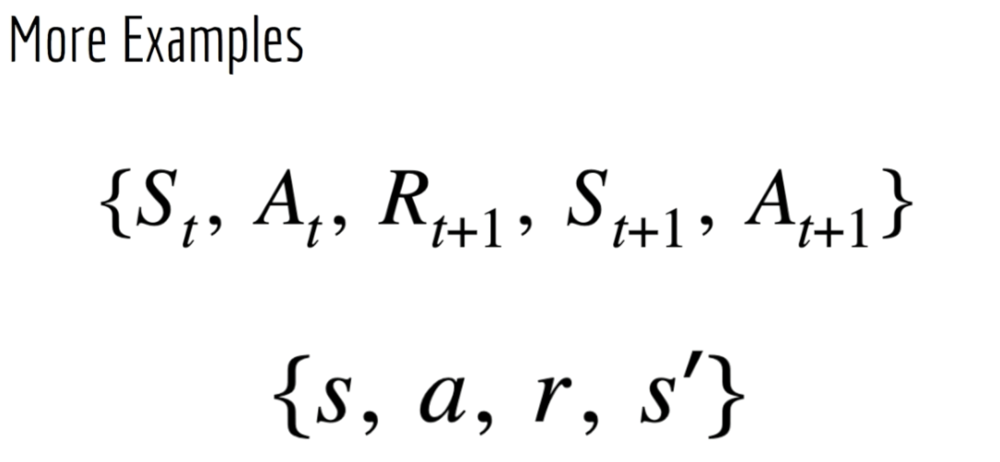

&nbsp;&nbsp;&nbsp;As I mentioned earlier in the chorus the language of reinforcement learning is probability.
So having good intuition of probability is important especially now.
Both entities in an MVP the agent and the environment are represented by probability distributions as
you've seen before.
The most general form of representing the policy of an agent is through the distribution pie of a given
s.
The reason this is the most general form is because it can still represent deterministic policies.
We just give the chosen action probability one and the rest.
0 The environment is also represented by a probability distribution p of s prime and are given as and
a.
This is analogous to the plain Markov model where we have the state transition probability P of s prime
given s of course in MVP D.
We have a few additional variables namely the action and the reward.
This makes complete sense if you think about it in plain Markov models.
The next stage simply happens.
So the distribution of s prime is completely determined by the current status.
It's not controlled by an agent doing any actions but in an MVP.
The next state as prime depends both on the current state s and the action taken.
A

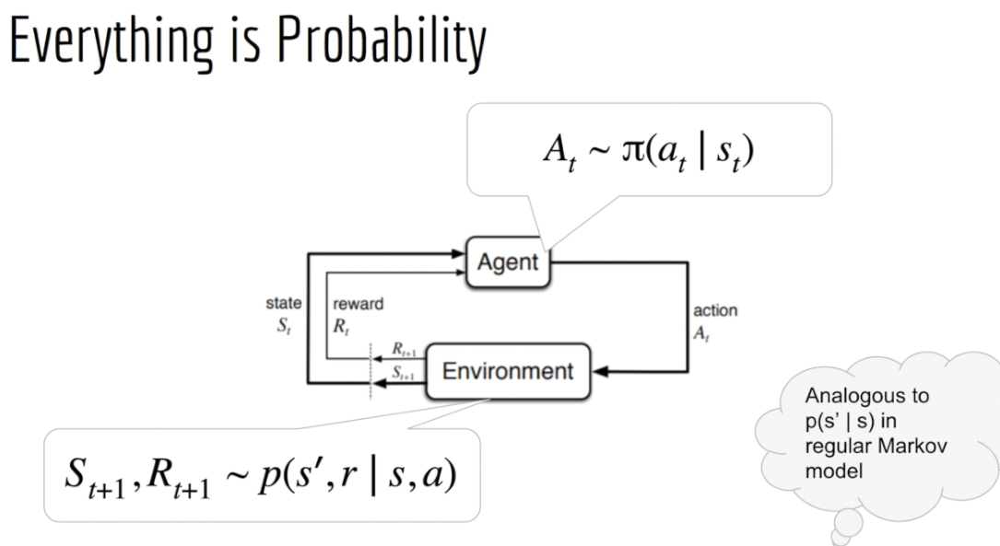

&nbsp;&nbsp;&nbsp;note that a more verbose way of writing the state transition probability is to write P of big s at time
C plus one equals s and Big R at T plus one equals little r given big s at t equals s and big eighty
equals a.
As usual we use capitalized letters to represent the random variable and lowercase letters to represent
a specific realization.

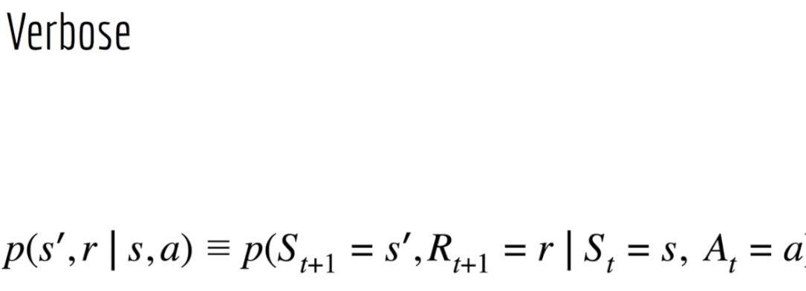

&nbsp;&nbsp;&nbsp;Sometimes people find it useful to think of empty PS in terms of state diagrams.
This might be useful if you have a small number of states and actions and you're using a toy example
to maybe derive an equation or invent a new solution.
But generally speaking I don't find this very useful for actually doing work in RL.
Of course if you like pictures you are encouraged to look at such pictures as much as you like grid
worlds could be represented by a picture like this.
But I think the actual picture of grid world communicates the exact same information so it's not really
useful in this instance.
Actually pictures like this are limited because each node is a state and each edge is a probability.
But remember that in the transition from one state to another state there are actually two probabilities
one to choose the action and one to choose the next state given the action and previous state.
So diagrams like this squash the two together and you can't really tell which is which

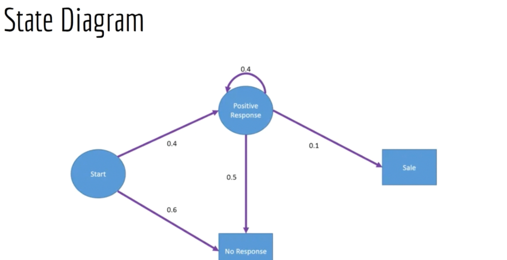

&nbsp;&nbsp;&nbsp;a slightly better diagram shows both the states and actions as different kinds of nodes.
And now each edge can show the probability of going to some action from some state and then to some
state from some action.
However notice that you have to repeat the same action multiple times in this diagram.
So these nodes do not truly represent the action they actually represent the action coming from a particular
state.
This is because the next state depends on both the action done and the state you came from.
Unfortunately with such a large number of elements diagrams like these become messy very easily even
this complicated looking diagram is an MVP with only three states and two actions.
If you were to draw the full state diagram to show even transitions with zero probability it would be
even messier.

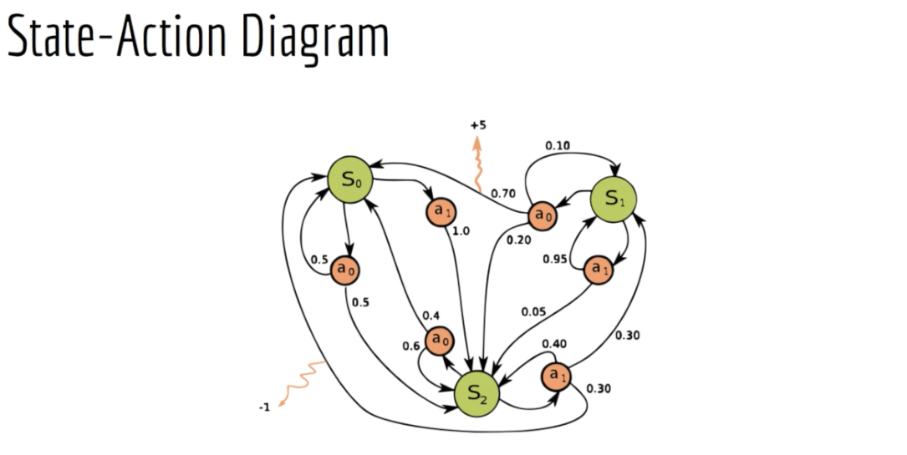

&nbsp;&nbsp;&nbsp;let's now talk about why we represent the state transitions of the environment as P of as prime are
given us and a.
This is by the way what we can also refer to as the environment dynamics.
In any case it seems like an overly generalized representation of real world environments.
You might ask in what environment would the reward be stochastic.
If I arrive in a state surely I will receive the same reward each time I arrive in that state for example.
If I win a chess game or a tic tac toe game probably the environment is built in such a way that I won't
get plus 10 reward in one episode and plus 20 reward in another episode if I win I win and I get the
winning reward.
In fact for some environments that may be true.
In that case you can represent the environment dynamics more simply by using the distribution p of as
prime given S and a reward.
R does not appear in this distribution since it is deterministic.
Even the next state as prime.
Could be deterministic.
For example imagine your playing grid world or Pacman.
We would expect that if I press the up button that I go up and if I press the down button I go down.
Generally speaking that's how video games work.
However even though this is true we would still like to represent our environment dynamics using the
distribution p of s prime given S and a since that's how everything else we do with MBP will be derived
without this distribution.
We can't really do anything else.
And remember it's perfectly fine to have a distribution to represent a deterministic process.
You simply have events that get probability 1 and some events they get probability zero.

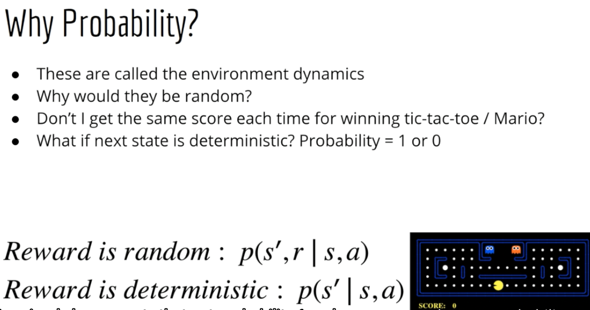

&nbsp;&nbsp;&nbsp;We should also keep in mind another reason for representing the environment dynamics probabilistic Lee.
It's that we may not have perfect information about the environment.
Remember that the state is simply a reading from our computer sensors.
Think of something like a self-driving car which uses video cameras to measure its state well.
What if there are some objects in the surrounding area that are occluded by other objects.
In that case your camera won't pick them up but they might have an effect on what happens in the environment.
Another great example is online advertising.
We have to remember that a lot of the time people enter fake information into their profiles so they
should not necessarily be trusted.
Sometimes people share accounts so the behavior for some user might be different depending on who is
actually using the account another great example is the game of blackjack in the game of blackjack.
We have imperfect information we can only see our card we can't see the dealer's card nor the cards
of any of the other players.
So our state that we measure does not precisely reflect the entire environment using probability helps
us quantify this uncertainty.
Even if the true nature of the environment is deterministic

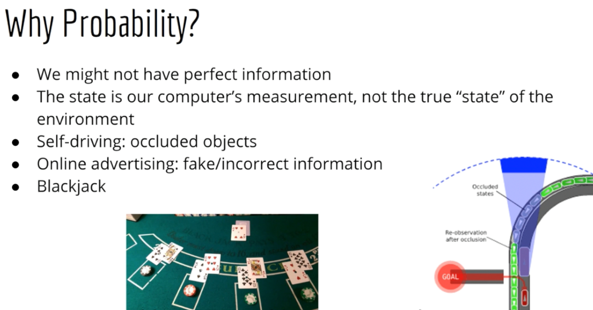

&nbsp;&nbsp;&nbsp;so let's break down the phrase discrete time stochastic control process as you recall stochastic is
just a fancy word for random.
So there's no real difference in a saying stochastic process or random process and even simpler way
to think of us stochastic process is to think of any sequence of events that happens over time.
For example Times series are often modeled as a stochastic process and a specific example of that is
the stock price over time.
Another example of a stochastic process is modeling the number of customers that arrive at a grocery
store or a website.
For that we usually use a on process when we say discrete time we mean that each step of the game that
we play is discrete.
This is obviously the case for games like chess go and tic tac toe.
It's not so clear that it's the case for things like driving a car or controlling the temperature of
a room but keeping in mind that computers themselves are discrete time.
We can really only take sample measurements from a continuous environment at specific intervals so effectively
all of the environments we care to solve in RL will be discrete time it's clear from our ingredients
that make up an NDP that they are discrete time.
We always go from time to time T plus one.
We never have something like Time T plus zero point two five.
For example.

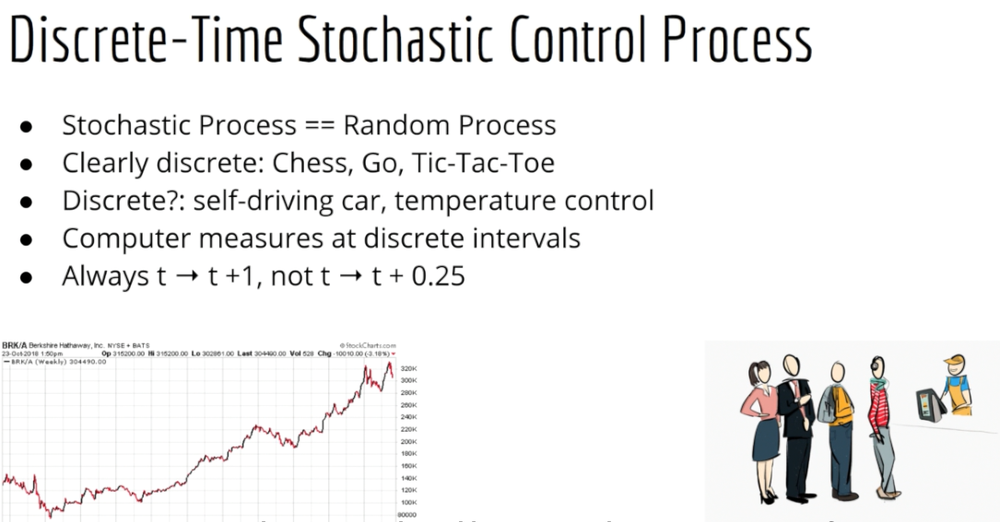

&nbsp;&nbsp;&nbsp;the final key component of this is control.
To understand how this comes into play it's helpful to think of stochastic processes that are not controlled.
A simple example of this is the temperature.
If all you have is a thermometer you're simply measuring the temperature and getting back at time series.
You don't have any control over this.
The temperature is what it is.
It's completely determined by the environment.
We might model the temperature over time as a Markov model on the other hand.
We might be building a thermostat instead of a thermometer and a thermostat does try to control the
temperature.
So in this case there is an actor or an agent who influences the state as you've seen we might model
a system like this as a mark of decision process in the top right quadrant.
Perhaps this is the case that we don't have an actor but the states are hidden that is unobserved for
this situation.
We use a hidden Markov model.
In fact we can still apply hidden Markov models to temperature time series or stock price time series.
The assumption and using such a model is that there is some hidden cause that we haven't observed that
is causing the results that we do observe.
So sometimes we say it's partially observed we think of our observations as noisy measurements of some
true underlying state that we never get to see.
Finally we can add control to the Hidden Markov Model and that gives us partially observable Markov
Decision Processes or peo MBP.
Note that in most popular reinforcement learning applications including deep reinforcement learning
we do not deal with peo MBP.
So if you're interested in modern applications of deep reinforcement learning then you'll be interested
in regular and the PS For the most part.

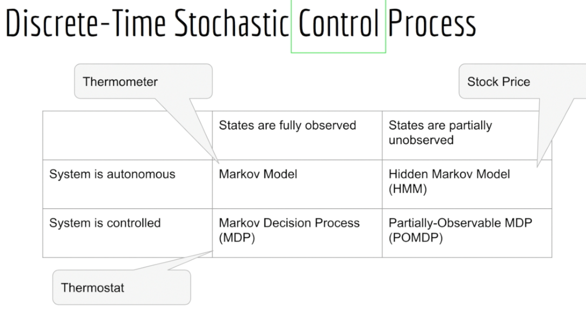

# Future Rewards

&nbsp;&nbsp;&nbsp;In this lecture we are going to get more specific about what our agent is trying to do.
If you look back to our previous discussions you'll realize that we spoke very generally about our agent trying to maximize its reward.
But this is not specific enough.
We know that in an MVP a reward is given at every time step.
We denote the reward at time t by R_t given that there will be a reward at every time step.
It actually doesn't make sense to say that we want to maximize the reward since there will be big T rewards for any episode of length Big T.
So what are we actually trying to do.

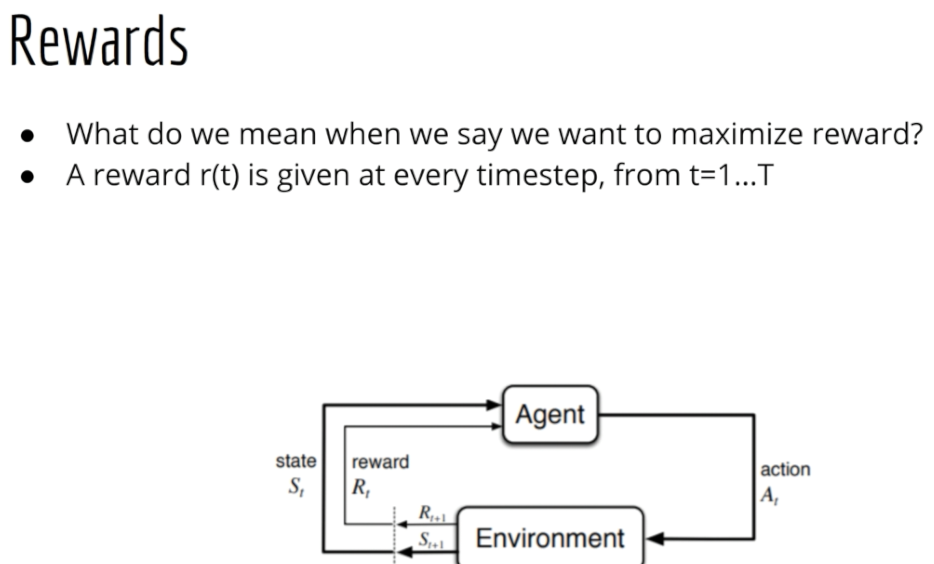

&nbsp;&nbsp;&nbsp;In fact our true goal is to maximize the sum of rewards.
Of course the thing we want to maximize is a scalar and one way to get a scalar from a set of numbers is to simply add them together.

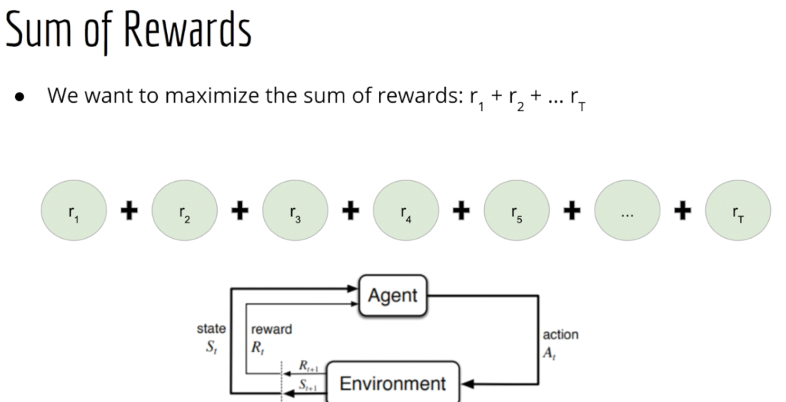

&nbsp;&nbsp;&nbsp;But we can be even more specific than this.
Consider that our actions can have no effect on the past but rather can only affect the future.
Thus our goal isn't just to maximize the sum of all rewards but rather the sum of all future rewards.
Of course if we are in the initial state of the game then this is equal to the sum of total rewards for that episode.

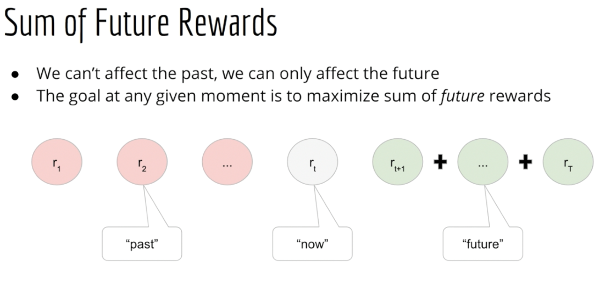

&nbsp;&nbsp;&nbsp;We call the sum of future rewards the return and we use the letter G to represent it technically since each R of T is a random variable then G is also a random variable since the sum of random variables is also a random variable.
We can say G at time t is equal to R at times T plus 1 plus R at time T plus 2 all the way up to time infinity at any given moment.
The goal of our agent is to act such that it can maximize the return or in other words the sum of future rewards it can't maximize the current reward or past rewards because it has already received them.

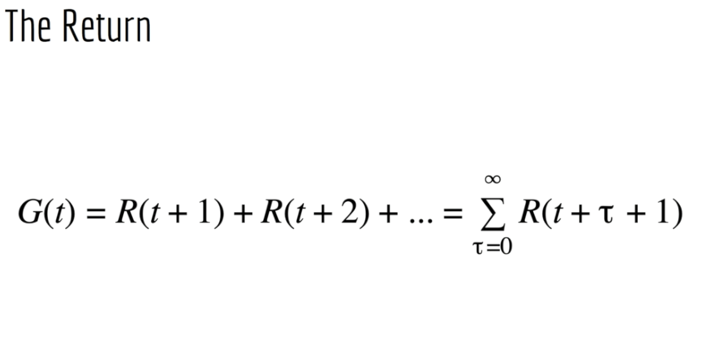

&nbsp;&nbsp;&nbsp;Believe it or not.
This is the key feature that makes reinforcement learning so powerful.
It's at this point we should take a step back to appreciate what reinforcement learning actually does.
Consider a task such as playing chess or go or balancing a pole on a cart.
Suppose you tried to use an approach like supervised learning in effect supervised learning at first seems like it should be a viable solution for each input state X.
Simply tell the agent what the best action should be and call that the target Y then train an agent on a data set of Xs and Ys as usual in supervised learning of course.
From this perspective our agent isn't really learning at all.
It's simply memorizing the state action pairs that you gave it.
This is contingent on your state action pairs being good in the first place.
In addition if all you do is store these state action pairs in say a database table then you really haven't learned anything you're just looking at moves in a dictionary.
But let's consider more practical reasons why this would not work.
In actuality it's not even feasible.
The number of states in chess is something like tens of the 10^50 and the number of states in go is something like tens of the 10^170 although there is lots of discussion online about how to calculate these.
The point is you will never be able to create a dataset that covers even close to the entire state space.
Furthermore this assumes that the human derived strategy is the best strategy which we know is obviously not true.

&nbsp;&nbsp;&nbsp;What makes reinforcement learning so interesting is this: in reinforcement learning.
Often the reward signal we are looking for is very far into the future something like solving a maze or winning a videogame stage.
These are all tasks where you don't win until the very end and thus there is an element of planning that has to take place.
Of course you should not give your agent a plan because as mentioned previously you have to assume that your strategy is not a good strategy and that you want the agent to learn and not just copy.
The remarkable thing about reinforcement learning is that this planning is built in by saying we want to maximize the sum of future rewards our agent will come up with whatever strategy is necessary to reach that goal.
This strategy finding feature is automatic if it takes one million steps to reach the goal.
You don't have to create a dataset with one million data points to specify the correct action at each of those 1 million states which is obviously infeasible often as we've seen these strategies can look very weird to us humans but these strategies are often objectively reasonable as measured by the reward.

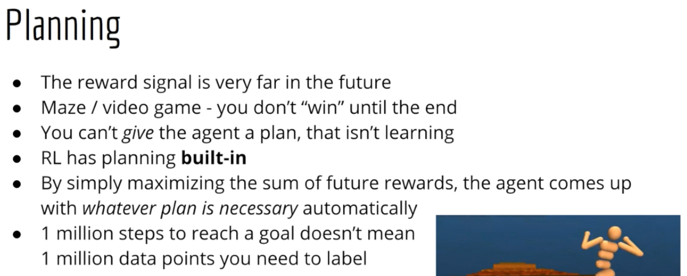

&nbsp;&nbsp;&nbsp;An important addition to the return is discounting.
We use a discount factor called gamma to down weight rewards that are further into the future.
Why might we want to do this.
One simple intuition is to think about finance.
We know from finance that we have to account for inflation when we're trying to estimate the cost of a project.
For example we calculate that cost in terms of the net present value.
We don't say if we have to buy a ten thousand dollar machine one year from now that its current value to us is ten thousand dollars.
Instead we discount it usually by some inflation rate.
It's the same reason you would rather receive ten thousand dollars now rather than ten thousand dollars 20 years from now.
It's simply worth more now.
Under normal conditions.

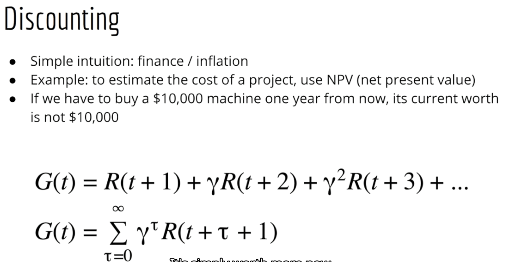

&nbsp;&nbsp;&nbsp;Another intuitive way to think about discounting is to remember that the environment dynamics are probabilistic whenever you are working with a stochastic process.
You know that the further you look into the future the harder it is to predict.
You might have a pretty good idea that it will rain tomorrow but do you know with any confidence whether it will rain 30 days from now.
And so discounting allows us to say that the near future matters more because I actually know what's going to happen in the near future.
I can't trust you to pay me back 100 dollars next year.

&nbsp;&nbsp;&nbsp;Let's consider what it means to have different values of Gamma suppose gamma equals zero.
That means my return is equal to R of T plus one which means I only care about the reward I get in the next step and I don't care about the future.
This can be thought of as greedy or shortsighted.
Now suppose that gamma equals one that says don't discount the future at all.
In fact this is closest to what we truly care about because remember we want to maximize the sum of rewards not the sum of discounted rewards although our algorithms use a discounted reward.
We still want to see our agent achieve the high score in a game and that high score is obviously not going to be discounted.
So there's a mismatch between what our algorithms care about and what we really want to agent to achieve.
That is to say the real purpose of discounting rewards is that it's a helpful tool to improve the training process.
It doesn't necessarily mean that we want to maximize the discounted return if you have an environment that consists of very short episodic tasks.
Then it may not be worth discounting at all.
The discount factor gamma is a hyper parameter that should be optimized by the user.
Usually it's kept very close to one like zero point nine seven, zero point nine nine, zero point nine or nine and so forth and experiment with doing would be to test an algorithm using different discount factors and then plot the total return as a function of the discount factor.
Then you found the best discount factor for that environment at least for the current settings of all the other hyper parameters.

&nbsp;&nbsp;&nbsp;You'll notice that in my definition of the return I sum up to infinity.
It might seem strange that I've assumed that we're doing a continuing task.
When I said earlier that we'll be working mostly with episodic tasks.
The key is the same formula can be applied to both episodic and continuing tasks.
The short story is that summing up to infinity makes the math more convenient.
So that's why we want to do it.
But how can we justify this.
Well we can consider episodic tasks to simply be continuing tasks with the terminal states have self loops with probability 1 that is whenever you reach a terminal state the state transition probability is 1 for going back to itself and zero otherwise.
In this way the environment is technically a continuing task but for practical purposes the episode ends when we reach a terminal state.

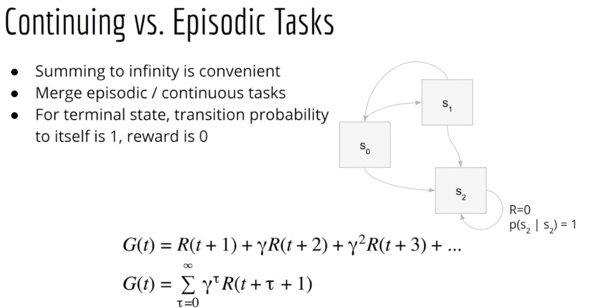

&nbsp;&nbsp;&nbsp;This brings up yet another reason to use the discount factor.
If we have no discount factor and we want to maximize the sum of future rewards what happens when the duration of an episode is infinitely long.
Well the sum of future rewards is potentially infinite and of course it's not possible to choose a better policy if both policies give you an infinite return.

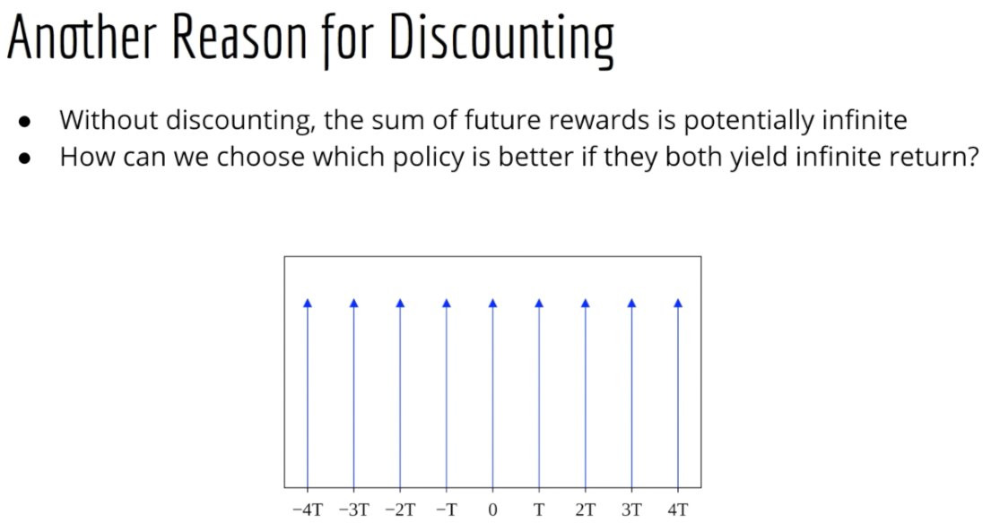

# Value Functions

&nbsp;&nbsp;&nbsp;So in this lecture we are going to begin with the fact that our agent's goal is to maximize the sum of future rewards.
The question we have to ask is how does the agent know what the sum of future rewards will be in the first place.
Clearly this is dependent on my policy.
Let's again look at grid world.
If my policy is to go directly to the winning state using the arrows that I've drawn here then obviously the sum of future rewards is one.
As long as I follow this policy.
Note that this is the case no matter what state I'm in.
As long as I follow my policy I'm guaranteed to get plus one reward in the future.

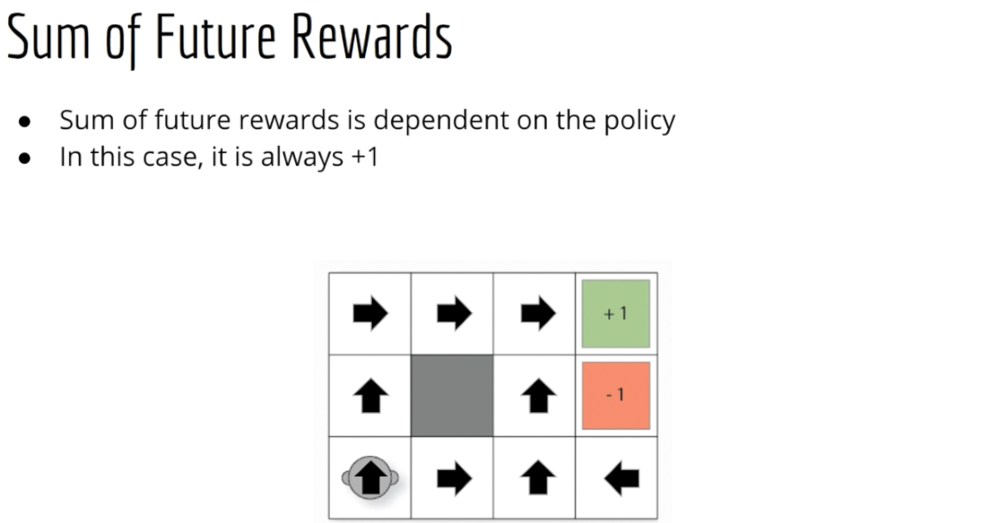

&nbsp;&nbsp;&nbsp;On the other hand.
Suppose that I follow this other policy which always leads me to the losing state.
Now if I follow this other policy my sum of future rewards will always be minus one.
Note that this is still the case no matter what state I'm in.

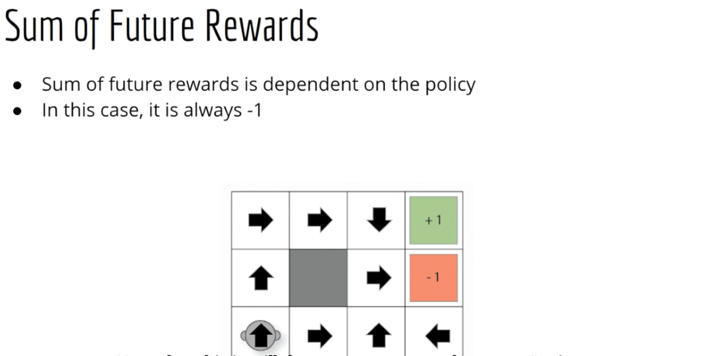

&nbsp;&nbsp;&nbsp;Now let's consider a slightly different environment where we receive minus one reward in every state.
And my policy is still to go directly to the winning state.
The difference between this example and the previous examples is that now my return is dependent on which state I'm in.
If I start just to the left of the winning state then my sum of future rewards is just plus one.
The reward at the winning state.
But if I start to the left of that state then my sum of future rewards is minus one plus one which is zero.
In general the return from any particular state is dependent on what state you are in.
This is also true when you have discounting.

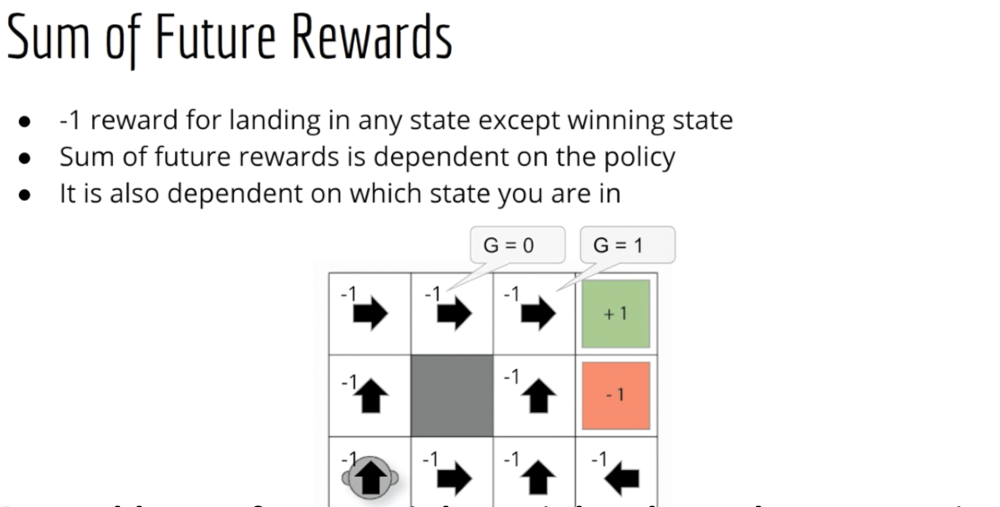

&nbsp;&nbsp;&nbsp;If you have discounting it's easy to see that the discounted reward will change depending on how far away you are from the winning state.
If you're right beside the winning state or one step away then the return is 1.
But if you're two steps away then the return is zero point nine.
Assuming gamma is zero point nine.
If you're three steps away then the return is zero point eight one.
The lesson is that in general the return is dependent not just on what policy you are following but also what state you are in.

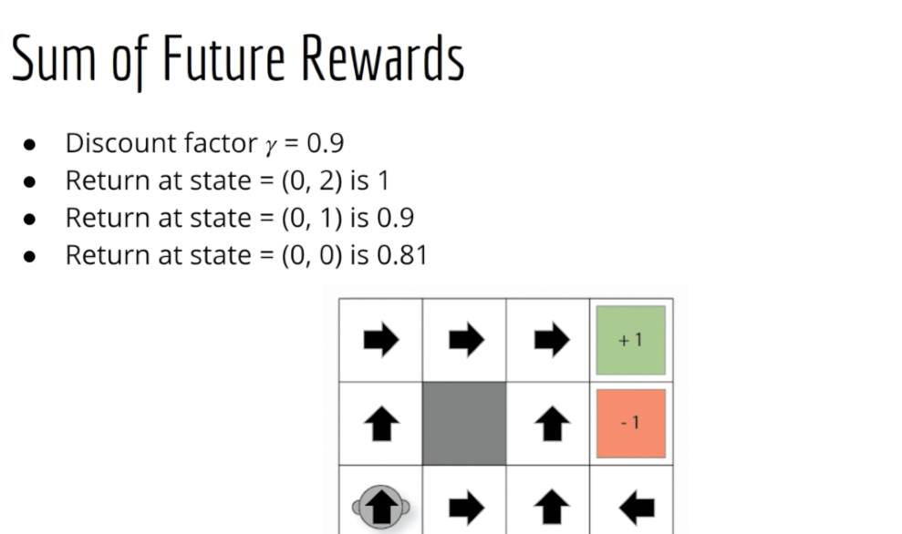

&nbsp;&nbsp;&nbsp;What about a game like tic tac toe or chess.
In the versions of grid world we've been looking at so far the entire game is deterministic.
There are states which are the locations on the grid and our actions simply bring us to neighboring states.
But in tic tac toe and chess we have an opponent who also can take any number of actions.
We have no idea what our opponent will do and therefore the next state we arrive in when it is our turn to make the next move is not deterministic.
We know that in general the environment dynamics are represented by the probability distribution P of s prime and r given s and a.
And so ultimately the future is not known.
Thus we should ask does it make sense to maximize the return when we don't even know what the return will be.
How can we maximize the return when the return can be different depending on the trajectory of the game.

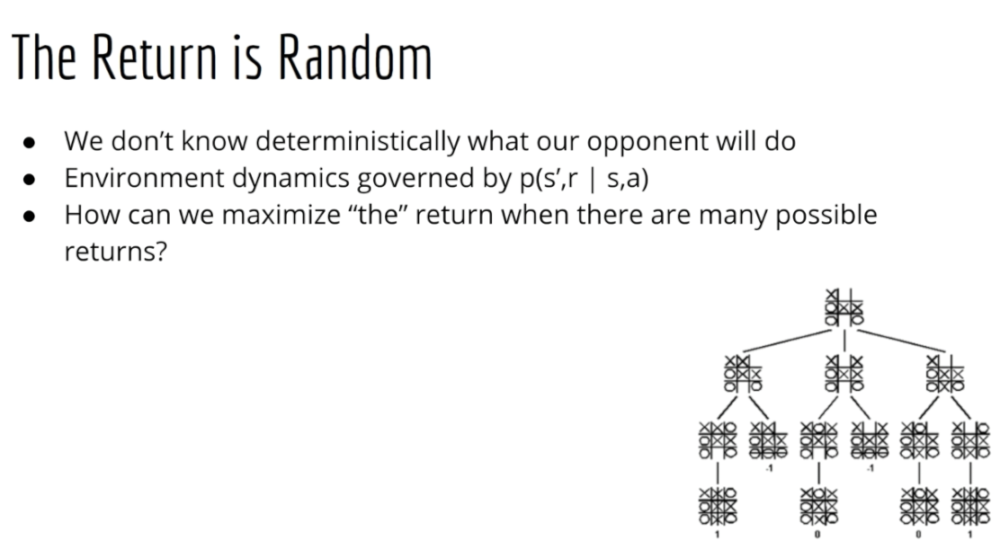

&nbsp;&nbsp;&nbsp;In fact the return is a random variable.
What we really want to maximize is the expected return or the expected value of the return.
Another way of saying that is I want to maximize the average return.
Of course in order to maximize anything I need to know how to calculate that thing in the first place.
So how do I calculate the expected return?
The expected return is known as the value or the value function.
Unfortunately this is a terrible name since the word value is such a generic word nonetheless that's what it's called.
So that's what we're going to call it.
As mentioned previously the entire purpose of this course is studying algorithms for solving the value function.
So it's pretty important to know what the value function is.
The value function is defined as the expected value of the return.
Given a state s under the policy distribution π.
This is why earlier in this lecture we demonstrated that the return will be dependent on what state you are in and what policy you are following.
The value function is defined as the expected return at time t.
Given that the state at time t is s.

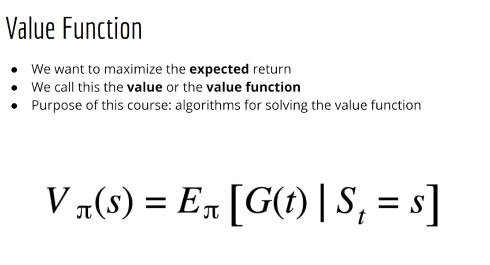

&nbsp;&nbsp;&nbsp;One important fact to remember is that the value of a terminal state is always zero.
Remember that the value is the expected return but the return is the sum of future rewards.
If you are in a terminal state then there are no future rewards and hence the value of a terminal state is always zero.

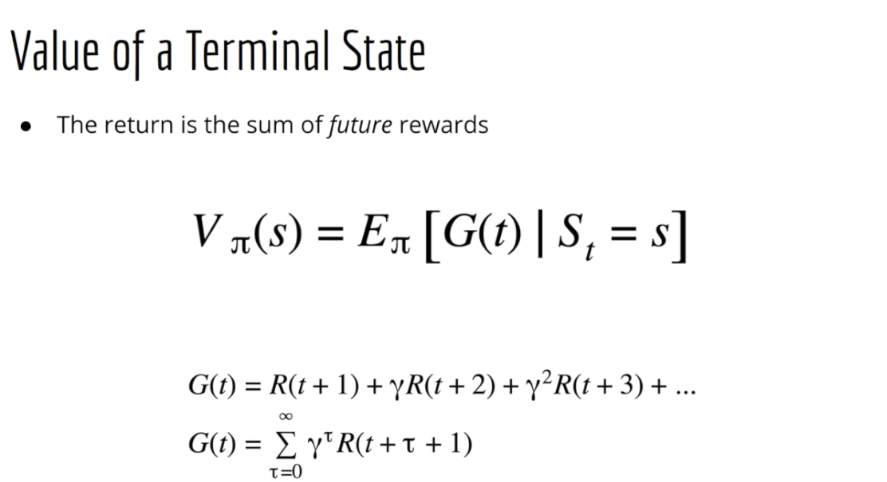

# The Bellman Equation

&nbsp;&nbsp;&nbsp;One useful way to think about value functions is probability trees.
Although these are somewhat simplistic as you'll see very soon, as a simple example consider a biased coin with probability of heads equals 0.6.
The idea behind the probability tree is the root node is going to represent where I am now; all the child nodes represent the states I could possibly go next.
Each branch of the tree has a weight which tells us the probability of going through that state.
From this graph I can see that I have a 40 percent chance of going to the left and getting zero reward, and I have a 60 percent chance of going right and getting a reward of 1 (if heads equals 1 and tails you get zero).
It's obvious that my expected reward will be one times 0.6 plus zero times 0.4 which is equal to 0.6.
In other words, my expected reward is the weighted sum of all the possible rewards where those weights are given by the branches of the tree.

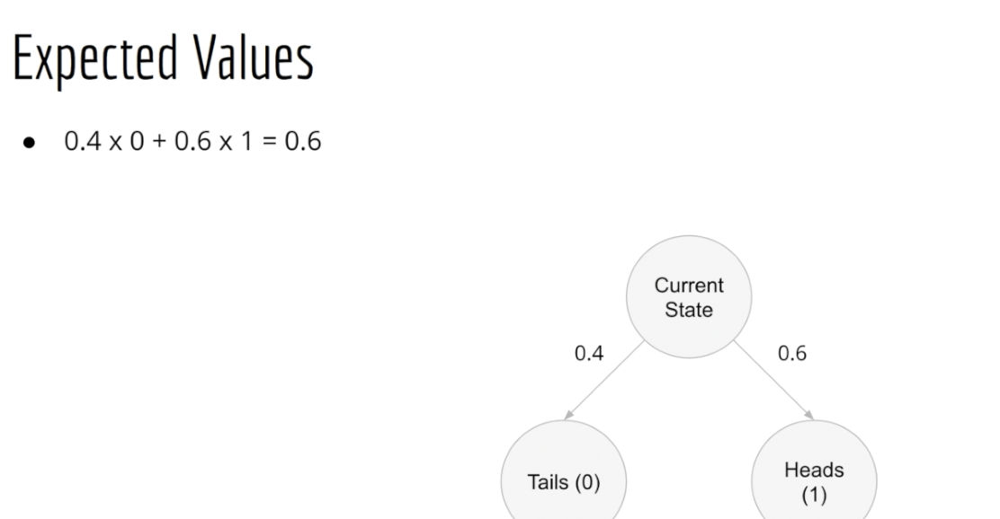

&nbsp;&nbsp;&nbsp;Note that this applies to a tree that can have any number of children; the rule remains the same.
The expected value is the weighted sum of each of the child node values weighted by the respective probabilities.
Of course this is just the definition of the expected value for a discrete random variable.
If X is our random variable then the expected value of X is just the sum over all possible values of X of X times P of X.

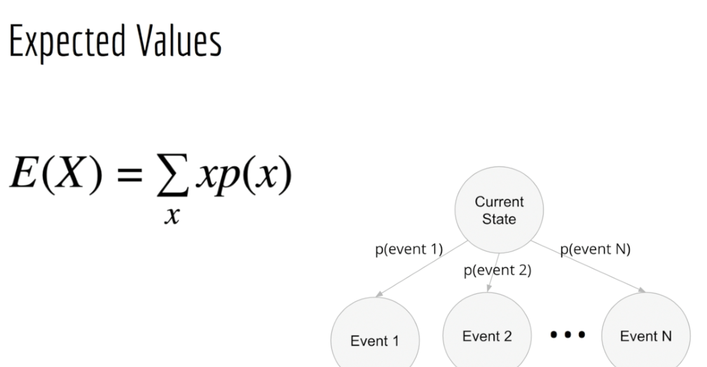

&nbsp;&nbsp;&nbsp;Of course we can extend this concept even further.
Let's look at a game of tic tac toe.
Previously we looked at a very simple tree where there was only a root node and then direct descendants of the root node.
With tic tac toe, we have to consider the fact that the game isn't over after just a single move.
A game is played by doing an entire sequence of moves and thus we have an entire sequence of states.
Each leaf node in the tree represents a possible state that we might end up in.
This tree represents all the different trajectories we might take from where we are in the tree at the current moment.
Luckily the same thought process still applies.
What we want to do is calculate the expected sum of future rewards which ends up being some kind of weighted sum of the values of the descendants.
The nice thing about trees is that they should remind us of recursion.
Remember that a tree is a recursive data structure.
We can pick any child node in our tree and the subtree starting at that child node is also itself a tree.

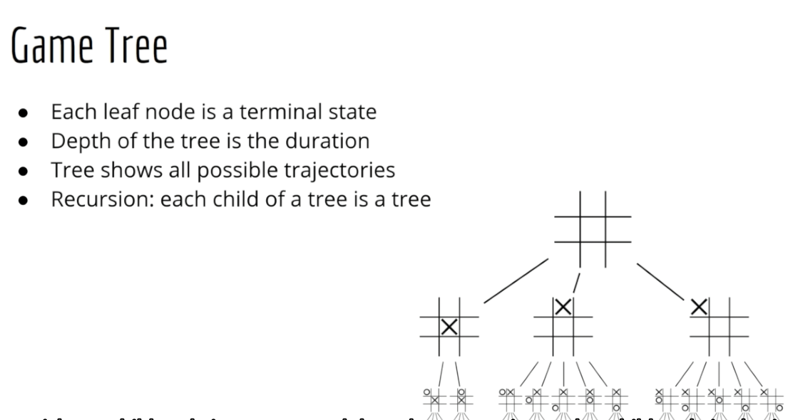

&nbsp;&nbsp;&nbsp;Let's look carefully at the equation for the return.
We say that it's the sum of future rewards: G₁ will be equal to R₂ plus R₃ all the way up to R_T.
But what if we are at the next time step and we want to know what is G₂?
Well, using the definition, G₂ is just R₃ plus R₄ all the way up to R_T.
Notice how G₂ is actually embedded into G₁.
In other words, we can substitute G₂ into the expression for G₁.
G₁ is just R₂ plus G₂.
In general, we can say that G_t is equal to R_{t+1} plus G_{t+1}.

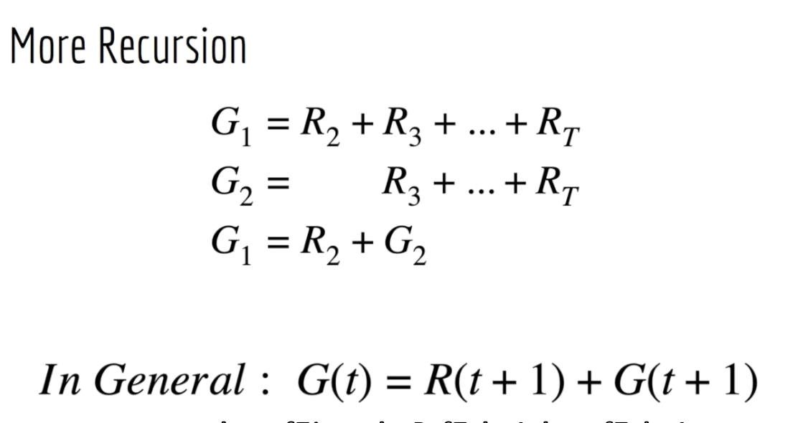

&nbsp;&nbsp;&nbsp;I would encourage you to prove to yourself that this applies to discounted returns as well.
G at time t is equal to R_{t+1} plus gamma times R_{t+2} plus gamma squared times R_{t+3} and so on.
G at time t+1 is equal to R_{t+2} plus gamma times R_{t+3} plus gamma squared times R_{t+4} and so on.
Therefore, V at time t is equal to R_{t+1} plus gamma times V at time t+1.
We can summarize this by saying the return is recursive.

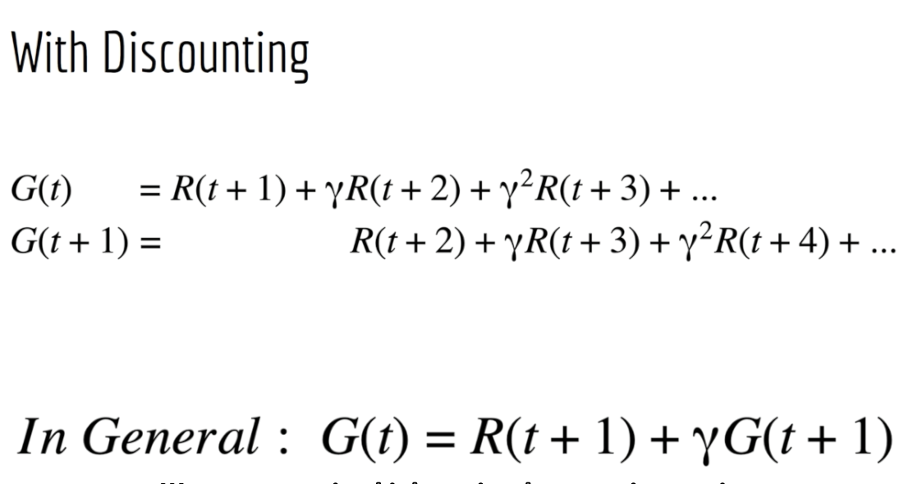

&nbsp;&nbsp;&nbsp;But let's remember that we are not just interested in the return but rather the expected return.
Having an expected value makes this a bit more complicated.
Still, this shouldn't stop us from trying.
We want the expected value.
Now let's try to expand our expression for the expected value using the relevant probabilities to take our first step in deriving the Bellman equation.
Let's remember that the return is recursive so I can replace G at time t with R at time t+1 plus gamma times G at time t+1.

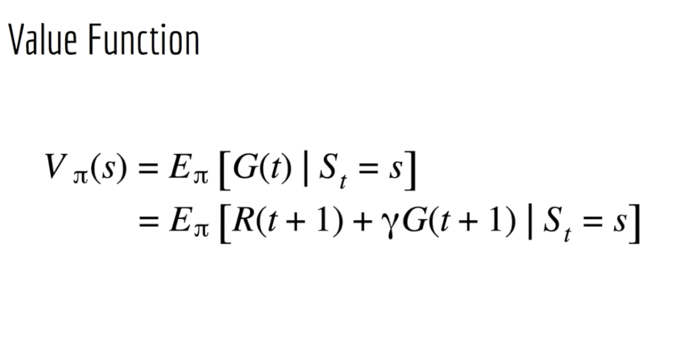

&nbsp;&nbsp;&nbsp;The next step is the most tricky step out of this entire derivation.
To understand this step, we first have to understand the law of total expectation in general.
This says that the expected value of the expected value of X given Y is just the expected value of X.
That is, if we take the expected value of a conditional expectation, it doesn't matter what we are conditioning on.
This appears to show you why this is true: you only have to expand the expression by the definition of the expected value.
We start by expanding the inner expected value which is a conditional expectation.
The random variable here is X.
So we sum over X.
The next step is to expand the outer expected value.
Since the inner expected value has already summed over X, the random variable now is Y.
Thus our outer sum should be over Y.
Since this is an expectation over the random variable Y, the appropriate probability distribution is P of Y.
In the next step, we remove the extraneous brackets since they don't affect the order of operation.
In the next step, we recognize that P of X given Y times P of Y is just the joint probability P of X and Y.
In the next step, we move the sum over Y inside past all the X's; that's allowed since nothing to the left of Y depends on Y.
Of course this is just marginalization: the sum over P of X and Y over Y just gives us P of X.
Now we have the sum over X of X times P of X which, as we know, is the expectation of X.

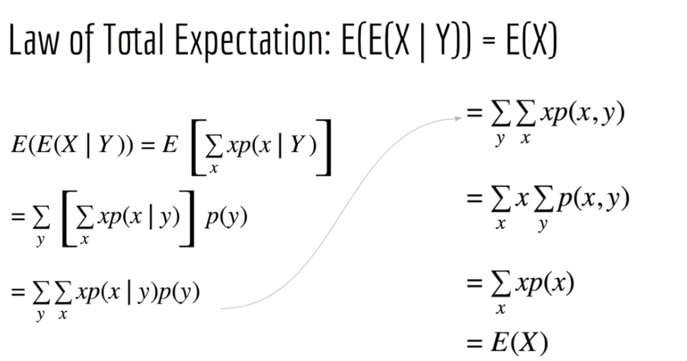

&nbsp;&nbsp;&nbsp;So how can we use the law of total expectation to help us derive the rest of the Bellman equation?
Well, it might help to first recognize that the expectation is a linear operation.
So if we see a plus sign inside an expectation, we can split up the expectation: that expectation of a sum is the sum of expectations.
We can also bring constants outside like gamma.
The important part of this is the second term.
The term with the return that G_{t+1}.
This is like our X in the law of total expectation.
As you know, we can replace G_{t+1} with any conditional expectation.
But obviously we want to replace it with something that makes sense.
So how about the next state s' at time t+1?
Of course this is nothing but the definition of the value function at the state s'.
And so we can simply replace it with a symbol V of s' and put both terms back together under the same expected value.

&nbsp;&nbsp;&nbsp;So this is the Bellman equation for the value function.
The centerpiece of reinforcement learning.
Although it seems simple, it has one key characteristic: this is that the computation of the value function is recursive.
Calculating the value function at the current state s depends only on the possible next states s'.
There is no need to traverse a possibly infinite number of future trajectories to estimate the expected value.
In other words, you don't need to search an entire probability tree.
What this equation says is that in order to calculate V of s, you only need to look one step ahead.
The value at s'.
Why is this remarkable?
It means that our agent can plan without actually having to look very far in the future.
Even if our goal is 1 million steps ahead, we can plan that entire 1 million steps simply by solving this equation that only looks at the next step.
As you'll see, this is of particular importance in popular algorithms such as Q-learning.

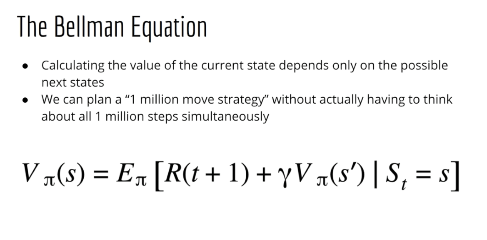

&nbsp;&nbsp;&nbsp;In this lecture we are going to continue our discussion of the Bellman equation.
It's important to recognize what probability distributions in the Bellman equation we are actually summing over.
As we discussed earlier, the value of a state is dependent on both the state but also the policy we are following.
That's the probability distribution π.
And we even write this explicitly as a subscript.
What is not so clear is that the value also depends on the environment dynamics.
Of course, now that I say this, it's pretty obvious.
Obviously, the expected sum of future rewards would depend on the environment itself.
Recall that in an MDP there are two entities: the agent and the environment, and they both have their own respective probability distributions.
The agent is represented by π(a | s) and the environment is represented by P(s′, r | s, a).
Therefore, if we expand out the expression for the Bellman equation, both of these probabilities should appear.
Note that in this expression the random variables we need to sum over are s′ (the next state), r (the reward), and a (the action).
It might not be clear exactly why expanding the Bellman equation like this is useful but later you'll do some exercises to help you see how to use it.
One way to simplify this equation a bit is to recognize that the policy distribution π does not depend on s′ or r, so it can be brought outside those sums.
Now we only have one outermost sum over a, and the sums over s′ and r can be brought further inside.

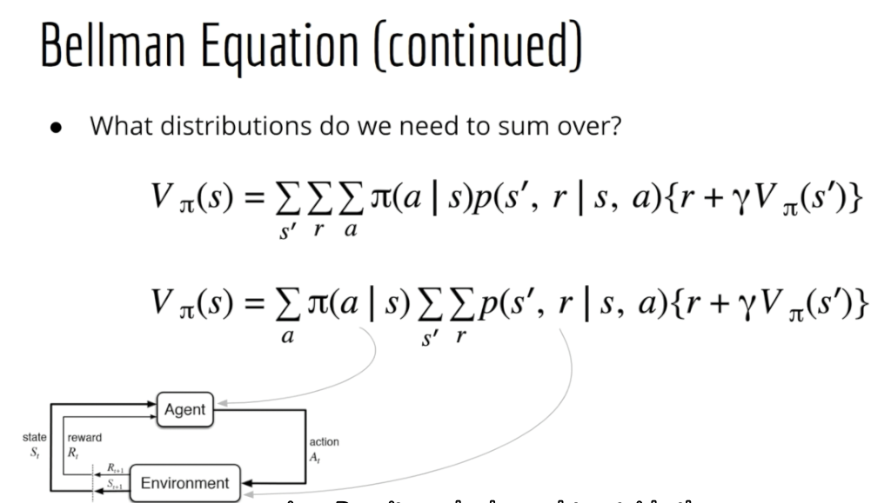

&nbsp;&nbsp;&nbsp;I want to mention that there are some alternative forms of the Bellman equation that you will see out in the wild.
You recall I said earlier that sometimes the reward is not considered to be stochastic, just the next state.
In that case, we can simplify Bellman’s equation; the environment dynamics are now represented by P(s′ | s, a).

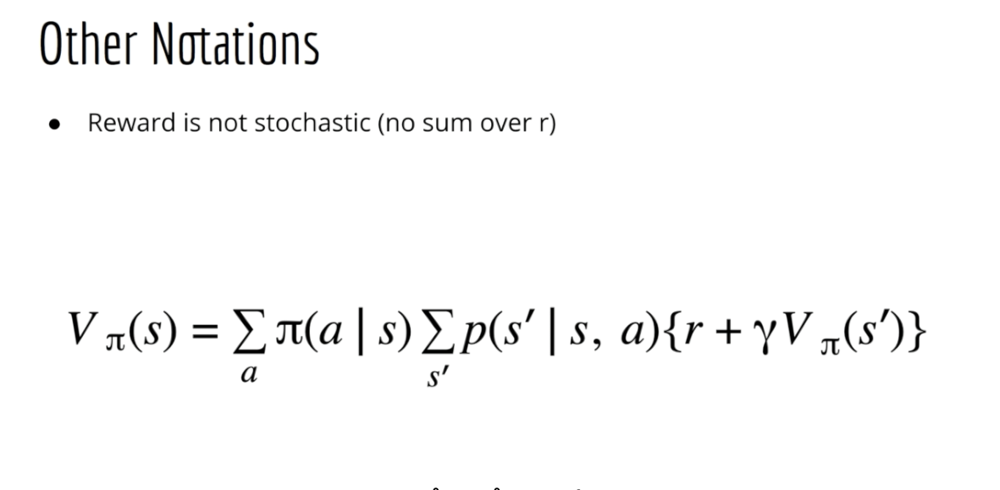

&nbsp;&nbsp;&nbsp;Another notation, which is a little more verbose, makes the dependence of the reward more explicit.
Essentially, it subscripts the reward with a triple: the current state s, the action a, and the next state s′.
In other words, the reward is dependent on these three values.

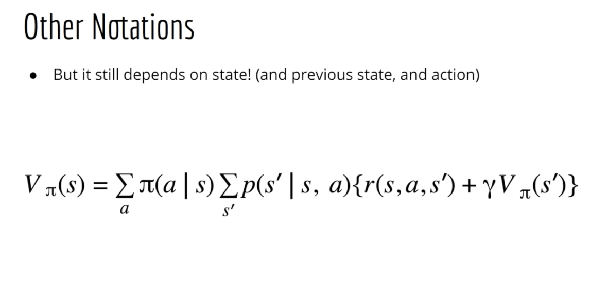

&nbsp;&nbsp;&nbsp;One alternative notation, which is kind of odd in my opinion, is to use subscript and superscript instead of explicitly stating what's the random variable and what's being conditioned on.
Of course, this is not ideal since we can't see what the meaning of any of these distributions is.
It also confuses the policy as a joint distribution rather than a conditional distribution.
I will never use this, but I want you to know that it exists.

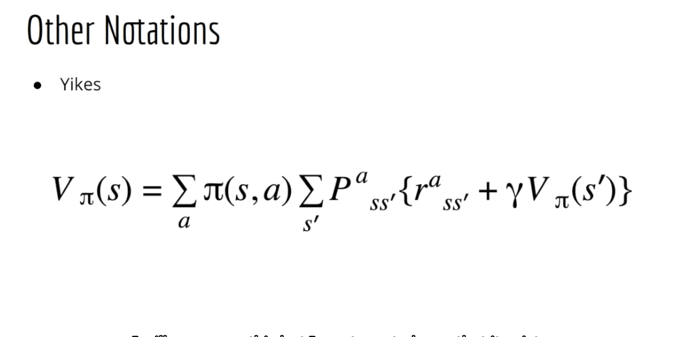

&nbsp;&nbsp;&nbsp;Finally, I want to bring this back to the idea of probability trees.
The thing with probability trees is that we can only go in one direction, but we know that this is limited even in a game like chess.
If the players just keep moving their pieces back and forth (although you probably wouldn't want to do so), your game will just go back and forth between states that were already visited.
Another example of this is if you are modeling the weather.
Suppose we have three states: sunny, rainy, and cloudy.
Obviously, we can go from any state to any other state from one day to the next, including the option of staying in the same state.
For example, it's sunny two days in a row as you saw previously.
Calculating expected values in a tree is easy—you just sum over the child nodes.
But what if you have a generic graph that has loops?
Now there is no notion of child because you can have two nodes that are pointing at each other.

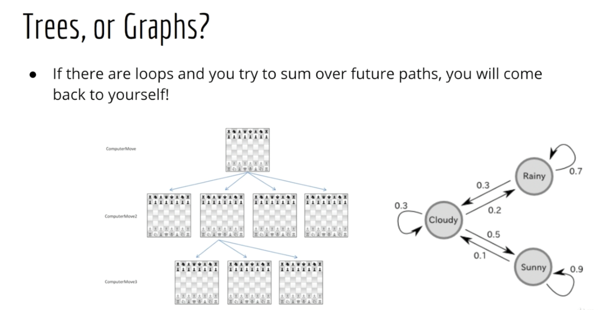

&nbsp;&nbsp;&nbsp;My claim is that solving the Bellman equation becomes nothing but a system of linear equations.
To remind you of what these look like (although you should already know this):
Consider a set of two equations: x + y = 3 and 2x − y = 1.
This is two equations and two unknowns, and so usually from these we can solve for x and y.
Well, the Bellman equation is the same.

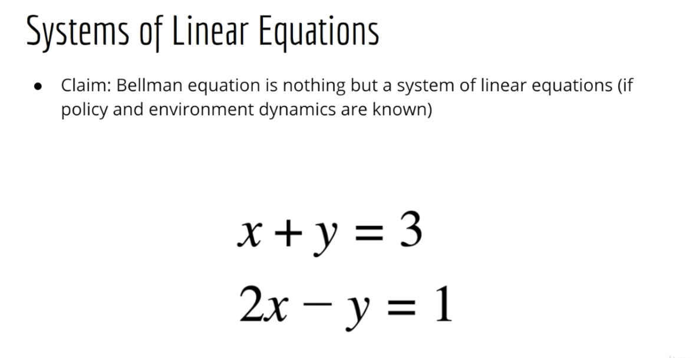

&nbsp;&nbsp;&nbsp;Suppose we have two states s₁ and s₂.
We can go from s₁ to s₂ or vice versa, and we can stay in the same state.
Remember that for now we will consider that environment dynamics and policy distribution to be given.
If we look carefully at our Bellman equation, what do we see?
First, let's consider π since this is given.
It's just a constant.
It's just a number.
Now let's consider P(s′, r | s, a).
Since this is also given, it is also a constant.
Now let's consider r.
Well, this is known since P(s′, r | s, a) is known.
We are just summing over all possible values of r.
How about V(s′)?
Well, this can only take on two possible values: V(s₁) or V(s₂).
Therefore, it's easy to see that the Bellman equation boils down to two equations.
The first equation is V(s₁) = B₁ + C₁₁ × V(s₁) + C₁₂ × V(s₂).
The second equation is V(s₂) = B₂ + C₂₁ × V(s₁) + C₂₂ × V(s₂).
Here the B's and C's are constants, and thus the Bellman equation is really nothing but a set of linear equations.

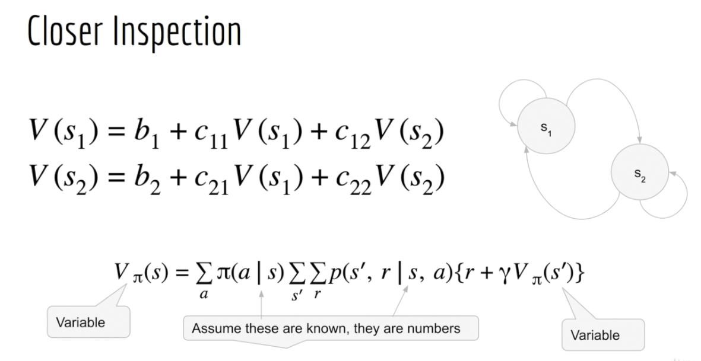

&nbsp;&nbsp;&nbsp;Of course, if this solution worked, then the rest of this course wouldn't be necessary.
So what's wrong with solving the Bellman equation using a system of linear equations?
Well, the problem is that the number of variables is the number of possible states.
What would we do for games like chess or Go which have 10^50 or 10^170 states?
In cases like these, solving systems of linear equations is not possible.
Unfortunately, problems like these are also the kinds of problems that we care about.
We also haven't yet discussed problems where the state space is infinite.
Thus, the rest of this course is not just how to solve the Bellman equation but rather how to solve it in a way that is also scalable.

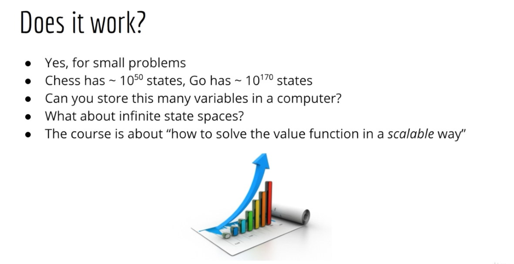

&nbsp;&nbsp;&nbsp;In this lecture we are going to continue our discussion on value functions and the Bellman equation.
So far we've discussed the value function V(s). It says:

What is the expected sum of future rewards given that I am currently in the state `s` following the policy `π`?

But here's a question to consider:

What would be the sum of future rewards if I took some arbitrary action `a` and thereafter followed the policy `π`?

As you know, in reinforcement learning, our goal is to get our agent to learn. To learn, it must perform new actions—actions that are different from its current policy.
Thus, it's not enough to only consider what is the value of the current state under the current policy.
We also need to ask what happens if I try some other action that is perhaps not the action dictated by the policy.
Also recognize that this is a question that must automatically be considered if you have a stochastic policy.
A stochastic policy allows you to take any action from a given state.
So obviously the sum of future rewards will be different depending on which action is actually taken.

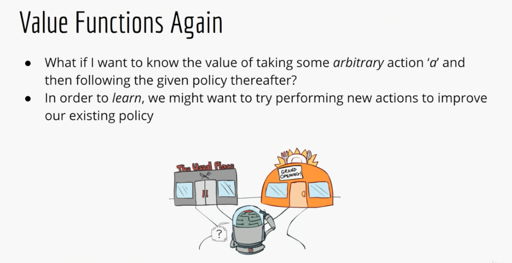

&nbsp;&nbsp;&nbsp;To address the fact that the sum of future rewards may be different depending on which action is taken, we create a new kind of value function.
In order to distinguish between these two kinds of value functions, we give them separate names:

The value function `V`, which we previously discussed, is referred to as the state value.
The value function `Q`, which depends on both the current state and the action taken in that state, is known as the action value.
The definition of the action value is analogous to the state value: it's the sum of future rewards conditioned on the current state `s` and the current action `a`.

Obviously, since we are now conditioning on two variables, the `Q` function has two arguments `s` and `a`.
Note that in many places you'll see `Q` referred to as a Q table.
This makes sense because `Q` has two arguments: the state and the action.

Tables are two-dimensional: we have rows and columns.
So if we line up all the states along the rows and all the actions along the columns, and inside the table we store the actual `Q` values for the given state and action, then it's pretty obvious that this is a table of `Q` values or simply a Q table.

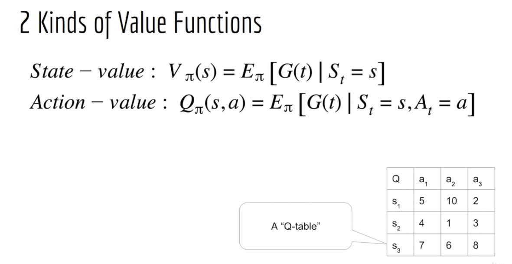

&nbsp;&nbsp;&nbsp;Just like with the state value, we can derive an expression for the Bellman equation for the action value.
As usual, we start from the definition, same as before.
The next step is to replace G(t) with the recursive definition: the reward at time t+1 plus γ times the return at time t+1.

The next step is to replace the return at time t+1 with the expectation of the return at time t+1 conditioned on the next state `s'`.

Of course, this is the state value function for `s′`.
Now you might wonder: why don't I condition on the next action `a′` as well?

Well, remember that `a′` is not a variable being considered under the current expectation.
Therefore, it has to be marginalized out.
So the next step is to additionally condition on the next action `a′` and take its expectation over all possible next actions.
Of course, now the entire term is just `Q(s′,a′)`.
And so we end up with a recursive definition of the action value function as well.

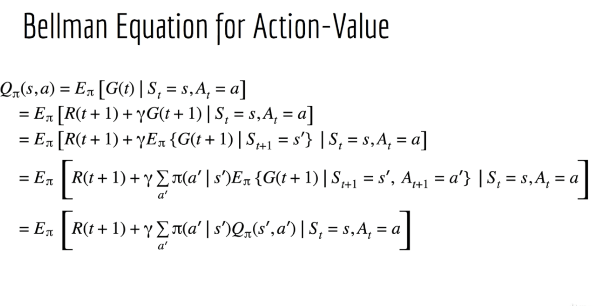

&nbsp;&nbsp;&nbsp;At this point, it's useful to tease out a few useful identities from our previous derivation.
The critical one is: how do I relate the state value to the action value?
This might be easier to see if we express both the state value and the action value in terms of probabilities.
So let's start with the state value again.
Now let's write out the expression for the action value.
Notice how there is no need to sum over a because we are conditioning on a, of course.
This makes it obvious that there is only one additional step for calculating `V`, which is to sum over the action `a`.
Thus, the state value is nothing but the expected value of the action value if we take the average over all possible actions we could have done weighted by the probabilities of those actions.

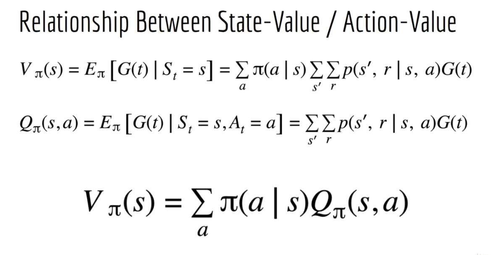

&nbsp;&nbsp;&nbsp;At this point, you might be wondering: what is the action value even useful for?
Well, this probably won't be super clear until we get to the next few sections where we start to introduce actual algorithms.
But the basic idea is this:
The state value is useful for evaluating a given policy.
That is, given a policy, tell me how good it is.
Tell me what future reward I can expect to achieve.
The action value is used for control.
Again, this is all abstract because you haven't yet seen any examples of it, so you'll just have to take my word for it at this point.
But the intuition is this:
The action value allows me to see what is the best action I can take in the current state.
It's telling me the expected future reward broken down by action.
Thus, let's say I want to compare two actions 
a1 and a2 for the state I'm currently in.

I want to ask: what is the best action I can take right now?
Well, the best action is obviously the one that's going to give me the highest future reward.
And thus I can compare Q(s,a1) and Q(s,a2).

I will choose the action that gives me the highest future reward.
This opens us up for the next lecture, which is on optimal policies and optimal value functions.

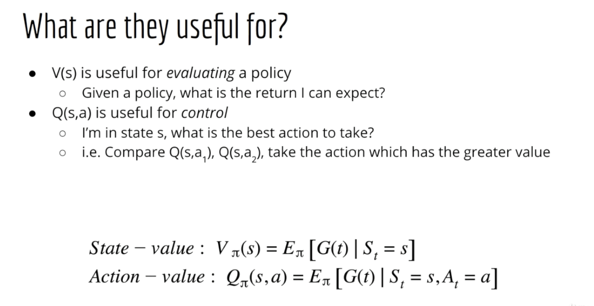

# Bellman Examples

&nbsp;&nbsp;&nbsp;In this lecture, we're going to look at the Bellman equation by example.

Now, of course, in the real world you may have thousands or maybe even millions of states, but in this lecture, we're going to look at some very simple models with just a handful of states and you'll see how we can solve the Bellman equation by hand for some very simple cases.

Hopefully, this helps you gain some intuition about the Bellman equation and realize that it's not sort of scary.
And also keep in mind, just from a big picture perspective, this idea of solving for V(s) — that's essentially what this entire course is about.
This whole thing can be generalized to this idea: we have a model called an MDP (Markov Decision Process) and there's this value function V(s).

Now all we need to do is find it.
It's really that simple.
So once you handle the details you can take a step back and appreciate this general framework and how useful this abstraction is for solving a variety of problems.

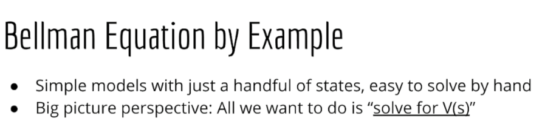

&nbsp;&nbsp;&nbsp;Let's start with a very basic example.
We have two states: start and end.
The probability of going from start to end is 1.
So every time you play this game it's completely deterministic; every game just consists of two steps: start and end.

Let's suppose the end state gives you a reward of 1 and the discount factor is γ=0.9. The question is: what do we need to find?

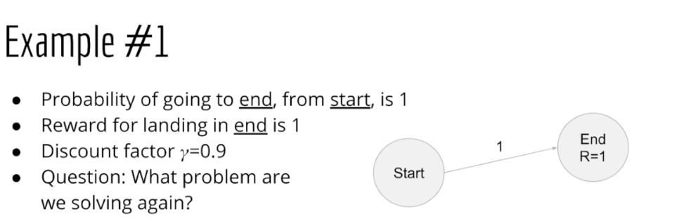

&nbsp;&nbsp;&nbsp;If your answer was we need to solve for the value function, that's great—you are on the right track.
Since there are only two states, that means we need to find V(start) and V(end).
See if you can do this on paper before we move to the next slide.

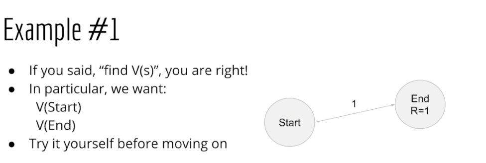

&nbsp;&nbsp;&nbsp;Now remember that the value is the sum of all future rewards.
Since at the end state there are no future rewards, the value of the end state (or in more general terms, any terminal state) is always zero because everything else is deterministic.
The start is one.
Why is this?

Remember that you can think of this as a probability tree.
Going from start to end is the only possibility, so the weight of that edge is one.
Note that we do not multiply this reward by γ because γ applies only to future states.

So the full equation is actually  R+γ×V(end), where the second term is just zero.

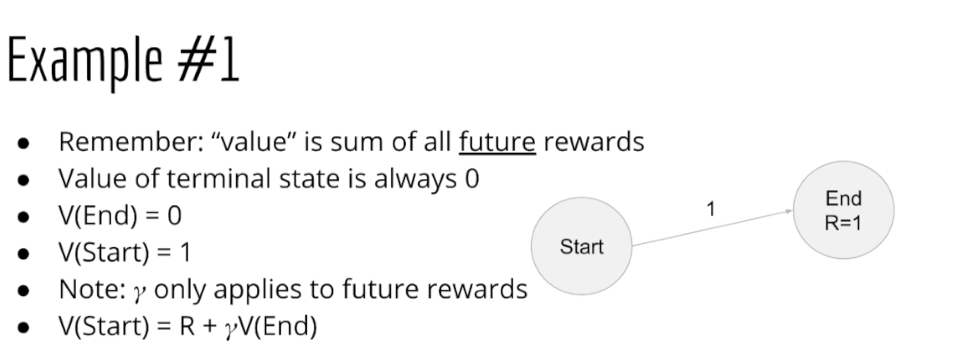

&nbsp;&nbsp;&nbsp;For our next example, I'm going to add a third state.
Note how everything is still deterministic.
Therefore every game just has three steps: start, middle, and end.
The reward again is one for arriving in the end state and zero otherwise. γ remains 0.9 as you already know.

Our job is to find  V(start), V(middle), and V(end).
See if you can do this on paper before we move to the next slide.

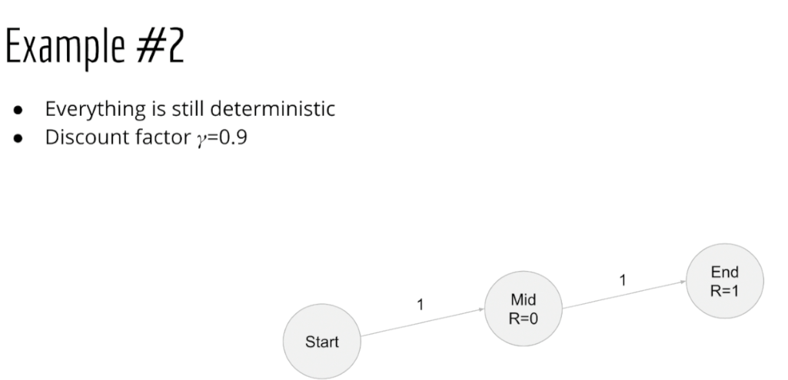

&nbsp;&nbsp;&nbsp;Because V(end) is a terminal state, we already know its value is zero.
In this example, the middle takes on the role of V(start) from our previous example.
So the middle is one by the logic we discussed previously.
Since this is all deterministic, we can use the Bellman equation in simple form to determine the value of V(start), which is 
R+γ×V(middle), which is 0.9.

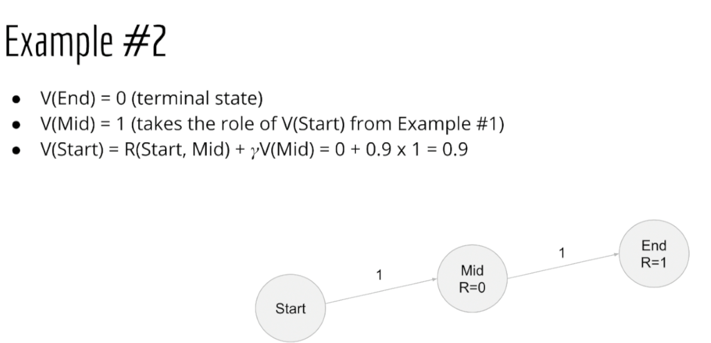

&nbsp;&nbsp;&nbsp;In this next example, we're going to make things a little more complicated.
We have the same states and everything is still deterministic but now you get a reward of minus 0.1 for going to the middle state.
Our job again is to find V(start), V(middle), and V(end).
See if you can do this on paper before we move to the next slide.

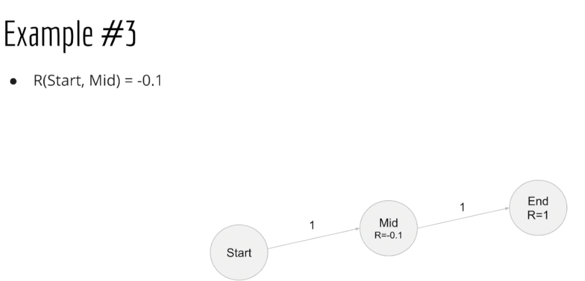

&nbsp;&nbsp;&nbsp;Because the end comes after the middle, its value is unaffected and it remains zero.
And since the middle is only concerned with future rewards, its value is also unaffected.
So it remains one.
Restart, however, is affected.
It's equal to 

−0.1+0.9×1=0.8.
Hopefully, you're getting the hang of this.

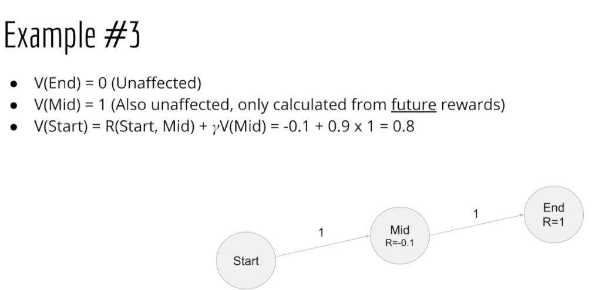

&nbsp;&nbsp;&nbsp;In this next example, we're going to introduce some randomness.
Our states are s1, s2, s3 and s4. s4 is a terminal state and you always get a reward of 1 when you go here.  
s2 and s3 both go to s4 100% of the time, so this part is deterministic.  
s1 goes to s2 50% of the time and to s3 50% of the time, so this part is random.

The reward for arriving in s4 is 1, the reward for arriving in s2 is −0.2, and the reward for arriving in s3 is −0.3.

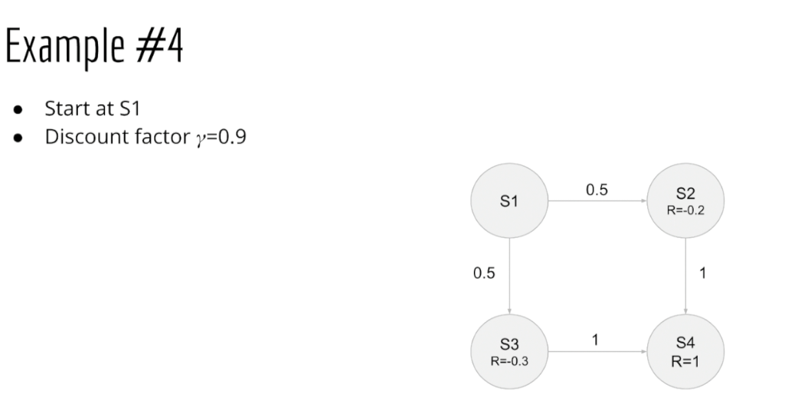

&nbsp;&nbsp;&nbsp;Before we move on to the solution, this example introduces an interesting nuance: what does the probability I just mentioned refer to?

If I say we have a 50% chance of going to s2 and a 50% chance of going to s3 what does that really mean?
Because this is reinforcement learning and there are multiple components in an MDP, this is not just a simple coin flip.
I don't flip a coin and go whichever way it tells me to go.
I'm an agent and therefore I have an internal policy that tells me what action to do.
Importantly, it's not the probability of where to go, it's the probability of what to do.
But if you recall, this is not the only relevant probability.

We also have P(s′, r ∣s,a).
This just means that by doing some action `a` in state `s`, the result can be random.
So if my action is "flip a coin," of course there are multiple possible results.
I may get heads or I may get tails.
That's one way an action might result in a probabilistic next state.
So when I say you have a 50% chance of going to s2 and a 50% chance of going to s3, that sounds really intuitive and simple but it oversimplifies the MDP and results in some ambiguity.
Although when you verbalize it, it sounds simpler.

For this particular example, let's assume P(s′∣s,a) is deterministic and the 50% probabilities I mentioned earlier refer to the policy π(a∣s) where the action is simply just to go to the next state.
That means the agent itself decides to go by random chance and it's not a result of the environment.
See if you can solve this on paper before we move to the next slide.

&nbsp;&nbsp;&nbsp;As usual, the value of the terminal state V(s4) is zero.
Everything that happens after you arrive in s2 and s3 is deterministic.

And so it follows the same logic as the previous examples.
So V(s2) is −0.2+γ×0=−0.2 but since the next state is terminal with zero value, V(s2)=−0.2.

Similarly, V(s3) = -0.3.  
V(s1), however, must be calculated using expected values.
I have a 50% chance of going to 
s2 and receiving a reward of −0.2.

I have a 50% chance of going to s3 and receiving a reward of −0.3. After that, the next state is always 
s4, which always yields a reward of 1.
So that part can be effectively removed from the expected value.
The value of s1 is then just the weighted sum of these two branches.

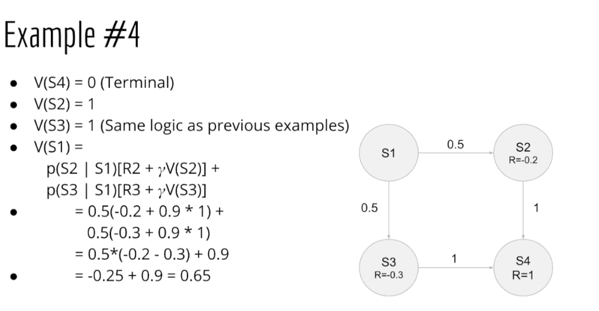

&nbsp;&nbsp;&nbsp;In this next example, we're going to extend this problem just a little bit.
For the expected value in the previous example, it was easy to calculate because you always ended up in the same terminal state s4. For this example, that won't be the case.  
Note that s1 can go to either s2 or s3, but from s2 or s3 we can end up in either s4 or s5.  
So now we have two terminal states and there are multiple paths to either one.
The only relevant rewards for this example are a reward of plus one if we end in 
s5 and a reward of minus one if we end in 
s4. Try this on your own and we'll look at the solution in the next slide.

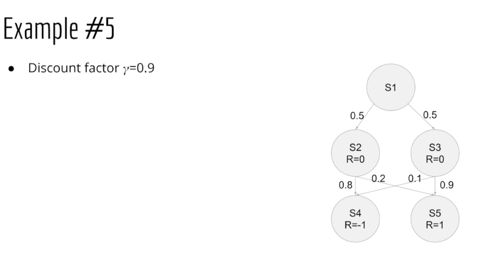

&nbsp;&nbsp;&nbsp;Firstly, we know that V(s4) and V(s5) are zero since they are both terminal states.
Second, we can calculate 
V(s2) and V(s3) just from the rewards since we know the next stage must be terminal.
So we don't need to use the full Bellman equation.

So  V(s2) = 0.8 * (-1) + 0.2 * 1 = -0.6

Its expected value is negative because it ends up in the losing state more often.

V(s3) = 0.9 * 1 + 0.1 * (-1) = 0.8

Its expected value is positive because it ends up in the winning state more often.

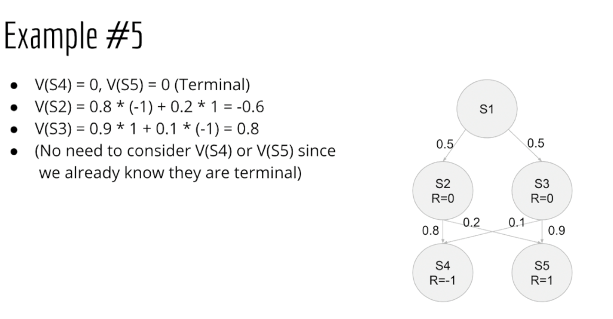

&nbsp;&nbsp;&nbsp;To calculate V(s1), we need to take into account both V(s2) and V(s3) since they are both possible next states.
But it's still simple since the rewards at s2 and s3 are both zero.

So it's just the weighted average of each of V(s2) and V(s3), which gives us 0.09.
It is slightly positive because we have an equal chance of landing in s2 or s3, but once we are in s3, we have a higher chance of going to s5 than the other path going from s2 to s4.

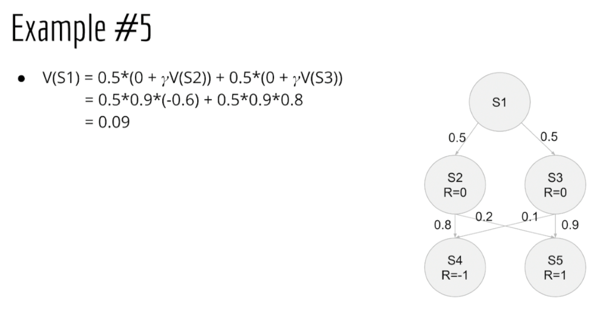

&nbsp;&nbsp;&nbsp;In this next example, we're going to look at a simple state diagram but with more complex probabilities.
This will be a somewhat more realistic scenario so you can actually picture what's happening.
It starts in state s: 

you're standing now, someone throws a ball at you.You can kind of think of this as dodge ball.
You have two choices: you can either decide to jump or duck.

Those are your two actions.
The next state is you either get hit or you don't get hit, which means you're safe.
I'd say the reward for getting hit is 
−1 and the reward for not getting hit is zero.

Importantly though, you can see why these state diagrams are somewhat oversimplistic.
In particular, when you look at a tree like this, you think—as I mentioned earlier—that the action is to go to the next state, but that doesn't include all the components of an MDP.
And so you can see how that doesn't work in this scenario.
I can't just choose "don't get hit."
Similarly, in life, I can't simply choose that I want to be rich.
I do some actions and the next state is going to be somewhat probabilistic.
I may start a company and it may fail or it may succeed, but I can't decide that.
All I can do is do the action.
The state that I end up in is probabilistic.

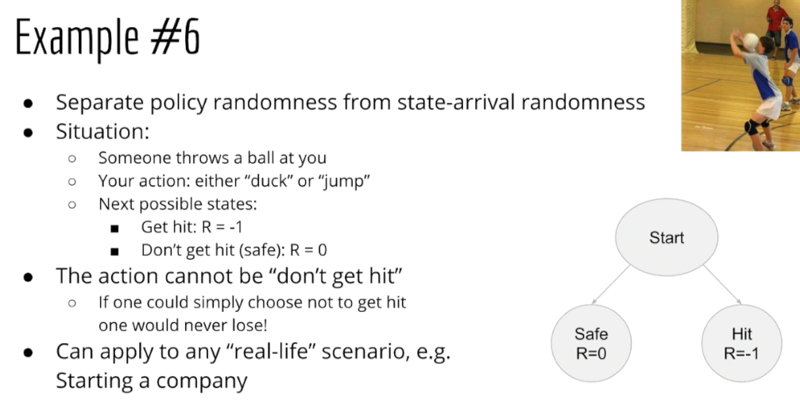

&nbsp;&nbsp;&nbsp;To continue on with this example, let's use these probabilities:

The probability of jumping given that you're in the start state is 0.5.
The probability of ducking is also 0.5.
Next, we have the state transition probabilities.
The probability of getting hit and getting a reward of 
−1 given that you jumped is 0.8.
The probability of getting hit and a reward of 0 given that you jumped is 0.
The probability that you don't get hit and the reward is 
−1 is also zero.

The probability that you don't get hit and the reward is zero given that you jumped is 0.2.
Notice how I define the probability distribution over the reward even though I didn't have to.
I just wanted to show you the full picture for what the probability space looks like.
Notice how you can put in any other number for the reward and the probability is zero as per the specifications of the problem.
For example, the probability that the reward is 10 is zero because that just doesn't exist in this game.

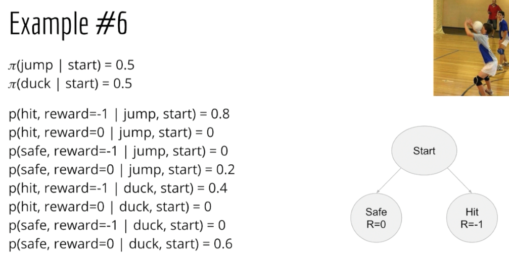

&nbsp;&nbsp;&nbsp;We can of course just marginalize these to get rid of the reward completely since it is deterministic.
We've already stated that when you get hit that counts as a reward of 
−1, and if you don't get hit it's zero.
If you want to try to solve the rest of the problem yourself on paper, please take this opportunity to do so.

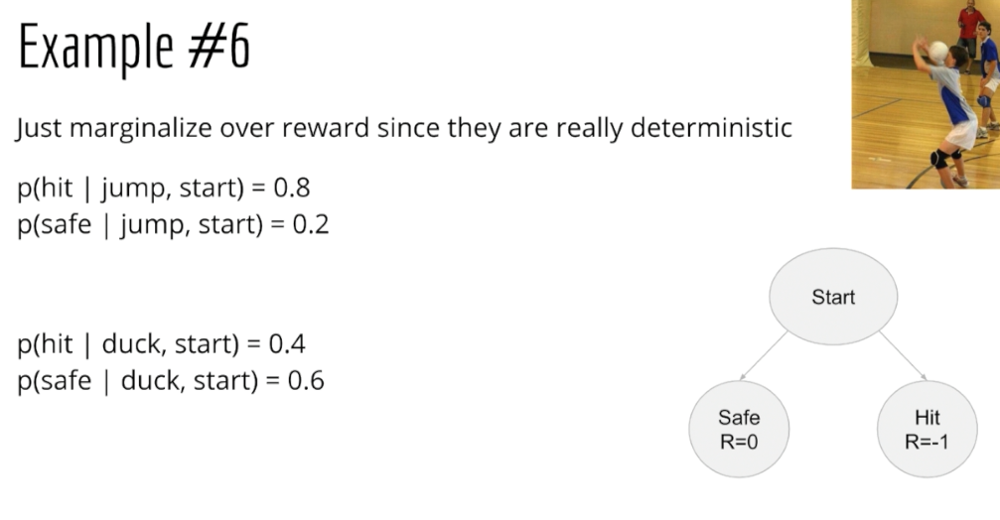

&nbsp;&nbsp;&nbsp;As usual, the value for the terminal states is zero.
So whether you get hit or you don't get hit, the value is zero.
It's calculating 
V(start) that's more challenging for this problem.
I've started using some typesetting for this equation since now things are starting to look a little more complicated, but it's still a little simpler than the full Bellman equation because we don't need to consider the value function for the next day.

For this type of thing, it's useful to do a little sanity check.
We see a summation inside another summation—in code, you can think of this as a for loop inside another for loop, or in other words, a nested for loop.
So when the outer loop runs, we have two things to sum over, and then the inner loop we have another two things to sum over.
And we know that the number of times things run in total is the size of the outer loop times the size of the inner loop.
So in total, we should have four things to sum over.

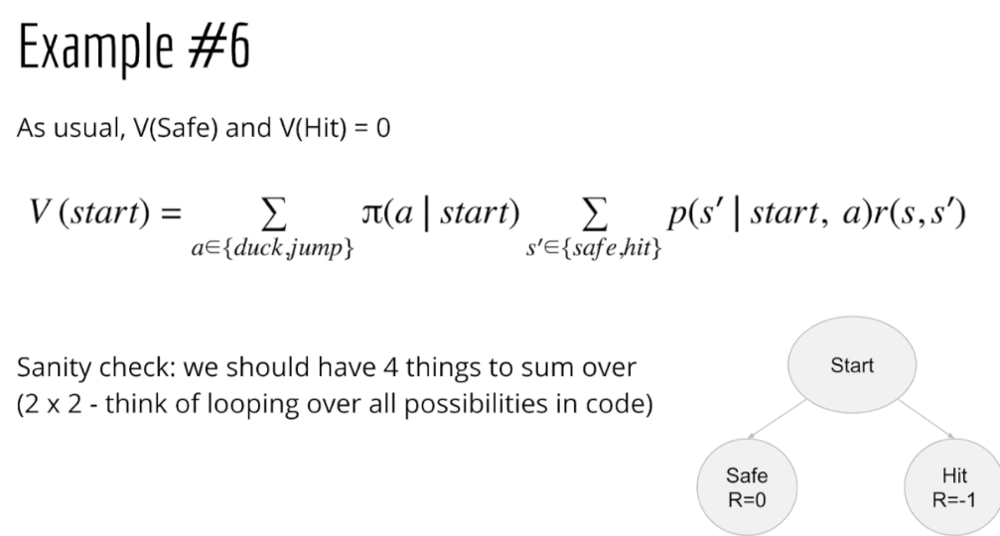

&nbsp;&nbsp;&nbsp;On this slide, I'm showing you the exact terms we have to sum over.
In order to make things fit on this slide, we have to abbreviate some things.
So we already know we're conditioning on the start state.
So let's just not show that.
We know that we're going to either jump or duck, so we can use the letter J or D which doesn't interfere with any other letter.
And so you see that we end up with four terms.
The first two are:

If we decide to jump, we're either safe and we get zero reward or we get hit and we get a reward of 
−1.

The next two are:
If we decide to duck, we're either safe and we get a reward of zero or we get hit and we get a reward of 
−1.

I'm not going to bother plugging in the numbers here since the main point of this exercise is how to set up the problem.
But you're welcome to do that as an exercise if you want.

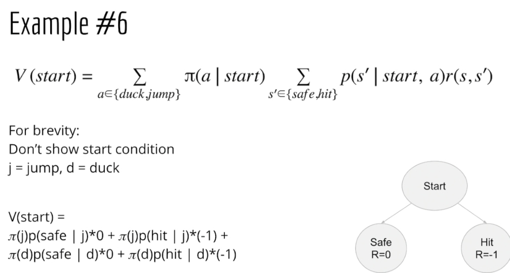

&nbsp;&nbsp;&nbsp;At this point, I think any state diagram shaped like a tree is going to be too easy for you.
I think by now you understand that this is recursive.
Essentially, you work backwards from the end.
So the terminal state is zero, the state next to that is whatever reward I get for ending the game, and so on using the Bellman equation.
In this next and final example, we're going to do something even more complex.
We're going to introduce a cycle.
When there's a cycle, it's not possible to just work backwards because there's no notion of backwards.
You can just end up in the same place you started.

In this example, we're going to have just three states: s1, s2, s3  
s3 is a terminal state, so once you reach it, you're done with the game and you get a reward of one. s1 and s2 are non-terminal states.

They can both go to each other.
So there's no notion of a starting position.
Only s2 can go to s3. But s1 can go back to itself.

Let's assume that the only probabilities here are the actions and that the actions are simply to go to whatever state is next.
As we discussed, the actions realistically don't have to be choosing which state is next, but it helps to simplify the picture in terms of what probabilities we have to consider.

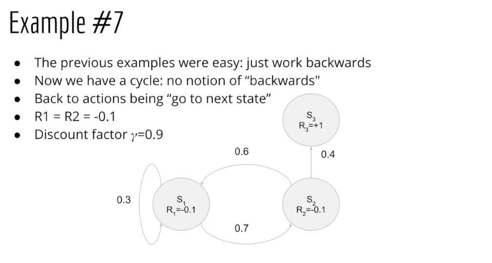

&nbsp;&nbsp;&nbsp;So how can we solve this problem?
Well, we can't use the method of just working backwards like we did previously.
That's because of this cycle we have.
So the only thing we can do is apply Bellman's equation in terms of the variables involved and just see what that gives us.

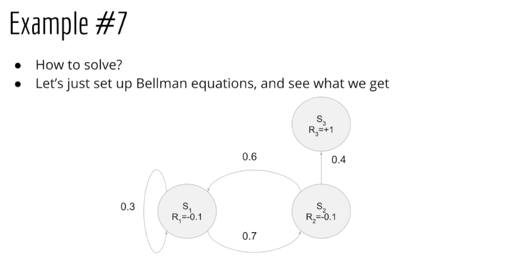

&nbsp;&nbsp;&nbsp;Let's do 
V(s1) using the Bellman equation.
We can see that it's equal to 
P(s1∣s1) × R1 +γ×V(s1) — that's the loop just back to itself.

And then there's 
P(s2∣s1) × R +γ×V(s2)— that's a loop going from 
s1 to s2.  
Notice that (s3) doesn't appear here because we can't get to s3 from s1.

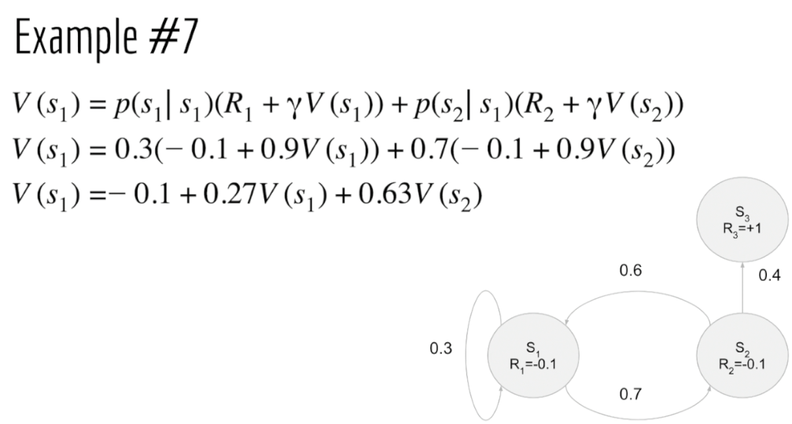

&nbsp;&nbsp;&nbsp;Let's do 
V(s2) next using the Bellman equation.
We can see that there is one term involving 
P(s1∣s2) and one term involving P(s3∣s2).

So these correspond to going to 
s1 and from s2 going to s3.
Notice that 
V(s2) doesn't appear here because s2 can't go back to itself.

&nbsp;&nbsp;&nbsp;And finally, for 
s3, we know that this is just zero because it's a terminal state.

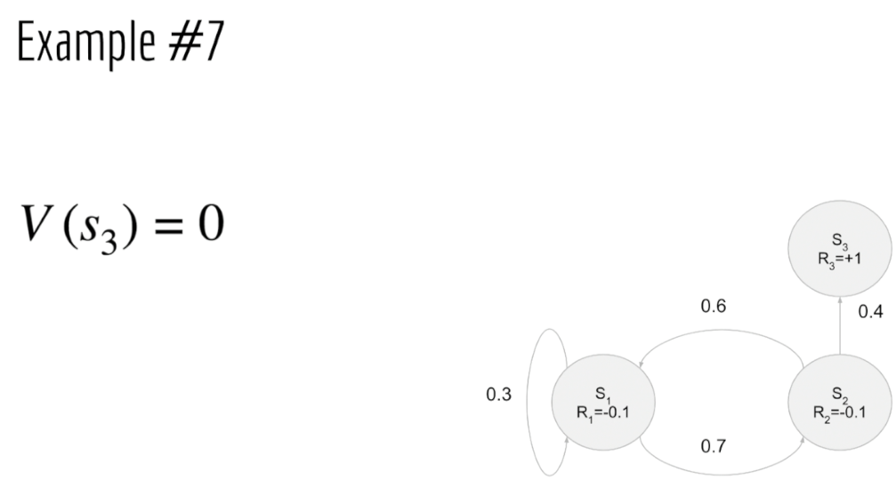

&nbsp;&nbsp;&nbsp;Now if we look at these three equations very carefully, what do we see?
We can see that it's actually a system of linear equations just like we used to study in linear algebra.
We have three equations in three unknowns.
So either we could solve this by substitution or we could use the matrix method.
If you want to try that on your own right now, please take this opportunity to do so.

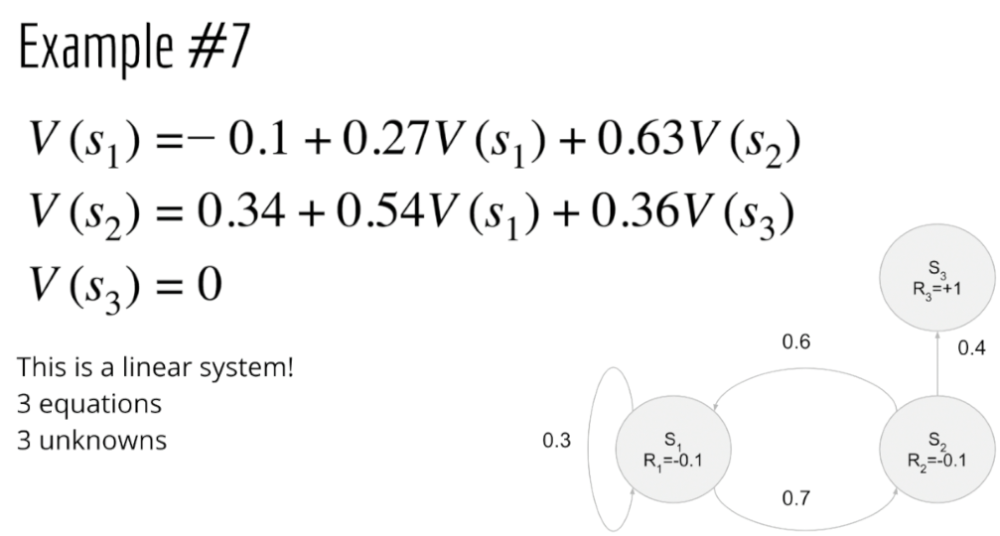

&nbsp;&nbsp;&nbsp;The first thing we can do is make this more like a system of linear equations by grouping together like terms and spacing them out appropriately.

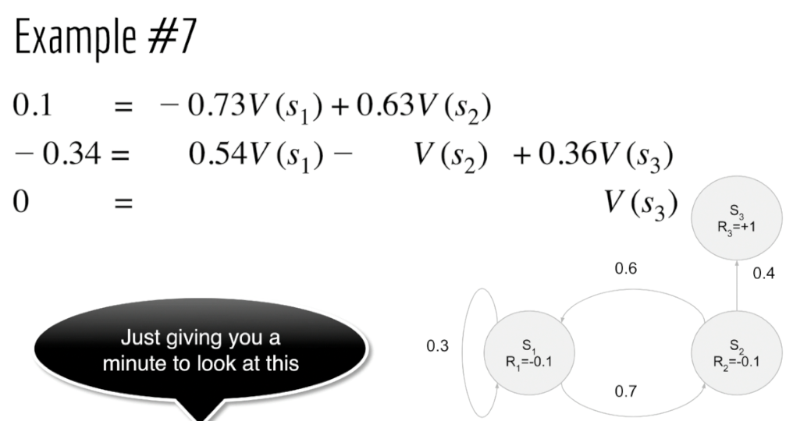

&nbsp;&nbsp;&nbsp;So we can see that we can neatly separate this equation into three parts:

A vector containing V(s1), V(s2), V(s3),

A 3x3 matrix to multiply by,

And a length 3 vector of numbers that just sits by itself.

This, of course, takes the form of Ax=b and we can solve it using the NumPy function linalg.solve.

As you recall from my Python prerequisites course, you never want to solve this using the inverse method (which would be to calculate the inverse of A and multiply that by 
b) since that's not efficient in code.

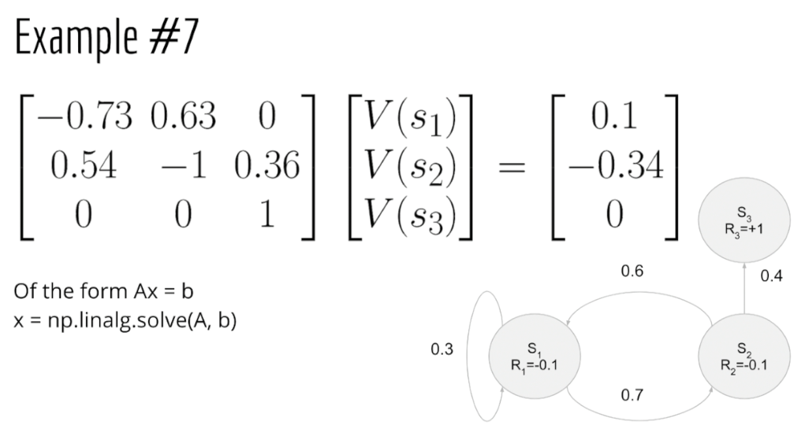

&nbsp;&nbsp;&nbsp;The result, if you want to try to calculate it yourself, is:

V(s1) = 0.293

V(s2) = 0.49

V(s3) = 0

As an exercise, you might also want to check if these are correct by plugging them back into the original equations.

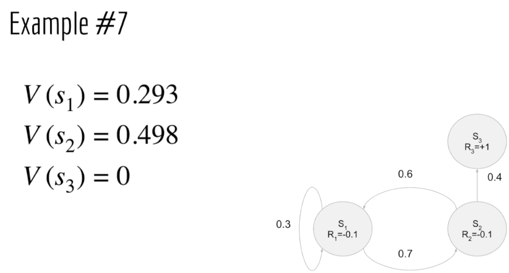

&nbsp;&nbsp;&nbsp;So I hope this lecture gave you an idea of how the Bellman equation can be reasoned about and used.
We've seen that for some simple cases, solving for the value function is no more than just working backwards up a tree.
We've also seen for slightly more complex cases that approach doesn't work, but the Bellman equation is general enough such that it can still represent them.
We just need slightly more sophisticated techniques to solve them.
Just to give you a big picture view of the rest of this course:
The rest of this course is completely and 100% devoted to just one thing:
How to solve the Bellman equation from a bird's eye view.
That's what reinforcement learning is.
Just like regular supervised machine learning, you want to get away from this idea that you need to do an example on a finance set, then on health data, then on house price data, and so on.
We know that all data is the same and what the algorithm sees is just a table of numbers.
The real work is figuring out how the algorithm works and coding it.
So the rest of this course is devoted to just that.
In this lecture, I hope to give you a sense that where we need to solve for the value function, it's really a better algorithm.
We saw that the idea of creating a linear system of equations and then calling NumPy's linalg.solve was pretty general, but we know that that's not scalable.

So the rest of this course is going to answer:
What are scalable solutions to this problem?
What assumptions do they make?
What are their advantages and disadvantages?

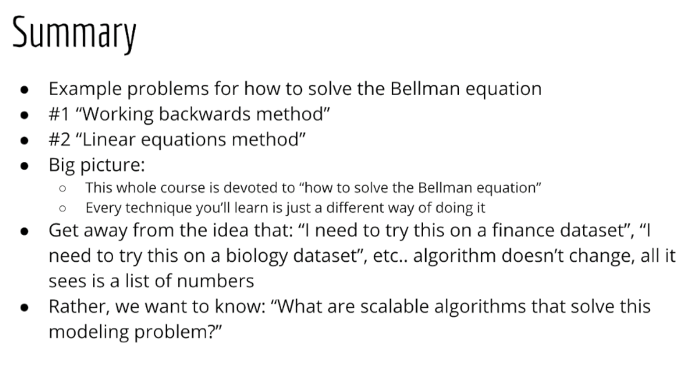

# Optimal Policy and Optimal Value Function

&nbsp;&nbsp;&nbsp;In this lecture we are going to answer the question: How can I find the best policy and the best value function?
Before we start, we should think about why this is important.
This brings us back to the big picture, in case you've been getting too far into the details of the math.
Remember that our goal as the machine learning engineer is to create an intelligent agent.
We consider an intelligent agent one that learns to achieve the maximum reward in a game.
We've refined this definition to say that the agent should achieve the maximum expected sum of future rewards in a game.
One might think of that as the best possible value function.
But remember the value function is dependent on what policy we are following.
Thus, we would like to find some policy that leads us to achieve this best possible value function.
It makes sense to call that policy the best policy when we achieve that.
We might say we've created an intelligent agent.
Now that might sound abstract but it's really not.
Imagine you create a computer program that plays a video game.
Obviously, a program that does nothing but move around randomly would not be considered very good.
On the other hand, a program that results in beating the video game at superhuman speed would be considered very intelligent and impressive.
And so it's sort of an obvious statement: a good policy is one that displays the desired behavior.

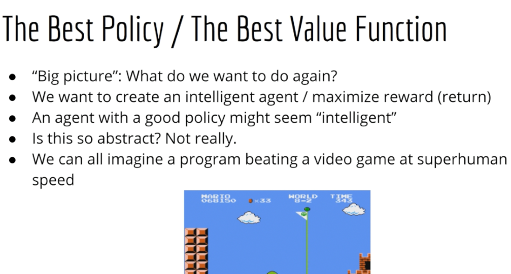

&nbsp;&nbsp;&nbsp;Let's now discuss more precisely what it means for one value function to be better than another.
Of course, we must have some notion of better, some notion of order in order to consider one of these value functions to be the best.
The problem with this is that the value function is not just a single number in machine learning.
It's simple because our objective is usually framed in terms of a single scalar loss.
Obviously a loss of 10 is better than a loss of 20.
But the value is given for each state in an environment.

&nbsp;&nbsp;&nbsp;The answer to this is that a policy can only be considered greater than or equal to another policy if its value function is greater than or equal to the other value function for every state in the state space.
That is, there can be no exceptions.
It must be better than or at least the same for all states for us to be able to use this greater than or equal to symbol.
So this implies that it's possible to come up with two policies such that policy one is not greater than or equal to policy two, but simultaneously policy two is not greater than or equal to policy one.

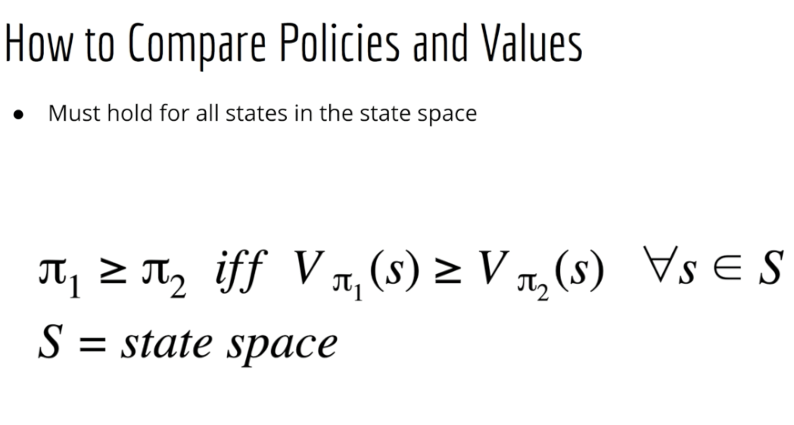

&nbsp;&nbsp;&nbsp;Here's a simple example with only two states.
Imagine that under policy one, 
V(s1) = 2 and V(s2)=1, but under policy two, V(s1)=1 and V(s2)=2.  
In this case, policy one is not better than policy two, but also policy two is not better than policy one.

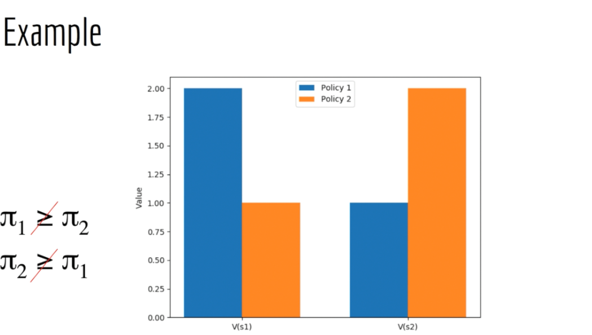

&nbsp;&nbsp;&nbsp;Here's another example, again with two states.

Under policy one, 
V(s1)=2 and 
V(s2)=3.
Under policy two, 
V(s1)=2 and 
V(s2)=1.  
Since under policy one the value is greater than or equal to the value under policy two for all states, we can see that policy one is greater than or equal to policy two.

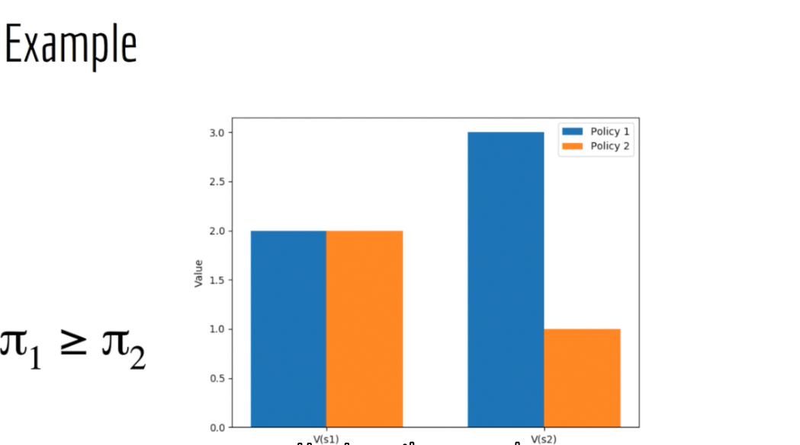

&nbsp;&nbsp;&nbsp;Now that we have some way of comparing two policies, let's discuss what it means to have an optimal policy and an optimal value function.
Both of these can be defined in terms of a state value.
In particular, the optimal state value function is the max over all possible policies π:

V*(s)=maxπ Vπ(s)
We call this particular state value function V*.
Similarly, the optimal policy π* is the argmax of the same expression.

In the same way, we can define the optimal action value 
Q* as the max over all possible policies 
π of Qπ:

Q*(s,a)=maxπ Qπ(s,a)

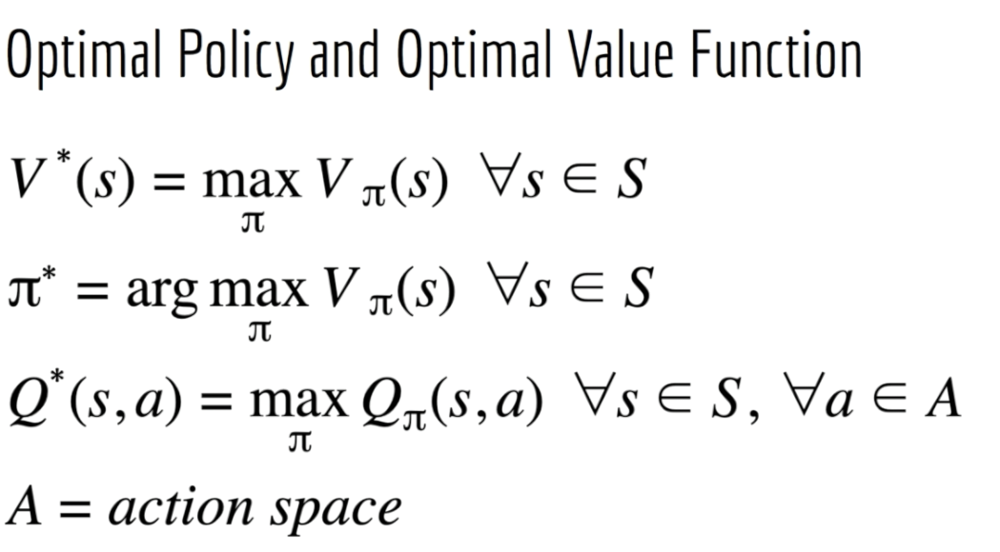

&nbsp;&nbsp;&nbsp;Knowing these definitions, let's consider a naive approach in finding the optimal policy in a given environment.
In fact, it's quite simple.
All we need is a simple for loop.
Let's assume we know how to evaluate a policy—that is, given a policy, we find its value function.
We confirmed earlier that this is nothing but solving a system of linear equations.
Well then, all I need to do is loop through all possible policies and for each policy evaluate (in other words, find its 
V(s)).

If the value of the current policy is better than the current best value, replace the current best value with the new value and replace the current best policy with the new policy.
By the end of this loop, we will have found the optimal policy.

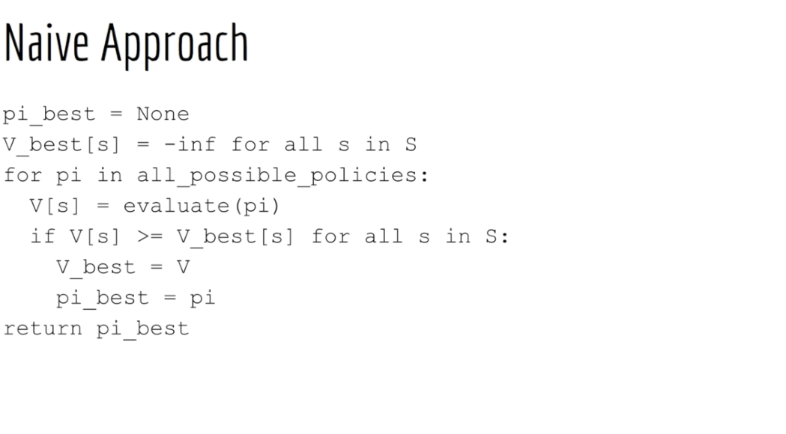

&nbsp;&nbsp;&nbsp;What is the problem with the previous approach?
Well, we have to ask: how many possible policies are there?
Let's assume we have a discrete finite action space 
A and a discrete finite state space 
S.

This is like saying we have ∣S∣ buckets and we want to know what is the number of possible ways I can fill these buckets with any of the actions in A.
That is equal to 
∣A∣^∣S∣.

In other words, this grows exponentially with the size of the state space, which makes the problem intractable.
Even with a simple grid world example, we have 11 possible states that the agent can occupy and 4 possible actions.
4 ^ 11 is almost 4.2 million.

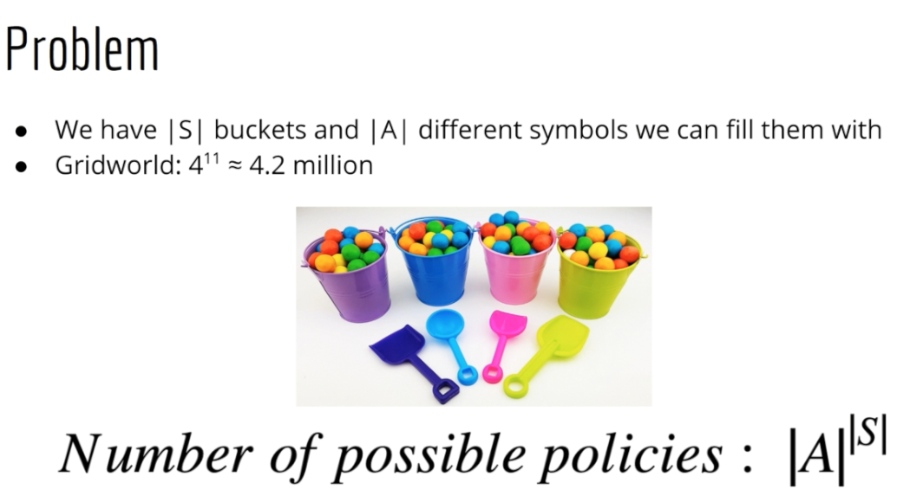

&nbsp;&nbsp;&nbsp;One interesting rule to remember is that the optimal value function is unique but the optimal policy is not unique.
For a simple example of this, consider our grid world game.
Remember that from the starting position there are two alternate paths to the winning state each with equal length.
Thus, even with discounting, the value of the initial state is the same no matter which of these two paths we take.
This is an example where the optimal value is unique but the optimal policy is not.

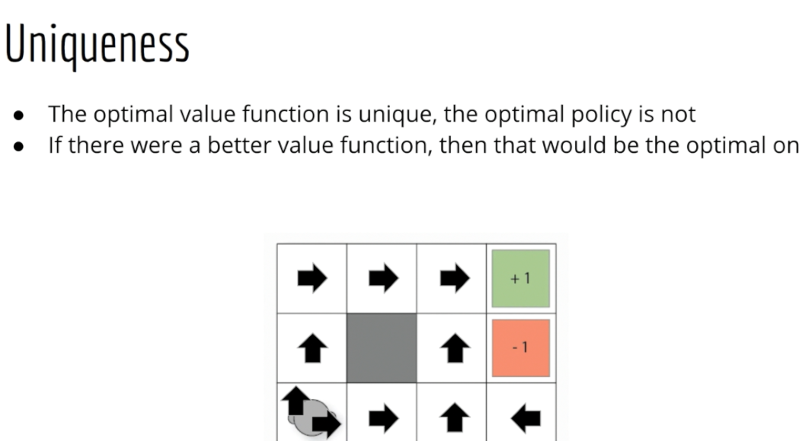

&nbsp;&nbsp;&nbsp;So how can the Bellman equation help us find a good policy?
Let's consider again the standard Bellman equation.
It says that the value of the state 
`s` is the expected return summed over all possible actions `a`.

But since we're now trying to find the best policy, it doesn't make sense to sum over all possible actions.
Instead, what we would like to do is pick the best action as we previously noted.
The best action is the action that yields the best future reward.
We can write this simply by removing the sum over 
π(a∣s) and replacing it with the max over `a`.

We call this the Bellman optimality equation.
It tells us how V*(s) can be described recursively when we are following the optimal policy, which is to take the action 
`a` that always leads to the maximum expected future reward.

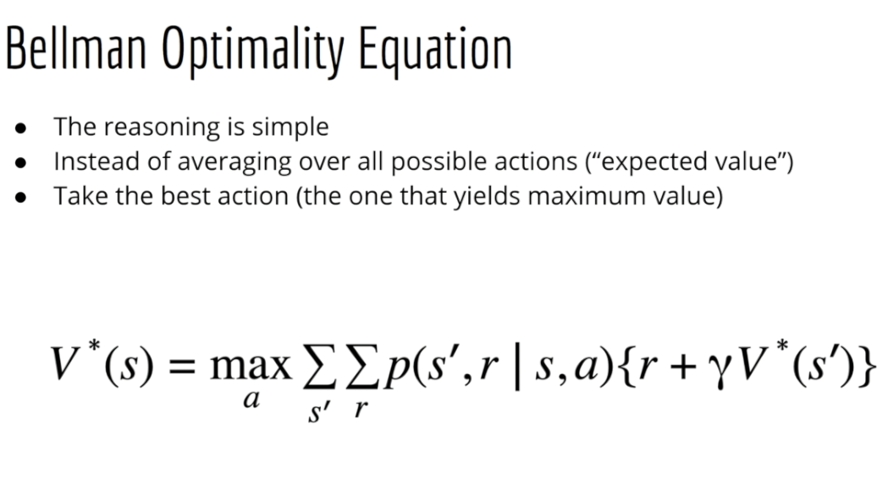

&nbsp;&nbsp;&nbsp;We can do a similar thing for the action value.
Recall that the action value can be described using the Bellman equation as follows.
Note that there is no sum over the action 
`a` on the outside, and thus this is a little different from our description of the optimal state value.
What we can recognize, however, is that there is a sum over the next action 
`a′`, and thus the optimal action value is the one that takes the max over `a′`inside the expected value.

We call this the Bellman optimality equation for action values.
As you'll see later, this equation is very handy when we start talking about Q-learning.

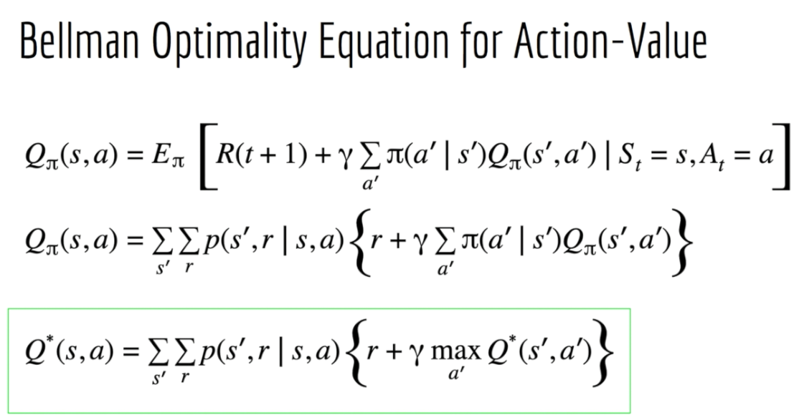

&nbsp;&nbsp;&nbsp;Using the definition of the optimal state value and the optimal action value, we can relate the optimal state value to the optimal action value as follows:

The optimal state value at state 
`s` is simply the max over all possible actions `a` of the action value at state `s` and action `a`:

V*(s) = maxa Q*(s,a)

If we take the Bellman optimality equation for 
`Q*`, we can see that it's possible to replace the inner 
`Q*`with `V*`, and thus this is another way to relate 
`Q*`and 
`V*`in the same equation.

And of course, if we take the max over the current action 
`a` on both sides of the equation, we just recover the Bellman optimality equation for 
`V*`.

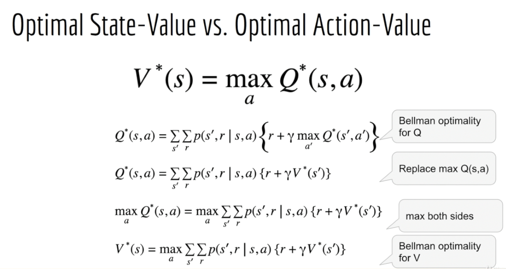

&nbsp;&nbsp;&nbsp;

