# Dynamic Programming Section Introduction

&nbsp;&nbsp;&nbsp;In this next section of the course, we'll be looking at how to use the Markov decision process to solve
real problems, to recap what we've done so far and to understand where we are going next.
Let's quickly summarize the previous section.
So in the previous section, we learned about the Markov decision process.
So why was this important?
Now for those people who don't like math, it probably just seemed like it was just a lot of math for
no particular reason.
So hopefully this lecture helps to connect the dots.
The MDP is important because it gives us a framework for describing the reinforcement learning problem.
Without this framework, it's not clear what approach you should take, but using this framework, you
can imagine it like the foundation of a house or the structure of a building.
Once we have that, we can start to build on top of it.
This is better than, say, taking a bunch of sticks off the ground and trying to combine them together
randomly to build a house, to build a house that will last for a long time.
You need a strong foundation and that requires you to build from a framework.
The framework for reinforcement learning is the MDP.
In fact, what you will see is that the bellman equation, which you've already learned, can be used
directly to solve our first important problem.
That is to say, all we need to do is implement the Bellman equation in Python code and we've already
started to do practical work and reinforcement learning.

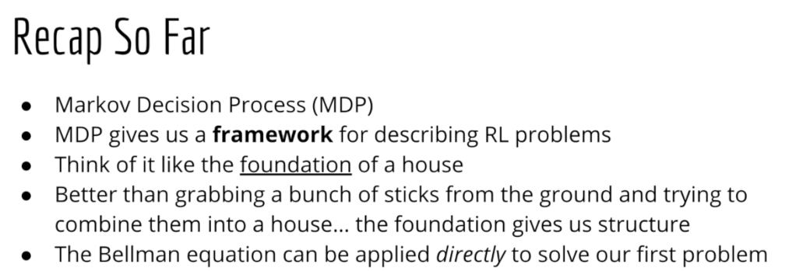

&nbsp;&nbsp;&nbsp;OK, so let's start by reviewing the problem that we are trying to solve.
This follows directly from what we learned about MVP's.
So to start, we have two entities interacting.
These two entities are the Asians and the environment.
The agent is the thing that we are trying to program.
The environment is some game or some subset of the world that we want the agent to achieve some goal
inside.
So how do the agents and the environment interact?
This is entirely described by the state's actions and rewards.
At every time step, the agent gets to read some data from the environment.
You can think of these like sensors on a robot, like a camera, a temperature sensor, GPS and so forth.
We call this the state at the current time T as of T at the same time, the agent also receives a reward
from the environment.
We call this Rt.
And remember, there is no negative or positive connotation associated with the term reward.
The reward is not like a cookie you get for behaving well.
The reward is just a number.
So the state and the reward go from the environment to the agents on the other hands.
The action goes from the agent to the environment.
This is what the agent does in the environment, which has the effect of possibly changing the state,
pressing a button in a video game or turning a steering wheel left or right.
So this is our system.
We have two components, the agents and the environment.
They communicate with each other via signals called states actions and rewards.
Now, what are we trying to do with the system?
We are trying to program the agent to meet some objective.
Of course, the term objective is too generic, but also stating specific objectives like when a game
of chess or when a game of tic tac toe or two specific.
We need a general technique that we can apply to all kinds of problems.
So what is this technique?
Ultimately, we would like to program the agents such that it maximizes its summer future rewards.
We call this the return.
We said that we would like to program our agents such that it maximizes the expected return.
We say expected return and not just the return, since both the environment and the agents can contain
randomness, expected return means the average return.
So it's good to distinguish the reward from the return.
We don't just want to maximize the reward because the reward is instantaneous.
Trying to maximize the reward would be too short sighted.
Instead, we would like to maximize all the rewards in our future.
And so how do we accomplish this?
Well, that's what we will discuss in this section.
But clearly, to solve this problem, we need a way to describe the agents and the environment using
math.
The language we need is probability.
Thus, both the agents and the environment are described using probability distributions.
The agent is described by the policy PI of a given as note that this can also be a deterministic function.
But when we generalize that, we get a distribution.
The environment is described by the state transmission distribution process prime are given Sunday.
So to recap what our job is, the state transitions should be considered fixed.
This is because we don't have any control over the environment.
However, we do have control over the policy pie.
Therefore, our ultimate goal in reinforcement learning will be to find the best pie to meet our objectives.

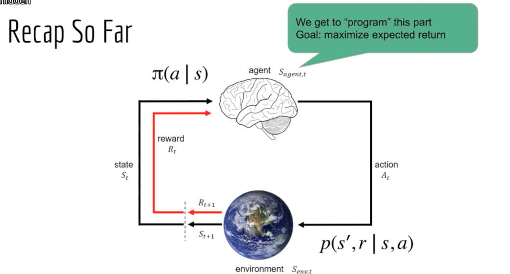

&nbsp;&nbsp;&nbsp;OK, so what's the outline for the section you'll see that with this section and the following sections,
we are always going to follow the same basic pattern in reinforcement learning.
There are two tasks that we are concerned with.
Task number one is called the prediction problem.
This is when we are given a policy and we want to evaluate the value of that policy.
In other words, we want to answer the question, how good is the given policy task?
Number two is the control problem.
This is when we are given an environment and we want to find the optimal policy for this environment.
In other words, we want to answer the question, what is the best policy?
OK, so I hope that's pretty simple.
Task number one.
Tell me how good a given policy is.
And task number two.
Tell me what the best policy is.

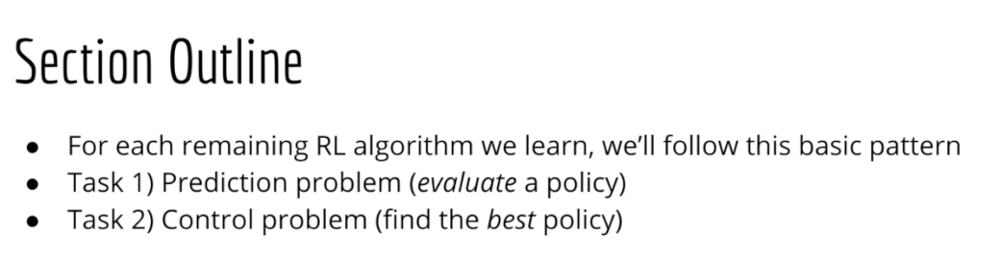

&nbsp;&nbsp;&nbsp;In this section in particular, we will look at the following methods in order to solve tasks.
Number one, we will employ a method called iterative policy evaluation.
You'll see that this is nothing but applying the Bellman equation repeatedly.
This will give us a function where we can pass in a policy and generates corresponding value in order
to solve tasks.
Number two, we will study a general approach known as policy improvements.
Once we understand the general approach, we will apply that approach in a quite straightforward manner.
The first method we will look at is called policy iteration.
This will work, but it's not particularly efficient.
The second method improves upon policy iteration, and it's called value iteration.

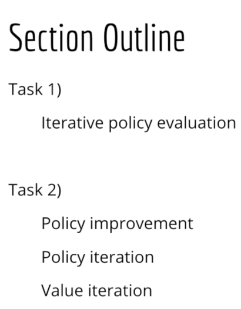

&nbsp;&nbsp;&nbsp;One important fact that I want to stress about this section is this will be applying the Belmond equations
directly.
You'll notice that the Bellman equation depends on the environment dynamics which are encapsulated by
the probability distribution P(s', r | s, a).
It also depends on the policy, which can also be expressed as a probability distribution of pi(a|s).
Now it's reasonable to assume that we can express pi(a|s) as a distribution in code.
But what about P(s', r | s, a)?
Ask yourself the question.
Is it reasonable to assume that we know this?
Imagine you are engineering a self-driving car or you're trying to teach a robot to walk.
The data that you read from your sensors will give you the state at any particular time.
But do we actually know these state transition distributions?
This would imply that you know what the readings on your sensors will be in the next timestep or if
you can't predict them.
Exactly.
You at least know their distribution in this section.
We will assume that this is the case.
But you should keep this idea in the back of your mind that in reality, this is not something we necessarily
know.

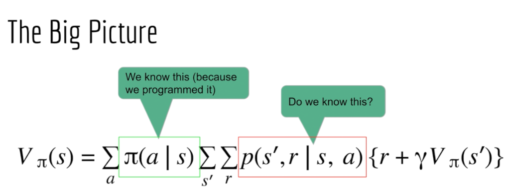

# Iterative Policy Evaluation

&nbsp;&nbsp;&nbsp;In this lecture, we'll be studying our first reinforcement learning algorithm, as mentioned in the
introduction and reinforcement learning will be focused on two main tasks.
Task number one is given a policy.
Tell me how good it is.
That is, what is the value function for this policy task?
Number two is given an environment.
Tell me what the best policy is.
This lecture will focus on task number one.
In particular, our goal is to find a V(s) or Q(s,a), given a policy note that we typically subscript
V and Q to make it explicit that the values depend on which policy is being followed.
Of course, this must be the case.
We expect a good policy to have higher values for V and Q because they yield higher rewards.
We expect a bad policy to have lower values of the V and Q because they yield the lower rewards.
So clearly the reward you get will depend on which policy you are following.

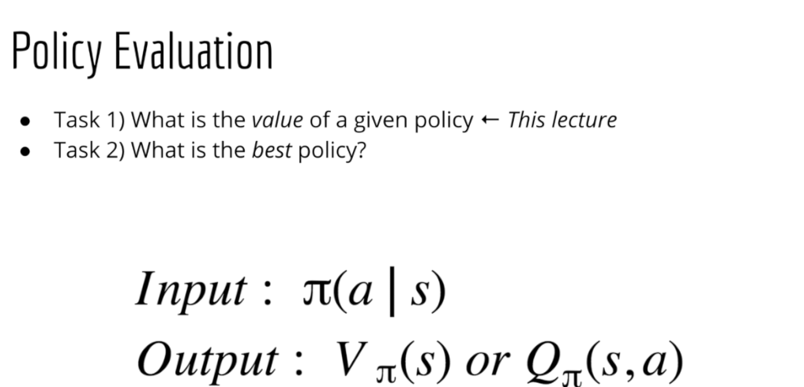

&nbsp;&nbsp;&nbsp;So the general approach that we will use in this section is called Dynamic Programming, or just DP
for short.
The specific DP algorithm we will discuss in this lecture is called Policy Evaluation.
Again, our goal is given some policy Pi find the value function.
We'll start with the state value V(s) although the same techniques can be applied to the action value
Q as well.
To begin, let's recall the Bellman equation.
What you should find interesting about this equation is that there is no need for any special algorithm
to solve this problem.
That is to say, you can solve this problem without this section.
If we go through each symbol in this equation, we can recognize that everything is known except for
the V's.
We know PI.
So that's just a number.
We also know P(s', r | s, a), or at least we are assuming that we do.
So that's just a number.
The reward is just a number.
And the discount factor Gamma is also just a number.
We know that when we multiply one number by another number, it's just another number.
So the only unknowns in this equation are the V's.
Furthermore, this equation is linear and V,there are no V squared terms or exponential.
It's just something, an addition.
Everything is just a number times V along with additions.
Therefore, this is a linear equation and V now there are multiple V's because we have multiple states.

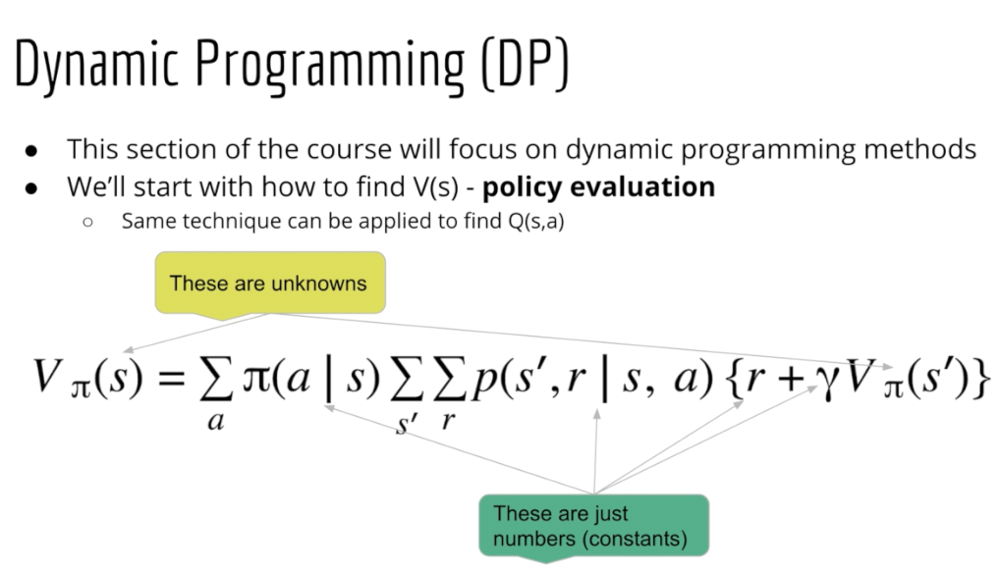

&nbsp;&nbsp;&nbsp;Suppose that we have N states, then we have V(s1) V(s2) ... V(sN), if we were
to write down the Belman equation for each state explicitly and plug in all the values for Pi, P,
R and Gamma, we would have N equations and N unknowns.
Therefore, this is just a linear system and we can solve it using regular linear algebra.
The problem is this is not scalable in several ways.
Firstly, it doesn't handle the case where N is large and secondly, it doesn't handle the case where
P is unknown, although neither does dynamic programming.
However, dynamic programming does set us up for the subsequent sections of this course where we do
assume that P is unknown.

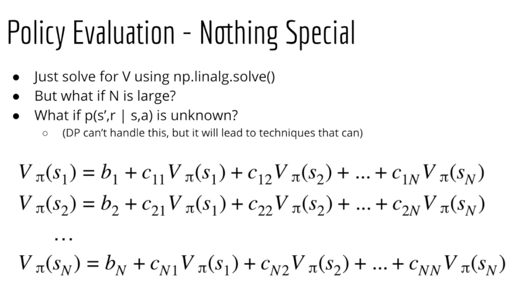

&nbsp;&nbsp;&nbsp;So what is an alternative way for finding the values for V(s). As a side note, when I say V(S), I
really mean the values of V(s) for all the states, but to avoid having to write down V(s1), V(s2) and so on each time, I will just save V(s) for convenience.
In any case, let's now move on to an iterative of solution for finding V(s).
This is the dynamic programming approach.
So this might be surprising, but this is nothing but simply applying the Bellman equation over and
over again.
There is a subtle use of overloaded notation here in this case, when we use the equal sign, we have to
imagine that this is computer code.
So we're not really saying that the two sides are equal, although they are.
But what we really mean is assign the value of the expression on the right side to the variable on the
left side.
Also, note that we start by initializing V(s) randomly or to zero.
One exception is the terminal state, which always has value zero.
You'll also notice that I'm now subscript ing v with an index K, this index K denotes the timestep
of our algorithm.
So we start at K equals zero and every time we update V(s), K increases by one to the next timestep.
Now to be clear, this is not a timestep in the environment, but a timestep in our policy evaluation
loop.
That is, these are timestep is in our code.

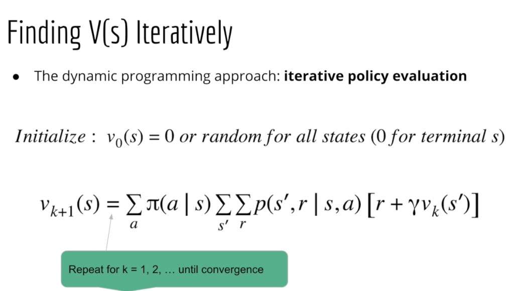

&nbsp;&nbsp;&nbsp;Now, you might wonder, why does this work, why does performing this update again and again until
K approaches infinity lead us to finding Vpi(s)?
The details are beyond the scope of this course, but they are closely related to other iterative algorithms
in linear algebra.
So look those up. If you're interested intuitively, you should recognize that the true value that we are looking for
Vpi(s) is a fixed point for this update rule.
So why is that?
Well, what is a fixed point?
A fixed point means that when we apply this update, rule V(s) no longer changes.
So why does Vpi(s) not change if we apply this update rule?
Well, because this is just bellman's equation.
Bellman's Equation states that these two sides are equal if we plug in Vpi(s) and that's if we plug
in the true values for Vpi(s).
Therefore, when we have found Vpi(s), the right side is already equal to the left side and performing
this update results in no change.
Therefore, we call it a fixed point.
So as long as the solution to this system of equations exists, then it will be found by dynamic programming.

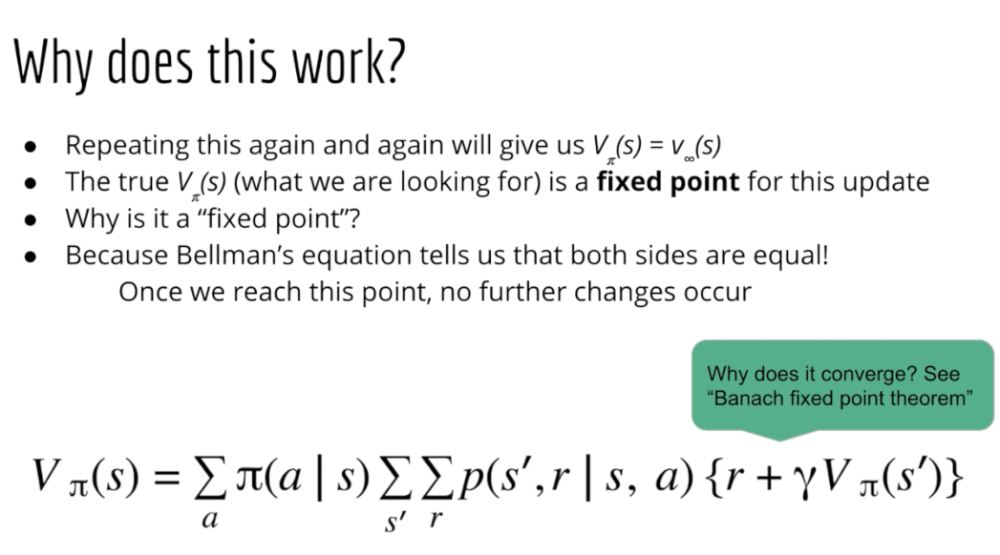

&nbsp;&nbsp;&nbsp;Another important aspect of this algorithm is when to quit.
We know that we will approach the true answer as K approaches to infinity, but of course, we can't wait
an infinite amount of time for the answer.
Therefore, we need to have some exit condition.
Typically, as is the case with models like these, we exit when our algorithm has converged.
We check for convergence by looking at how much the V(s) has changed from one iteration to the next.
Specifically, let's create a new variable called Delta.
Delta is the maximum change in V(S) over all states during an iteration.
Thus, at each iteration of the loop, we check the value of Delta against some threshold.
You get to pick this threshold depending on how accurate you would like your function to be.
Once Delta falls below this threshold, you can consider your algorithm converged and then you can exit.
Not that typical values of Delta are decimal numbers, for example, ten to the minus three tenths of
the minus five, ten to the minus eight and so forth.

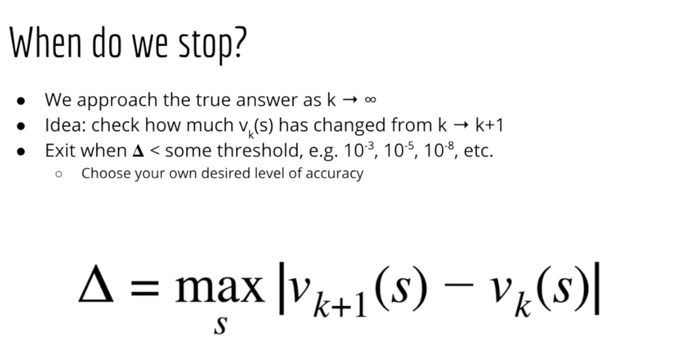

&nbsp;&nbsp;&nbsp;OK, so let's look at how policy evaluation would be implemented in practice.
Note that this is just pseudocode in real code.
There are a few details we have yet to discuss.
But looking at the pseudocode, first, we'll help you understand the principles.
First, we accept as input a policy Pi.
We start by initializing V(s) randomly.
Alternatively, it can also be initialized to all zeros.
Not that the terminal state should always be zero.
So this value should always be initialized to zero and there's no need to update this value since it
is known.
Next, we enter a loop, let's suppose that this is an infinite loop and we only break out of the loop
after our algorithm has converged inside the loop, we initialize Delta to zero.
As you recall, Delta will store the maximum change in V(s) over the current iteration.
Next, we enter a second in a loop that loops over all the states in our environment except for the
terminal state.
As you recall, the value for the terminal state does not need to be updated since it's always zero.
Note that there's an implicit assumption here, which is that we can loop through all the states.
So this doesn't handle the case where the state space is too large to live through, or when the state
space is infinite, or when the state space is continuous.
For these cases, they'll be discussed later in the course.
Dynamic programming requires this assumption.
OK, so for each state, we'll store the current estimate for V(s) in a variable called a V_old.
This is just a temporary variable to store our old value.
Next, we compute the new value for V(s) using the right side of the Bellman equation at this point.
We now have our new value for V(s) and we can compare this to our old value V_old.
Remember that we would like to store the maximum change in our Delta variable.
Therefore, we can assign Delta to be the max of current Delta and the current absolute difference between
the new V(s) and the V_old.
Ones the inner loop is complete.
We can check Delta for this iteration.
If Delta is less than a threshold, we can consider our algorithm converged and we can break out of
our infinite loop.

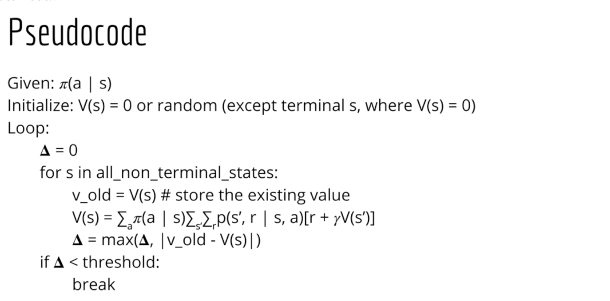

&nbsp;&nbsp;&nbsp;Now, just to be super clear, how do we implement the Bellman equation, note that it has three summations.
Well, you should recognize that summations in math are equivalent to loops in code.
So in order to break down the Bellman equation into code, we need some loops. Specifically Since there are three summations, we need three nested for loops, one over the action space for a,
one over the state space for s', and one over the possible rewards for R, then we simply accumulate
the result in some variable.

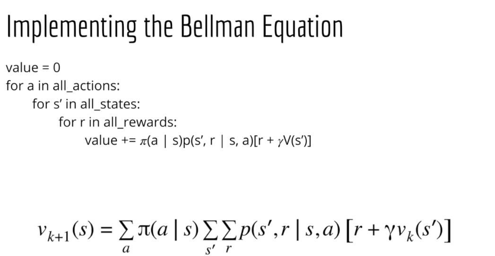

&nbsp;&nbsp;&nbsp;Now, note that the reward is typically deterministic.
This is the case for many practical environments and it's also the case for the environments in this
cause.
Therefore, there is no practical need for the loop over the reward are.
Instead, we can treat the reward as simply a deterministic function of the state s' in this scenario,
we would only need two loops and the reward can simply be a dictionary look up into a reward function
that accepts a state as input.

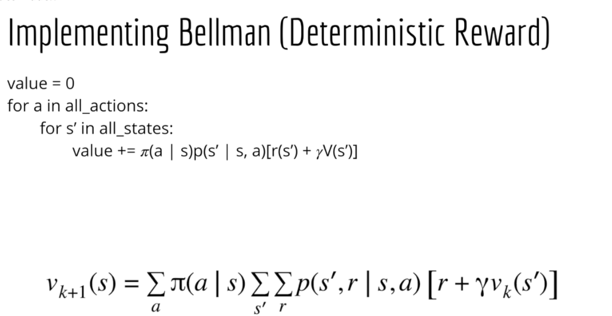

&nbsp;&nbsp;&nbsp;So now that we're getting closer and closer to our Python implementation, it's worth thinking about
what kind of data structures you will need in our Bellman update.
It's clear that according to this update rule, we need at least two versions of V, one which will hold
V at iteration K, and one which will hold the updated V added iteration K plus one.
So if you use a list, then you would need two lists of the same size if you use a dictionary and you
would need two dictionaries of the same size.
And so why don't we need more than two?
Well, suppose that you have two of these lists or dictionaries or arrays or whatever you are using
to hold V, let's call them A and B, let's suppose that you've initialized the V(s) in a variable called
A, we'll call that V0(s).
Then you would store the updates in the variable B.
So now beholds the latest version of the events.
We'll call that V1(s), but now you don't need the old A anymore. so A  can hold the next set
of updates.
And now A will hold the latest version of the events.
We'll call that V2(s).
So you only need two structures because you can just keep alternating which one holds the latest version
of V(s).
Now, in practice, what we do is a lot simpler, although technically it goes against this update rule.
In practice, we simply store everything in the same structure.
We don't bother to have two arrays.
Therefore, when we update V(s) at iteration K plus one, technically it should only depend on values
of V(s) for different states at iteration K.
However, since we store everything in the same structure, V(s) set iteration K plus one might depend
on other values of the events on the same iteration K plus one.
Although this might sound wrong and actually ends up being more efficient, you're encouraged to test
it out yourself in the code.
And by the way, we call this in a place updating.

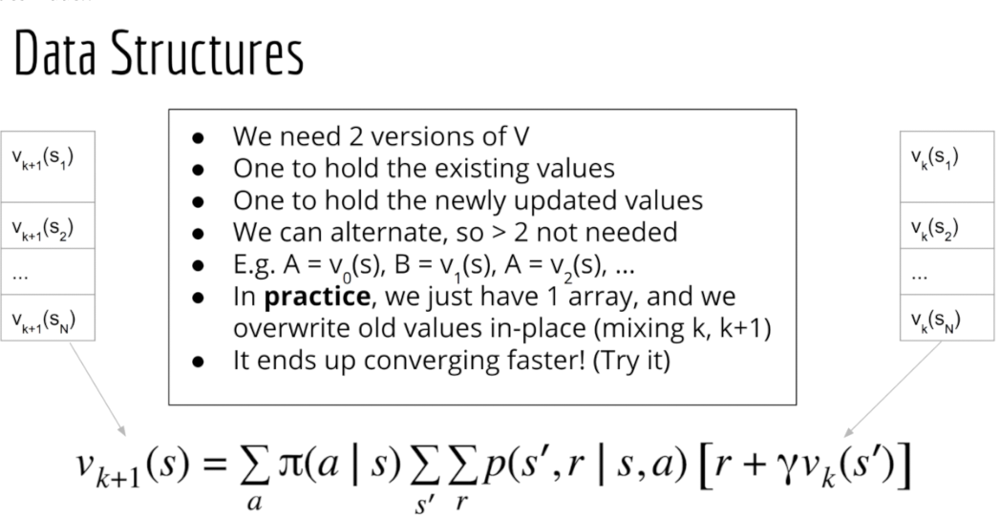

&nbsp;&nbsp;&nbsp;So, as mentioned, something that's worth thinking about early and often is how you will actually implement
these things in code.
In math, it's easy to write V(s) and Pi(s) and P(s', r | s, a).
But what does this actually mean in code?
Let's take something simple like s ,in our grid world environment
Each state is a position on the grid.
You can think of it like a maze and we're trying to reach the maze exit.
So one way to represent each state would be a tuple containing the coordinates on the grid.
For example, the top left would be zero zero to the right of that would be zero one and so for.
If your states are tuples, then an appropriate data structure to store V(s) would be a dictionary.
In this case, the key to the dictionary is the state represented by a tuple events.
The value of the dictionary is a number representing V(s).
However, there are other possible approaches.
For example, suppose you just numbered each of the states zero, one, two and so for.
Now your states are just integers and therefore you can use an array or a list instead of a dictionary,
which is more computationally intensive.

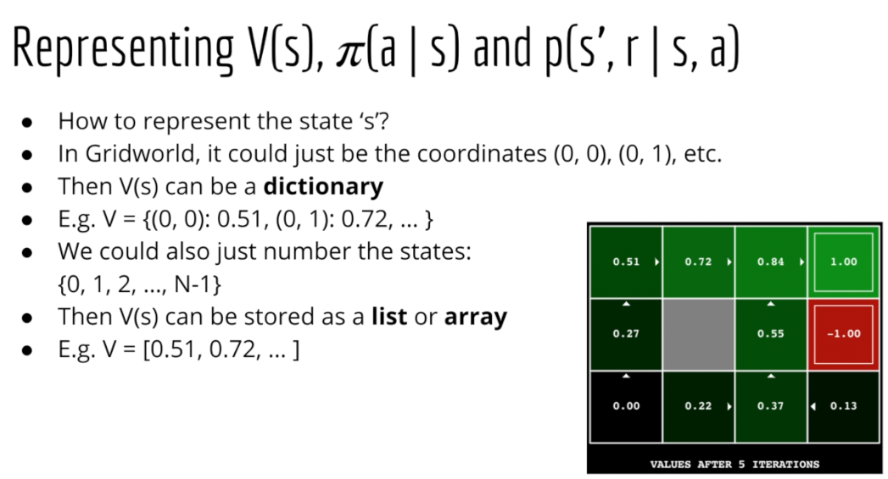

&nbsp;&nbsp;&nbsp;What about the state transitions P. In this case, you have even more options, basically, we know that
for each 4-tuple (s',r,s,a), we're going to have some associated probability value.
If states, actions and rewards can be represented by a finite set of integers, then we might store p in
a 4 dimensional array.
But remember that rewards are usually deterministic, so perhaps these can be removed entirely.
Another option would be to use a dictionary.
The key to this dictionary might be a triple containing as P(s'| s, a).
As long as the states and actions are hashable , this would be an appropriate dictionary key.
Yet another way to store this distribution would be to use a dictionary with only `s` as a key, than the
value of this dictionary might be another nested dictionary with the action A as the key.
Then the value of this nested dictionary might be yet another dictionary storing `S'`.
Finally, the value of this dictionary might be a tuple containing the associated probability and the
corresponding reward are.
The point of this is when there are so many variables, there are more options to choose from for how
you want to implement this data structure and code.
So keep this in mind as you go through the course and when you do your exercises.

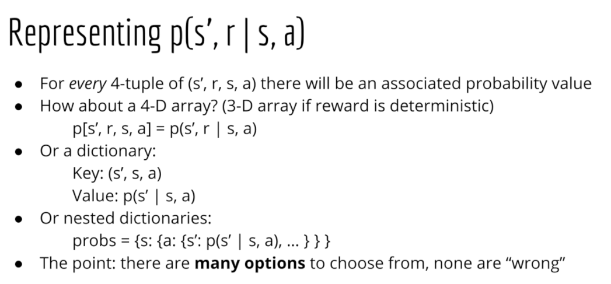

# Designing Your RL Program

&nbsp;&nbsp;&nbsp;in this lecture
We are going to discuss how to design your reinforcement learning program.
First let's recap what we would normally do in a supervised learning in supervised learning.
We are interested in implementing the algorithm.
We just learned about the main outline is always the same no matter what supervised learning algorithm
we're implementing the main steps are as follows.

Step 1 load in the data.

Step 2 instantiate your model.

Step 3 train your model and Step 4 evaluate your model.

Your job as the implementer of the algorithm is to write up the fit and predict functions.
This is the case for all supervised learning algorithms.
In other words you might want to think of this as a fill in the blanks type of task.
Steps 1 to 4 are boilerplate meaning that no matter what algorithm you're implementing you still have
to do these things

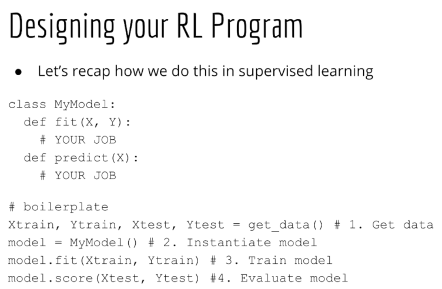

&nbsp;&nbsp;&nbsp;in this course,
Since this is reinforcement learning that's not going to be what we'll do.
However that doesn't mean there isn't a pattern to be followed.
First I want to make it clear that the design and layout of your program is part of your homework.
If you think the exercises in this course are going to be to write one or two lines of code you are
in for a big surprise as we did in the bandit section.
We're going to learn about several different algorithms but the beauty of these algorithms is that like
supervised learning they all have the same interface.
So whatever your design you're basically just going to be implementing the same thing multiple times.
The only difference should be the algorithm itself not the layout.

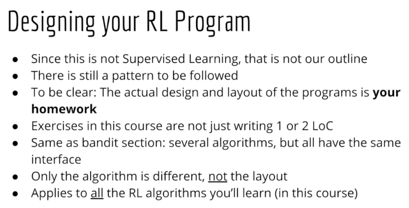

&nbsp;&nbsp;&nbsp;With that said it is still possible to go over the basic steps that your script must perform.
First realize that there are two different problems we will try to solve in this course.
So you'll have two different kinds of scripts.
The first kind of problem is the prediction problem.
This is where given the policy we would like to find the corresponding value function V or Q.
The second kind of problem is the control problem.
This is where our agent will engage with its environment and do actual learning.
The goal of the second problem is to find the optimal policy and the optimal corresponding value function.

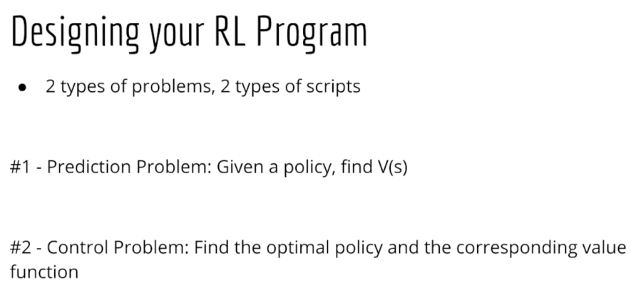

&nbsp;&nbsp;&nbsp;the first problem the prediction problem is the easier of the two.
Your job is essentially to do one single thing find the value function the algorithms we discuss in
this course are iterative.
So the basic outline will be like this.
First we initialize V of S then in a loop.
We play the game according to the given policy from this playing of the game.
We collect data about the states actions and rewards then we use those states actions and rewards to
update our value function V of s according to whatever algorithm we just learned about.
At the end we might want to plot or print some useful information such as the change in view of as per
iteration.
The final values of V of S and the actual policy itself so that we can ensure that the values we found
make sense.

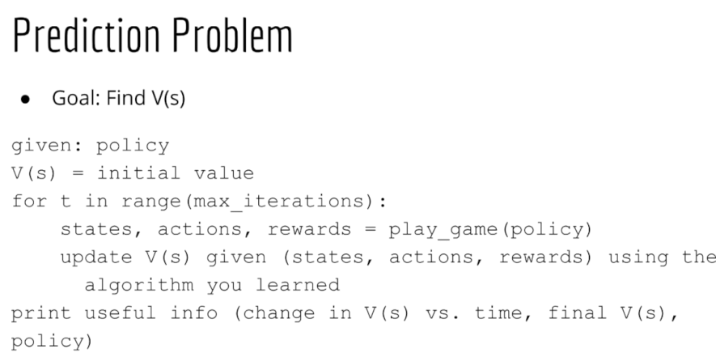

&nbsp;&nbsp;&nbsp;The second type of problem the control problem is a bit more difficult because it requires us to update
two things at the same time.
The policy and the value function in this case you're not given a policy but rather your goal is to
update the policy according to whatever algorithm you learn.
Still the basic loop is the same.
First we initialize the value function that can be V or Q Depending on the algorithm being discussed.
Then we enter a loop for a certain number of iterations inside the loop.
We play an episode of the game using the current policy from this we get a series of states actions
and rewards that the agent experienced.
Then we update the value function and the policy using whatever algorithm we just learn about at the
end.
We again might want a plot or print some useful information such as the change in the value function
per iteration.
The final values of the value function and the final policy so that we can verify that it makes sense.
No I want to make it clear that this is just a very rough outline in actuality for some algorithms the
policy is not explicitly represented in code and so it's not actually going to be represented by a python
variable but again that's kind of part of the implementation.
So it's partly your choice about how you want to do things.

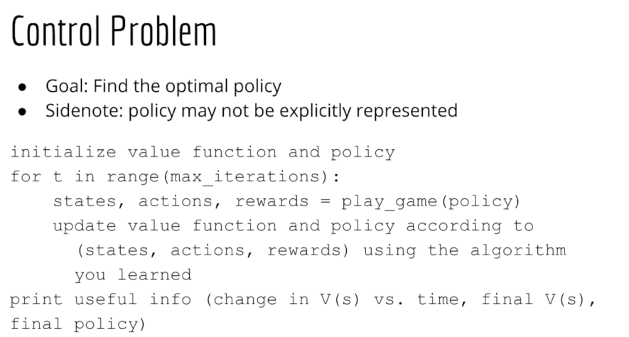

# Gridworld in Code

&nbsp;&nbsp;&nbsp;In this lecture, we are going to start looking at the code for the grid world environment.
This is in preparation for implementing algorithms such as policy evaluation and policy iteration.
Obviously, in order to implement these algorithms, we need to have an environment to implement the
mine.
So our first step will be to actually implement grid world.
It's important to note that before we start, there are an infinite number of ways to do this.
Many of them are drastically different.
That's why it's so important for you to code by yourself and implement your own design.
My design is merely one of many.
And it's very possible that what you have in your head will be completely different from mine.
What you end up designing is very dependent on your personality, your past life experiences and your
general education background.
Probably someone who is a biologist will write code that's very different from someone who is a computer
scientist.
And even still, one computer scientist will write code that's very different from another computer
scientist.
So don't get stuck on trying to make your code like my code or trying to understand why my code isn't
more like your code.
This is completely missing the point of these exercises.
Instead, it's better just to do everything completely using your own design from the beginning and
to write everything in your own style.
What I present in the following lectures is just an example.
So let's begin.

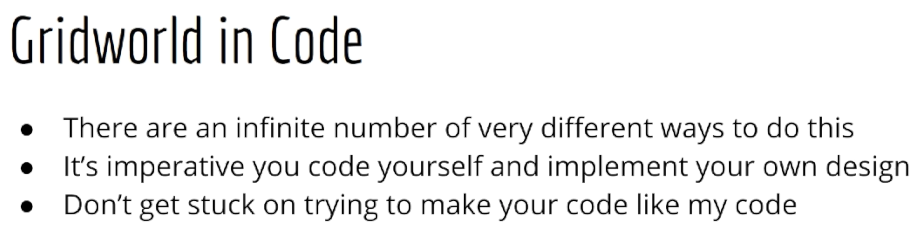

&nbsp;&nbsp;&nbsp;OK, so before even jumping into the code, I want to think about how we will use the code.
This is similar to test driven development.
The goal is to have some kind of object to represent our environment, a grid, a world object in the
constructor for the environment.
It might make sense to have a few arguments.
For example, the number of rows in the grid, the number of columns in the grid and the start position.
We might want to have a function that returns the current state.
This basically answers the question.
In what position am I in at this current moment?
As you've seen, the agent and the environment interact in a loop where the agent performs an action
in the environment, arrives in the next state and received some reward.
Thus, I propose a function called move that takes in an action.
Does the action in the environment and then returns the reward associated with doing that action.
In arriving in the next state, obviously, if you want to know what state you're in after taking the
action, you simply need to call the function that current state, which we just described.
Of course, we can't loop forever.
We must know when the game is over.
So I propose a function called Game Over, which returns true when we are in a terminal state and false
otherwise.
All right.
So I hope this seems pretty simple so far.

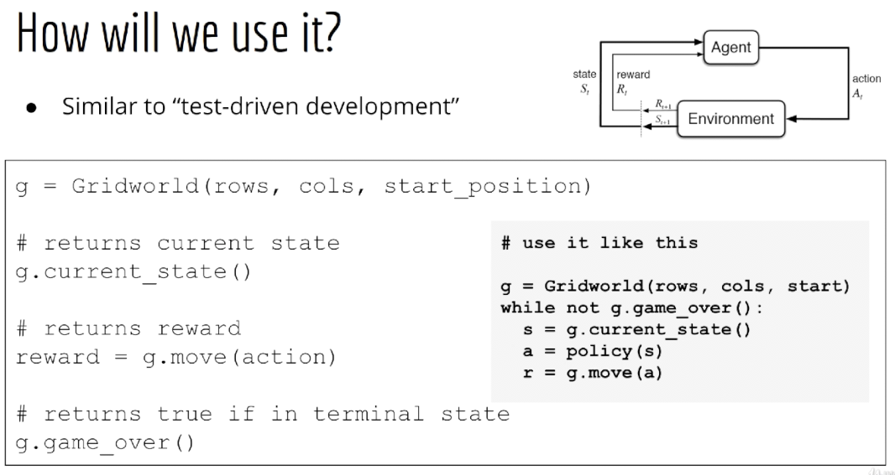

&nbsp;&nbsp;&nbsp;Of course, we have yet to discuss one crucial detail.
How do we specify what the rewards are?
How do we specify states like walls where the agent cannot travel to?
Now, again, this is very implementation specific.
But here's what you will find in the repository.
We have a function called set that accepts as input a dictionary containing rewards and also a dictionary
of actions that result in movement in the grid world environment.
An example of the rewards dictionary would be as follows.
A key.
Zero three with a corresponding value of plus one means that you will get plus one reward when you land
in the state.
Zero three.
A key one three with the corresponding value of minus one means that you will get minus one reward when
you land in the state.
One three.
A dictionary of actions can be specified as follows.
Obviously, I'm not going to read this entire thing to you.
But let's focus on a few particular states so you get the idea.
Notice how the values four zero zero R, D and R, which stands for down and right.
That's because in the position zero zero.
Only the actions down and right can result in me going to a different state.
Note that it's possible to use the action left it up.
They simply don't result in going to a different state.
It's the equivalent of walking into a wall.
Similarly, if you look at the values for zero one, we have only left and right.
It's not possible to go down because there is a wall in that position.
So if you enter the action down, you will simply be walking into a wall and you will remain in the
same state.
Finally, notice that the position zero three and one three do not appear in this dictionary at all.
Remember that these are terminal states, so no actions can be done from these states that would result
in going to a different state.

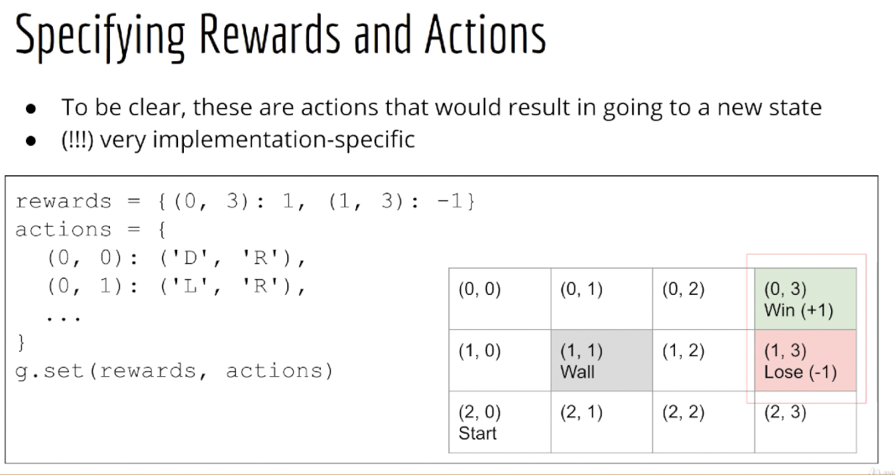

&nbsp;&nbsp;&nbsp;So here's an example of how we might use our grid worldclass.
First, we instantiate an object of type grid world.
Then we call the set function passing in the rewards dictionary and the actions dictionary that we just
described.
Then we can actually play the game with our agent using the move function described earlier.

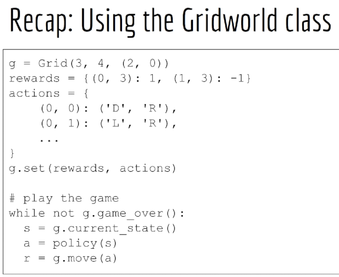

&nbsp;&nbsp;&nbsp;All right, so now that we've described how we will use the grid worldclass, let's have a look at the
actual implementation.
The relevant file in the course repository is grid world up high.
So here's the constructor as promised.
It accepts as input three arguments.
The number of rows of the grid, the number of columns of the grid and the starting position.
All we do in the constructor is assigned these two instance variables self-doubt rows, self-doubt calls
and self-doubt and self-doubt.
Jay.

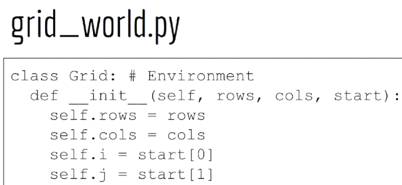

&nbsp;&nbsp;&nbsp;Next, we have the set function that takes in a dictionary of rewards and actions.
Again, all we do is assign these two instance variables.

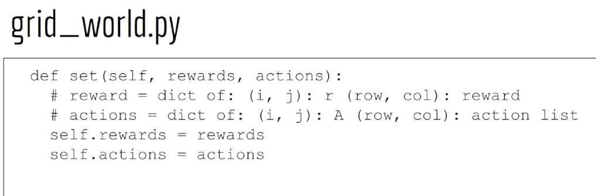

&nbsp;&nbsp;&nbsp;Next, we have the set state function, which will be useful in later code examples.
All we do in this function is take as input a state s and assign that to the instance variables self
driving self.
J.
Note that this is a bit like playing a video game and God mode, or with cheats obviously in real life
games.
You can't simply set the state to whatever you want.
For example, if you're playing chess, you can't say I want to go to the state where I'm one move away
from a checkmate.
That's simply not allowable when you are playing chess.

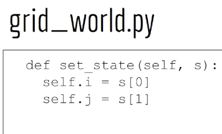

&nbsp;&nbsp;&nbsp;Next, we have the current state function, which returns the current state as a tuple containing the
I coordinate and the J coordinate.

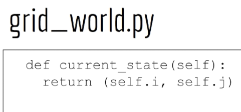

&nbsp;&nbsp;&nbsp;Next, we have the IS terminal function, which accepts as input a state s and tells you whether or
not that state is a terminal state.
Roughly speaking, a terminal state is a state you can't move from, although there are subtleties there
that we don't need to concern ourselves with.
Alternatively, we could have simply said terminal states explicitly.
But I think it's reasonable to simply say that any state that does not appear in the actions dictionary
is a terminal state.

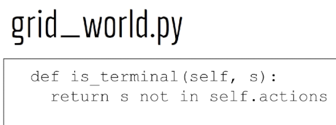

&nbsp;&nbsp;&nbsp;Next, we have the get next state function, which will be useful later on, this accepts as input a
state s in an action A and tells you what the next day you end up in will be.
This is, again, one of those God mode like features.
And it only makes sense in this particular environment because this environment is assumed to be deterministic.
When you are in a state s and you perform an action A, you will always end up in the same next state.
So first we extract the I and J coordinates from the S variable.
Next we check if the action A is in the actions dictionary for the state IJA.
If it's not, then we can simply return the tuple IJA since any action from the state won't change the
state otherwise.
If the action is in the dictionary for the state, then we check what the action is.
It's important to remember the convention when we think about arrays and programming, rows count down
and the columns count left to right.
So if the action is up, we subtract one from the row, coordinate.
If the action is down, we add one to the row.
Gordon.
If the action is left, we subtract one from the column, coordinate.
And if the action is right, we add one to the column.
Gordon.

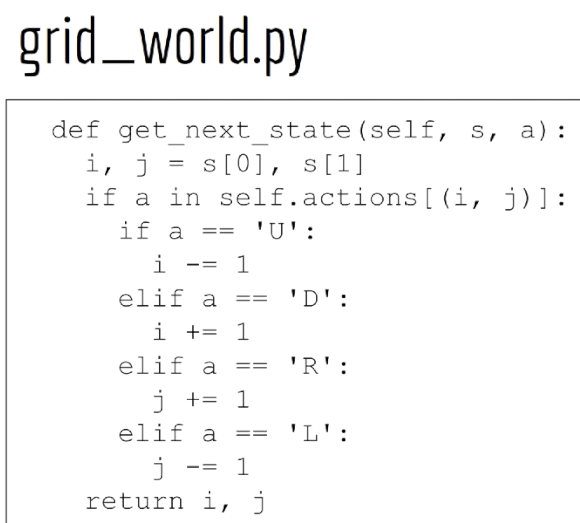

&nbsp;&nbsp;&nbsp;Next, we have the move function.
This is very similar to the get next state function, except that it actually performs the action in
the environment rather than being simply a hypothetical calculation.
Notice how we use self-doubt and self-doubt, J.
The actual current position.
We do the same calculation as discussed previously.
To update the state.
And then at the end, we return the reward associated with the resulting state.
This is the case even if we end up in the same state we started in.
Note that not all states have associated rewards.
So if a state doesn't exist in the rewards dictionary, we will assume that by default the reward is
zero.

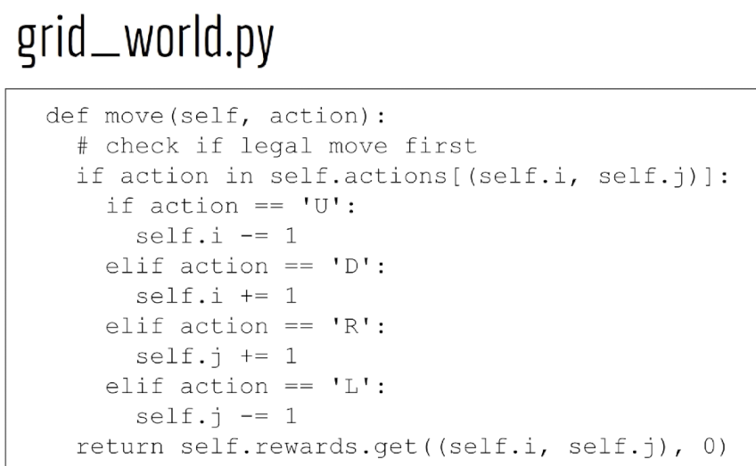

&nbsp;&nbsp;&nbsp;Next, we have the undue move function again.
We didn't discuss this before.
Since it's not critical to playing a game, but it may or may not be useful later on in the course.
As you can see, this simply reverses the calculation done inside the move function.
So all the updates for I and J are reversed.
Note that in order to ensure that we don't end up in an illegal state, we have an assert.
At the end of this function, we assert that the current state is in the set of all states.
We will look at the all states function very shortly.

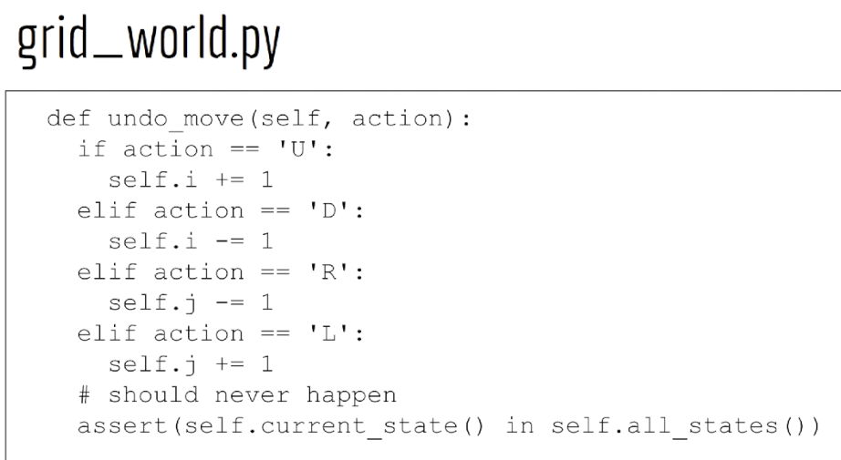

&nbsp;&nbsp;&nbsp;Next, we have the game over function.
This tells us whether we are in a terminal state currently, which means the game is over.
This is slightly different from the IS terminal function, which checks whether the state you pass in
as input is a terminal state.

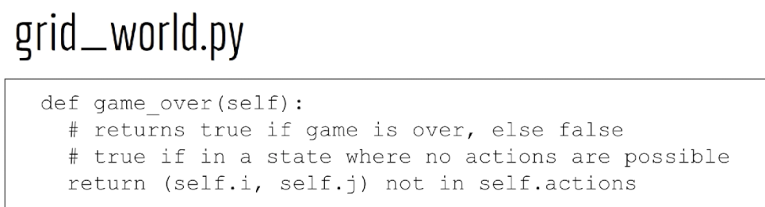

&nbsp;&nbsp;&nbsp;Finally, we have the all states function again, there are probably many ways to do this, but this
was just a quick and dirty way to get all of the possible states, including the terminal states, as
a single set to calculate this.
We get the set of all states that appear in the actions dictionary and the set of all states that appear
in the rewards dictionary.
We then return the union of these two sets.
The reason we want to do this is some states do not appear in actions dictionary such as terminal states.
Conversely, there are some states that don't appear in the rewards dictionary since there will be some
states that don't yield any non-zero reward.
Obviously this calculation isn't foolproof, but it's probably good enough.

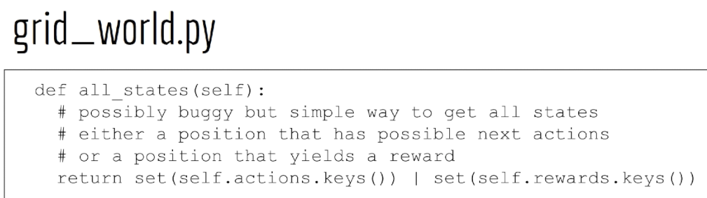

&nbsp;&nbsp;&nbsp;Finally, note that we have a helper function called Standard Grid, which does what we described earlier.
It creates a three by four grid of the exact same type.
We have been discussing in the theory lecturer's it, instantiates a reward's dictionary and an action
dictionary and then sets these on the grid and returns the grid world object.

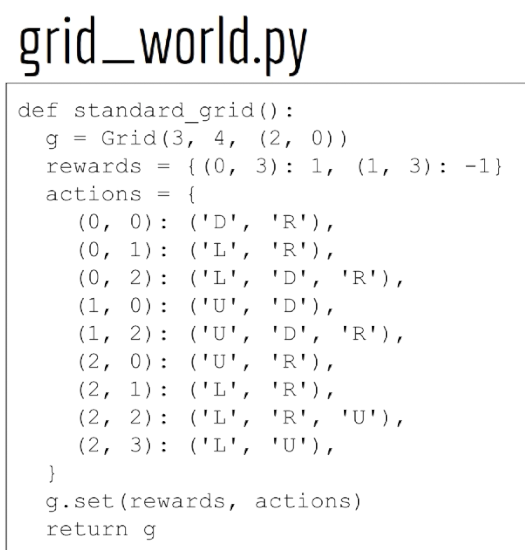

[Code_11](../code_files/11_Grid_word/Gridworld_test.py)
[Code_11_org](../code_files/13_windy_Gridword/grid_world.py)

# Iterative Policy Evaluation in Code

&nbsp;&nbsp;&nbsp;In this lecture, we are going to look at the code for iterative policy evaluation.
This is because we'll be looking at the deterministic version of Grid World, which we just described.
Again, before we start, I want to discuss at a high level what we are going to do before we dive into
the implementation.
This is similar to a test driven development approach where we define what we want to implement before
actually implementing it.
Another way to think about this is that this is as close as you will get to a fill in the blanks type
of exercise.
In fact, you are defining where the blanks are.
So let's begin.

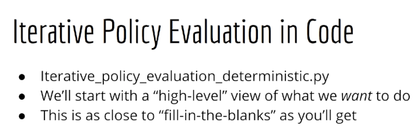

&nbsp;&nbsp;&nbsp;First, we would like to have some functions to visualize the value and the policy, we might have a
function called the print values, which takes in a value table V and a grid world object G and prints
the value of each state on top of a drawing of the environment.
We might have a function called print policy, which takes in a policy table P and a grid world
object G and Prints the action corresponding to each state On top of a drawing of the environment.

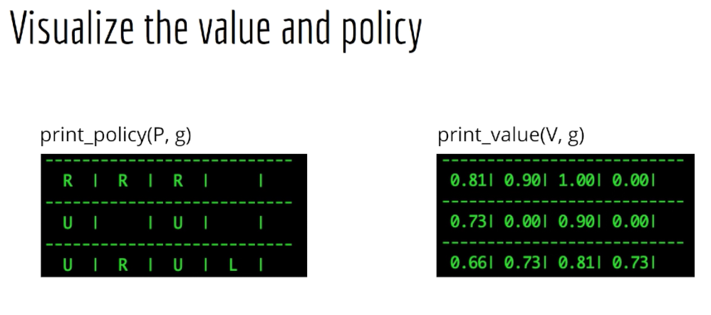

&nbsp;&nbsp;&nbsp;Next, because this is dynamic programming, we know that this algorithm involves using the state transition
probabilities to calculate V(s).
But our grid world environment does not have any such state transition probabilities.
So this is kind of an unusual step, but it's necessary in order to complete the exercise.
We are going to build the state transition probabilities from the environment.  
will store the environment
dynamics in a dictionary called transition probs.
In the most general case, we would have four arguments into our probability function s, a, s', r , however, to make things a little simpler
We will assume that the reward is deterministic so that we only need three arguments into our probability
function s, a, s'.
Therefore, the keys to the Transition Probs Dictionary will be a triple containing the current state
S action A and next status prime.
The value of the dictionary will obviously be the actual probability P(s' | s,a).  

How we actually populate this dictionary is an implementation detail So we'll discuss that later.

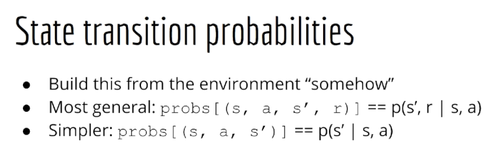

&nbsp;&nbsp;&nbsp;Next, because this is policy evaluation, we need a policy to evaluate.
will represent our policy as
a dictionary with the key being the state and the value being the action for that state.
For example, up, down, left or right.

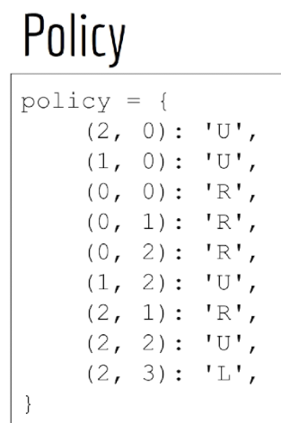

&nbsp;&nbsp;&nbsp;Next, we will initialise our value table and then run our policy evaluation loop.  
at some point
We'll also want to print the policy along with the value using the functions we defined earlier.

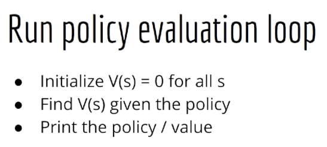

&nbsp;&nbsp;&nbsp;So overall, these are the steps:  

Number one, define helper functions to print the policy and the value.  

Number two, create dictionaries to represent the state transition probabilities.
And the policy.  

Number three, apply the iterative policy evaluation algorithm to find the value for the given policy.  

And number four, call the print policy.  

And print value functions to observe that the results make sense.

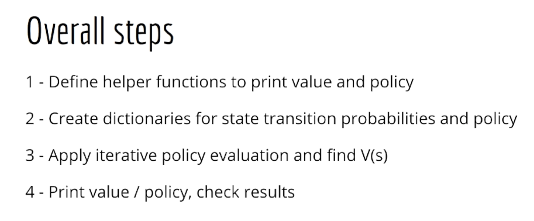

&nbsp;&nbsp;&nbsp;At this point, we can look at the details for how to implement the aforementioned code.
First, let's cover our imports.
We import numpad, obviously, and the standard grid function in the action space variable from the
grid of world file.  
action space contains an iterable of all the possible actions in our environment.
We define a variable called small enough.
Since our algorithm is iterative, we have to know when to quit.
We will quit when the maximum difference in the value table falls below this threshold.
This value is somewhat arbitrary.
So obviously you would want to play around with it in your own scripts.
Next, we have the print values function.
This function takes as input a value dictionary V and a grid of world objects G.
This function will draw our grid in ASCII and inside each state.
It will print the value corresponding to that state.
First, we have an outer loop that loops through all the rows for each row.
We print a bunch of horizontal dashes.
Next, we loop through each column inside this inner loop.
We get the value for the current position i j.
Note that the position i j may not be in the Values Dictionary.
So we use the get function with a default value of zero.
Next, before printing the value, we check whether the value is not negative.
This is because a negative sign takes up an extra space on the command line.
So we treat negative numbers differently.
So if the value is not negative, we print a space and then the value rounded to two decimal places.
We end with a vertical bar.
If the value is negative, we admit that space, since the negative sign will take up a space and then
we print the value again rounded to two decimal places.
Again, we end with a vertical bar.
Finally, when we reach the end of a column, we print an empty string to bring us to the next line.
Next, we have the print policy function, which is very similar to the print value function.
As before, we looked through each of the rows and then we loop through each of the columns for each
row, we print a bar of horizontal dashes inside the inner loop.
We grab the action for the corresponding state i j.
We use the default value of space.
If there is no action for the position i j, next we print the action.
And at the end of the inner loop, we print a new line.
Next, we have the main section in this section.
The first thing we do is populate a dictionary of transition probabilities and we can populate the dictionary
of rewards at the same time.
We start by calling the standard grid function, which returns a grid object.
Next, we loop through the full range of Rosen columns using the indices I and J.
Inside the loop, we said the current state s to be the tuple i j.
Next, we check whether or not S is a terminal state.
If it is, there's no need to assign any probability because the game will be over when we reach this
state.
Otherwise, we loop through the action space.
Remember that the reason we need all these loops is because we're trying to build a probability distribution.
Inside this loop, we get the next state as to by calling the function that get next state and passing
in state.
S an action, a recall that this tells us the next day without us having to actually go to that state.
Next, we set the transition probability for this as a as two tuple to one.
Note how these are the only probabilities we've set.
Thus all the probabilities stored in our dictionary will be one.
And anything else will be assumed to be zero by default.
That way we won't have to store a whole bunch of zeroes unnecessarily.
We might think of this as a sparse representation.
Next, we check of the next state as to is in the rewards dictionary attribute of the grid world object.
If it is, then we assign this reward to our rewards dictionary in this script.
Note that this is not strictly necessary.
We don't need to redefine the rewards dictionary.
We could simply use a grid that rewards throughout the rest of the code.
But I think this demonstrates more clearly that the reward may depend on the entire tuple S.A.S. to
rather than just the state as to.
The next step is to set up our policy dictionary.
As promised, the key is the state and the value is the action.
So this is a policy that reasonably leads us to the winning state.
I'd recommend you draw it on paper for a more visual representation.
Next, we initialise our value function, which we are going to store in our code as a dictionary to
do this.
We simply loop through all the states, return to by the all states function and set the value for that
state to be zero.
Next, we have our policy evaluation code.
This is the meat of this script where we actually implement the algorithm we've been discussing.
We're gonna start with a big while loop that will only quit when the maximum change in Vivace falls
below the threshold we set earlier inside the loop.
We set a variable called the biggest change equals zero.
Next, we live through all the states returned by grid dot all states.
Inside this loop, we check whether or not the current state s is terminal.
If it is, there's no need to do anything because we already know of is zero.
Inside the if statement, we set a variable called Old V equal to V of S.
We set New V equal to zero, and the rest of this loop will be to accumulate the new value of the US
into the variable new V.
Next, we loop through every action in the action space inside this loop.
We do yet another loop through the state space, this time for us to.
Now, you might ask, why do we need all these loops?
Remember that we are simply implementing the equation we derived earlier, by the way.
I do expect that you have taken notes and you have the Bellman equation on hand so that you can cross-reference
this code with the equation.
Each summation calls for another loop inside the loop for us to.
We grab the action probability.
Since the script is all deterministic, the action probability will just be one or zero.
We'll discuss what happens if we have a probabilistic policy in a later lecture.
Obviously, the action probability is one.
Only if A is assigned action for the state.
S.
Next, we get the reward for this particular essay, two triple using our rewards dictionary.
Note that we use the get function so that we can have a default value of zero.
Next, we accumulate the result in New V.
The equation on the right is just the expression inside the summation in bellman's equation.
It's the action probability multiplied by the transition probability multiplied by R plus gamma times
V of S2.
Finally, after we are done accumulating the sum into new V.
We can assign it to V of S.
Next, we update the biggest change variable to be the max of the current biggest change and the absolute
value of the new V of S minus the old V of S.
Once we've updated the entire value function, we can check whether the biggest change variable is less
than our threshold.
And if it is, we can break out of the loop.

[Code_12](../code_files/12_iterative_policy_evaluation_deterministic/iterative_policy_evaluation_deterministic_test.py)
[Code_12_org](../code_files/12_iterative_policy_evaluation_deterministic/iterative_policy_evaluation_deterministic.py)

&nbsp;&nbsp;&nbsp;All right.
So let's look at the results.
As you can see, our algorithm converges quite fast.
You can also feel free to double check the values by hand.
Of course, the value right beside the winning state is just one since a reward of one is obtained at
the winning state.
One step away from that is zero point nine.
Since Gamma is zero point nine one step away from zero point nine is your point eight one since zero
point nine times zero point nine zero point eight one and so on.

# Windy Gridworld in Code

&nbsp;&nbsp;&nbsp;In this lecture, we are going to look at a slightly more complex version of grid world called windy
Grid World.
Previously, our grid world was deterministic, meaning all of the transition probabilities were either
zero or one in Windsor.
Grid world, we extend this idea so that the transition probabilities can be anything.
Unfortunately, this code is quite a bit messier than the deterministic grid world code.
Since we have to specify all the probabilities, let's start again with a kind of test driven development
approach where we discuss how we would like the code to work before looking at the actual implementation.

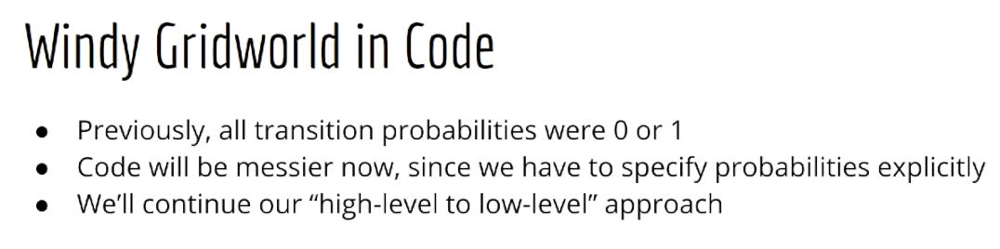

&nbsp;&nbsp;&nbsp;So far, windy.
Grid world, the main new data structure we want is something to represent the transition probabilities.
Again, this will vary widely depending on your personal design choices.
But my design was to represent the probabilities as a dictionary.
The dictionary is structured as follows, similar to our previous code.
I've decided that only the next states may be probabilistic.
The rewards will be a deterministic function of the state.
Therefore, we only need to concern ourselves with the current state action.
And the next day, the key to the dictionary will be a tuple of state and action.
These represent S and A the value in the dictionary will be another dictionary containing the next state
probabilities inside this nested dictionary.
The key will be the possible next state and the value will be the probability of going there.
For example, a dictionary with the key zero two and value zero point seven means that we will go to
state zero two with probability zero point seven.
If there's another key 1-3 with the value zero point three, that means we will go to state one three
with probability zero point three.
Of course, these probabilities must sum to one.
In order to represent a valid distribution.
Note that we can also have only a single possible next state with probability one.
This just means that the transition is deterministic.

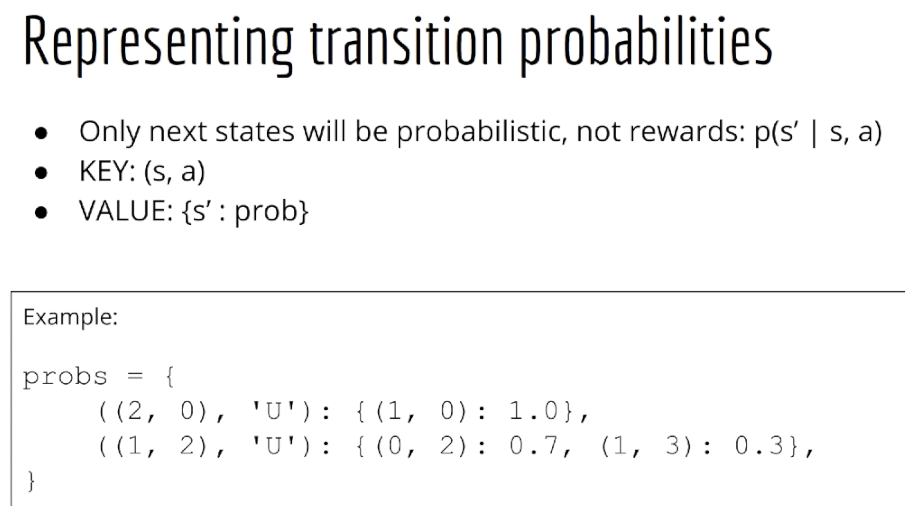

&nbsp;&nbsp;&nbsp;In our version of Windy Grid World, the list of probabilities is quite long, but I would encourage
you to look at it carefully in case I made any errors.
Creating this dictionary is repetitive work.
So errors are very easy to make.
You'll notice that most of the grid is still deterministic.
It's just represented in probabilistic form.
The relevant part of this dictionary, which is what makes the windedness interesting, is the state
right beside the losing state for this state.
You obviously want to go up since that brings you closer to the winning state.
However, I've made the transition probabilistic so that even if your action is up, you still have
some probability of going to the right.
This makes it so that going in this direction is less safe than simply going around along the left wall
to get to the goal state.
If you recall, the path from the starting position to the goal state is the same.
Whether you go up, up.
Right, right.
Right or right.
Right.
Up, up.
Right.

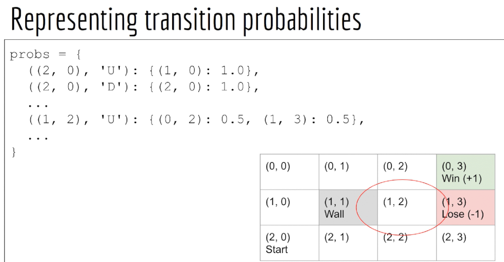

&nbsp;&nbsp;&nbsp;To continue on with our test driven approach, the way we would like to use our dictionary of transition
probabilities is like this.
It's very similar to before where we instantiate a windy grid, a world object with the number of rows
and columns and the start position in the set function instead of just the rewards dictionary and the
actions dictionary.
We also pass in the state transition probabilities.

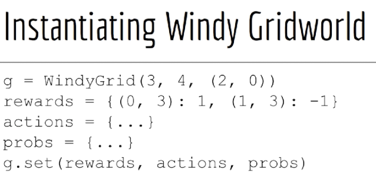

&nbsp;&nbsp;&nbsp;Other than this, our API should be the same as before.
We still want to have a move function which takes in an action and returns a reward.
We still want a current state function to return the current state.
We still want and is terminal function.
A game over function ends and all states function, which you've seen before.
So you know how these might be used.
One function we will not have is the get next state function.
As you recall, this takes in a current state s action day and returns the next state that doing this
action will land you in as a quiz question.
Think about why we will not have this function for Windy Grid World.

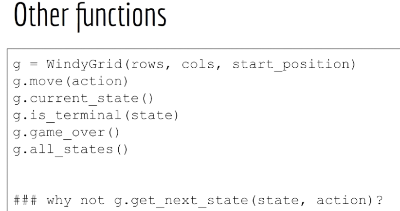

&nbsp;&nbsp;&nbsp;So the reason we won't have a function called get next state for windy grid world is because having
a function like this doesn't make sense any longer.
The next state is probabilistic, given a state in an action.
Therefore, we can't possibly return a single next state.

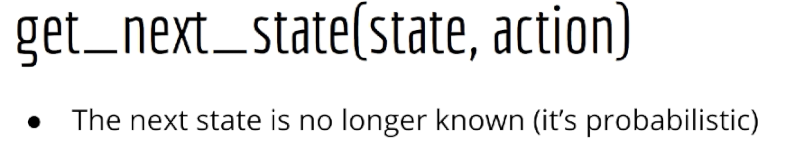

&nbsp;&nbsp;&nbsp;Now that you understand how we will use Wendy Grid World, let's dive into the implementation.
By the way, this is still in the same grid world profile we looked at earlier.
First, the constructor is exactly the same.
It sets instance variables for the number of rows, columns in the start position.
Next, we have a set function which has before simply assigns the dictionaries to instance variables.
We have a set state function, which is the same as before.
It says the state to whatever inputs state you pass in.
We have the current state function, which still returns self-doubt and self-doubt J as the current
state.
We have the terminal function, which still returns true if the input status is not in the action dictionary
keys.
So perhaps the only interesting function in windy grid world is the move function, which, of course
now has to be modified.
We start by assigning the current position, the self-doubt, eye and self DOJ to a variable called
S.
We assign the input action to a variable called A..
We get the next state probabilities by indexing self-taught probs with the tuple as a recall that this
returns a dictionary where the key is the state and the value is its corresponding probability.
Next, we get the possible next states by retrieving all the keys in the next state probabilities dictionary.
Next, we get the probabilities for all those states by retrieving all the values in the dictionary.
So now we have two lists, one with the states and one with the corresponding probabilities.
Next, we can use the NPR random not choice function to choose one of the next states from our list
of next states.
This function as an argument p which lets us pass into the corresponding probabilities for each item.
This returns us as to the next state.
We can now assign S2 to self-doubt, AI and self-doubt J.
Finally, we look up the reward for S2 in self-doubt rewards and return the appropriate reward.
Lastly, there are two more functions in Wendy grid world, which are the same as before.
We have game over which returns whether the current state is a terminal state.
And we have all states which returns the union of the state stored and self-doubt actions and self-doubt
rewards.
We also have a windy grid helper function which initializes a windy grid object and all the corresponding
dictionaries for the actions, rewards and state transitions.
We will use this on our next script so that we can focus on the actual algorithm and not how the environment
is implemented.

[Code_13](../code_files/13_windy_Gridword/windy_Gridword_test.py)
[Code_13_org](../code_files/13_windy_Gridword/grid_world.py)

# Iterative Policy Evaluation for Windy Gridworld in Code

&nbsp;&nbsp;&nbsp;Since our previous policy evaluation script was very general and could handle probabilistic state transitions, in order to implement the bellman equation, there isn't that much work to be done in this script. Therefore, we'll focus mainly on the differences and on looking at the results.  
First, let's start again by looking at an overall high level view of the script. We start by defining functions for printing the value function and printing the policy.  
You should convince yourself that these will not need to change. Next, we will define the State Transition Probabilities Dictionary and the Rewards Dictionary. Now you might wonder how is this state transition dictionary different from the one we defined in the previous lecture for Windy Grid World?

&nbsp;&nbsp;&nbsp;This is a good question to keep in mind. Next, we will define the policy in order to add even more probability to the script. We are also going to look at a probabilistic policy. At the same time.  
So we've added more probability to two places. The state transitions and the policy. Finally, we have our main loop, which actually implements iterative policy evaluation. This will largely be the same as before. Since the bellman equation was already probabilistic.

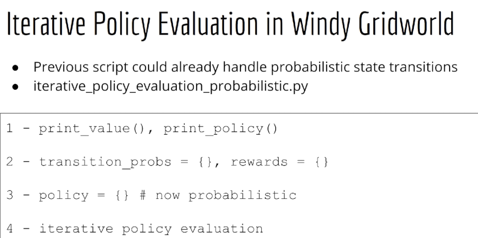

&nbsp;&nbsp;&nbsp;So the first obvious difference is that instead of importing standard grid, we're now going to import the Windy_grid function.  
The next difference is less trivial. We're going to populate our dictionaries for the state transition probabilities and rewards. Note that in our previous policy evaluation script, the state transitions were represented a bit differently than how we represented them in windy grid world. This is mostly for convenience, since we would like to keep this script mostly the same as our previous policy evaluation scripts. We will not use the windy grid world's state transition probabilities, but instead redefine them here in the same format we had before.  
To remind you, the format was that the key is a triple containing s, a, s'. The value in the dictionary is just the corresponding numerical probability representing P(s'| s, a). Luckily, our follow for this is much simpler than before, because we can make direct use of the probabilities stored in our windy grid object. We start by looping through each item in grid dot probs. Remember, the key is the state action tuple and the value is another dictionary, which we'll just call V . Inside the loop, we have another loop to loop through the V dictionary. Recall that for this dictionary, the key is the next state `s2` and the value is the associated probability. Thus, when we're inside both loops, we already have a triple s,a,s2 , which is the key. And we can simply assign the value P to our state transition probabilities dictionary. The rewards dictionary is the same as before.  
Well, we grab the reward and grid dot rewards using the key s2. The next big change is how we define the policy, we would like the policy to be probabilistic, which makes the results more interesting. This policy data structure is going to be very similar to how we represented the state transition probabilities in windy grid world. The key is still the state, but the value, instead of being just a string for the action, is now an entire dictionary. This nested dictionary has possible actions as the key and the corresponding probability as the value. As you can see, the policy of the find is still mostly deterministic, which makes the results easier to analyze. The one action, which is probabilistic, is for the initial state. You recall that from the initial state, there are two possible direct paths to the goal state. Either we go up, up. Right, right, right. or, we go right. Right up, up, right.  

&nbsp;&nbsp;&nbsp;So this policy gives us an equal chance of going either up or right, after which we will follow a direct path to the goal. Next, we have our main loop for iterative policy evaluation. We're going to skip over most of the loop since it's the same as before. We still have to loop over all possible states `S` all possible actions `a` and all possible next states `s2` the interesting part is inside the loop. Previously, the action probabilities were all either one or zero because we had a deterministic policy. Now our action probabilities are stored in our policy dictionary so we can do policy of s dot get a zero to get the probability of doing action day in status. You'll notice that the part where we accumulate the variable new_V does not change since it was already very general and could handle probabilistic state transitions and probabilistic actions. So those are the major differences in this script.

[Code_14](../code_files/14_iterative_policy_evaluation_probabilistic/iterative_policy_evaluation_probabilistic_test.py)
[Code_14_org](../code_files/14_iterative_policy_evaluation_probabilistic/iterative_policy_evaluation_probabilistic.py)

&nbsp;&nbsp;&nbsp;Let's run this and see what we get.   
All right, so first you'll notice that printing the policy is now pretty ugly. You can feel free to improve this yourself.  
If we look at the value, you'll see that it still converges quite fast. The important part is making sure these values make sense in the previous script. The values were symmetric for either path to the goal. This time they are not symmetric due to the fact that the state transition beside the losing state is now probabilistic. You'll recall that even if we select the action to go up the environment dynamics dictate that we still have a 50 percent chance of ending up in the losing state. I'd recommend doing the calculation on paper to check whether or not this value is correct, although it should be exactly minus zero point zero five. You'll notice that I've printed the actual value dictionary as well. And there is some numerical precision error. We get minus zero point zero four nine ninety nine instead of exactly minus zero point zero five, which affects the other calculations as well. One thing that might seem strange is that one step away from minus zero point zero five is minus zero point zero four. But one step away from that is still minus zero point zero four. You might think, why doesn't this value decrease in magnitude since we have a gamma of zero point nine?  
In fact, it does decrease, but you just don't see it since we're rounding off to two decimal places. If you look at the actual values dictionary, you'll see the full non rounded off values.

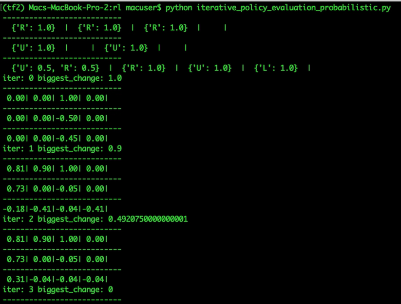

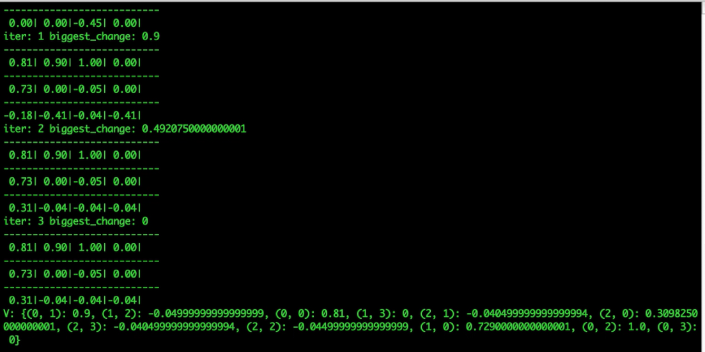

# Policy Improvement

&nbsp;&nbsp;&nbsp;In this lecture, we'll be continuing our discussion of dynamic programming, let's recall again the two tasks that we care about in reinforcement learning. Tasks Number one is given a policy, Tell me the value of that policy. Task number two is given an environment, Tell me the best policy note that we just solve task number one in the previous lectures. So in this lecture, we'll start on solving task number two. The main principle we need for solving task number two is an idea called policy improvement. This answers the question, given a policy, how do I find a better policy? You can imagine that if I'm able to answer this question, then I've solved the problem. This is because if I can find a better policy, given an existing policy, then I can just keep iterating on my policy since each step leads to a better policy. I will have a monotonically increasing improvement in policies.

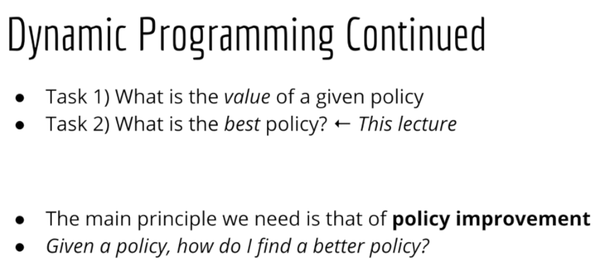

&nbsp;&nbsp;&nbsp;So how does policy improvement work?  
Let's begin with what we know so far and then just make a very tiny change. We'll start with a given policy pie from the previous lectures. We now know how to find its value function `Vpi(s)`. Now, suppose that we just consider one single state s and suppose that when we are in this state `s`, instead of following the policy, we decide to do something else. Suppose that we take some action `a` which is not the same as the action we would have taken according to the policy `pie`.  
Now how can we find the value of this action if we were to perform the action in the state and then follow our given policy thereafter? Of course, this is what the action value `Q` tells us. `Qpi(s,a)` tells us the value of doing action `a` while in state `s` and then following the policy `pie` thereafter. Intuitively, we can see that if `Qpi(s,a)` is greater than `Vpi(s)`, then our return for this episode is expected to be better than if we had just followed `pie` the whole time. The subtle thing to notice is that what we are talking about here is just a single action out of an entire series of actions. Imagine playing a game from start to end. As you recall, we call this an episode. Essentially, an episode is just a series of states actions and rewards in a sequence.  
So we play one episode and on just this one action, we decide to deviate from our existing policy. For `Q` function tells us that if the value for this action is greater than `Vpi`, then making just this one change will have improved our expected return.

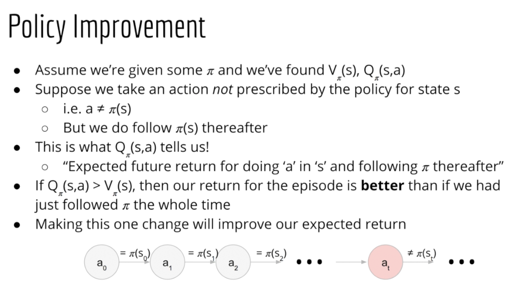

&nbsp;&nbsp;&nbsp;The next question to answer is this, suppose that we have some state `s` and we are interested in finding some better action. We know that we can look at `Q` to tell us whether or not a new action will be better than the current policy. So how can we find such an action? Better yet, how can we find the best action?   
Well, here's a simple solution. Why not just look through the `Q` table over all possible actions from this given state `s` and then pick the one that gives us the maximum `Q`? As you may recall, this is called the `arg max`, the best action to perform in the state would be the `arg max` over `a` of `Qpi(s,a)` and again, this is just a change to one single action over an entire episode. And then we follow the prescribed policy `pie` thereafter.  
Let's call the action. We chose `a star`. So `Qpi(s,a*)`  is greater than `Vpi(s)` than we have chosen the best action from the state `s` that improves the expected return.

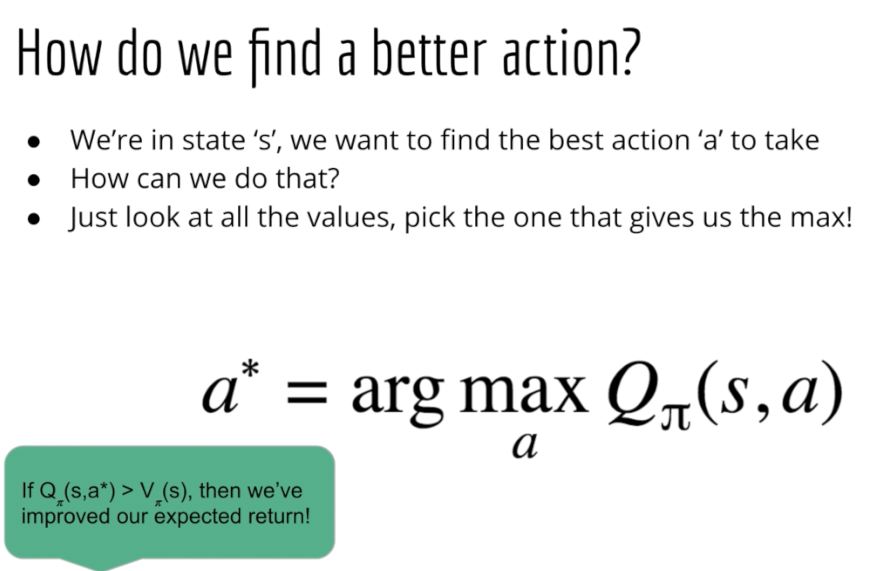

&nbsp;&nbsp;&nbsp;So we have just seen how deviating from our policy by performing just one action differently during an episode can improve our expected return. The next question to consider is this. We know that it's possible to encounter the same state twice or more during an episode so we can ask a similar but subtly different question. What if we perform this other action not just once, but every time we visit that state?  
In this case, we have created a new policy because the action we prescribed to this specific state is now different than what it was before. So let's call this new policy `pi'(s)`. Our original given policy was `pi(s)`. Now, this is a very subtle difference from what we were discussing before, previously, we considered the case where we changed the action only once and then followed the given policy thereafter. This is different because now we are saying every time we see the state `s`, we are going to perform a different action given by `pr'`. In this case, we do not follow the proscribes policy `pi` thereafter.

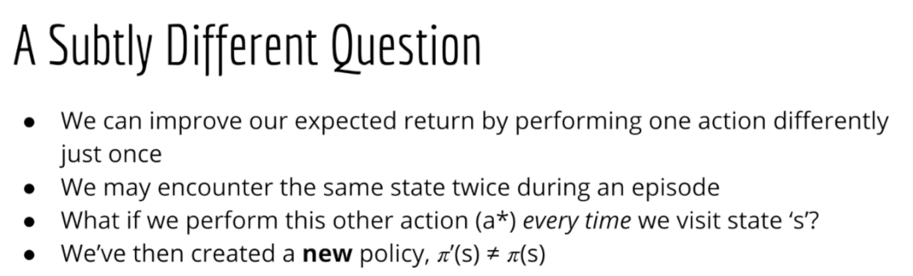

&nbsp;&nbsp;&nbsp;The next question to answer is this, is `pi'(s)` better policy than `pi(s)`? Now, this might seem obvious, but the reasoning is subtle and it's actually not obvious if you think about it. Suppose that we choose one single state to change the action. We look at `Qpi(s,a)` and we take the `arg max` over all actions `a`. Then we say, my new policy, `pi'` will replace the existing action with this new action. Suppose that all other state action mappings in the policy remain the same. Previously we showed that if we only change the action once and follow the given policy thereafter, this leads to an improvement.  
This just follows directly from the Bellman equation. For `Q` The right hand side contains `Vpi`, which means that we have to follow the existing policy `pie` for this equation to hold. But now we are asking a slightly different question. Now the right hand side no longer applies because we are no longer following `pie`, but we've created a new policy `pi'`. So I hope you can see that.  
In fact, it's not obvious that the value for the new policy is better than that of the old policy. We actually do not have any equation telling us that this should be the case.

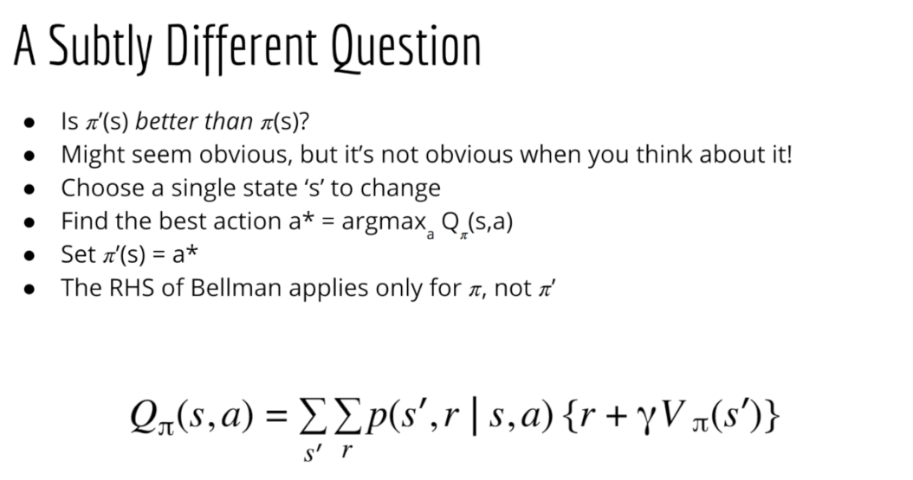

&nbsp;&nbsp;&nbsp;Luckily, it turns out to be true, the expected return for following `pi'` is better than the expected return for following `PI`. And note that when I say better, then I'm just using casual words for greater than or equal to. And this is the case when we choose `pi'` as described previously. Now, the proof of this is outside the scope of this cause.  
This is one of those rare situations where I don't think it adds anything to the intuition and in fact, I think it takes away from it. But if you're curious, I encourage you to think about it yourself. What this is called is the policy improvment theorem.

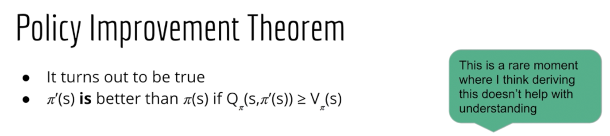

&nbsp;&nbsp;&nbsp;So to state it more formally, the policy improvement theorem is this, it says that suppose we choose some different policy `pi'(s)` for a given state `s`. Remember that for now we are just considering one single state. Suppose that the `Q` function for the given policy `pie` with the argument `s`  for the state and `pi'(s)` for the action is greater than or equal to `Vpi(s)`. So we're following the same process we described before.  
We are choosing some different action `pi'(s)`, thereafter  We continue to follow the policy `pie`. That's why both `Q` and `V` are subscripts by `pie`. The policy improvement theorem says that if this is true, then it is also true that the value function `V` for the policy `pi'` is greater than or equal to the value function, `V` for the policy `pi`, and therefore `pi'` is a better policy than `pie`. So note the subtle distinction between these two statements. We're saying that if this action was better to change once for the state `s`, then it's also better to change it to this action every time we visit the state `s`.

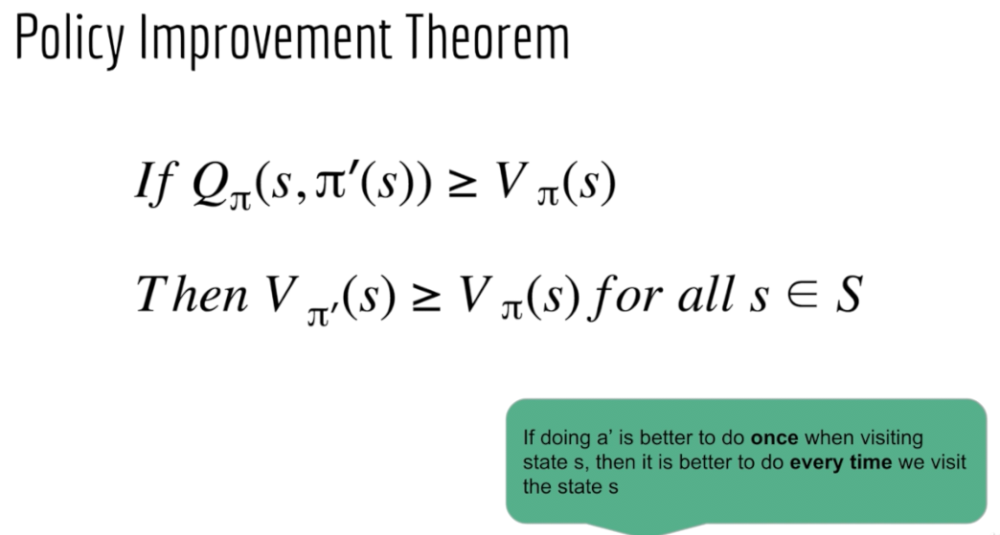

&nbsp;&nbsp;&nbsp;Also note that if we have a strict inequality when we change the action once, then we'll have a strict inequality when we change the action permanently. This means that if we find some action such that `Qpi` is greater then but not equal to `Vpi`, then updating our policy with this new action will lead to a new value function `Vpi'` at a strictly greater than `Vpi`.

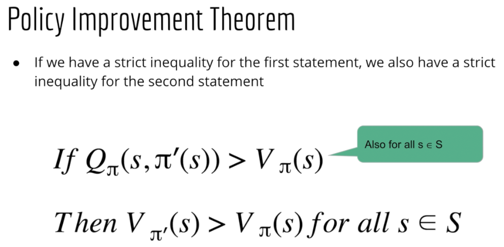

&nbsp;&nbsp;&nbsp;The next question to consider is this. up until now, we've been considering what happens if we change the action for some individual state `s`, but let's say we perform this process for every state `s` in the state space, this is the process of policy improvements. We are given some policy `pie` and we would like to improve it. Let's also assume we've computed `Qpi` and `Vpi` for all states and all actions. We know how to do this because this is just policy evaluation. So basically, you can think of policy improvement in pseudocode form. First, we have a loop that iterates over all states in the state space except for the terminal state. Since we never take any actions from the terminal state, it is irrelevant. Now for each of these actions We take the `arg max` over all actions of `Qpi(s,a)`.  
Now suppose that you like working with `V` instead of `Q` in this case you can replace `Q` with the right hand side of the Bellman equation. OK, so this is the process of policy improvement. It basically means you improve the action for each state overall states. And by performing this process, we have improved our policy not just over a single state but over all states.

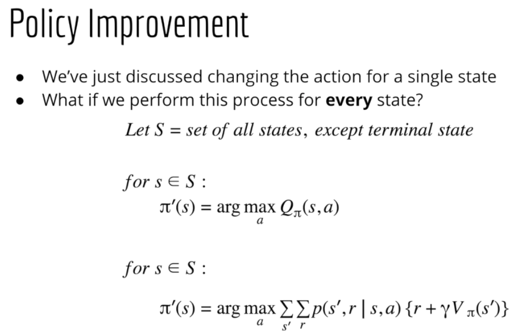

&nbsp;&nbsp;&nbsp;Let's now return to this concept of convergence. We can first recognize that by following the process of policy improvement, it's not possible for the policy to get worse. Therefore, the policy will always improve monotonically. Now, let's suppose that we reach a point where we perform the policy improvement process. And it turns out that the new policy is the same as the old policy. We can write this an equation form simply by plugging in what we had on the previous slides for the policy improvement assignment.  
In this case, we are asking what happens when both sides are equal? Well, you may recognize this from the previous section of the chorus. This is called the Bellmen Optimality Equation.  
So if we can reach this point with a Bellman optimality equation is satisfied, then we found the optimal policy.

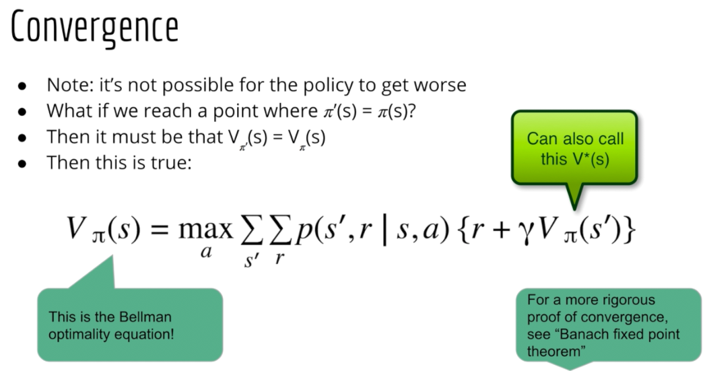

# Policy Iteration

&nbsp;&nbsp;&nbsp;In this lecture, we'll get one step closer to applying the policy improvement principle in practice. So far, we've learned how to improve a given policy. Interestingly, the input to this process is a policy, and the outputs of this process is also a policy. The output policy happens to be better than the input policy. Now, consider what would happen if you applied the process again. Well, reason should tell you that the result would be an even better policy if you apply the process again and even better policy. So this is the concept of policy iteration.

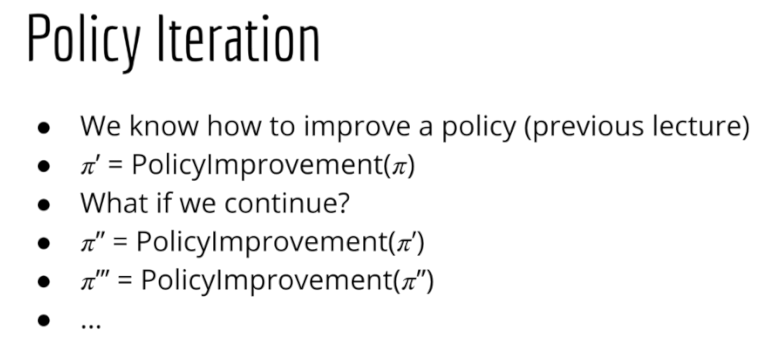

&nbsp;&nbsp;&nbsp;Now, we have to zoom in a little bit, because there's one more step that we've almost forgotten about, the process of policy improvement we described in the previous lecture requires us to find the value function. Therefore, we know that policy evaluation should be part of this process. Specifically, the full process is this. Suppose we're given some initial random policy `pi0`. The next step is to evaluate this policy. So we find a `Vpi0`.   
As you recall, this is needed for the policy improvement step. Then we learned in the last lecture that we can improve the current policy by following the process of policy improvement. This will give us `pi1`. In order to improve `pi1`, we must first find its value function. So we do another round of policy evaluation and this gives us `Vpi1`. Clearly we can now improve this policy to get `pi2` which is better than `pi1`. Then if we want to improve `pi2`, we have to find its value. So we evaluate `pi2` and we get `Vpi2`. And obviously we can repeat this pattern until our policy stops changing.  
This is the process of policy iteration.

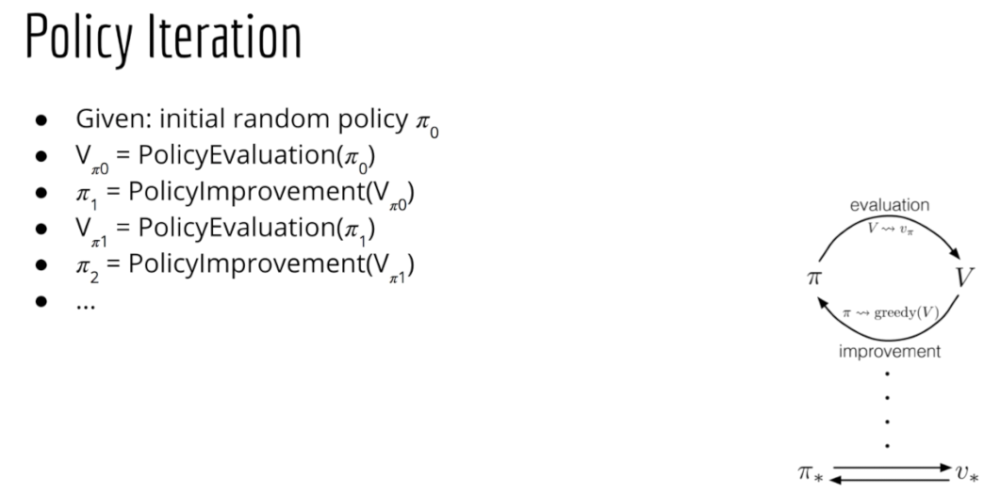

&nbsp;&nbsp;&nbsp;So I hope you'll agree that given what you've learned so far, the process of policy iteration is pretty straightforward. It's nothing but the repetition of two previous concepts we already learned about. Nonetheless, it's still hopeful to walk through some pseudocode before you move on to implementing this yourself.  
Now, at a high level, this is probably pretty basic. We start by initializing some random policy. Then we have an infinite loop inside this loop. We simply have two steps. Step number one is to evaluate the current policy. Step number two is to perform policy improvements. At this point, we can check if our new policy is the same as our old policy. And if that's the case, we can exit the infinite loop.

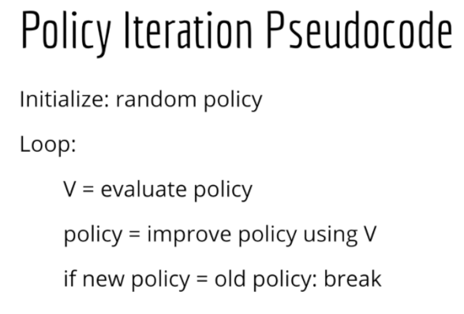

&nbsp;&nbsp;&nbsp;Let's now zoom in so that we can consider this in more detail. Again, we start by initializing some random policy. Step number one is to evaluate this policy. So let's write this out explicitly. This is essentially just a copy of what you learned previously as before we start by initializing the `V(s)` and then proceeding with an infinite loop. Next, we create a variable `delta` which will store the maximum change on each iteration. Then we lived through all the states in the state space except for the terminal state. Inside this loop, we save the old value of `V(s)`. Then we compute the new value of the `V(s)` using the bellmen equation. Then we update `Delta` using the absolute difference between the new `V(s)` and the old `V(s)`. Outside the loop, we check whether or not `Delta` is less than our minimum threshold. If it is, then we can break out of the loop and policy evaluation is complete.  
Step number two, proceed like this. First, we create a flag that tells us whether or not our policy has changed. We'll call this `is policy stable`. The initial value for this is true. But if any of the subsequent steps lead to a change, we will set it to false. Next, we live through all the states in the state space except for the terminal state inside this loop, we save a copy of the action given by our existing policy for the state `s`. We'll call this `a_old`. Then we perform policy improvement for the state using the `arg max` equation. We learned previously. Note that instead of using `Q`, we use `V`.  
This is because, as you recall, `V` is easier to compute than `Q`

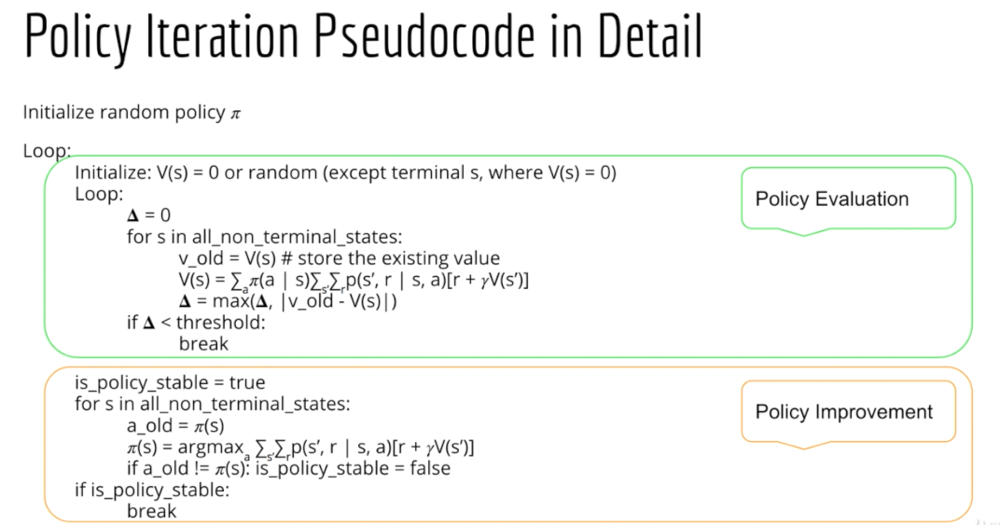

&nbsp;&nbsp;&nbsp;For `V` If we have big `s` state, then we only need to hold it big `s` values. But if we have big `a` actions, then we need big `s` times big `a` values to hold `Q`. So using `V` is a bit more memory efficient.

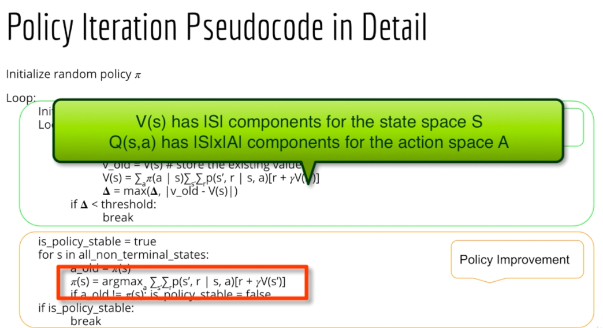

&nbsp;&nbsp;&nbsp;Next, we check whether our improved action is the same as old, if this is not the case, then we set our `IS policy stable` flag to False. When we finish looping through all the states, we check whether or not there `is policy stable` flag has been set to False. If that was not the case and the flag is still true, then we know we can quit because the policy has not changed. Since the policy hasn't changed, the value will also not change. And of course, if the policy has changed, then training is not yet complete and we loop back around to perform both steps once again.

&nbsp;&nbsp;&nbsp;Now, there's one extra subtle point to consider, recall that as we discussed before, optimal values are unique, but optimal policies are not unique. This is because if one value function is better than another value function, then by definition only one of them can possibly be optimal. On the other hand, two or more different policies can lead to the same value function. Therefore, neither is better than the other. They are both optimal. But what would happen if we performed our algorithm and we just kept switching back and forth between two distinct optimal policies? In this case, the loop would never terminate. Therefore, we can add one extra condition for whether or not we should quit. Specifically, if the policy is stable, then we know it's OK to quit. But also if the value is stable, then we also know it's OK to quit. This allows us to recognize that it's possible for more than one policy to be optimal. But if we find that the value is no longer changing, then whatever policy we have found stable or not is an acceptable answer.

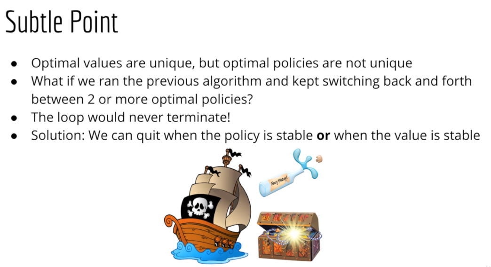

&nbsp;&nbsp;&nbsp;So there's one slight opportunity for improvement in the preceding pseudocode, specifically, consider what will happen if the policy only changes by a small amount from one iteration to the next, say only one or two actions have changed in this case, The value for the new policy will not be that different from the value of the old policy. So it seems wasteful to start the policy evaluation process from scratch on each round. Instead, we would like our initialization point to be close to where we want to end up to that end, instead of initializing `V` to a bunch of zeros or random numbers each time, it's more efficient to save the `V` and use that as your initial value for the next round of policy evaluation. In this way, we can utilize the fact that if `V` doesn't change that much, then policy evaluation will be completed in fewer steps.  
Please test this out in code and observe this for yourself when you do the next exercise.

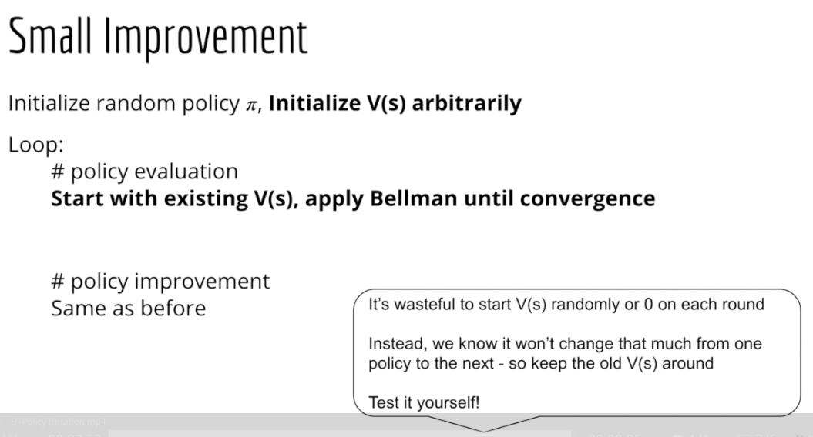

# Policy Iteration in Code

&nbsp;&nbsp;&nbsp;In this lecture, we are going to look at policy iteration in code, sticking to our strategy of starting with an outline of how we think the code should work. We will go through a high level explanation before diving into the actual implementation. So let's think about what functions we might need and what order we might want to call them in. We know that there are two major steps that we need to complete policy evaluation and policy improvement. We know how to do policy evaluation because we just did that earlier. This itself involves several steps, but we don't need to do them all each time. In particular  
before we do anything, we need to find and store the state transition probabilities and the reward table. We only need to do this once since it doesn't change as we do policy iteration.  
Next, perhaps we would like a function that will do policy evaluation. This would encapsulate the task that we did on our previous scripts, which makes it more convenient to call, and also just easier to think about.  
Next, we have the policy improvements step; both the policy evaluation step and the policy improvements step will go inside a loop which only quits when the policy improvements step yields no change in the policy.

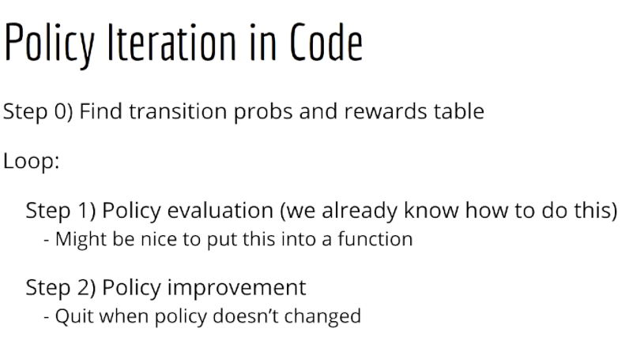

&nbsp;&nbsp;&nbsp;Now that we know at a high level what we want to do, let's dive into the implementation. The relevant file for this lecture is policy iteration deterministic dot Py. This is because we will be using the deterministic version of Grid World where all the state transitions are deterministic. 
In the import section We import numpy as usual, standard grid and action space, and also our previously written print values and print policy functions. We said are small enough parameter to ten to the minus three and gamma to zero point nine.

Next, we have a function to populate the state transition probabilities and rewards. This will be the same codes as earlier. Now just encapsulated in a function, as you recall, both dictionaries have the tuple `s`, `a`, `s2` as the key and some number as the value. 

Next, we have a function called Evaluate Deterministic Policy. This returns `V(s)`, given an existing policy as arguments into the function. We have the grid world object and the policy dictionary.  
Technically, we could also pass in the transition probabilities and the rewards dictionary. But I decided to leave these as global variables. Not a big deal. Again, this code is the exact same thing as we had previously in our policy evaluation script. So I won't be explaining it again.   

Next, we have the main section, inside the main section we call the standard grid function to get our grid world object. Next, we use the function, get transition probs and rewards to get the transition probabilities and rewards.  
Next, we print the rewards using the print values function. Remember that this just takes in a generic dictionary where the key is the state and the value is a number. So while it was originally built to print the value dictionary, it can also print the rewards dictionary. Since the structure of these dictionaries is the same. 

Next, we initialize a random policy. To do this, we start by creating an empty dictionary. Next, we loop through all the states stored in grid dot actions. Remember that these are only the states in which we can perform actions, in other words, non terminal states for each state. We simply assign a random action using `np.random.choice()`. 
Next, we print our initial policy using the print policy function. 

Next, we have our main loop. This is an infinite while loop, which we will break out of, only when the policy stops changing. The first step of this loop is the policy evaluation step. Since we already wrote this function, it's just one line to call a function and we get back a value dictionary `V`.  

The next step is the policy improvement step. Technically, we could have also put this into a function. But again, the design is totally up to you and it's not really a big deal. When it's new code, I prefer to see it completely raw. We start by setting a flag: Is policy converged equal to true?  
Next, we looked through all the states in grid dot actions. Again, these are all the non terminal states for which we can actually perform actions. Next, we grab the currently assigned action for the state and call it Old a. We want to keep track of the old action because that's how we will know whether or not the policy has changed. Next, we initialized New a to none and best value to minus infinity. Why minus infinity?  Remember that the action we will eventually assign will be the action that yields the maximum value. Therefore, we are going to store larger and larger values in this variable, best value. And so obviously an appropriate initial value is minus infinity. 

Next, we live through all the actions in the action space in order to find the best one. Inside this loop, we need to accumulate the value for performing this particular action. We will store that in a variable called `V`. Next, we loop through all possible next states `s2` recall again that this simply implements the inside part of the Bellman optimality equation. And again, you will have wanted to take notes so that when you are doing your coding, you can quickly glance at them to ensure you are implementing the right equation. 
Inside this loop, We first get the reward for this particular triple of `s`, `a`, `s2`. Next, we accumulate the value in `V` according to the Bellman equation, that would be `P(s'|s,a)*(r + Gamma* V(s'))`. Once we are out of the loop, we can check if the value `V` is bigger than our current best value. If it is, then we assign a `V` two best value and we assign `a` to `new a`. 

After this loop is complete, `new a` will be the action that leads to the best value stored in best value. And once that's done, we can finally assign `new a` to our policy dictionary for the state `S`.  
We can also check if `New a` is not equal to `old a`. If it's not, then this automatically means our policy has not converged since it has changed. Finally, once we're outside of that loop, we can check whether or not the policy has converged. And if it has, then we can break out of the loop. After we found our optimal policy, we can print the optimal value along with the optimal policy.

[Code_15](../code_files/15_policy_iteration_deterministic/policy_iteration_deterministic_test.py)
[Code_15_org](../code_files/15_policy_iteration_deterministic/policy_iteration_deterministic.py)

&nbsp;&nbsp;&nbsp;So let's run this and see what we get. All right.  
So it seems that both our optimal policy and our optimal value make sense, our policy leads us directly to the winning state from whatever state we are in. And the optimal value follows the usual pattern. The value is one beside the winning state. One step away from that is zero point nine. One step away from that is zero point eight one and so on. Note that our optimal policy is such that if we are in the beginning state, we want to go up. Of course, it would be just as valid to go right, since that would still lead to the same optimal value.

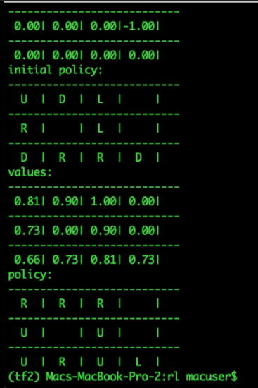

# Policy Iteration in Windy Gridworld

&nbsp;&nbsp;&nbsp;In this lecture, we are going to look at policy iteration for windy grid world in code. We are going to use the same Wendy grid world as we looked at previously with a state beside the losing state is windy.  
This makes it so that even if we choose to go up, we may still end up being pushed to the right such that we land in a losing state. Before we look at the code, it will be useful to think about what we expect our algorithm to do. In our previous scripts 
taking either path to the winning state would be an optimal choice. But now, because of the fact that going beside the losing state is more dangerous, we might expect that our algorithm tries to take us away from this state.

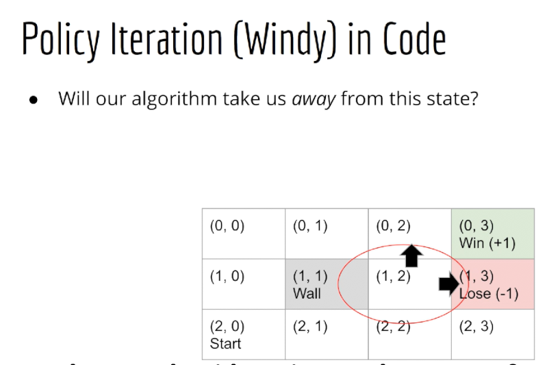

&nbsp;&nbsp;&nbsp;One thing that's not immediately clear is this. What should the action be if we are right beside the losing state? Obviously, you might think the best choice is to simply not go there.  
But remember, this is reinforcement learning and not your mind. So we still have to pick an optimal action for every state. What's not immediately clear is whether it's better to simply go up because the winning state is closer and to take the risk. Or is it better to go down and away from the danger?

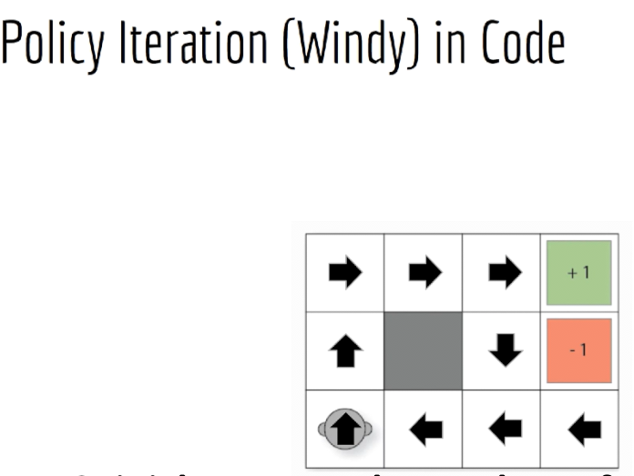

&nbsp;&nbsp;&nbsp;Here's something else that will make this problem a little more complicated. What if we add an associated cost for taking a step anywhere in the environment? In other words, suppose that for every state we land in. That is not one of the terminal states. We get a negative reward. This should alter our agents behavior.  
Suppose the reward for going to any non terminal state is just zero. Then it's always good to go down when we are beside the losing state because this imposes no penalty and going down as a deterministic move. If we choose down, we will always go down. Only going up is probabilistic.   
However, what happens when the reward becomes negative?  
For example, if we get minus 10 reward for each step we take. It's probably better to just jump into the losing state, which only gives us a minus one reward. However, those are two extremes. What would be interesting is to see how the policy changes for those in-between values. What if we set the reward at each state to be minus zero point one? What about minus zero point two or minus zero point five? These will be investigated in the following code.

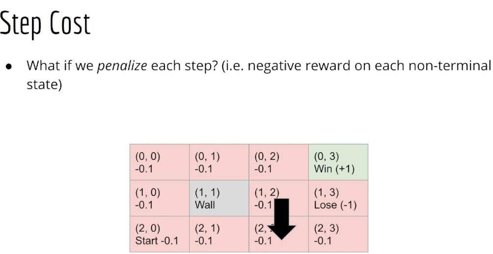

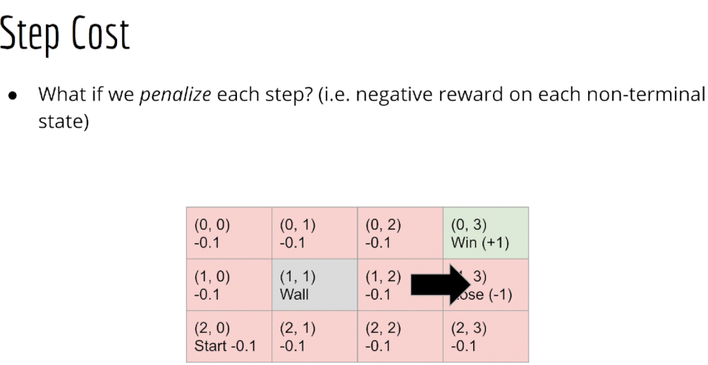

&nbsp;&nbsp;&nbsp;Let's begin by extending our windy grid helper function to windy grid penalized. This takes in a parameter called step cost, which will be the reward for going to any state. That is not the terminal state. The terminal state rewards will remain as plus one and minus one. Of course, this is very easy to implement. Using our existing API, we simply need to extend our rewards dictionary.  
So have a look at this code and make sure you understand it.

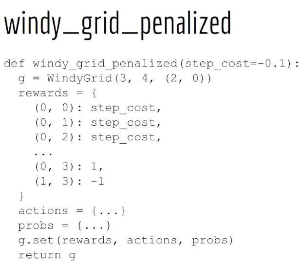

&nbsp;&nbsp;&nbsp;All right, so now we're in the code for policy iteration in Windy Grid World. The relevant file is policy_iteration_probabilistic.py. What's nice about this code is that it's almost identical to our previous policy iteration code. Only the environment has changed.  
So we will have to make the same adjustments we made earlier for policy evaluation for our imports. We're going to import windy grid in windy grid penalized. We're first going to test out windy grid and make sure the results make sense. Then we will move on to windy grid penalized. 

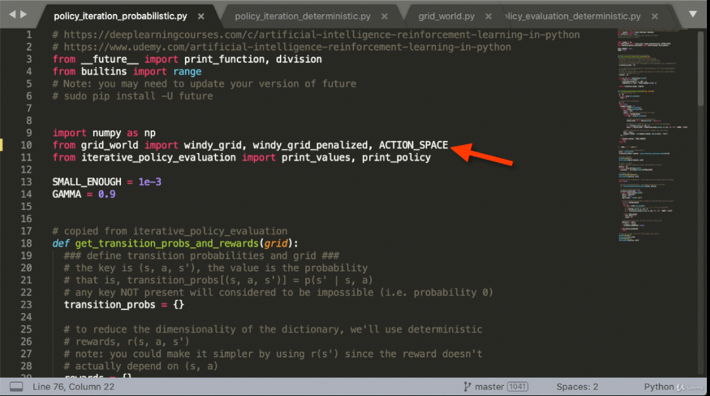

&nbsp;&nbsp;&nbsp;Next, we have the function, get transition probs and rewards. This makes the same change we made in our policy evaluation script where we are able to use the transition probabilities stored in the environment itself. This makes it easy, since all we really need to do is copy the same dictionary. We're just changing what we consider to be the key of the dictionary. The reward assignment remains the same.

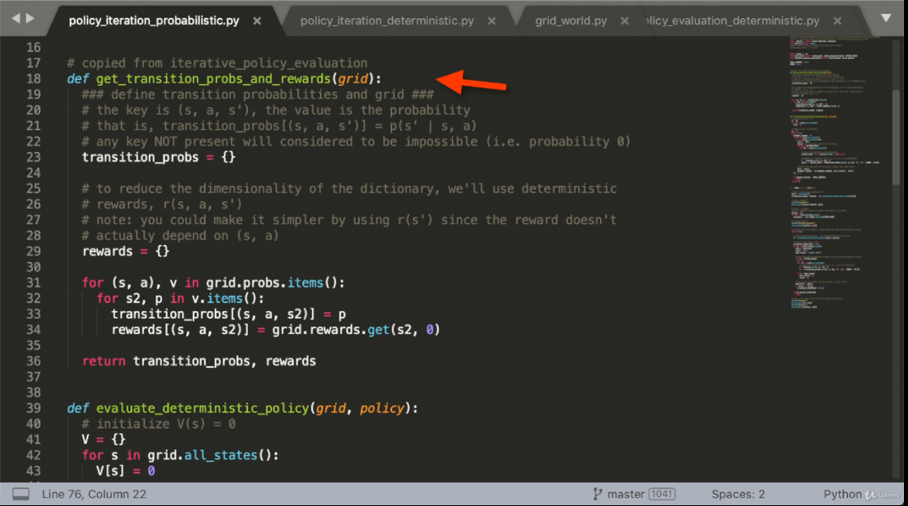

&nbsp;&nbsp;&nbsp;Next, we have the function evaluate deterministic policy. Note that this is called evaluate deterministic policy and not evaluate probabilistic policy. Since we are doing policy improvement, the action we want to perform is an ARG max or the value function and is therefore deterministic. Therefore, this function is the same as we had before.

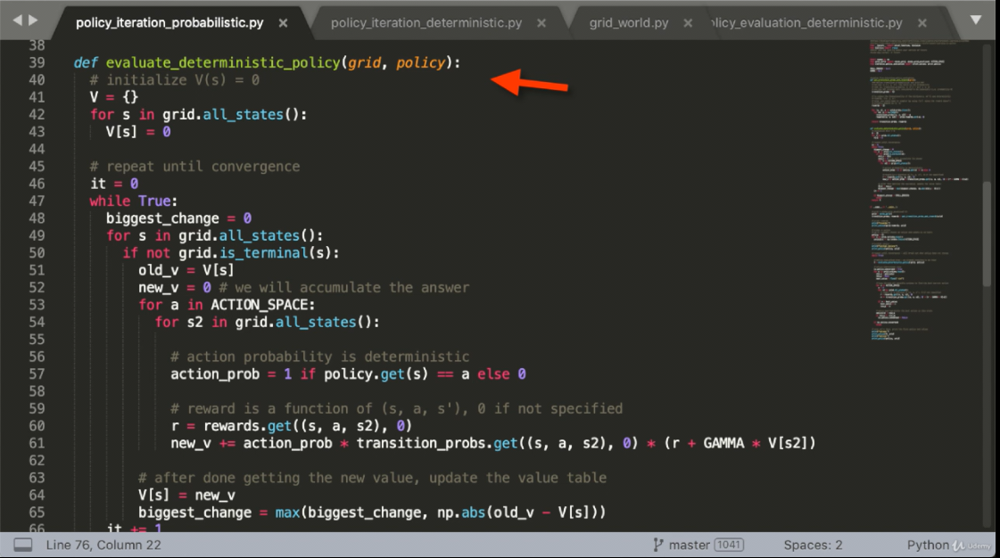

&nbsp;&nbsp;&nbsp;Next, we have the main section. The only difference here is that instead of using the standard grid helper function, we use the windy grid helper function. After that, everything is the same.  
We do policy iteration, which involves the two steps policy evaluation and policy improvement. The policy improvements step does not need to change since it already accounts for all the probabilities that may be involved in an MVP. So let's run this and look at the results.

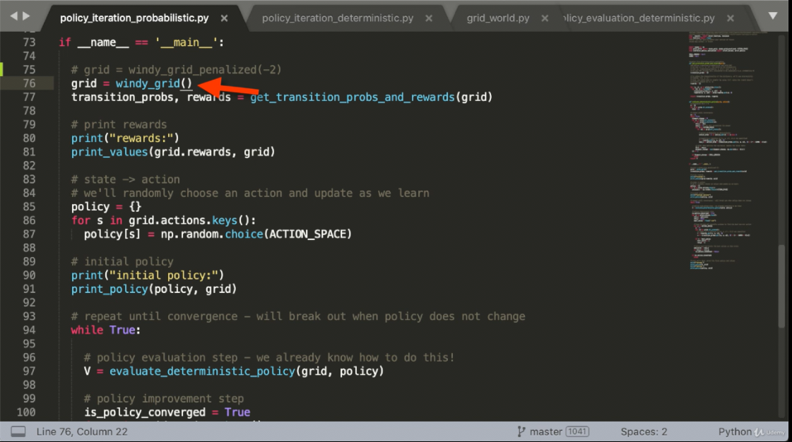

&nbsp;&nbsp;&nbsp;So here are the results for Wendy grid worlds, where each step is not penalized as promised. The policy is to go away from the state right beside the losing state. We choose to go down because that action is deterministic and always leads to us going down. But going up would be dangerous because there's a chance we would end up in the losing state by going down.  
We guarantee that we will reach the winning state and thus the value for this state is positive. You might want to double check that the value goes down by a factor of zero point nine for every step away from the goal state that you go. It starts at one, then zero point nine, then zero point eight one, then zero point seven three, then zero point six six and zero point five nine and then zero point five three. And then zero point for eight.

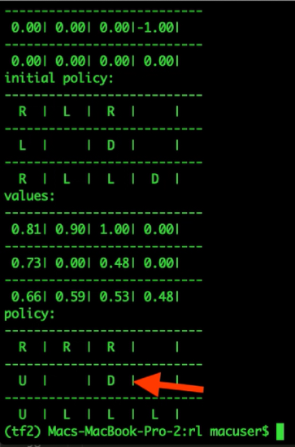

&nbsp;&nbsp;&nbsp;Now, let's try this again.  
But with the penalize windy grid with a step cost of minus zero point one.

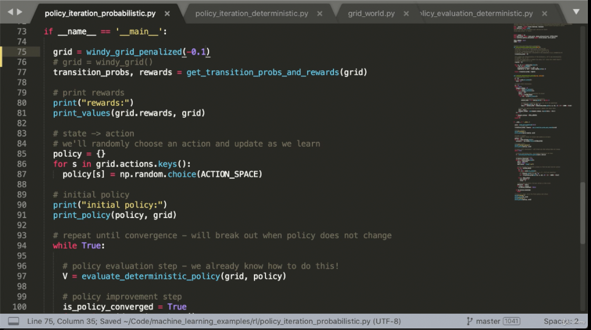

&nbsp;&nbsp;&nbsp;So as you can see, this death penalty is not enough to change our policy. However, the value of being in the state beside the losing state goes down to a negative number.

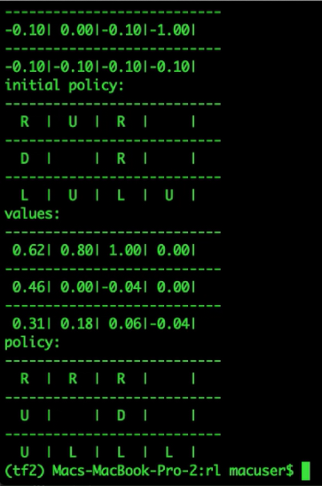

&nbsp;&nbsp;&nbsp;Now, let's try penalize Wendy Grid again with a step cost of minus zero point to. So this is where things get interesting.  
Now, when we are beside the losing state, we choose to go up instead of down. This is because going all the way around now costs more than the expected cost of simply going up. Or put another way, they expected return of going up is higher than the expected return of going all the way around. Pay attention to the threshold of this decision as well. If we are below the state, beside the losing state, we still choose to go up. But if we are to the left of that state, which is under the wall, we choose to go around, even though the winning state is further away.

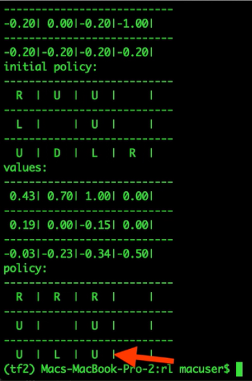

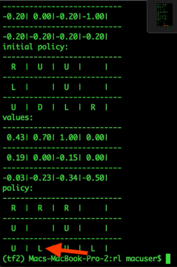

&nbsp;&nbsp;&nbsp;Now, let's try a court again with a step cost of minus zero point for. So our optimal policy has changed again.  
Now, if we are in the state underneath the wall, we choose to take the direct path to the winning state rather than going all the way around. The step cost is simply too high to justify taking a long way.

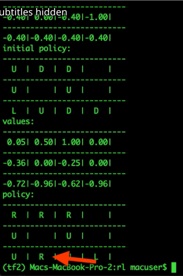

&nbsp;&nbsp;&nbsp;Now, let's try minus zero point five step cost. So this is also interesting. If we look at the state below the losing state. Notice that the policy is now to simply go directly into the losing state instead of going around and attempting to get to the winning state.

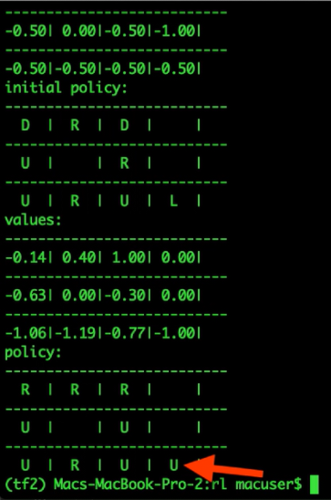

&nbsp;&nbsp;&nbsp;Finally, let's try step caused of minus two. At this point, the step cost is so high that even when we are right beside the losing state, it's better to just go into the losing state instead of trying to go up to get to the winning state.

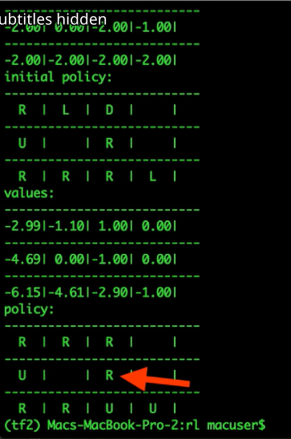

[Code_16_windy_gridword_penaized](../code_files/16_policy_iteration_probabilistic/windy_Gridword_test.py)
[code_16](../code_files/16_policy_iteration_probabilistic/policy_iteration_probabilistic_test.py)
[code_16_org](../code_files/16_policy_iteration_probabilistic/policy_iteration_probabilistic.py)

# Value Iteration

&nbsp;&nbsp;&nbsp;In this lecture, we'll be continuing our discussion of how to solve task number two, which is given an environment, how do we find the best policy? In the previous lectures, we saw that it was possible by simply combining two key ideas. The first idea was policy evaluation. In order to improve a policy, we have to know how good that policy is. This is done through the value function and the value function is found by performing policy evaluation. A second key idea is policy improvements. We determine the simple method that guarantees we can achieve a policy as good or better than a given policy,  
just as long as we know its value function, we observe that if we just perform these two operations repeatedly, we would improve the policy each time.

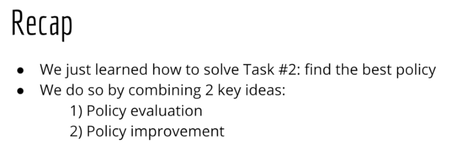

&nbsp;&nbsp;&nbsp;Now, there is one drawback to the method we just described; to see this, consider that the policy improvement process is a loop. We repeat this loop until conversions, inside this loop we have two steps. The first step is policy evaluation, and the second step is policy improvements. The second step is relatively efficient as it only requires a single pass through every state.  
On the other hand, the first step policy evaluation is not efficient. In fact, this step requires another loop in which we must wait for conversions. Therefore, we actually have to nested loops, both of which could potentially last for a very long time as we wait for them to converge. So I hope you can see why this process would be slow.

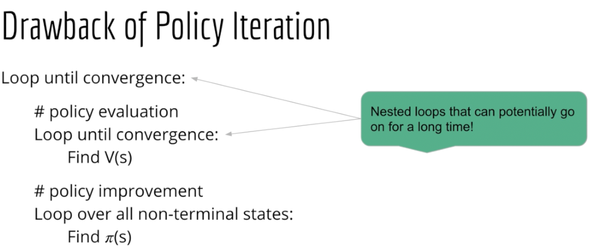

&nbsp;&nbsp;&nbsp;So here are two ways that we can consider speeding up the process of policy iteration. First, note that the policy itself is not really needed. Recall that the policy is simply the `arg max` of `Q`. We can also state this as the policy is the `arg max` of the right hand side of the bellmen equation. In this case, we can use `V`.  
However, note that on the subsequent step, when we want to evaluate the policy, we don't really care about the `arg max` of this expression. We care about the actual value of this expression. In other words, if we just want the value, we can take the `max` instead of the `arg max` and forget about which action is being chosen altogether.

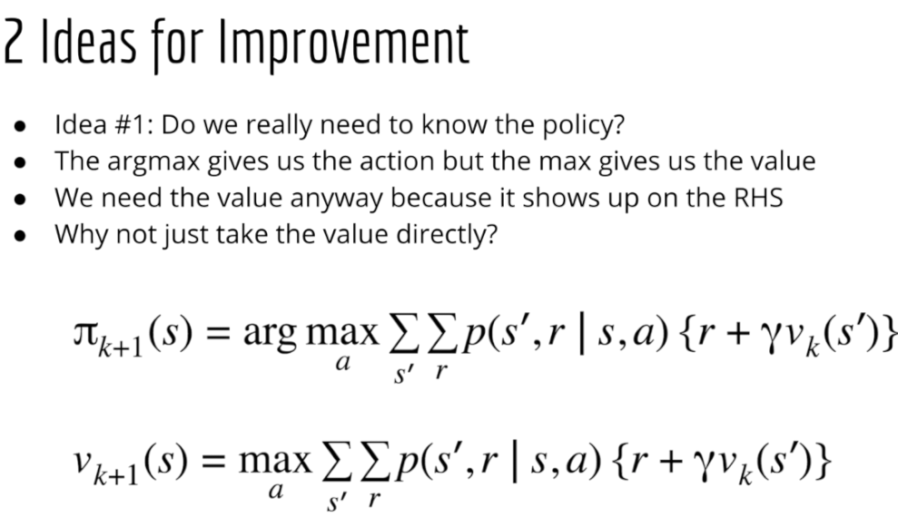

&nbsp;&nbsp;&nbsp;Here's another key idea. We know that the policy evaluation step is problematic. This is because this inner loop can potentially last forever. We know that, practically speaking, we can cut this short by stopping when we reach some threshold for the largest change in `V(s)`.  
Previously, we learned about one way to improve this calculation in the context of policy iteration; it was that, instead of initializing `V(s)` randomly or to all zeros, we could simply start at whatever values were currently stored in `V(s)`. This speeds things up, since we know that `V(s)` won't change that much from one policy to the next.  
The result of this is that policy evaluation converges in fewer steps. Here's one way we can extend this idea. Instead of waiting for `V(s)` to converge, what if we simply stop the evaluation process after a few steps? And what if we take this to the extreme? What if we perform just a single step of policy evaluation? You might have a hunch that this converges since both the policy and the value function are both moving towards some optimal point.

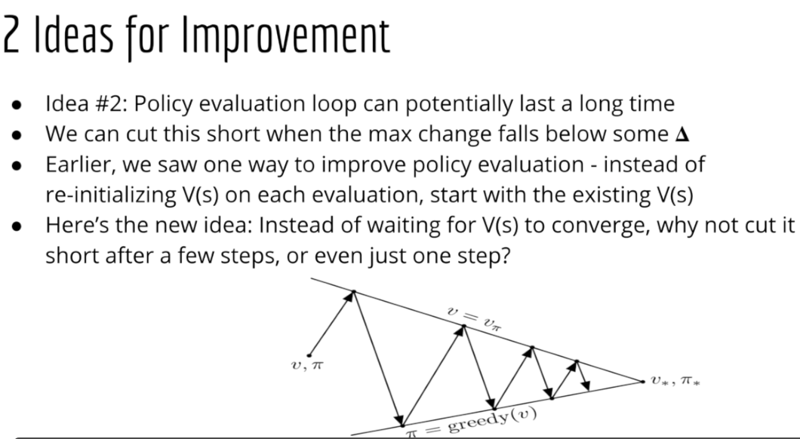

&nbsp;&nbsp;&nbsp;To come up with our next algorithm, we just need to combine these two ideas. To recap, here's what they are. Idea number one, instead of taking the `arg max` and getting the action, just take the `max` and get the value directly.  
Idea number two, instead of going through many steps of policy evaluation, just do a single step. When we combine these two ideas together, we get an algorithm called value iteration.

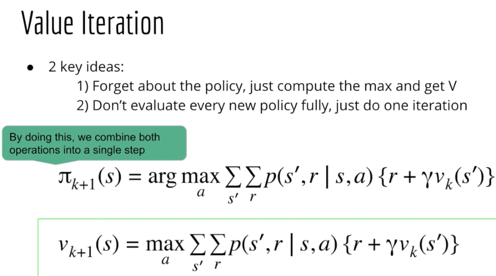

&nbsp;&nbsp;&nbsp;So value iteration works like this, you can see that it's a pretty short algorithm, so we start by initializing very randomly, except for the terminal state, which must have a value of zero. Then we enter an infinite loop. Inside this loop, we create a variable called `Delta`. This will store the maximum change for this iteration of the loop, will initialize this value to zero, and we'll update it for each state that we see.  
Next, we live through all the states in our database except for the terminal state whose value should be fixed at zero. Inside the second loop, we store the current value of the `V(S)` inside a variable called `v_old`.  
Next, we take the `arg max` of this expression, which is the equivalent to taking the `max` over all actions of the `Q` function for the given state. This gives us the new value for `V(s)`. Note that this is similar to what we do for policy improvement, except that instead of taking the `arg max`, we now just take the `max` directly and forget about the actual action we would have chosen.  
Next, we update Delta to be the max of the current Delta and the current absolute change in `V(s)`.  
Finally, we check whether or not Delta is less than our threshold for convergence. If it is, then we break out of the loop. Once we've completed this loop, we found the optimal value function `V*`. In order to find the optimal policy `pi*`, we need to live through each state one last time. Inside this loop, we set `pi*` to be the `arg max` of the usual bellman expression.

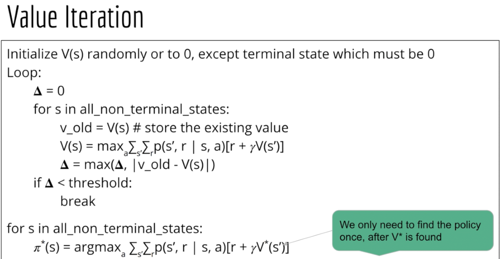

&nbsp;&nbsp;&nbsp;So here are some interesting facts to note about value iteration, note how in this pseudocode, we end up with only one infinite loop that stops when `V(s)` converges. This is better than before where we had two nested infinite loops. As before, well this one loop could potentially go on forever. Practically speaking, we quit when the maximum change in `V(s)` drops below some threshold. Furthermore, note that we don't have to deal with the issue where more than one policy can lead to the optimal value function.  
As you recall, for policy iteration, it's possible for us to flip flop between two different optimal policies, since optimal policies are not unique, since we're now dealing with the value function which is unique, the knowing once you break out of the loop is easy.  
Finally, note the parallels between this and policy evaluation. Policy evaluation is nothing but treating the bellman equation as an update rule. We take the right hand side and we assign it to the left hand side. Convergence is achieved when the right hand side is equal to the left hand side, which is a fixed point for the update rule. Similarly, value iteration is nothing but treating the bellman optimality equation as an update rule. Again, we take the right hand side and assign it to the left hand side. We reached convergence when the right hand side is equal to the left hand side.

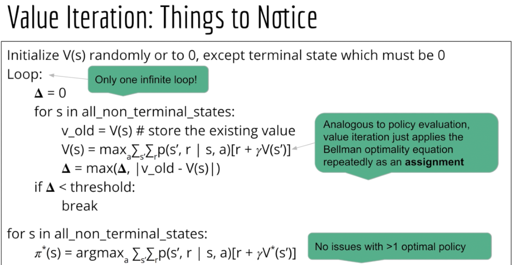

# Value Iteration in Code

&nbsp;&nbsp;&nbsp;In this lecture, we are going to look at value iteration in code. The relevant file for this  lecture is value_iteration.py. To start, we are going to do our usual imports.  
Numpy, Windy Grid, Action Space, Print values and print policy.  
Next, we set our parameters :  Small enough to ten to the minus three. And Gamma to zero point nine.  
Next, we define the function that get transition probs and rewards. Technically, we could have imported this as well, but it would depend on which version of grid world you imported earlier. Since we'll be using Windy Grid world, we'll have the same version of this code that we've been using for windy grid worlds previously.  
Note something interesting is that we don't have any function for policy evaluation. This is because now that we're doing value iteration, there's no need to do policy iteration.  
So next, we have the main section; inside the main section, We obtain a grid world object by calling the function of windy grid.  
Next, we get the transition probabilities and the rewards by calling the function above.  
Next, we print the rewards using the function of print of values.  
Next, we initialize the value function of `V(s)` To zero for every state.  
Next, we enter our value iteration loop. Recall that this simply applies the Bellman optimality equation again and again. We start by entering an infinite while loop inside this loop. We instantiate a variable called the biggest change to zero, just like our previous scripts. We will break out of the loop when the biggest change falls below are small enough threshold.  
Next, we live through all possible states. Then we check if the current state is a terminal state, if it is, we do nothing since the value of a terminal state is always zero. If it's not. We continue.  
Next, we set the current value for `V(s)` to a variable called `Old_V`. This is so that we can keep track of the change in `V(s)`.
Next, we initialize `new_V` to be  minus infinity. Since we want to find the maximum value for `new_V` minus, infinity is an appropriate starting value.  
Next, we lived through each action in the action space. We would like to calculate the value for doing this action. So we initialize a variable called `V` where we will accumulate this value.  
Next, we live through all possible next states `s2`. Inside this loop, we get the reward for this `(s,a,s2)`tuple.  
Next, we accumulate `V`, According to the bellmen equation, again, I hope you're taking notes and you're referring to them as you look through the code. Once we are outside the above loop, we check if the `V` we just calculated is better than the `new_V`. We've stored so far. If it is, we make this `V`, the `new_V`. Remember that no actions are assigned at this time because it's value iteration. We only determine the actions after the optimal value is found. Once we found the value of `new_V`, we were outside the above loop and we can assign a `new_V` to `V(s)`.  
We now check how different the new `V(s)` is compared to the old `V(s)`, and we update `Biggest_change`. when we're outside that loop. We check if the biggest change for this iteration is less than our threshold. If it is, then we break out of the loop. So at this point, we have found at the optimal value function.  
The next step is to find the optimal policy by taking the `arg max` over the value function. First, we initialize an empty dictionary called policy. Then we live through each state in `grid.actions`, which is basically all the states except the terminal states. Inside the loop  We said `best_a` to `none` and best value to minus infinity.  
Then we loop through all possible actions in the action space. Inside this loop, similar to the above loop, we set `V` equal to zero, then we live through all possible next states `s2`. Inside the loop, we obtain the reward `r`, and we update `V` according to the bellmen equation. When we're done finding `V`, we check if `V` is better than best value. If it is, we make `V` the new best value and we make `a` new best action. Once we finished searching through each action, we assign the best action we found to the policy at Index `s` once we're done finding the optimal policy. We print the optimal value and the optimal policy.  

Before we continue on, I want to give you a surprise quiz. This is related to a question that a student asked me in the past. So perhaps if you have this same question to, then maybe it's worth thinking about. If you did not have this question, then obviously you might just find it confusing as to why anyone would think this way. So it's up to you if you want to consider this quiz or not. So the quiz question is this. You will notice that the calculations we are doing for the value iteration part are very similar to the part where we find the policy. Basically, we're doing the same loop twice, once to find the `max` and wants to find the `arg max`. You might ask why not simply combine them into a single loop? Will this make the code faster or more efficient? And in what sense does it improve the computational complexity of the loop? So that's the quiz. It's up to you whether or not you want to think about the answer.

[Code_17](../code_files/17_value_iteration/value_iteration_test.py)
[Code_17_org](../code_files/17_value_iteration/value_iteration.py)

&nbsp;&nbsp;&nbsp;So let's run this and see it. All right.  
So, as expected, we get the same answer as with policy iteration. However, this is more efficient since we only need to do a single loop to find the optimal value and thereafter another single loop to find optimal policy.

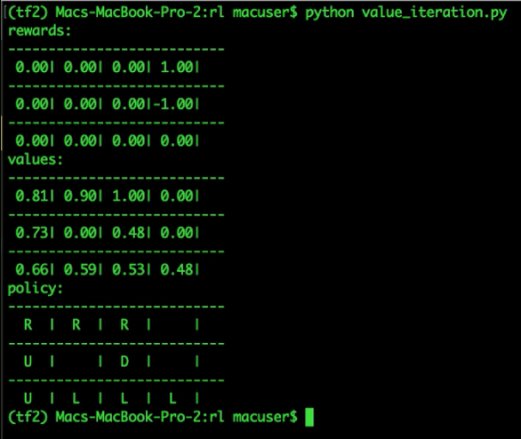

# Dynamic Programming Summary

&nbsp;&nbsp;&nbsp;In this lecture, we'll summarize and review everything we learned in the section, this section was all about how to solve two important problems in reinforcement learning.  
The previous section showed us the framework for reinforcement learning problems, the MDP using the MDP, we were able to build on this framework to solve the problems of prediction and control. The prediction problem is a given a policy. Tell me the value of that policy. The control problem is given an environment. Tell me the best policy.

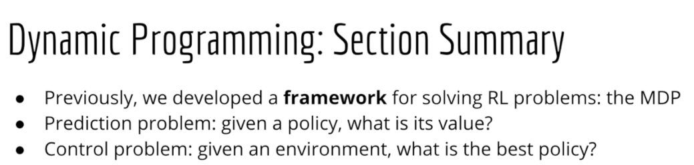

&nbsp;&nbsp;&nbsp;So to solve the prediction problem, we use policy evaluation, we learn that this is nothing but treating the Bellman equation like an update rule, we noted that there are other solutions to this problem, such as using a basic linear solver. However, this is limited because it doesn't scale and it doesn't give us something to build on later in the course.  
In fact, we saw an example of that in this section. Specifically, value iteration is essentially just like policy evaluation, except that instead of doing a summation, we take the max. So even in this section, we've seen how the dynamic programming approach is more powerful than solving a linear system of equations to solve the control problem. We first learned about the principle of policy improvement. It was here that we learned about the policy improvement theorem. This theorem states that if changing in action once improves the value for a given policy, then changing that action permanently for that state will lead to a better policy. Using this theorem, we developed the process of policy iteration. Policy iteration solves the control problem. We can start with a completely random policy and after running the process for long enough, we will end up with the optimal policy.  
One problem we discovered with policy iteration is that it can potentially be very slow. It has one infinite loop nested inside another infinite loop. We then considered a new approach called Disvalue iteration that just has a single loop. Essentially, value iteration is like policy iteration, except that we combine the evaluation step and the improvement step into a single operation. This converges much faster than policy iteration, and it doesn't require us to even store a policy at all. The policy is only computed after the value iteration loop is complete.

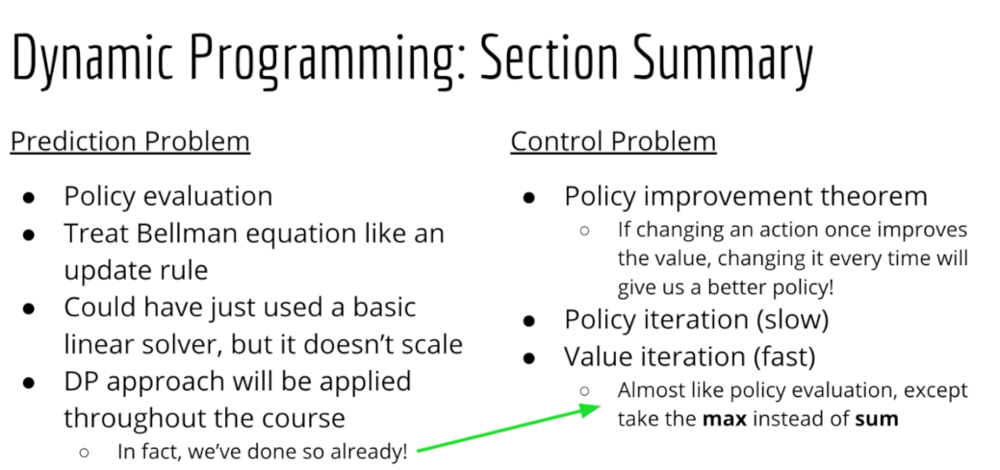

&nbsp;&nbsp;&nbsp;One interesting fact you may have noticed about this section is this reinforcement learning is supposed to be all about learning from experience. Imagine a robot playing a game or solving a maze by playing the game or solving the maze. A large number of times it can use the rewards it achieved to learn the optimal policy. What was interesting about this section was that no actual games were played, so why did this happen?  
In fact, no games were played because we had full knowledge about the dynamics of the environment. In other words, we knew as prime are given. The lesson is that when you know this probability distribution, you don't actually need to play the game. The solution is just a matter of applying the Bellman equation or the bellmen optimality equation. So is learning from experience unnecessary?  
The answer is no. This is because in the real world, we don't know this probability distribution. Imagine driving a car or playing a game of chess when you join this course. You probably had in your mind this idea that you were going to teach and agents who play a game or solve some task you probably had in your mind that your program would learn from experience and not just use probabilities. Now, of course, this is necessary in order to understand the next stage of this course.  
In the next section of this course, we will consider the more realistic scenario where this distribution is not known. In this case, we must learn from experience. Finally, note that we have different names for these approaches when we know the transition probabilities. That is our model of the environment when we use this model to find the solution. We call this a model based approach. When we learn from experience, we don't need a model of the environment. So we call that a model free approach.  
The remainder of this course, we'll focus on a model free approaches in more advanced courses. You might go back to model based approaches or even combine these two approaches to get a hybrid approach.

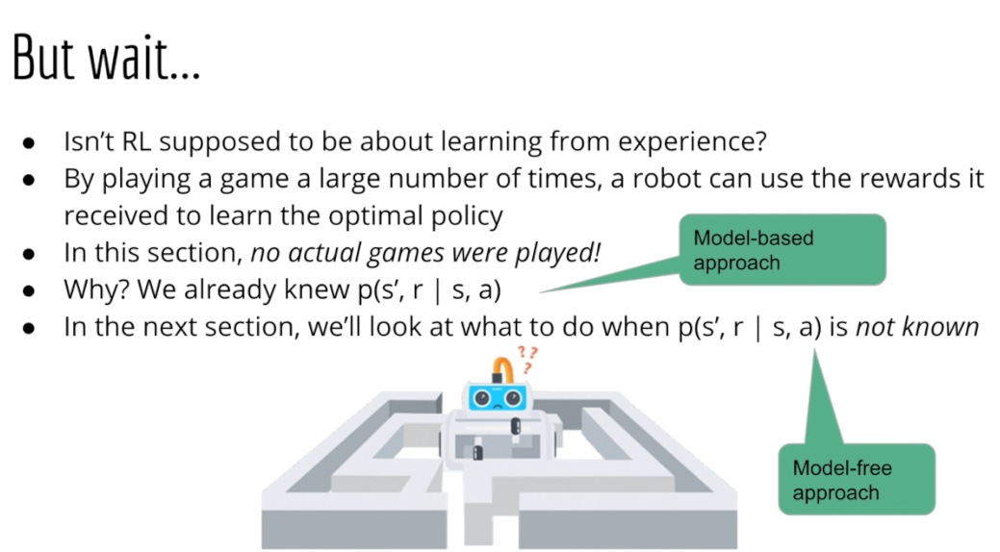

