# Monte Carlo Intro

&nbsp;&nbsp;&nbsp;Hey, everyone, and welcome back to Reinforcement Learning in Python. In this section will be moving on to a new topic known as Monte Carlo. Now, like the term dynamic programming, Monte Carlo is also not a technique that is specific to reinforcement learning.  
You may have seen dynamic programming in other contexts. So, too, with Monte Carlo. Monte Carlo is a general technique that can be used when you want to estimate some quantity with samples.

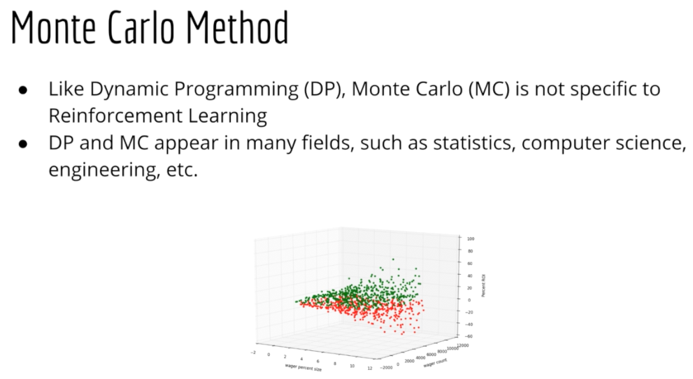

&nbsp;&nbsp;&nbsp;The typical example people used to introduce Monte Carlo goes something like this, although personally I'm not a huge fan of this example. Basically suppose you want to estimate PI. Yes, we know that it's three point one four one five nine something. But let's pretend that we do not know this value. How can we estimate PI?  
The Monte Carlo approach is this. Suppose that we have a square and we're able to generate random samples of points uniformly inside this square. For simplicity let the side length of the square be one. Now let's draw a circle inside this square such that the square fills the circle. Clearly the circle has diameter one or radius one half. Now let's consider the areas of the square in the circle. The area of the square is one. Well, the area of the circle is `PI * r^2`, which is PI over four. The key points are recognizes this. The ratio of the area between the circle and the square is PI over four. This means that if I draw many samples uniformly inside the square, I will find that they fall inside the Circle Pi over four of the time. That is to say, PI over four tells me the proportion of uniformly sample points that will fall inside the circle.  
Put another way, suppose I draw a very large number of points uniformly inside the square. I should find that the number of points `C` that fall inside the circle divided by the total number of points in is approximately equal to PI over four. Therefore, my estimate of Pi, `Pi'` will be `C` over `N` times four. OK, so this is the typical example people use to introduce Monte Carlo, which gives you the sense that we can use sampling of random numbers to estimate some value.  

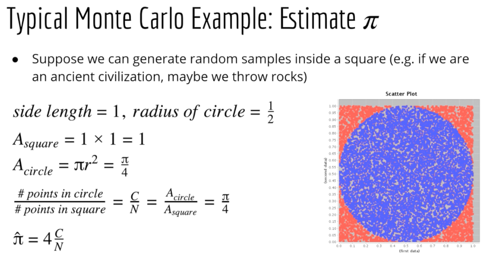

&nbsp;&nbsp;&nbsp;So why do I not like this example? Well, this example doesn't really tell us how MonteCarlo is used in the real world. In fact, the way Monte Carlo is used in the real world is much simpler, and it's actually a lot closer to how we will use it in this course. And obviously, this is because reinforcement learning is a real world problem. So what is, in my opinion, a simpler introduction to Monte Carlo?  
The main application of Monte Carlo is in estimating expected values. You may recall that I emphasize this in the warm up section of this course. It played a large role in the MDP section. It played a large role in the dynamic programming section. And it's going to, again, play a larger role now. So now you understand why this appeared in the warm up? It's because it's very important. So suppose I want the expected value of X where X is drawn from some distribution P of X. Now, normally, if you knew P of X, you could just use the usual formula to calculate E of X.. This is an integral effect's is continuous and a sum if X is discrete. But suppose I do not know P of X, here's a simple example, suppose that I'm in charge of city planning and I want to know the expected speed of vehicles driving down some road in order to compute this expected speed. I must know the distribution of speeds P of X. Of course, there's no way for me to know this distribution. I can't call every car owner and ask them to tell me their speed distribution and then try to combine them with some overall distribution of speeds. But what can I do instead?  
Well, I can simply measure the speeds of actual cars driving down the road. If I add them all together and divide by N, I will get the sample mean. As you recall, the sample mean is an estimate of the true mine, which is E of X. Believe it or not, this simple process is MonteCarlo.

&nbsp;&nbsp;&nbsp;So how does this apply and reinforcement learning? Well, let's recall what we have done so far, we've essentially solved the reinforcement learning problem, given some environment and state transition distribution, you know how to find the optimal policy for an agent acting in that environment. So what's the problem? The problem is that our previous formulation had some pretty serious constraints. Specifically, we don't actually know the state transition distribution P(s', r | s , a )is typically unknown.  
For example, imagine you're trying to build a computer program that drives an autonomous vehicle. There's absolutely no way you can practically enumerate all the possible states that a vehicle could be in and then come up with the next state probabilities. Furthermore, you'll recognize that our task in reinforcement learning is essentially to solve the Bellman equation, to find the value function `V` or `Q`, and according to the Bellman equation, this can be defined recursively in terms of an expectation. So let's summarize what we have. We have an expected value that we want to compute.  
The problem is we can't compute this expected value because we don't know the distribution `p` that the expected value was taken over. Now, technically, in this expected value, there are two distributions, there's `P` which represents the environment dynamics and there's `PI`, which represents the agent's policy. The policy is what we program in code. So this part we do know, however, not knowing one part is enough to prevent us from computing this expected value. And thus this is exactly the scenario we described previously for which Monte Carlo can be a possible solution.  
We want an expected value, but we don't know the distribution. We only have samples. Therefore, our solution will be to estimate this expected value with the sample mean.

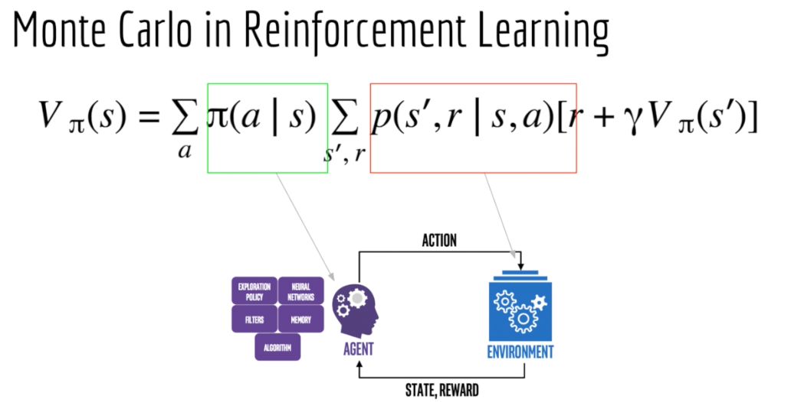

&nbsp;&nbsp;&nbsp;So the outline for this section will be as follows, as you'll see, it's pretty simple and it mirrors what we did for dynamic programming. Again, we'll start with the prediction task that is finding the `V(s)` Given a policy, this will allow us to establish the basics of the MonteCarlo method.  
The second step will be to solve the control task. As you'll see, using `V(s)` is no longer a viable solution. So we'll need to involve the action value `Q`. We'll study two approaches for the control task, one that builds up from the basics. But isn't that practical and one that is more practical?  
This will involve applying what we learned in the bandit section of this course specifically that explore exploit dilema.

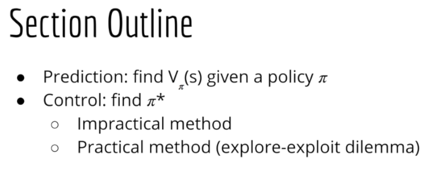

&nbsp;&nbsp;&nbsp;One clear distinction between this section and the previous sections is this. Reinforcement learning is all about trying to learn from experience. This is even encoded in its name. Reinforcement refers to the fact that we can provide the agent with rewards and the agent uses these rewards to modify and adapt its behavior. Greater reward acts as positive reinforcement, encouraging similar behavior in the future. Lesser rewards act as negative reinforcement, discouraging similar behavior in the future. The curious thing about the dynamic programming section was that it did not involve gaining any experience. We were able to solve the problem using only mathematics. Of course, this relied on an unrealistic assumption that we knew the environment dynamics.  
Now, by building the environment ourselves, we can ensure that this was the case and noticed that this is actually a great benefit to us in this cause. Because we built the environment ourselves, we're able to use the same environment for every section of this course. By doing so, it allows us to compare each of the techniques we learn about in a very fair and consistent manner if we kept using different environments in each section. It wouldn't give you an intuitive sense for how these techniques compare to one another. So using the same environment each time is an advantage.  
In that sense, MonteCarlo is the first section of the course that will show us how to solve an MDP using experience only without needing to rely on the environment dynamics. So as you go through this section, compare and contrast these methods with what you learn previously in terms of performance, effectiveness, implementation and assumptions.

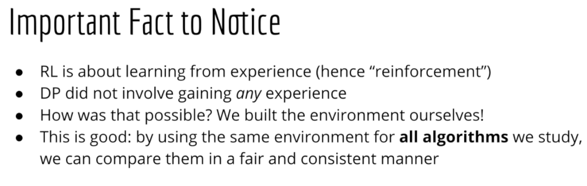

# Monte Carlo Policy Evaluation

&nbsp;&nbsp;&nbsp;In this lecture, we'll be discussing how we can use MonteCarlo for evaluating a policy. That is given a policy `pi`. How do we find a `Vpi` or `Qpi` without making use of the environment dynamics. To understand how to do this Let's start with the definition of the state value function `Vpi(s)`. This note that we do not need to use the Bellman equation. In this case, it's more convenient to express `Vpi` in terms of `G`, so what does this definition tell us?  
It tells us that if we want to find the value function, we can do so by taking the average of many returns sampled from the environment. Note that because the expected value is conditioned on the state `S`, will have a different estimate for each state. Basically, all we need to do is play a bunch of episodes using our given policy and collect all the `G` from those episodes. When we're done, we averaged the `G` so that we can estimate the expected value. OK, so hopefully that's pretty simple.

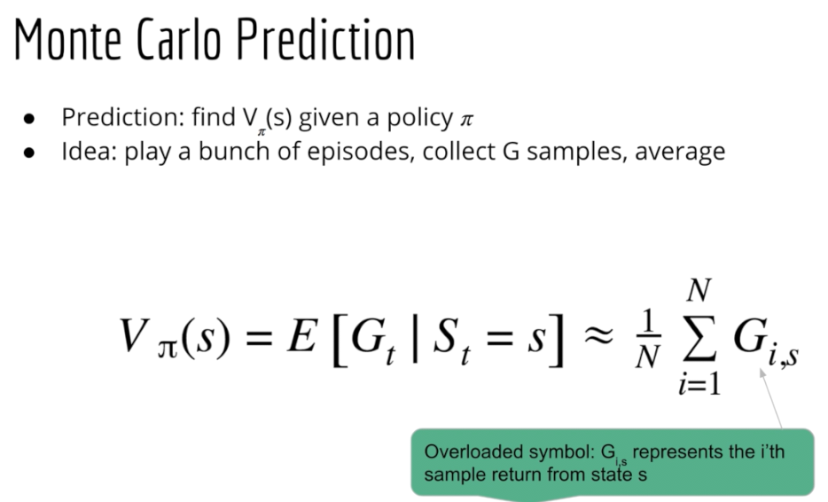

&nbsp;&nbsp;&nbsp;Now, there are several complications to consider. What if we want to know the value of a state not visited by our policy. In this case, we would have no samples and hence no estimate. One solution to this is to simply not compute any value for those states. Since those states are never visited, their values are irrelevant. Another solution to this is to manually put the agents into different starting states.  
For example, in grid world, this would mean not starting in the same position on every episode. Instead, we could choose starting positions at random to ensure that every state will have corresponding sample returns. Note that this doesn't violate our policy because the return `G` is calculated from future rewards, which are all received based on following the policy. Another thing to consider is that if our policy is probabilistic with a non-zero probability of performing every action from every state, then this wouldn't be a problem. Given enough time, we would collect a sufficient number of samples for each state.

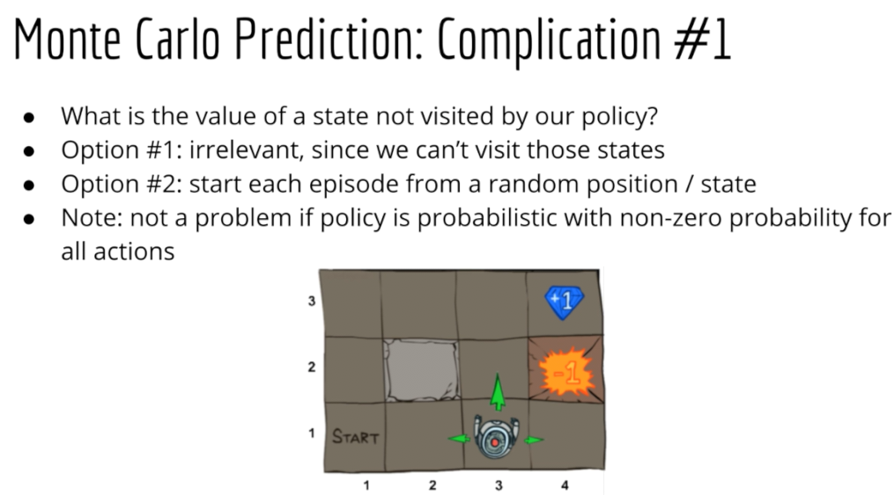

&nbsp;&nbsp;&nbsp;The second complication to consider is this. What if a policy is such that: we encounter the same state  more than once. In this case, what is the return for the state? There are actually two solutions to this problem. Solution number one is to consider the return only for the first time the state was visited. This is called first visit MonteCarlo.  
Solution number two is to consider the return for every time the state was visited. This is called Every Visit Monte Carlo. It turns out that you can prove theoretically that these will both converge to the true answer. They have different convergence properties, but I would consider these details to be outside the scope of this course as they are not helpful for where we are going.

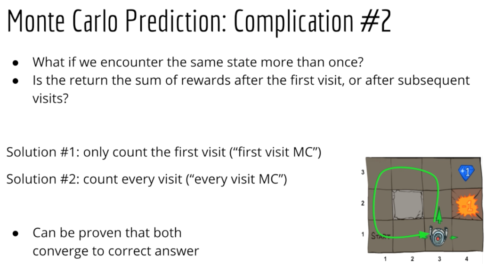

&nbsp;&nbsp;&nbsp;Yet another complication to consider is this. This is somewhat related to the previous issue, which is that we may encounter the same state more than once. So now let's consider the problem where our policy leads to an infinite cycle. For example, suppose in one state the policy is to go left, but then in the state to the left, the policy is to go right. Clearly, this will just lead to going left and right forever.   
The greater issue here is that, what if we have an episode that never ends in this case, MonteCarlo methods do not apply because by definition of the MonteCarlo method, we can only compute the value once we know the return, but we only know the return after the episode is terminated. If the episode does not terminate, then the return cannot be computed and MonteCarlo methods cannot be employed. Practically speaking, when it comes to our environment, we will declare our episode complete when it reaches a certain number of steps.  
For example, we consider a 20 steps or 100 steps to be the end of an episode if we haven't yet reached the terminal state. So even if there is an infinite cycle, the episode will still terminate. Note that while this might seem like a hack, this is not really the case. For example, in other environments like Cartpole and Mountain Car, which are part of openAI GYM, the episodes end after you reach two hundred steps. So this is a completely normal thing to do.

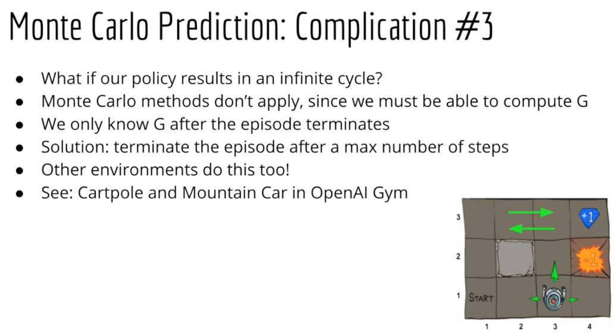

&nbsp;&nbsp;&nbsp;OK, so now that you understand some of the hidden details of the MonteCarlo method, let's consider how this will look like in pseudocode. To start will be given a policy `pi` that we wish to evaluate, to initialize our algorithm. We'll start by initializing our value function to zero and we'll create a dictionary to store all of the returns we've collected for each state. The key for this dictionary will be the state and the value will be a list of returns that we've collected for that state.  
Next ones are a loop that will continue for as many iterations, we think we need to obtain an accurate estimate. Of course, this will depend on how many samples we wish to collect. You might consider evaluating the accuracy using confidence intervals. Inside the loop. We start by playing an episode using the given policy. This will generate a sequence of states and rewards.  
Next, we initialize a variable `G` to zero. This will hold the return for each step of the following loop. Note that because the return is always based on the sum of future rewards, it's more practical to live through our episode backwards and compute the return recursively. The return `G` starts out at zero since the return for the terminal state is zero.  
Next, we live through each timestep of the episode, starting at `T-1`. Note that we do not start at the final timestep `T` because we know that the value for that state will always be zero. So inside this loop, we begin by updating the return `G` using the recursive formula we derived earlier in this course.  
Next, we check whether or not the state of time `t` occurred earlier in the episode. This is when we want to do first visit Monte Carlo. If you want to do every visit Monte Carlo, then this check is not necessary. So only if this state does not appear earlier in the episode do we proceed next, we simply append a `G` to our list of sample returns for the state `S(t)`. And finally, we update `V` of `s` of `T` by taking the average of the returns we've collected so far.

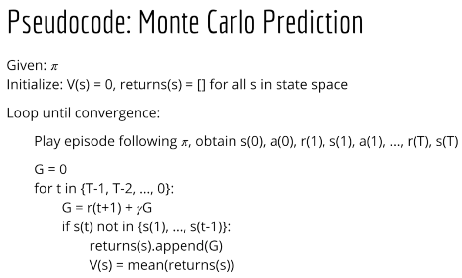

&nbsp;&nbsp;&nbsp;OK, so before we in this lecture, I want to make a small note about one tricky implementation detail. Now, first, before you look at any of the implementations in this course, this is a reminder that your exercise is to implement it from scratch without looking at any preexisting code. Once you've completed the exercise, then you should feel free to look at the solution. In fact, if you haven't yet completed the exercise, you should not listen to the following explanation until you have it probably won't become relevant or even make sense until you've quoted something yourself. So please try to implement the MonteCarlo method yourself and then return to the rest of this lecture.

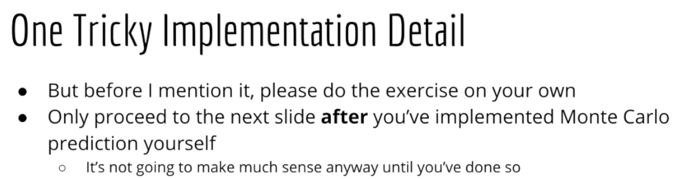

&nbsp;&nbsp;&nbsp;OK, so from this point onward, I'm going to assume you've completed the MonteCarlo exercise, so you have the context to understand what I'm talking about. Basically, the key difficulty in implementing MonteCarlo is keeping track of the time indices.   
Let's begin with a naive implementation of Monte Carlo, where we keep track of every state and reward that we encounter. We start by randomly choosing a state to begin our episode next week, grab the current state and store it in our list of states. We also initialize a list to store our rewards, since we haven't received any rewards yet. It's just an empty list.  
Next, we do a loop that exits when the game is over. Note that I'm ignoring the maximum time steps for simplicity, although in the code you will want to implement that as well. Inside the loop we grab the action according to our policy and perform that move in the environment. We then receive a reward which we appends or lists of rewards. At this point, we can call the current state function again to get the new state and append this to our list of states.

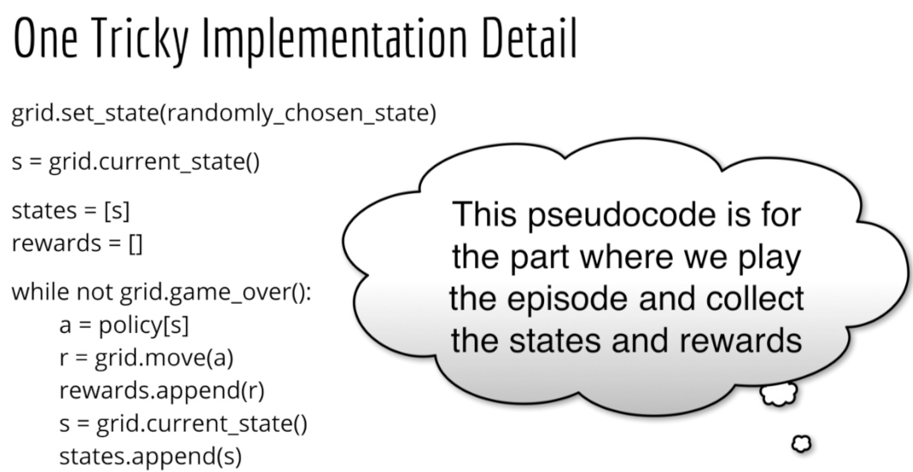

&nbsp;&nbsp;&nbsp;So what's the problem with this? Firstly, notice how the list of states and rewards do not have the same length. When we start the episode, we have an initial state, but there's no such thing as an initial reward. The bigger problem is this. When you index the states list and the rewards list, the index will not refer to the same time step in both lists. This will lead to lots of confusion unless you track things very carefully.  
For example, if you want to have some time index `T`, the states list indexed by `T` does not refer to the same timestep as the rewards list index by `T`. Therefore, using `T` would be very misleading because it doesn't refer to the same timestep in both cases.

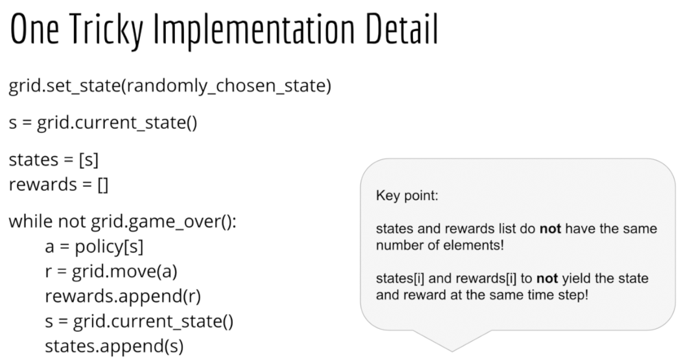

&nbsp;&nbsp;&nbsp;Here's another way to do this that will make things a bit simpler to think about. It's basically a one character change where we add a zero to the initial rewards list. It's equivalent to saying we get a reward of zero at time, zero. Why don't we start the episode, which has no effect except to make the code easier to reason about. Notice that now when we index the states list and the rewards list, the index will correspond to the same time step for both lists. You'll see that in the code this value is never actually used.  
In fact, if you want to go back to the pseudocode we saw previously, you can confirm that this is true even without looking at any code. Furthermore, note that the state of the final timestep `s(T)` is also never used. So one kind of dangerous thing in terms of bugs is if you ignored the first reward and ignored the final state. In that case, both the states list and the rewards list would have the same length, but they would also be off by one in terms of which index corresponds to which timestep. So in my opinion, it's best to add these dummy values that will never be used, but make the time steps line up correctly.

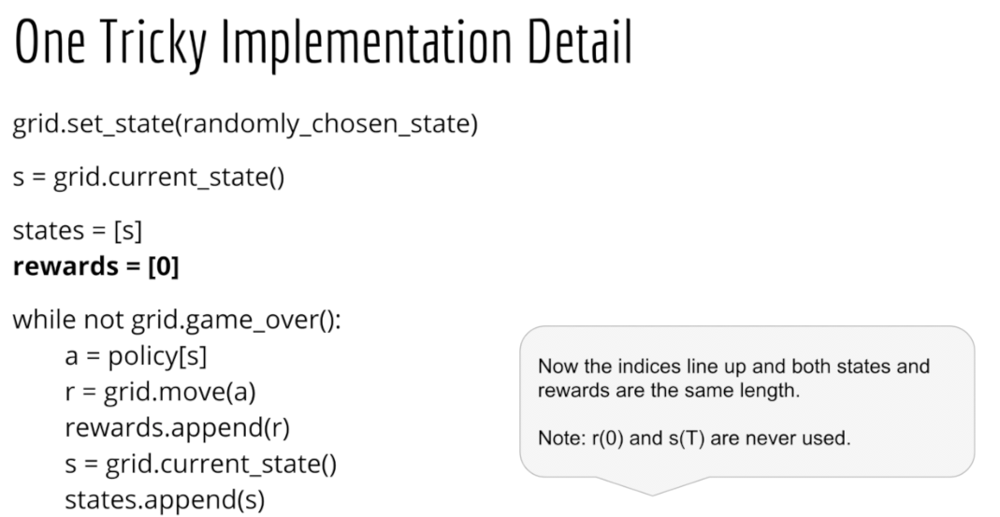

# Monte Carlo Policy Evaluation in Code

&nbsp;&nbsp;&nbsp;So in this lecture, we'll be looking at how to implement MonteCarlo for prediction. We're going to apply the MonteCarlo method to find `V(s)`. So starting from the top, we're going to import standard grid and negative grid. I encourage you to try both of these on your own and try to see if you can predict what the outcome will be. We also import the print values and print policy functions that we wrote earlier, since they still apply here.  
Next, we said Gamma equal to zero point nine. As you recall, this is the discount rate.  

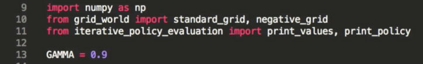

&nbsp;&nbsp;&nbsp;Next, we have a function call to play_game, as mentioned previously, the major new concept in the section is that we are now learning from experience rather than just doing calculations to solve an equation. This function takes in an environment and a policy and plays one episode using the policy. It then returns the sequence of states and rewards that it encountered. There's one extra argument here which defines the maximum number of steps in the episode before we force that determination. Remember that this must be used since if an episode doesn't terminate, then we can't calculate the return. Since the return is the sum of all future rewards and if we can calculate the return, then we don't have any samples from which to estimate `V(s)`. Estimating the `V(s)` thus requires having return samples and therefore episodes need to terminate. Recall that it's possible for episodes of Grid World to be infinitely long in the case where our policy results in a loop.  

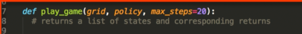

&nbsp;&nbsp;&nbsp;So at the top, we're going to randomly select which state to start it and remember that this is required because if our policy is such that it never visits a state, we will never have any samples for that state and we will never know its value. However, the value is defined by the expected future return, which means that it only depends on future actions.  
So starting randomly in different states is allowable as long as we follow the policy after arriving in that state. To do this, we'll start by grabbing all the possible start states, which can be obtained by accessing the keys of the Grid our actions dictionary. This is basically a list of all the states except the terminal states, since no actions can be taken from the terminal states.  
Next, we select a random index using NP.Random.Choice, which will be used to index this list of states. Finally, we call grid that said state passing in the state corresponding to the index we just randomly selected.  

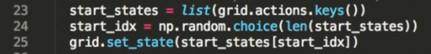

&nbsp;&nbsp;&nbsp;Next is where the function really begins. We start by grabbing the current state and assigning it to a variable called `s` next, we create two lists to store the states and rewards. We store the current state `s` and we insert a placeholder zero for the reward. Technically, this value will never be used. However, if we do not insert this value, our states of rewards will be misaligned, since the indexed to these lists will not correspond to the same timestep. So by inserting a reward, every time we insert a state, we can ensure that the indexes will be aligned correctly.  

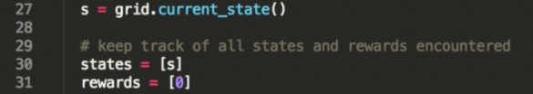

&nbsp;&nbsp;&nbsp;Next, we create a variable called steps, which will keep track of the number of steps we've completed so far. Then we enter a loop that iterates until GameOver is true. Inside the loop, we have the action from a policy given the state `s`, then we perform the action in the environment by calling the move function. From this, we obtain the reward `r`, this also brings us to the next state, So we call the current state function again to get to the next state, which we will call `next s`.  

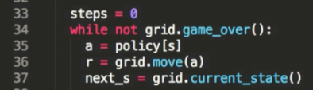

&nbsp;&nbsp;&nbsp;Next, we append the new state and our new reward to our lists of states and rewards to be returned at the end of this function.  
Next, we increment steps by one, then we check whether or not we've reached the maximum number of steps, if we have, then we break out of the loop since the episode is now over. If not, we continue and we assign the next state `next s` to be the current state `s`. Once we're done, we return our list of states and rewards.  

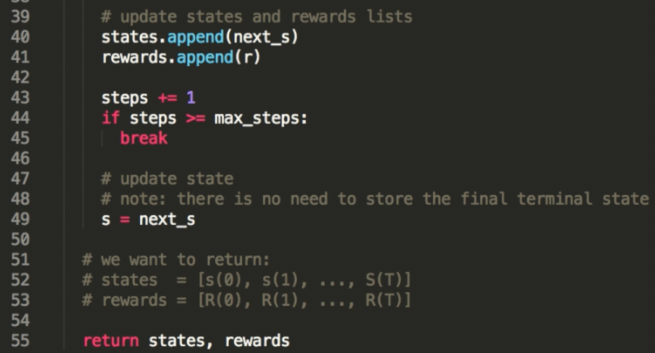

&nbsp;&nbsp;&nbsp;Next, we have the main section of this scripts, what we call the function we just made and run our MonteCarlo algorithm. Inside this block of code. We start by instantiating a standard grid object.  
Next, we print the grid rewards. Doing so will help us sanity check whether our results make sense.  
Next, we declare a policy, there's nothing special about this policy, so you can feel free to make your own policy if you like.  

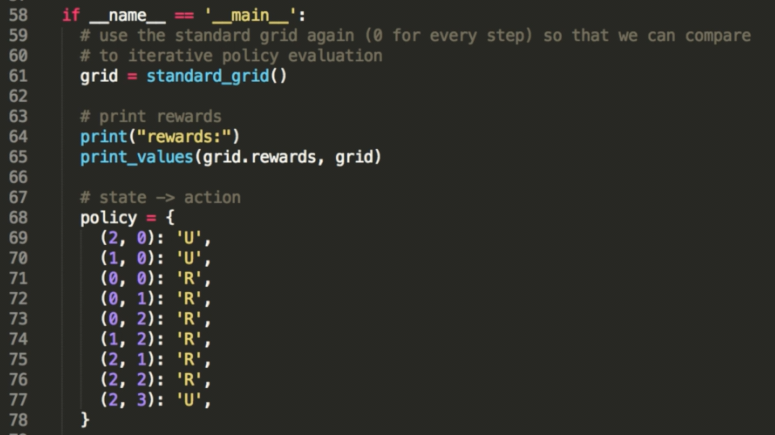

&nbsp;&nbsp;&nbsp;Next, we initialize `V(s)`, and our collection of return samples. To do this will live through every state in our state space inside the loop. We check if the state is a terminal state, if it is not a terminal state. We initialize an empty list for storing our return samples. Otherwise we assign `V[s]` zero since `V[s]` should be zero for terminal states.  

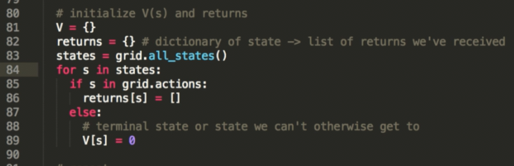

&nbsp;&nbsp;&nbsp;Next, we enter a loop that repeats one hundred times. 100 is just an arbitrary number, and in practice you should choose this based on the behavior of your environment and your code. Inside the loop, we play an episode which gives us back a list of states and a list of rewards.  
Next, we initialize `G` to zero and we set Big T to be the length of the states list.
Technically, the length of the states list is Big T plus one since as you recall, the time index starts from zero and the final time step for the terminal state is big T. However, this is not meant to be the mathematical big T, but rather just a variable for our code.
So when we do our loop, we start at Big T minus two, which is actually the second last state we visited, which is the last state before the terminal state. We don't visit terminal states in this loop since their values do not need to be updated. As you recall, we would like to live through our states and rewards backwards since the return is calculated recursively based on future returns. Note that in each iteration of the loop, we are interested in the state of time t but the reward at times t+1. So that's why the indexes are like what you see here.  
Next, we update the returns `G` using the usual formula.  
Next, we check whether or not the state we are currently seeing appears earlier in the episode. we'll be doing first visit Monte Carlo. So we only want to update `V(s)` if this is the first time we visited us during the episode. So if this is the first time we visited `s`, then we proceed. So here's what we do. We append `G` to our list of returns for the state `s`. Then we re-estimate `V(s)` by taking the mean of all the `G` that we've collected so far.  
Finally, when we're outside the Monte Carlo loop, we print the final values and we print the policy so we can cross-reference it and make sure it corresponds to our values.

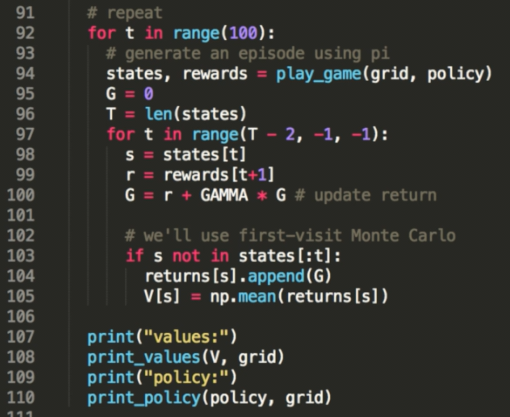

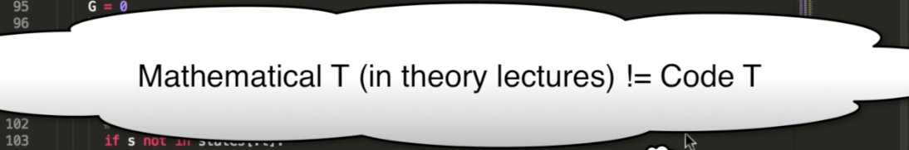

&nbsp;&nbsp;&nbsp;OK, so let's look at the results. All right, so please have a look at these values for yourself and make sure they make sense to you. Basically, you should see that at each step away from the terminal state that we go, the value decreases by a factor of zero point nine, since that is our discount rate. Gamma.

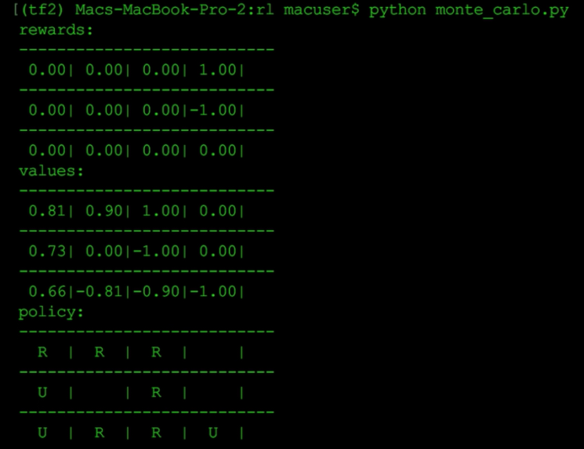

[Code_18_GridWord](../code_files/18_monte_carlo/Gridworld_test.py)
[Code_18](../code_files/18_monte_carlo/monte_carlo_test.py)
[Code_18_Org](../code_files/18_monte_carlo/monte_carlo.py)

# Monte Carlo Control

&nbsp;&nbsp;&nbsp;OK, so we just learn how to solve the addiction problem using Monte Carlo. That is given a policy pi. We learned how to find `Vpi(s)`. As you know, the next question to consider is how do we solve the control problem? That is, how do we find the best policy `pi*`?

&nbsp;&nbsp;&nbsp;Let's take a moment to consider that we actually already have all the tools we need to do this, in the previous section we learned about the concept of policy iteration. This is the idea that if we want to find the best policy, all we need to do is start from a random policy. Then we find that policy's value function. After doing so, we can apply the policy improvement theorem, which allows us to find a better policy given an existing policy and its corresponding value. So it seems like we're pretty much already there.

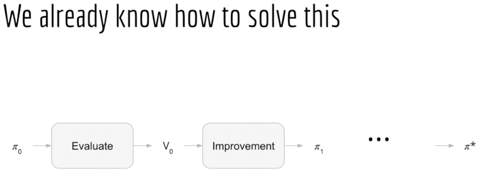

&nbsp;&nbsp;&nbsp;So let's write out some rough pseudocode, so think about how this will work. We'll start with a random policy. We know how to find the value function for this policy, even if we do not know the environment transitions.  
We know that we can just use experience from the environment and apply the MonteCarlo method.  
The next step is the improvement step, where we essentially take the `arg max` of the right hand side of the Bellman equation. This gives us the optimal action for each state. But there's a problem here. You see, the right hand side involves an expected value. We can't compute the expected value because it involves a summation over as `P(s',r | s, a)` and we've established that we do not know this.  
So what can we do?

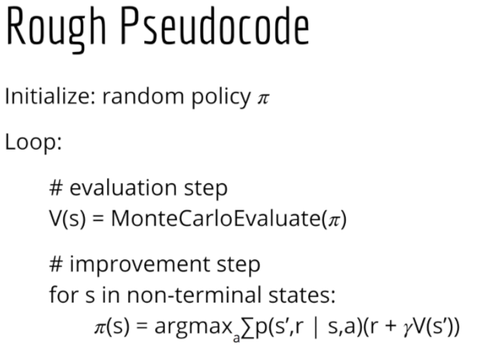

&nbsp;&nbsp;&nbsp;The answer is simple, you recall that the right hand side of the expected value just happens to equal `Q`. If we know `Q` than policy improvement is not a problem. So this should help you understand why for control problems in this course we use `Q` not `V`. The one exception to this is dynamic programming. we are  using `V` makes sense because we can compute that expected value.  
As an exercise, you might want to consider how we might modify the code for solving the prediction problem with `V` to find `Q` instead, that is, how can you solve the previous exercise for `Q` instead of `V`?

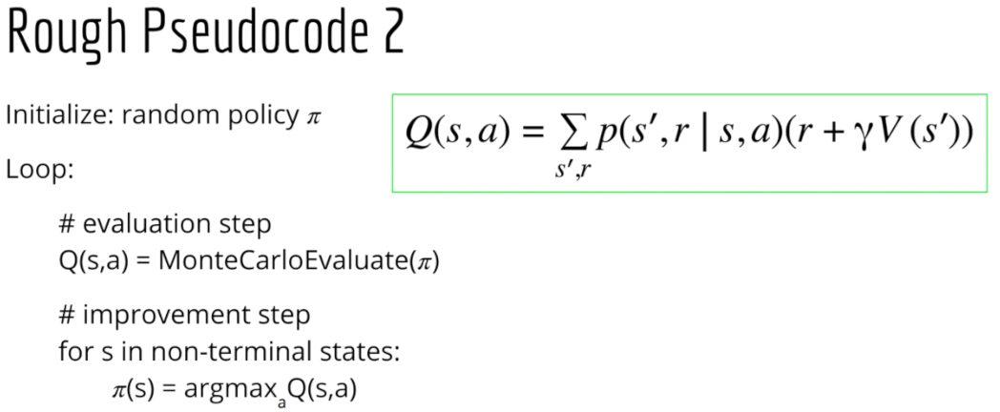

&nbsp;&nbsp;&nbsp;Now, although the strategy we've come up with will work, it's still not ideal, as you recall, there's one downside to policy iteration, which is that it's pretty slow. This slowness gets even worse when you consider that because we need to use sampling, gathering enough experience can take a very long time. Furthermore, because we now need to find `Q` instead of `V`, we need even more samples than before. As you recall, `Q` requires us to estimate  big S * big A values, or as `V` only requires big S values.  
So that's a lot of values to estimate. But we know there's a trick we can use which basically says forget about trying to accurately estimate the value, just combined policy improvement and the value update into a single step and they'll eventually converge to the optimal policy and the optimal value.

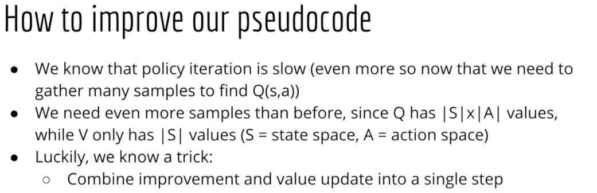

&nbsp;&nbsp;&nbsp;We call this method value iteration.

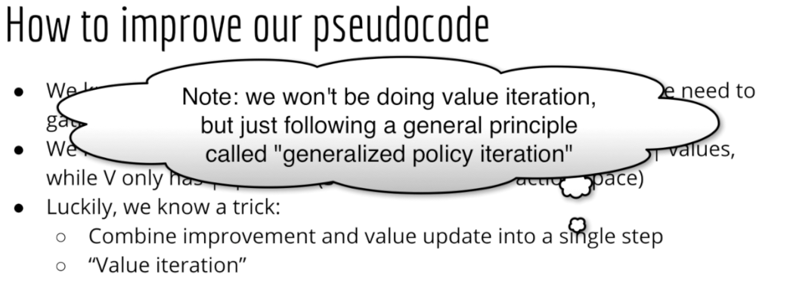

&nbsp;&nbsp;&nbsp;With MonteCarlo, we're going to do something similar. Instead of playing many episodes to accurately estimate `Q`, We'll just play one episode. After playing that one episode, We'll update `Q` with the new returns we received and will run policy improvement on our newly updated `Q`.

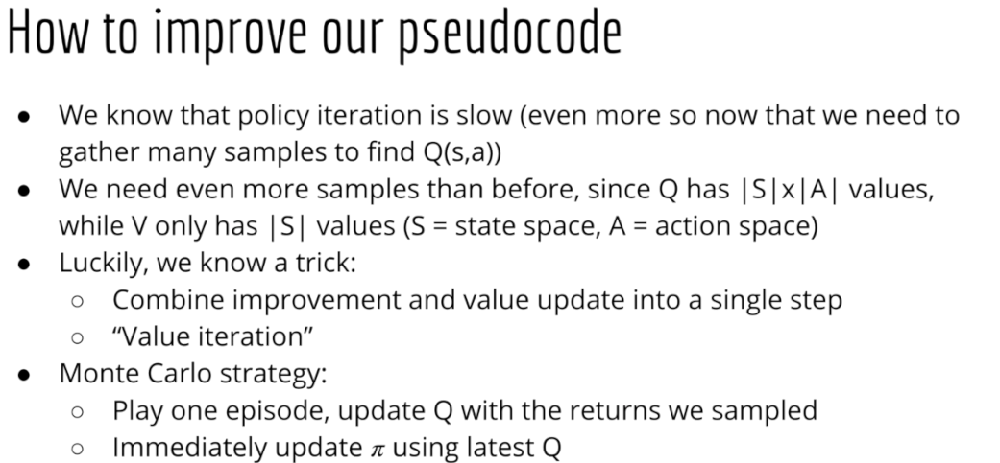

&nbsp;&nbsp;&nbsp;So there's still one problem we have to consider. We know that in order to run policy improvement, we must be able to search through `Q(s,a)` over all actions `a` for  given state `s`. This will tell us the best actions to perform given the state `s`. But this requires that we populate `Q(s,a)` for all possible states and all possible actions.  
Now, why is this a problem?  
Well, suppose that we've just started our algorithm. We follow our policy and obtain samples according to our policy, but our policy only tells us which actions to perform in each state. Therefore, our `G` samples will correspond only to the actions prescribed by our policy. For other actions, we will not have any samples and therefore, taking in `arg max` doesn't make any sense. We can't take an `arg max` over a list of values if we don't know all the values.  
So what's the solution?

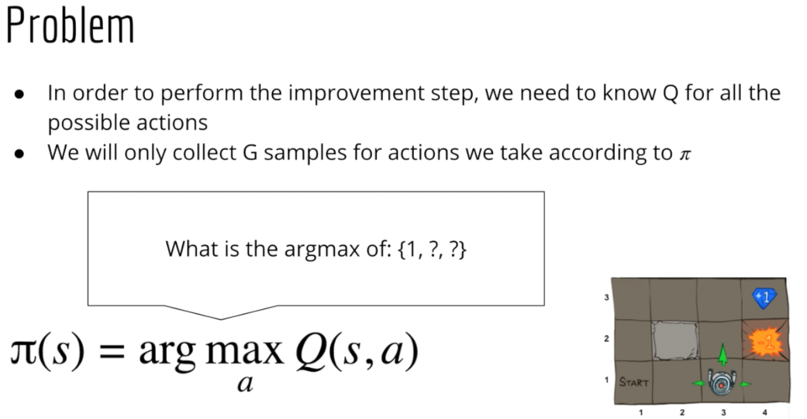

&nbsp;&nbsp;&nbsp;Imagine this, imagine that we start each episode from our randomly selected state and perform a randomly selected action, if you like, picture grid world where you start from a random square each time and you randomly choose left, right, up or down as your initial action. our return for this state and this action will just be the sum of rewards over that episode. Now, if by this random selection we collect enough samples for all states and all actions, then our problem is solved. And of course, since we get to choose these initial states and actions, it'll be pretty easy to make sure that this is the case. We call this method `the exploring starts method`.

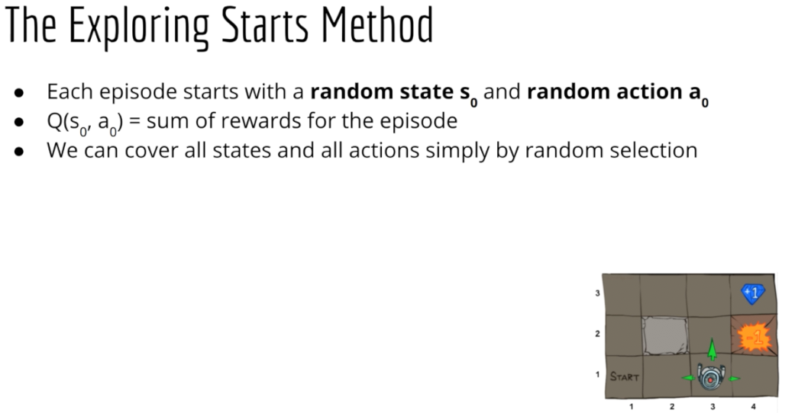

&nbsp;&nbsp;&nbsp;Let's look at some pseudocode so we can see how this will work in detail, so we begin by initializing some random policy `pi` where we assign a random action for each state. Note that this is a deterministic policy. Well, then arbitrarily initialize a Q table. Note that this does not have to correspond to the policy `Pi`. Will also create a data structure that will store the returns that we receive for each state action pair.  
These are the `G` samples. Initially, these will all be empty lists and every time we find a new `G` will appended to the list corresponding to the state action pair it goes with.  
Next, we enter a loop that runs many times. How many times you run this loop depends on the desired accuracy of your MonteCarlo estimate.  
Inside the loop will choose at random and initial starting state as zero, and then initial action is zero, then we'll play an episode starting from `s0`, `a0` following our current policy `pi`. This will give us a sequence of states actions and rewards from our episode.  
Next, we're essentially going to update `Q` using MonteCarlo sampling and then run policy improvement, as you recall, `G` recursively depends on future `G`, so it's easiest to live through that and so backwards. So we'll start by initializing `G` to zero. Then we'll live through each step of the episode, starting at TimeStep, Big T minus one, as you recall, there's no need to update the value of the terminal state because that is always zero. Inside this loop, we update `G` using the usual recursive formula.  
Next, we check whether or not the state action pair `(St, at)` appears anywhere earlier in our episode. Only if this is not the case do we update `Q`. As you recall, we call this `first visit Monte Carlo`. So if it's OK to update, then we happen `G` to our list of returns for the given state action pair.  
Next, we update `Q` by taking the sample mean of the returns we've collected for this state action pair. So this is our `Monte Carlo estimate`.  
Finally, we perform policy improvement by setting `pi(St)` to be the `arg max` of `Q `for the given state over all possible actions.

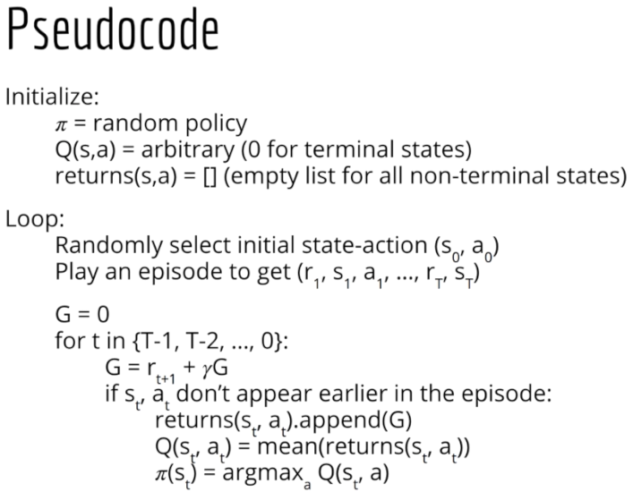

&nbsp;&nbsp;&nbsp;Now, there's one more thing to discuss in this lecture. Note that the algorithm we've presented is not as efficient as it could be. As you recall, you learn that calculating sample means can be inefficient, especially when you have lots of samples. More samples means more things to add up. And this will grow as you collect more and more samples, making each episode a slower and slower to get through. But you've already learned how to improve this calculation.  
I'll leave it up to you to check your notes, to recall exactly how to do that. So for the next exercise, which will be to implement the Monte Carlo exploring starts method, not only should you implement what we discussed, but also consider how to make it more efficient.

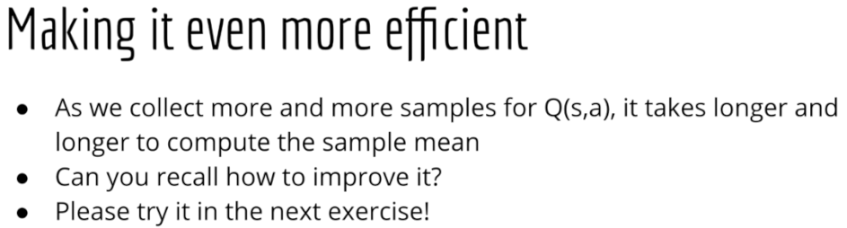

# Monte Carlo Control in Code

&nbsp;&nbsp;&nbsp;In this lecture, we'll be looking at how to implement MonteCarlo for control in code. 

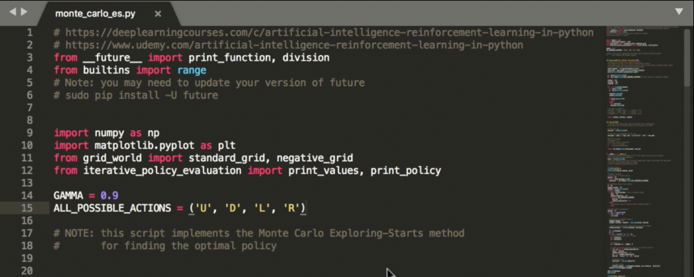

&nbsp;&nbsp;&nbsp;So let's start by looking at the play_game function, since this is where the major new changes begin to take place.  
The first thing you'll notice is that for the control task, we need both states and actions instead of just states. So we start by randomly selecting a starting state and randomly selecting a starting action. This can be done just by calling `np.random.choice` and passing in a list of possible actions.  
Next, we create three lists to store the states, actions and rewards that we encounter. Again and note that the first reward is just a dummy reward that doesn't actually enter our calculations. It's just so that when we index these three lists with the same index, they correspond to the same time.  

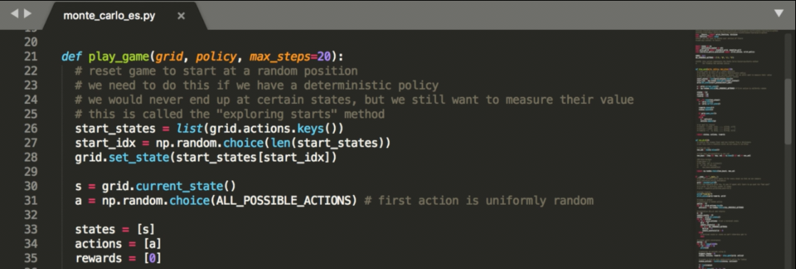

&nbsp;&nbsp;&nbsp;Next, we enter a loop that goes max steps times. Inside the loop, we call the move function using the action `a`. This gives us a new reward `r`, and it moves us to the next state.  
Next, we call the current state function to retrieve the new state. And we call this `s`.  
Next, we append this new reward and this new state to our list of rewards and states.  
Next, we check whether or not our episode is over, if it is, then we break out of the loop. If it's not, then we obtain the next action and append that to our list of actions. Note that because of how we saw the actions, our actions list may end up having one less element at the end, which is fine because we never tried to access it. OK, so when we're done playing the episode, we return our list of states actions and rewards.  

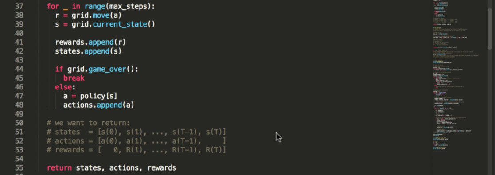

&nbsp;&nbsp;&nbsp;The next step is to write a function called max_dict, so let's discuss why we need this. As you recall, we're using a dictionary to store our Q table, but there's no `arg max` function for dictionaries. Furthermore, and `arg max` function couldn't handle the case with a `arg max`  is actually a set of multiple actions. Therefore, we need to write a function to take care of all this logic.  
So we start by just finding the maximum value stored in the dictionaries values. This is a dictionary where the key is the action in the value is the `Q` value for that action.  
The next step is to find which keys correspond to this maximum value. As you can see, I'm using a list comprehension to do this, but there's a more verbose loop commented out down below. If that makes more sense to you, you should be able to convince yourself that these two pieces of code do the same thing. So max_Keys will be a list containing all the actions that yield the maximum value max_value.  
Finally, we would like to randomly select one of these optimal actions by using `np.random.choice`. We also return the maximum value itself just in case it's needed later in the code. So this function really does both the max and `arg max` operations.  

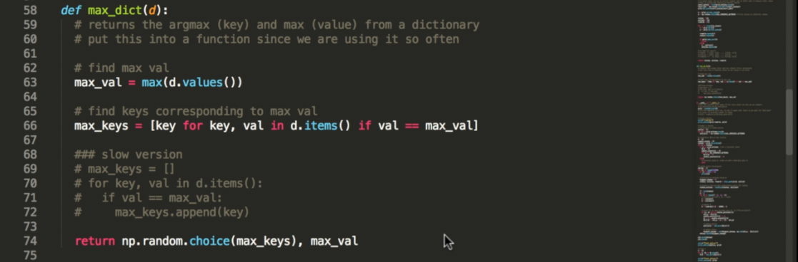

&nbsp;&nbsp;&nbsp;Next, we have the main section where we implement MonteCarlo control. We'll start by instantiating our grid and printing out the rewards, as we've done before. Please feel free to change, which we're using the step cost and so forth.  
Next, we initialize a random policy for each actionable state in the state space. We randomly selected action from a list of all possible actions.  

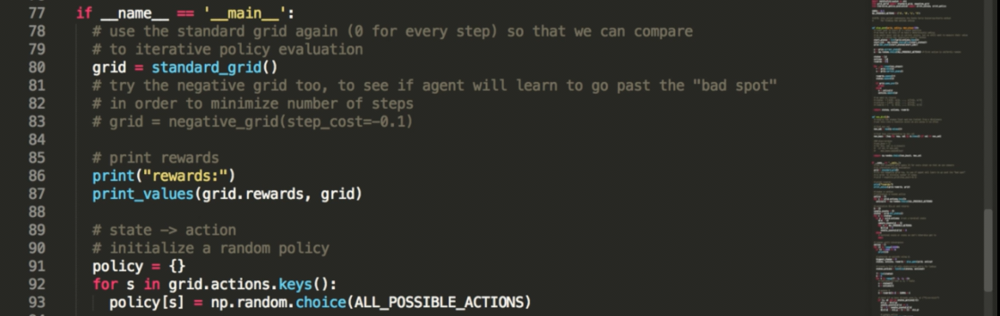

&nbsp;&nbsp;&nbsp;Next, we initialize our  Q table and a dictionary called Sample_Counts, so what is this for? Well, you recall I mentioned that in theory we would like to store all the sample returns and then take their average. However, we also know that this is a slow operation because it requires summing over all the samples we've collected. But we've also learned that we don't have to do this instead. There is a one step update that involves simply computing the new average from the old average, using one new sample and the count of the sample so far. Therefore, instead of storing a list of sample values, we only need to store the counts of the samples.  
Next, we live through all non terminal states and all actions. Inside the first loop, we assign each state its own dictionary. Then in the second loop, we index that dictionary and assign a value of zero for each action. 

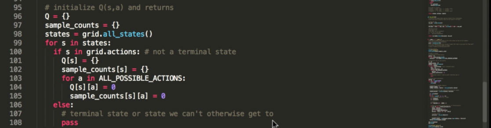

&nbsp;&nbsp;&nbsp;Note that for the Q table the first value is irrelevant since it's erased by the sample mean update.  

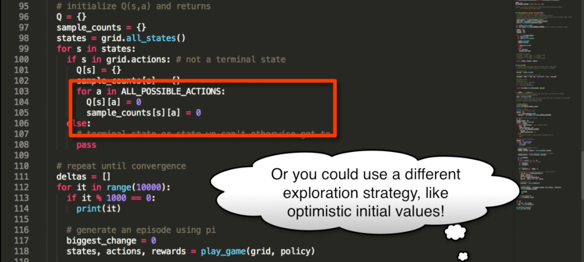

&nbsp;&nbsp;&nbsp;Next, we prepare to enter our main loop. We first create a list called Deltas, where we will store the maximum delta in queue, as we did before. Then we enter a loop where we play some number of episodes. Inside the loop, we initialize, biggest change to zero, and we call the play game function, which returns to us a list of states actions and rewards. Now, as you recall, when we do our update loop, if we want to do first visit Monte Carlo, we can only update the state action pairs that do not appear earlier in the episode. Therefore, we need a data structure where we can actually look up state action pairs. We don't currently have this because the states and actions are separate, but we can make something using our list of states and actions. Specifically, we can use the zip function, which basically turns out two separate lists of states and actions into a single list of state action pairs.  

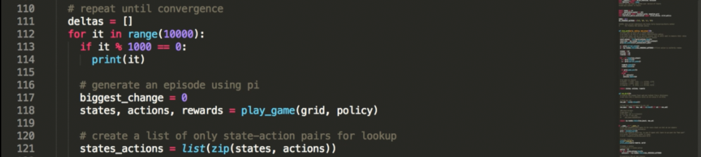

&nbsp;&nbsp;&nbsp;Next, we said big T to be the length of the state's list. Remember that this is not the mathematical big T, but rather just the length of the state's array, which has one extra element more than the episode length. We also initialize `G` to be zero at this point.  
Next, we enter a loop, which again goes in reverse, starting at Big T minus two. This will therefore start at the second last step of the episode, corresponding to the last non terminal State. inside the loop. We obtain the current state and action at time t.  
Next, we update the return `G` using the reward at time T plus one.  
Next, we check whether or not the current state action player appears earlier in the episode, if it does not, we proceed. We first designed the existing value of Q to a variable called old_Q. This is so we can track the maximum delta in our updates.  
Next, we update our sample count for the state action pair.  
Next, we assign a one over the count to be a variable called `lr`, which stands for Learning Rate. Then we update `Q` using the update formula we derived previously.  
Next, we update the policy by the policy improvement process using the max_dict function we wrote earlier. The last thing we do in this block is update the biggest change variable. If the change in our update of `Q` is bigger than the current biggest change, then biggest changes updated to be the current change.  
Next, we go back outside the loop where we append the biggest change to our list of deltas 

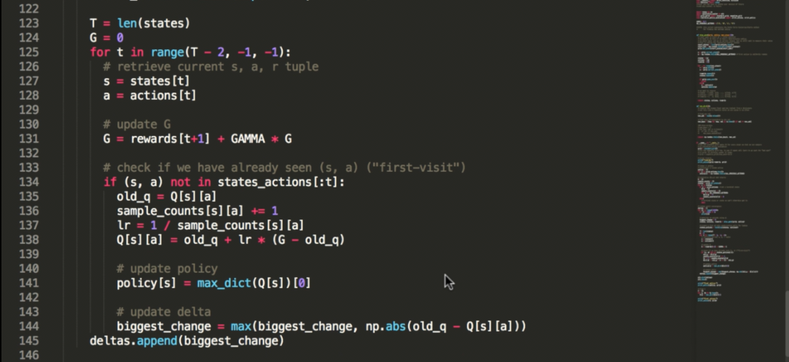

&nbsp;&nbsp;&nbsp;At the next piece of code, We've now finished running all of our episodes. At this point, we can plot our deltas to see how they've changed over time.  
Next, we print the final policy, which is hopefully the optimal policy found by our agent.  
Next, we find `V` by taking the max over `Q` for each state so we can plot the optimal value in each state.

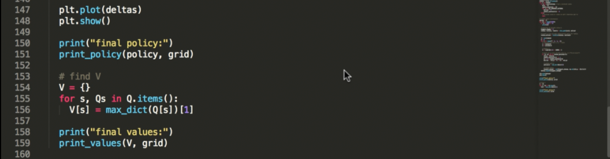

&nbsp;&nbsp;&nbsp;OK, so let's run this and see what we get.  
So here's a plot of the Deltas, over time, we can see that they decrease as our core values converge to the optimal `Q`. And here's our final policy, along with the final optimal `V`, so please have a look at these values yourself and make sure they make sense to you. Basically, you should see that for each step away from the terminal state that we go, the value decreases by a factor of zero point nine, since that is our discount rate Gammer, the agent, has also figured out how to arrive at the goal state from any state on the grid.

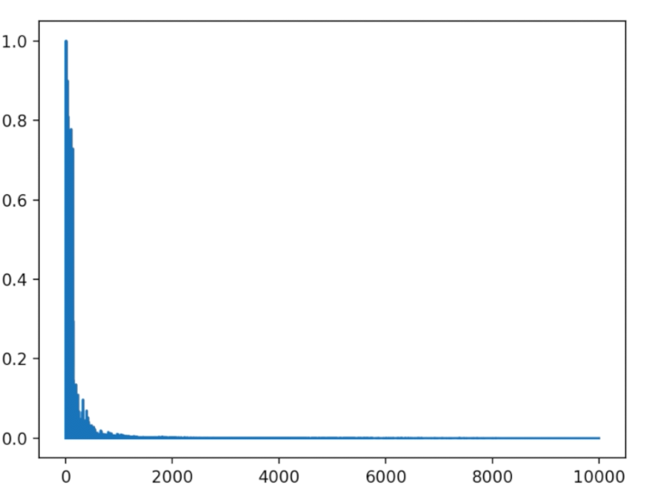

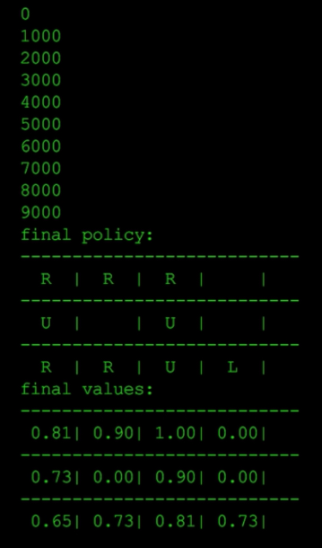

[Code_19](../code_files/19_monte_carlo_es/monte_carlo_es_test.py)
[Code_19_org](../code_files/19_monte_carlo_es/monte_carlo_es.py)

# Monte Carlo Control without Exploring Starts

&nbsp;&nbsp;&nbsp;So although we've just learned how to use Monte Carlo for solving both the prediction problem and the control problem, there is still one small detail to consider. As a quiz question, I want you to think about what is impractical about the Monte Carlo exploring Starts method. I'll give you a minute to think about it.

&nbsp;&nbsp;&nbsp;OK, so hopefully you thought about why MonteCarlo exploit starts might be impractical, the answer is that exploring starts can't always be done in the real world. Imagine, for example, building a self-driving car. It's simply not possible to put your car into all possible states that it could ever be in or imagine something simpler, like a video game. Unless you hack into the video game, you can't just have your characters start in any state that you want.    
The question is then, is there a solution to the problem of exploration that does not require exploring starts? And remember, the reason why we needed this in the first place, it was because we needed to fill up samples for all state action pairs in `Q`. If our policy never tells us to perform action `a` in state `s`, then we will never have any samples for action `a` in state `s`. Without any samples. We don't have any estimate and we cannot choose the optimal action.

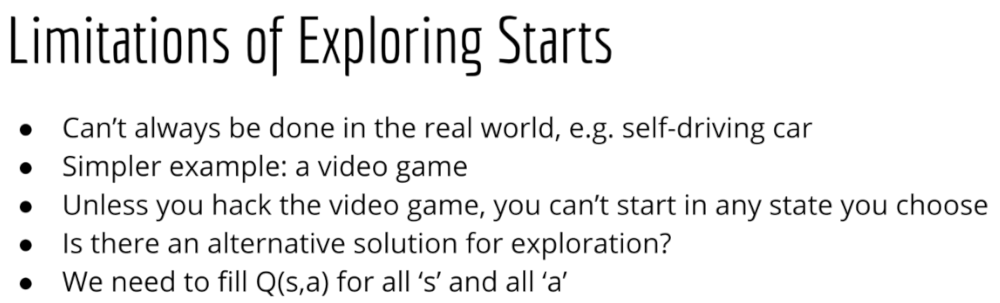

&nbsp;&nbsp;&nbsp;The answer goes back to the classic method of epsilon greedy. Of course, you can employ other methods as well, but this is the traditional solution. So what does the algorithm look like?  
Well, the initialization is essentially the same. The only requirement is that your initial policy gives a non-zero probability to performing each action in every state. For example, a uniform policy or Epsilon greedy policy would both work.  
next we enter a loop for some number of episodes. Inside the Loop, we play a single episode according to the current policy `pi`, and we generate a sequence of states actions and rewards.  
Next, as usual, we initialize our return `G` to zero. Then, as before, we loop through the episode in reverse. Starting at TimeStep Big T minus one. Inside the loop we update `G` using the usual recursive formula. Then we check whether or not the current state action pair `St`, `at` appears earlier in the episode. This is for first visit, Monte Carlo. If it does not appear, then we continue. As before we appends our new `G` samples to our list of returns for this state, action pair.  
Then, as before we update `Q` using the sample mean of the returns we've collected so far for this state action pair.  
Finally, we come to the new part where we find the best action `a*` from `Q` for the given state, but instead of making our policy just to always do action `a*` from the state `st`, we use an epsilon greedy policy. That is to say, our policy is now probabilistic for the action `a*`, we assign the probability one minus Epsilon plus epsilon divided by the size of the action space. For all other actions, we assign the probability epsilon divided by the size of the action space.

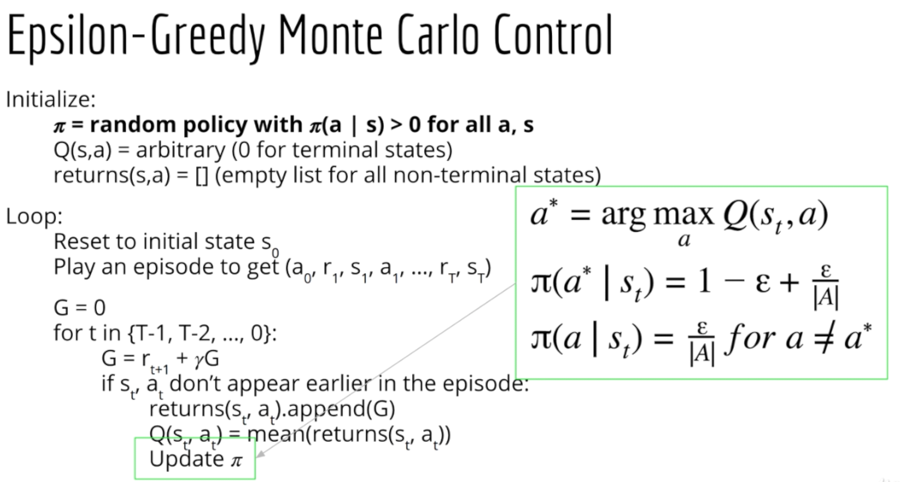

&nbsp;&nbsp;&nbsp;Now, one question you may have is. How does the previous probabilistic policy correspond to Epsilon greedy? I would encourage you to think about this as an exercise by yourself. So here's a computer function that does Epsilon greedy, where with Probability Epsilon, we select an action at random from the action space with uniform probability. Otherwise we choose the optimal action. Prove to yourself that by following this computer program, we equivalently have this mathematical expression for the policy.

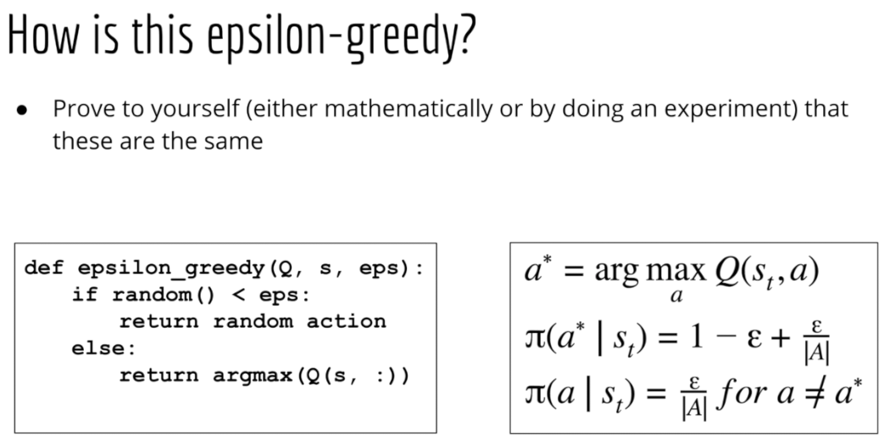

&nbsp;&nbsp;&nbsp;OK, so that's everything you need to know about Monte Carlo without exploding stars, we just learned how to remove the need for exploding starts, which would be impractical in the real world. Please implement this as an exercise and I'll see you in the next lecture.

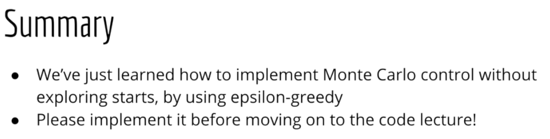

# Monte Carlo Control without Exploring Starts in Code

&nbsp;&nbsp;&nbsp;In this lecture, we'll be implementing Monte Carlo for control, using Epsilon greedy without the need for exploring starts.  

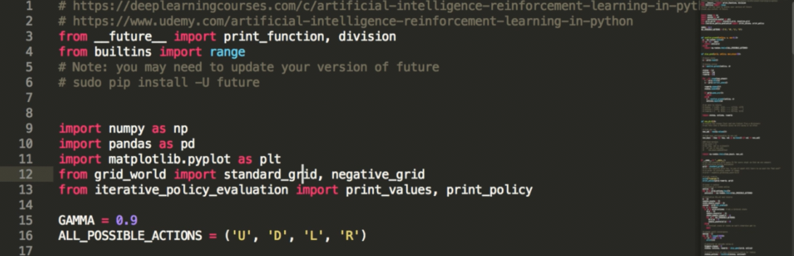

&nbsp;&nbsp;&nbsp;So let's start by looking at the epsilon_greedy function, this takes in a policy, a state `s` and an epsilon whose default value is zero point one. Now, policy is a bit of an incorrect name, since technically our policy is the epsilon greedy policy. So really, the variable policy here refers to the greedy policy. Inside this function, we generate a random number between zero and one. If this random number is less than one minus Epsilon, we return the gritty action. Otherwise we select an action at random. So basically this is the same epsilon greedy that we've seen before.  

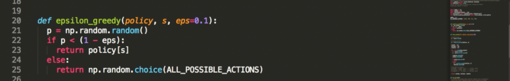

&nbsp;&nbsp;&nbsp;Next, we have the play a game function. So what's different about this? In this case, we always start each episode in the same state, which is the designated star state for our grid world. We can obtain the state simply by calling grid.reset(), which resets our environment.  
Next, we select our initial action using the epsilon_greedy function that defined above. Previously, you recall that this action was selected at random.  
Next, we initialize lists of states actions and rewards. 

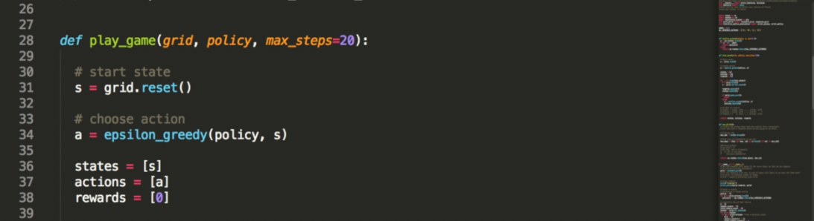

&nbsp;&nbsp;&nbsp;This part is the same as before. In fact, the rest of this function is mostly the same as before. The main difference is that every time we select an action, we do so by using the epsilon greedy policy.This ensures that we have the opportunity to visit all states and all actions eventually.  

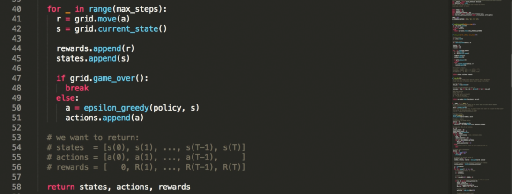

&nbsp;&nbsp;&nbsp;Next, we have our max_dict function, which you've seen before.  

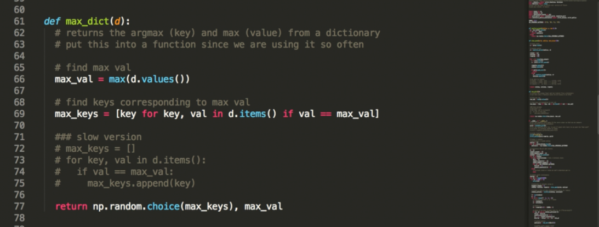

&nbsp;&nbsp;&nbsp;Next, we have the main section. Again, you'll find that this is mostly the same as before. 

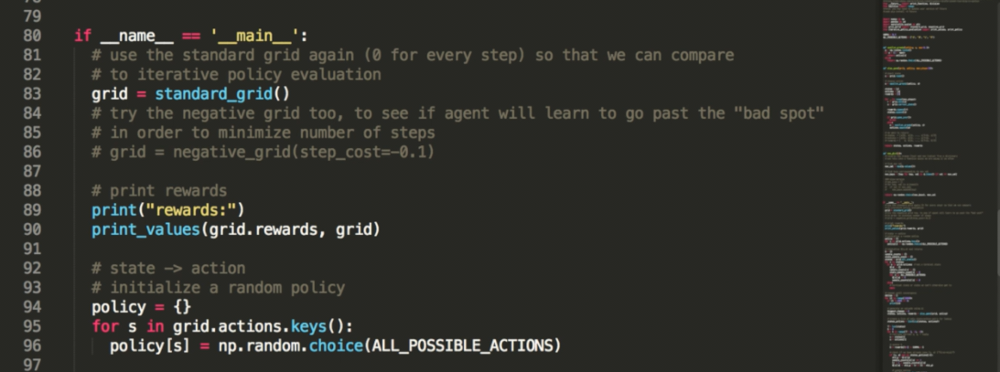

&nbsp;&nbsp;&nbsp;Here's one difference, which is something I've added because it's useful for our understanding. Note that this is not part of MonteCarlo, but just sort of a debugging trick to help us understand what's going on. So previously we kept track of the sample counts for each state action pair. We need this count in order to update the sample mean for `Q` using the previous estimate. Well, in addition to this, we're also now going to keep track of the sample count for each state, only disregarding the action. So this will tell us how many times we visited each state using our epsilon greedy policy.  
So let's scroll down to where this is updated. 

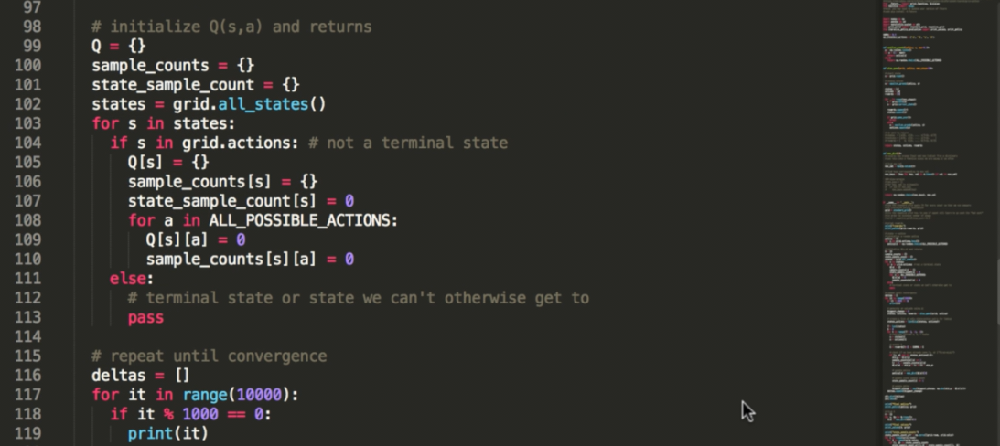

&nbsp;&nbsp;&nbsp;So you can see that in the case we update `Q`, we also update the state sample count for the current state `s`. This gets updated every time we update `Q`, which effectively tells us how many `Q` samples we have for the state. You'll also notice that in the pseudocode, our update for the policy involves assigning probabilities. In practice, this isn't necessary because it's computer code. So all we need to do is find the greedy policy as before. And our Epsilon greedy function can make sure the probabilities are reflected in the way we play our episode.  

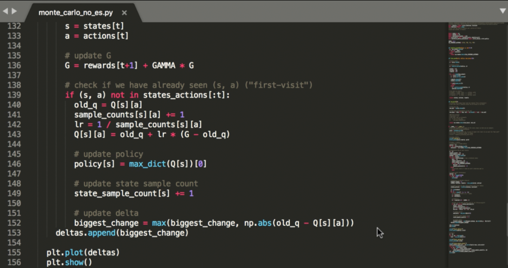

&nbsp;&nbsp;&nbsp;OK, so everything else is essentially the same as before, the new part is at the very end of this script where we now print out the state sample counts, you'll see that there's this somewhat complicated code, which is actually quite simple if you walk through it yourself. Basically, I'm just converting the sample counts to a data frame so that when I print them out, they are formatted automatically. We could use the print value function for this, but you'll notice that if you try this, it doesn't look as nice when you have large numbers, which is what we have since we've collected lots of samples.  
 
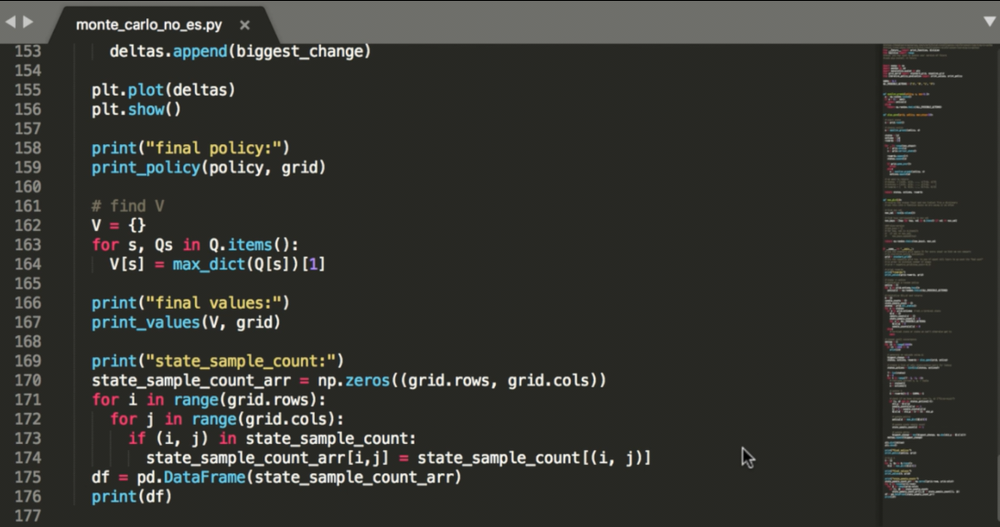

&nbsp;&nbsp;&nbsp;OK, so let's run this and see what we get.  
OK, so the first thing you'll notice is that, the plot of Delta over time doesn't decreases nicely as before. This means that our algorithm is still making larger updates as time goes on. So let's consider why that might be.  
So if we look at our policy, we see that it makes sense, our agents is capable of getting to the goal from any state on the grid. However, you'll notice that the policy and the values are not the same as what we got before.  
So how did this happen?  
Well, looking at the sample counts for each state explains why. We can see that our agent prefers to go up from the start day because of this. We have lots of samples for the path, so along the left edge and the top edge. But in the bottom right area, we have very few samples. This is because our policy dictates that we should not go here. The only time we end up going this way is if we randomly choose to do to Epsilon greedy. We can see that as we go further and further away from what the policy dictates, the number of samples we collect gets smaller and smaller. Therefore, we cannot expect the value function to be accurate for those states as an exercise. Try to think about why the probability of visiting states away from the policy decreases exponentially the further away you go.

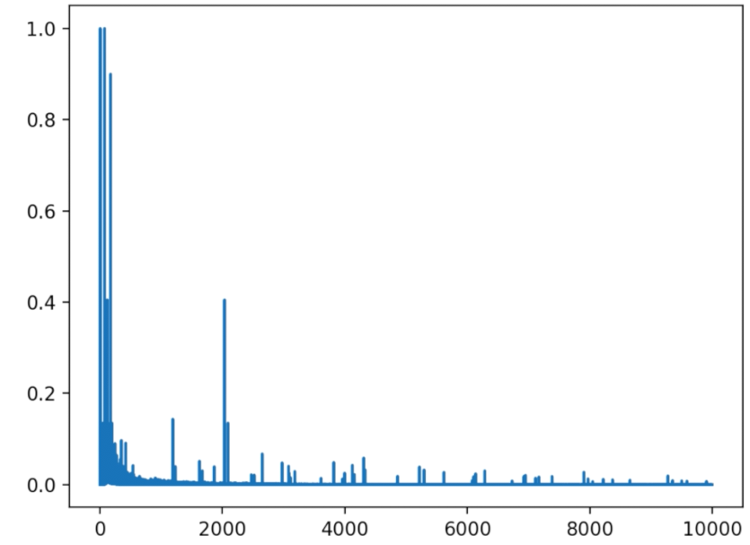

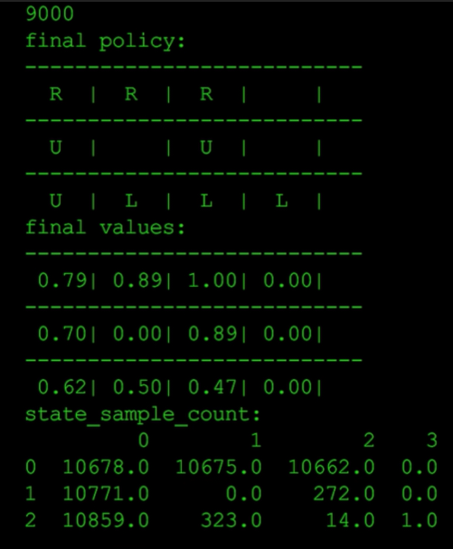

[Code)20_GridWord](../code_files/20_monte_carlo_no_es/Gridworld_test.py)
[Code_20](../code_files/20_monte_carlo_no_es/monte_carlo_no_es_test.py)
[Code_20_org](../code_files/20_monte_carlo_no_es/monte_carlo_no_es.py)

# Monte Carlo Summary

&nbsp;&nbsp;&nbsp;In this lecture, we'll be summarizing everything we learned in the section. This section was all about the Monte Carlo method. The section represented an important step in our study of reinforcement learning. In the previous sections, all of our work was theoretical.  
We didn't create any actual agents that would play games in an environment. Our agents didn't learn from experience. This section was the transition to the practical world where we did program an agent to produce and learn from experience. So this was an important step.

&nbsp;&nbsp;&nbsp;The main idea behind this section is actually pretty simple, it all goes back to the warm up where we talked about how to estimate expected values, since we don't know the probability distribution that this expected value is being taken with respect to, we can't compute it directly. However, we can collect samples by playing many episodes. Put simply, we estimate the expected value with the sample mean.

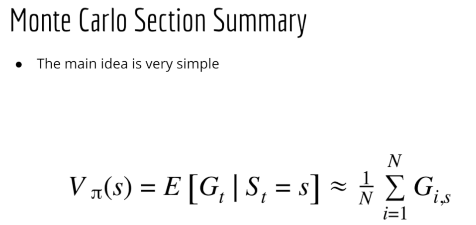

&nbsp;&nbsp;&nbsp;Along the way, you learned several important concepts. Firstly, you learn how the concept of policy iteration is applied in the context of sample based learning methods, although the version of policy iteration that we studied before would be possible, it was also not practical. We also learned why it's necessary to estimate `Q` rather than `V` when it comes to control. Lastly, we rediscovered the need for exploration and how Epsilon Greedy can be applied to serve that need.

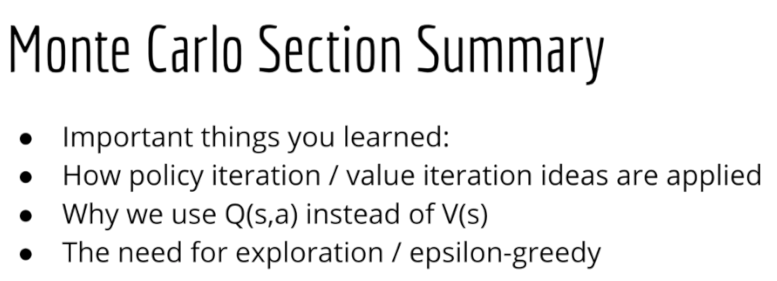

