# Temporal Difference Introduction

&nbsp;&nbsp;&nbsp;In this lecture, we're going to move on to the next section of the course, which is all about temporal difference learning, so it's always good to recap what we've done so far in order to have a better understanding of where we are going next.  
You'll see that with each section of this course, we're going to peel back more and more layers, which allows us to handle more complex problems with more sophisticated techniques. So in the last few sections, we've established the framework to be used for solving reinforcement learning problems. This is the MDP. We learned about how the agent uses rewards that it gets from the environment in order to learn how to act such that its future rewards will be maximized.  
In the dynamic programming section, we learn about how to solve both prediction and control when the environment dynamics are known. When this is the case, there is no need to actually play any episodes since a model of the environment allows us to find the optimal policy directly using bellman's equations. In the MonteCarlo section, we removed this restriction. Without any model of the environment. Playing episodes and gaining experience is necessary. You saw that the main principle behind the Monte Carlo method is pretty simple. Just replace the expected value of the return with the sample mean of actual returns.  
Now there were obviously some details we had to contend with, but the main idea itself was not very complex.

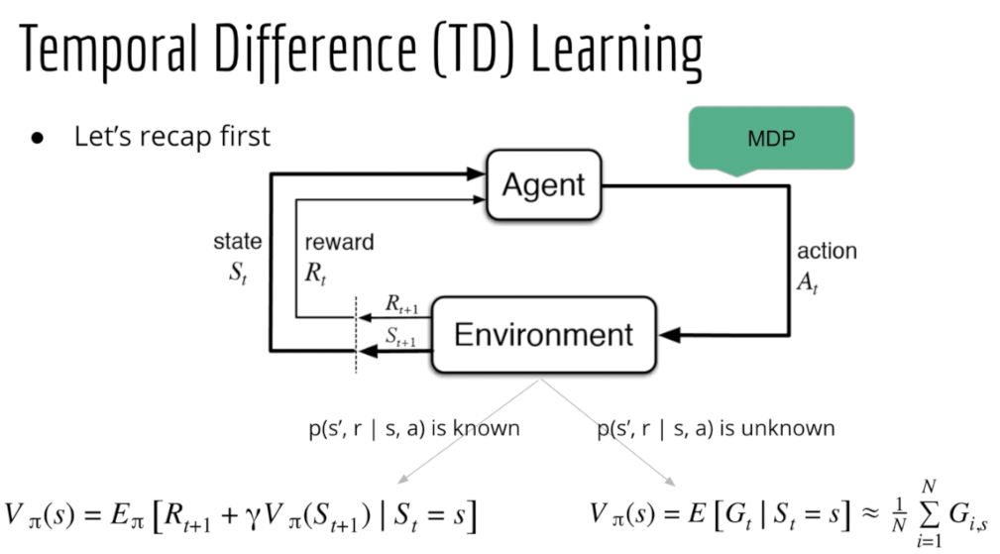

&nbsp;&nbsp;&nbsp;In this section will progress to a few new ideas. One question whose answer is not clear is. What if you have an environment such that episodes never end? You'll recall that from Monte Carlo to work, we require episodes to terminate so that the return can be computed.  
We'll see how TD learning can tackle this problem. Another way to view what we'll be doing in this section is this. Recall that dynamic programming uses a technique called bootstrapping, at each step of our algorithm, the value estimate is improved by iterating on the previous estimate. Specifically, the new value that each state is estimated by using the current value at all, the possible next states. That is the new `V(s)` is improved by using all the current `V(s')`. On the other hand, MonteCarlo does not make use of this technique. Instead, it learns purely from samples taking the sample mean of all the returns it's seen so far. in this section, you'll see that temporal difference. Learning borrows ideas from both of these techniques. Temporal Difference Learning is a sample based method, so it uses samples from the environment to improve its estimate. But at the same time, it's also a bootstrapping method. You'll see how we make use of our estimates of `V(s')` in order to update `V(s)`.

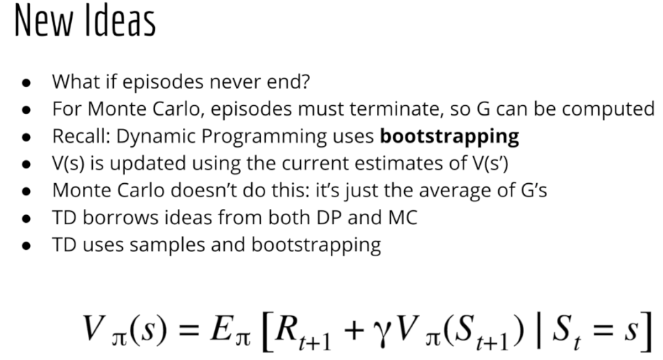

&nbsp;&nbsp;&nbsp;So as before, this section will proceed it using the same basic outline, first, we'll discuss how the TD principle can be applied to the prediction task. Once we understand the basics of how it works, we can then apply it to the control task. As with MonteCarlo, there are two variants of TD learning that we'll discuss in this course. Now there are actually more that exist, but the two in this course are what I would consider to be the most fundamental. The first one we're looking at is called `SARSA`, and the second one we'll look at is the famous `Q_learning` technique.  
So I hope you're excited about finally learning to implement these classic reinforcement learning algorithms. Thanks for listening and I'll see you in the next lecture.

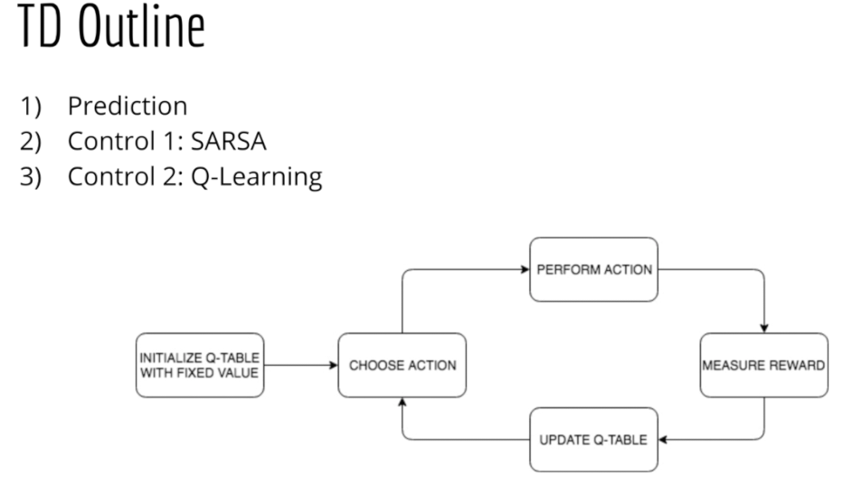

# TD(0) Prediction

&nbsp;&nbsp;&nbsp;In this lecture, we're going to look at how to apply to learning to prediction. As you recall, The problem is given a policy `pi` we would like to find the `Vpi(s)`. So the best place to begin is where we left off with using MonteCarlo methods. Using the MonteCarlo method, We know that what we would like to estimate is the expected return from a given state `s`. We do this by collecting lots of sample returns and then averaging those returns to get our estimate. Now, if you did the exercise from the previous section, you will remember that in the implementation we didn't use this exact formula to calculate the sample mean. That is, we didn't just sum up all the samples and divide by the number of samples.  
You'll recall that this is an inefficient computation because as we collect more and more samples, this takes longer and longer. Instead, we learn that we could replace this computation with the one step computation based on the previous estimate.

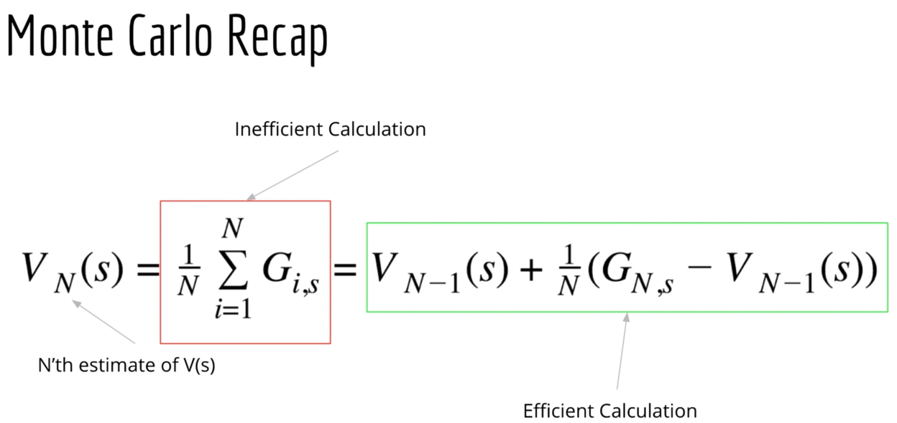

&nbsp;&nbsp;&nbsp;One simple modification we can make to the Monte Carlo update is this. Recall that if our targets are non stationary, then using a constant learning rate, Alpha results in an exponentially weighted moving average.  
In fact, it would be quite easy to modify our previous Monte Carlo scripts to use a constant alpha instead. So in this assignment, I've removed the `N` subscripts for simplicity and I've replaced one over `N` with  alpha which denotes a constant. `G` represents the latest sample. On the right hand side `V(s)` represents the existing estimate for `V(s)` and on the left hand side, `V(s)` represents our new estimate for `V(s)`.

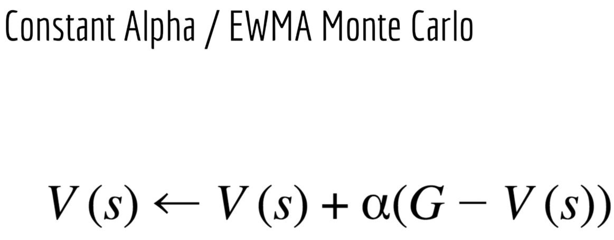

&nbsp;&nbsp;&nbsp;Let's consider another piece of the puzzle, the Bellman equation. It states there, the value function can be expressed in terms of an expected value of the next state value functions instead of the return. The Monte Carlo method did not make use of this equation, but temporal difference learning will.

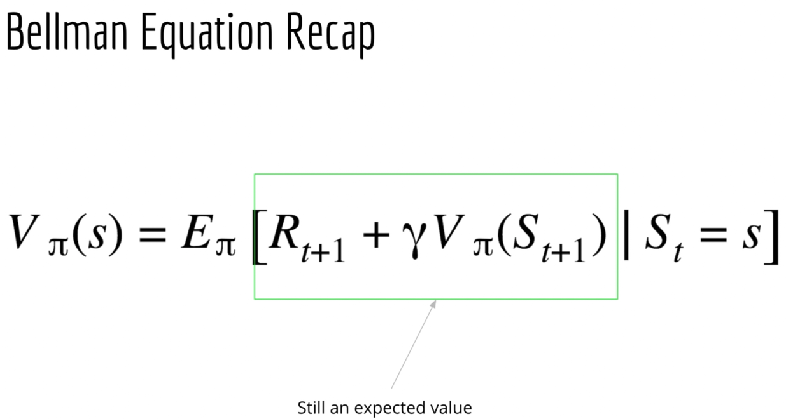

&nbsp;&nbsp;&nbsp;So what is temporal difference learning? temporal difference learning is simply to combine these two things together. Instead of trying to compute the average of all the sample `G`, let's compute the average of `R` + `gamma` * `V(s')`. The important thing to notice about this is that unlike MonteCarlo, this does not require us to know `G`. This means we do not have to wait until the episode is over to make an update. This can be helpful in cases where episodes are very long or even infinite.  
In effect, the agent can learn as it goes as long as it has one reward, it can perform. This update also recognize the use of bootstrapping effectively The target value, which is `R` + `gamma` * `V(s')` depends on the value function estimate at the next state `s'`.  
In other words, your estimate of `V(s)` depends on another estimate. The target is really composed of two parts, the part that we know for sure and the part we have to guess. The reward `R` is the part we know for sure. The future rewards. We don't know yet. So we have to guess. And of course, our guess for that is `V(s')`.  
Now, luckily, despite the fact that we no longer use the full return, this has been proven to still converge to the correct answer.

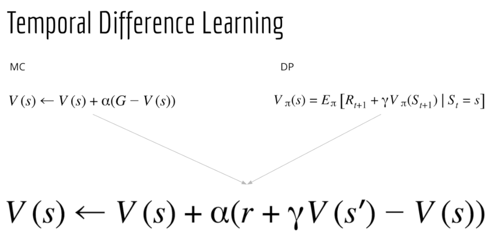

&nbsp;&nbsp;&nbsp;So here's the full pseudocode for temporal difference prediction, one of the major changes going from MonteCarlo to temporal difference learning is that there is no need to play an entire episode to collect a list of states and rewards. Instead, we can recognize their temporal difference Learning, only requires a single step before making an update. Specifically, the value for state `s` depends only on the results of the reward `R` and the next state `s'`.  
So to begin, we accept as input some policy `pi` whose value function we want to find.  
Next, we initialize `V(s)` arbitrarily, except for the terminal states where we already know that `V(s)` is equal to zero.  
Next, we enter a loop that goes for some number of episodes. Inside this loop, we reset our environment and begin a new episode, add some state `s`. 
Next, we enter another loop that goes on until the episode is complete. Inside the second loop, We look at a policy to determine the next actions that perform, given the state `s`. We perform this action Which brings us to the next state `s'` and yields the reward `R`. next, We update `V(s)` using the temporal difference update you saw earlier.  
Next, we update the `s` variable to be `s'` since that is now the current state.  
OK, so pretty simple algorithm. Again, note how there is no distinct function for playing an episode. Both episode playing and a value function updates are part of the same loop.

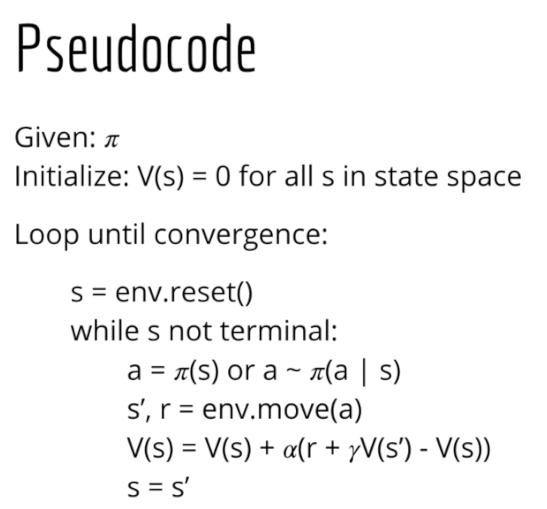

# TD(0) Prediction in Code

&nbsp;&nbsp;&nbsp;In this lecture, we'll be looking at how to implement TD prediction in code. You'll notice that the filename here is td0_prediction. This is because it's possible to generalize the concept of temporal difference learning to something called td_Lambda. td0 is a special case of that, and it's the one we've just learned about. So to start, we're going to import numpy, matplotlib, some grid environments and some useful printing functions that we wrote earlier.  
Next, we define some constants, which I'm sure you've seen before. Note that Alpha here refers to the learning rate in the update equation.  

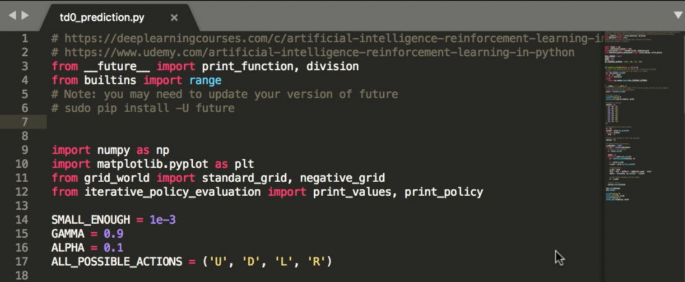

&nbsp;&nbsp;&nbsp;Next, we have a function called the Epsilon_Greedy. This takes as input a policy dictionary, a state `s` and epsilon. As before, The variable policy is really misnamed. More specifically, it refers to the greedy policy from which we create the epsilon greedy policy. In any case, this function should look familiar to you by now.  

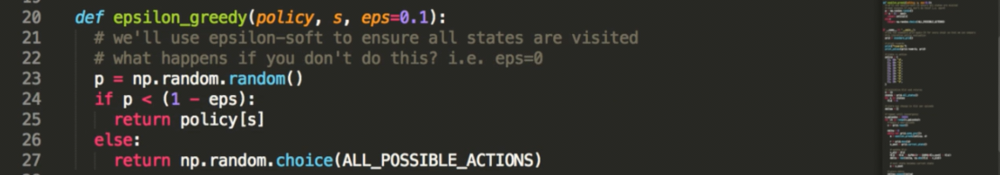

&nbsp;&nbsp;&nbsp;Next, we have the main section of this script. We start by initializing a standard grid environment.  
Next, we print the rewards so that it's easier to sanity check our Solution when it's printed out.  
Next, we declare a greedy policy. Feel free to change this, to test out different policies.  

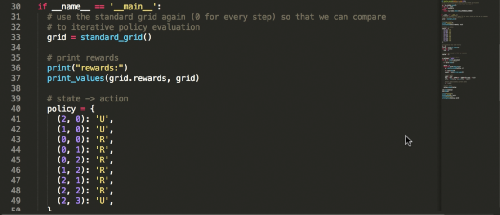

&nbsp;&nbsp;&nbsp;Next, we initialize `V(s)` by looping through all the states in our state space and setting the value of those states to be zero.  
Next, we create an empty list to store a Deltas for each episode. This will be the maximum change in `V(s)` over each episode, which is a bit different from before, but the same principle applies. We just want to observe how `V(s)` changes as we learn the value.  
Next, we do a loop n_episodes times. In this case n_episodes is ten thousand. Inside the loop, We begin a new episode by calling Grid.Reset(). This gives us back our initial state, which we call `s`.  

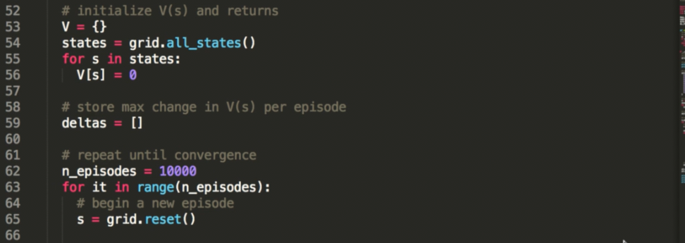

&nbsp;&nbsp;&nbsp;Next, we initialized Delta to zero.  
Next, we enter a loop that exits only when game over is true. Inside this loop, we use our epsilon greedy function to obtain an action that we call `a`. Next we call grid.move() to perform the action `a` in our environment. This gives us back our reward `R`. we can then call grid.current_state() to get the next state, s_next.  
The next step is to update `V(s)`. First we store the existing value in v_old, then we apply our update formula, which you learned about in the theory lecture. Once we found the new `V(s)`, we can then find the difference between the new value and the old value to update Delta.  
Once that's done, we can assign s_next to `s` for the next iteration of the loop. Once we complete the inner loop, we can append Delta to our list of Deltas, which represents the maximum change in `V(s)` over the episode.  

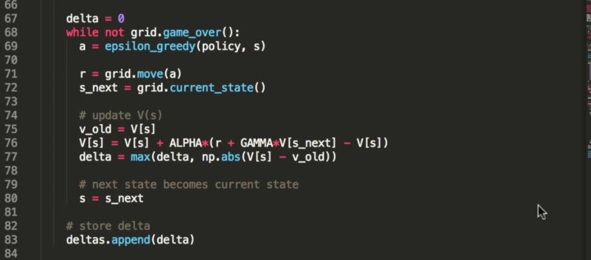

&nbsp;&nbsp;&nbsp;Finally, when we're finished running through all the episodes, we can plot a list of deltas to see how they change. We can also print our final value function and the corresponding policy.

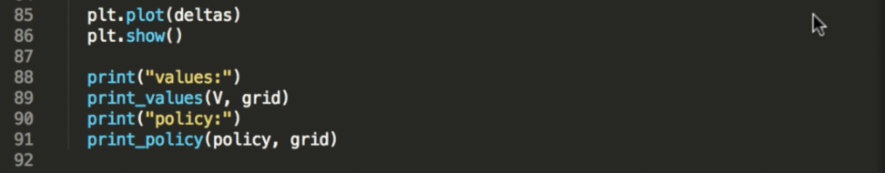

&nbsp;&nbsp;&nbsp;OK, so let's run this and see what we get.  
So one interesting thing you'll notice is that the Deltas do not decrease over time, as they did before. One reason this is the case is there are learning rate is now constant rather than decreasing with each sample as before.

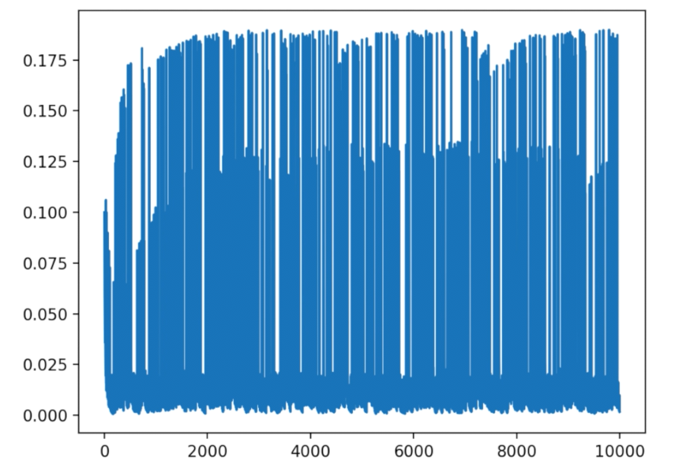

&nbsp;&nbsp;&nbsp;Another thing to keep in mind is the accuracy of our value function estimate because we're using epsilon greedy. There are some states here which will be visited only very rarely. This means that we have less opportunity to collect samples and hence those values will be less accurate. You'll recall that we encountered the same issue with Monte Carlo, however, because the value function for other states depends on the value function for those states. This inaccuracy can propagate.  
One thing you might want to try in order to test how accurate this is, is to run dynamic programming, which essentially finds the exact solution. You can also do what we did before, where we counted how many times we were able to visit each state on the grid.

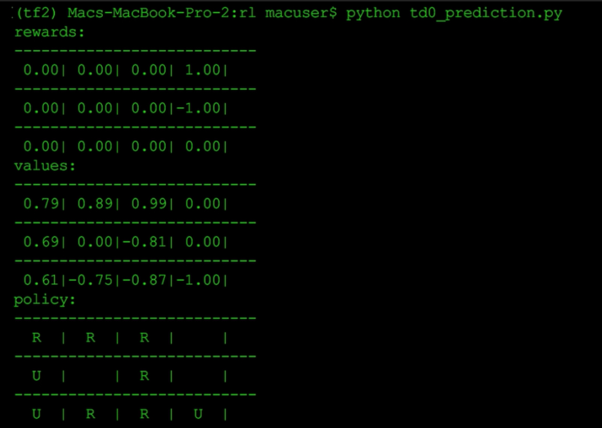

[Code_21](../code_files/21_td0_prediction/td0_prediction_test.py)

[Code_21_Org](../code_files/21_td0_prediction/td0_prediction.py)

# SARSA

&nbsp;&nbsp;&nbsp;So in the previous lectures, we learned how to apply temporal difference learning. As you come to expect, the next step is now to apply this principle to control. So how can this be done?  
The first method we're going to discuss is SARSA. How it works is essentially embedded in his name. Clearly, the letters SARSA correspond to the states actions and rewards that we encounter while we play an episode. Suppose that we are in state `s`, Then we use our current policy to obtain the action we should perform, which we call `a.` Then we perform that action, This brings us to the next state `s'`. We also obtain a corresponding reward `r` at the same time. Given the next state as prime, we can use our policy again to determine the next action `a'`. So this gives us a SARSA tuple from which we can derive our value update.

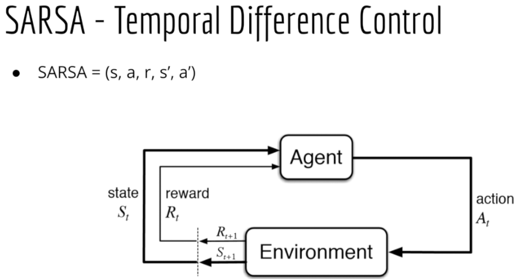

&nbsp;&nbsp;&nbsp;So as you recall from the MonteCarlo section, when we're doing prediction, it's OK to use `V`. But when it comes to control, we need to use `Q`. This is because the optimal action will need to be derived from `Q` and not `V`. If we use `V`, then we would need to compute an expected value in order to know the optimal action which can't be found since we don't know the environment dynamics. Otherwise, notice that this is essentially the `Q` version of temporal difference prediction for the value function.

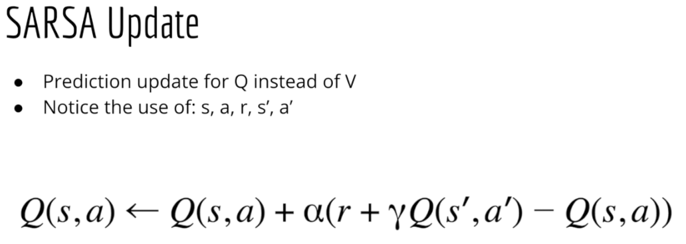

&nbsp;&nbsp;&nbsp;So what makes this different from prediction? how is this a control algorithm? Well, when it comes time to determine which actions to perform instead of following some given policy, we're always going to take the `arg max` over `Q(s,a)`. That is to say, we'll use our most recent estimate of `Q` to determine the best action to take

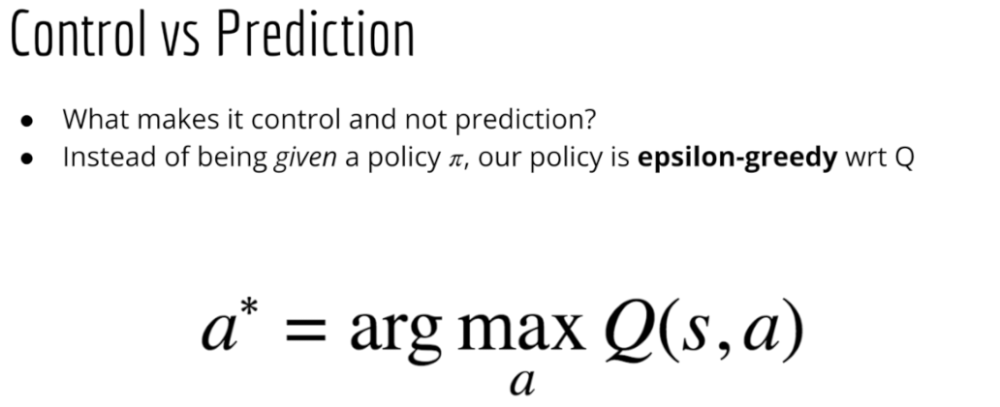

&nbsp;&nbsp;&nbsp;as `Q` approaches `Q*`, both the value function and corresponding policy will approach their optimal values. One thing to remember, is that we don't always perform the action `a*`. This is because, as we've learned several times in this course, we need exploration. Exploration is required because that's what allows us to have an accurate estimate for `Q`. By using Epsilon greedy, we can ensure that once in a while we choose a random action which helps us make `Q` more accurate for all states and all actions. But most of the time we perform the greedy action to obtain the best return.

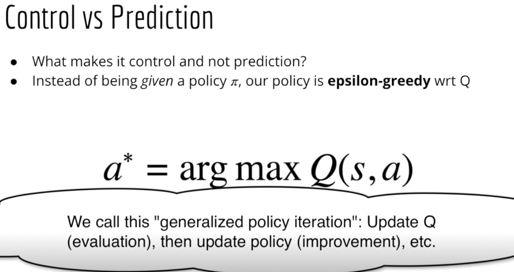

&nbsp;&nbsp;&nbsp;So let's now look at the pseudocode for SARSA. As you can see, it's quite short and it also contains one of the major features we saw with temporal difference prediction. This was that playing the episode and updating the value now appear in the same loop. This is unlike Monte Carlo, where we had a separate function to play the episode and update of the value only after the episode was complete.  
So in SARSA recognize that there's no need to initialize any random policy. Instead, we just need to randomly initialize `Q` because our policy is always derived from `Q`. Note that the terminal states should still have `Q`values equal to zero.  
Next, we enter a loop which will go for however many episodes we want to play. Inside the loop, we reset our environment and obtain our initial estimate.  
Next, we choose an action based on the current value stored in `Q` and the current state `s`.  
Next, we enter a loop that exits when the episode is complete. Inside the loop, we perform the action `a` and this yields a reward `r`, and the next state `s'`. Once we have the next state `s'`, we can use this to find out what our next action should be, which we'll call `a'`. Notice that we now have our full SARSA tuple : `s`, `a`, `r`, `s'`, `a'`. Using this, we can now do our update for `Q` using the formula you learned before.  
Finally we assign `s'` to be `s` and `a'` to be `a` for the next iteration of this loop.  
OK, so that is SARSA. Notice how using this algorithm, it doesn't matter how long your episode is, the agents is always learning. Even if your episode is infinitely long, you could quit when you see that the value has converged.

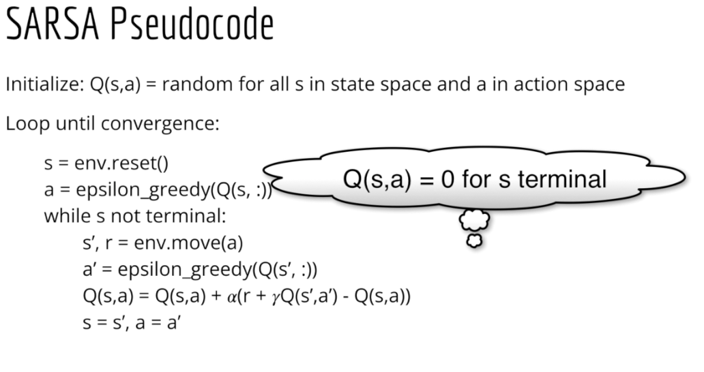

# SARSA in Code

&nbsp;&nbsp;&nbsp;In this lecture, we'll be looking at how to implement SARSA for control. OK, so in this script we have one extra useful import, which is the max_dict function, which you saw earlier. This will help us when we need to take the `arg max` in order to determine the optimal action given `Q`. 

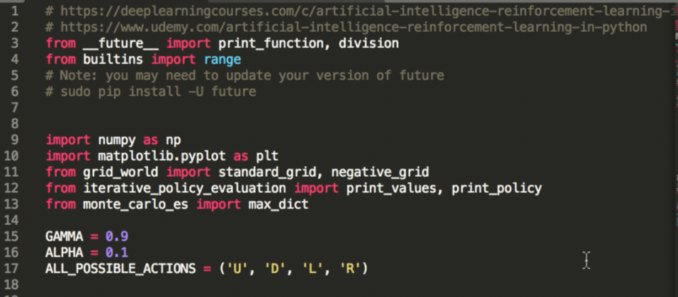

&nbsp;&nbsp;&nbsp;So let's look at the epsilon_greedy function, which is a little bit different from before. In this function, we take in `Q` as an input instead of a predefined, greedy policy. We also take in a state `S` and Epsilon.  
So first we generate a random number uniformly between zero and one. And if this is less than Epsilon, we return in action sampled at random. Otherwise we use the max_dict function passing in `Q[s]`, which returns a dictionary of values for each action. As you recall, this returns a tuple of both the `arg max` and the `max`. For this function, We want the `arg max`. So we grab element zero and we call the result `a_opt` meaning `a` optimal.  

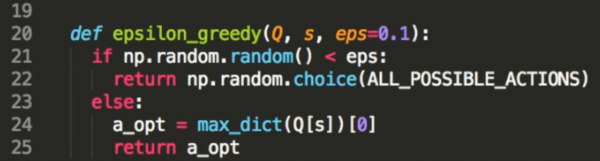

&nbsp;&nbsp;&nbsp;Next, we have the main section. We'll start by creating a grid with a step cost minus zero point. One as before, feel free to try different settings yourself.  
Next, we print the rewards for each state, since this will help us understand the value function we come up with.  
Next, we initialize `Q`. Note that unlike other methods we've seen, there is no need to explicitly initialize any policy. This is because our policy is effectively decided by `Q`. So basically we loop through all the states and for each state we assign `Q[s]` to be an empty dictionary. Then we live through our actions and assign the value for each action to be zero. This also ensures that the value for the terminal states is zero.  

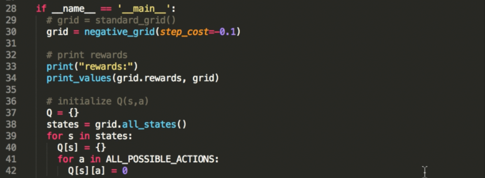

&nbsp;&nbsp;&nbsp;Next, for debugging and understanding purposes, we're going to store the update counts for each state.  
Next, we're going to enter our main training loop, so because this is reinforcement learning, our goal is to maximize the reward. Previously in this course, we made other plots like the change in `V(s)` over time. But in practice, what we usually care about is how well our agents is learning. So what we're going to do now is make a list to store the reward per episode. If we see this increase over time, that's a good sign that our agents is learning.  
OK, so next we're going to enter a loop that's going to iterate for 10000 episodes. Inside this loop, We're going to begin a new episode by calling Grid.Reset(), which will give us back the initial state `s`.  
Next, we're going to use our Epsilon_ greedy function to obtain the corresponding action `a`.  
Next, we're going to create a variable called episode_reward, where we accumulate all the rewards we receive.  

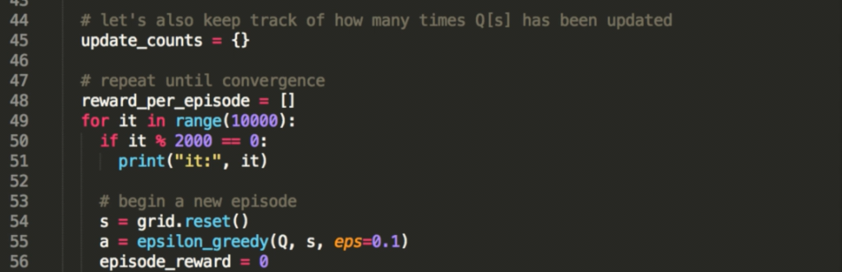

&nbsp;&nbsp;&nbsp;Next, we enter a loop that iterates until the game is over. Inside this loop, we perform the action `a` and receive the reward `r`. We can then call grid.current_state() to obtain the subsequent state `s2`.  
Next, we update the episode reward by adding `r`.  
Next, we determine the next action `a2` by calling Epsilon_greedy, again passing in the state `s2`.  
Next, we have the `Q` using the formula you learned about earlier.  
Next, we update the count for the state `s` in our Update_Counts dictionary.  
Finally, we assign `s` to the `s` and `a` to the `a` for the next iteration of this loop, 

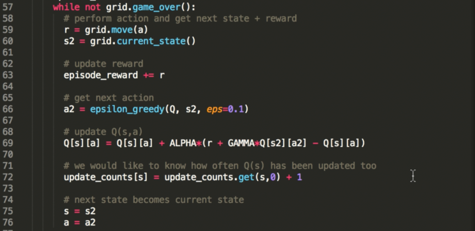

&nbsp;&nbsp;&nbsp;when we finish the inner loop, the episode is complete. We can then append the episode reward to our reward_per_episode list.  
Next, we are now outside the main training loop. At this point, we can plot the reward per episode.  
Next, we use `Q` to find the optimal policy and the optimal state value `V`, to do this, we live through all the states from which we can take an action that is all noncriminals states. Inside the loop, We obtain the optimal action and the corresponding value from `Q(s)` by calling the max_dict function, we assign the action to the policy and the maximum `Q` value to `V(s)`.  

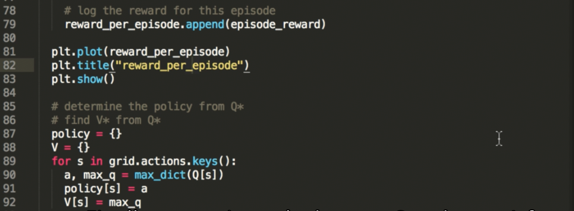

&nbsp;&nbsp;&nbsp;Next, we can print out our results.  
First, we're going to print out the proportion of time we spent updating each state rather than the raw account. To do this, we first find the total number of updates by summing up all the values in the dictionary.  
Next, we live through each item in the dictionary and divide the value by the total in order to get a proportion. Next, we call the print values function, which will just print these proportions for each position on the grid.  
Finally, we print a `V(s)` and the policy as usual.

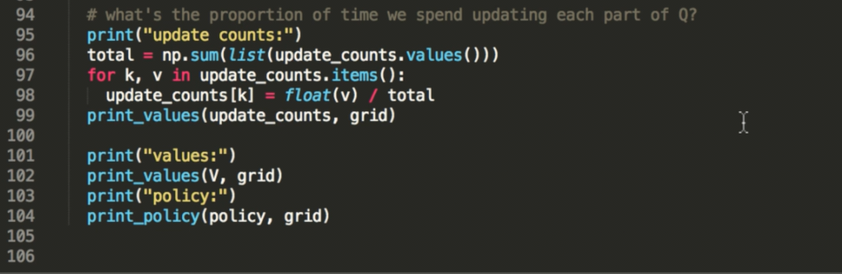

&nbsp;&nbsp;&nbsp;OK, so let's run this and see what we get.  
OK, so looking at this plot, we can see that a reward converges to the maximum quite fast. This is because this is a very simple environment in more complex environments, you'll see that this normally takes more time. Notice that the reward fluctuates because our policy sometimes makes us do random actions which reduce the reward. 

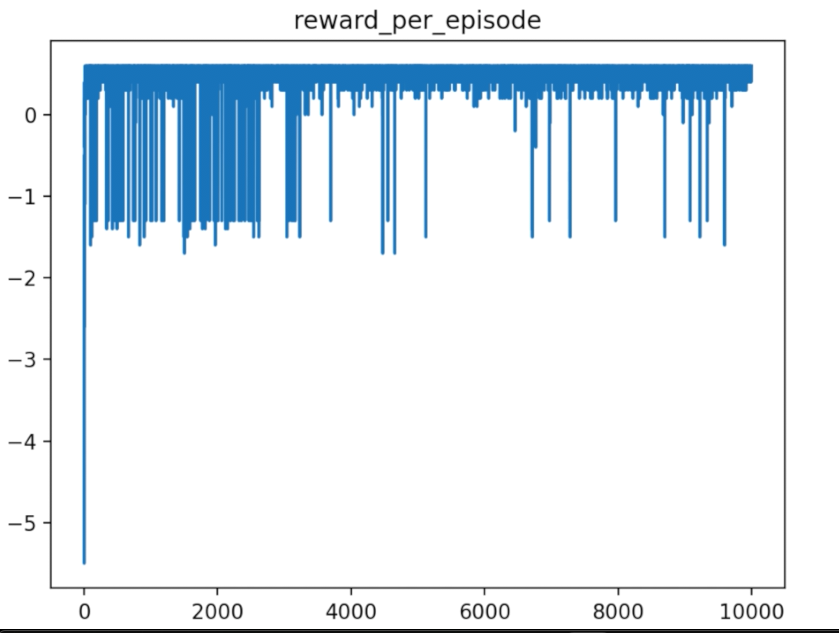

&nbsp;&nbsp;&nbsp;We can also see that our final policy makes sense. From each state, We know what to do in order to get to the goal, to maximize our reward. In order to make sense of the values, we can see that they generally decrease the further away we get from the goal.  
If you'd like to check how accurate these values are, I again recommend plugging in this policy into our dynamic programming script in order to get an exact answer.

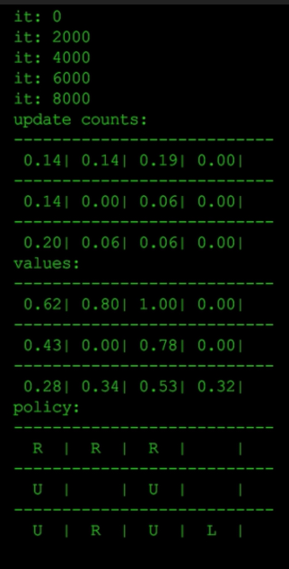

[Code_22](../code_files/22_sarsa/sarsa_test.py)

[Code_22_opg](../code_files/22_sarsa/sarsa.py)

# Q Learning

&nbsp;&nbsp;&nbsp;In this lecture, we're going to look at an alternative temporal difference control algorithm called Q learning. So why is this necessary? Well, if you've ever read about reinforcement learning on your own, you may have noticed that Q learning is quite popular. On the other hand, SARSA is not. There are many variations of Q learning, such as deep Q learning. Maybe someone out there has implemented Deep SARSA, but it's certainly not as recognizable.

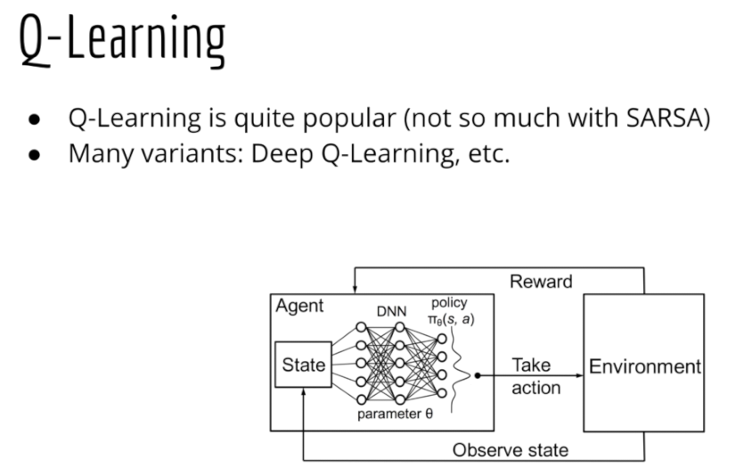

&nbsp;&nbsp;&nbsp;So what's our motivation for improving SARSA. You'll recall early on where we discussed why epsilon Greedy is not an optimal policy. It helps us with exploration, but it also means that some percentage of the time we're just going to choose a suboptimal action randomly. Q Learning gives us one way of avoiding this.

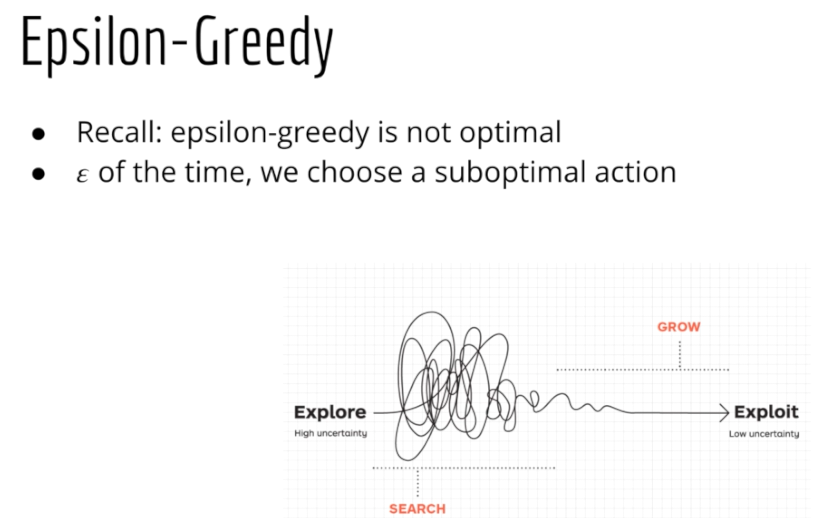

&nbsp;&nbsp;&nbsp;Essentially, Q learning is just one small change. With SARSA, you'll recall that our target is `r + GAMMA * Q(s',a')` with Q Learning our target is `r + GAMMA * maxQ(s',a')` over all actions `a'`. So what's the main difference?  
The main difference is that instead of using the actual next action in the target, we use the action we would have taken if we had chosen the current optimal action. So in SARSA, when you're doing Epsilon greedy, sometimes you'll choose an action `a'` that's not optimal. This means that the target will correspond to that suboptimal action with Q Learning you'll always use the maximum `Q`. Meaning that you're learning the `Q` function for the policy in which you always choose the best action.

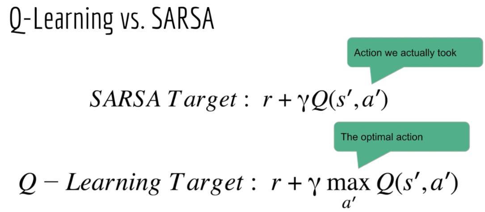

&nbsp;&nbsp;&nbsp;So a new concept arises when we discuss the difference between a SARSA and Q learning. specifically, we can describe an algorithm as being either `on-policy` or `off-policy`. SARSA is called an `on-policy` method because the Q function we're learning is the Q function for the policy that we're actually using. Once we complete training, this will be the policy that we consider to be the best policy for the agent. On the other hands, Q Learning is an `off-policy` method. This is because our actions are dictated by an epsilon Greedy  policy. However, the Q function we are learning is for a purely greedy policy. The greedy policy is what we would get if we always chose the optimal action which corresponds to taking the max over `Q`. We can differentiate between the two kinds of policies as follows :  
The policy that we use to play the episode is called the `Behavior` Policy. The behavior policy dictates how we act in the environment. It tells us which actions we should perform. On the other hand, the policy that we are learning is called the `target` policy. The target policy may not be the same as the one we are using to determine our actions during training. But when we update `Q`, the `Q` we want to find corresponds to this target policy. Furthermore, the target policy is the policy we eventually want to end up with the one that represents an intelligent agents that knows how to maximize its rewards. In fact, if you further your studies in reinforcement learning, you may learn about methods in which your behavior policy can be completely random, that is uniform, random, and you can still end up with an optimal target policy.

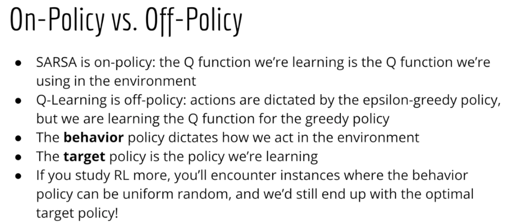

&nbsp;&nbsp;&nbsp;So to end this lecture, let's look at the pseudocode for Q learning. As before, we're going to initialize `Q` randomly, except for terminal states where it's equal to zero.  
Next, we enter a loop that plays for some number of episodes. Inside this loop, we reset our environment and obtain the initial state, which we call `s`.  
Next, we enter a loop that exits when the episode is complete. Inside this loop, we use an epsilon greedy policy to get our action, which we call `a`. So this follows our behavior policy.  
Next, we take the action `a` in the environment, which gives us back the reward `r` and the next state `s'`.  
Next we use `s`, `a`, `r`, `a'`, `s'` to update `Q` Using the formula you saw earlier. no one difference between this and SARSA where we no longer have to wait to get the next action `a'` before updating `Q`.  
Next, we assign `s'` to be the current state `s` for the next iteration of the loop.  

OK, so that's it for Q Learning. Please implement this yourself as an exercise and I'll see you in the next lecture.

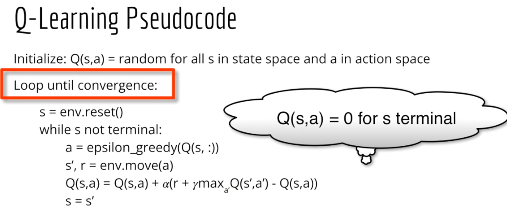

# Q Learning in Code

&nbsp;&nbsp;&nbsp;So in this lecture, we'll be looking at how to implement Q Learning. Luckily, most of the work has already been done and you'll notice that this script essentially looks the same as the SARSA script, aside from a few minor details. So at the top, we again start by importing the same libraries and defining the same consents.  

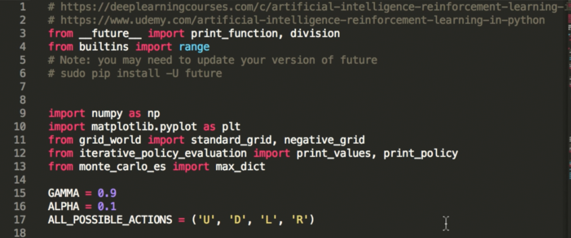

&nbsp;&nbsp;&nbsp;Next, we have our epsilon_greedy function, which is the same as before.  
Next, we have the main area, we start by instantiating an environment. Again, feel free to change this and to try different parameters.  
Next, we print out the rewards since that helps us sanity check the results.  

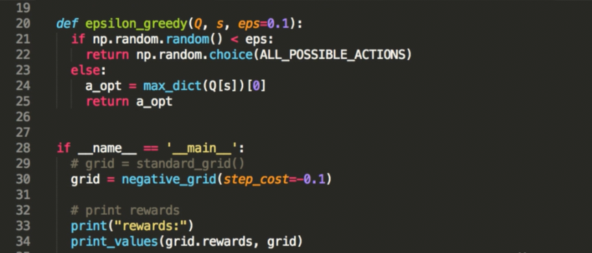

&nbsp;&nbsp;&nbsp;Next, we initialize our Q table. As before we loop through all the states and all the actions. For each state, we create a new dictionary and then within that dictionary, we set the value of each action to zero.  
Next, we create a dictionary for debugging purposes, which will count the number of times we updated the value in each state.  
Next, we create an empty list to store the reward per episode.  
Next, we enter a loop that iterates for 10000 episodes.  
Next, we begin a new episode. First, you'll see that when we begin each new episode, we only call grid.reset() to get the initial state `s`. We also create a variable called episode_reward where we accumulate the reward on each step. At this point, we do not obtain the corresponding action `a`.  

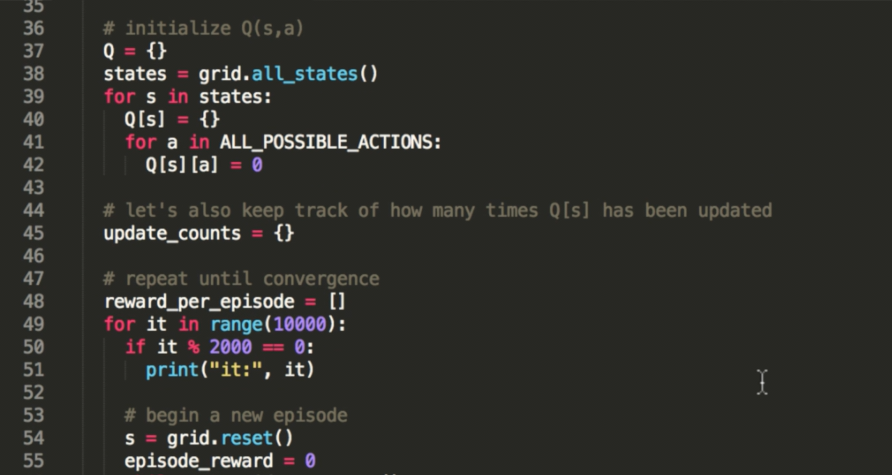

&nbsp;&nbsp;&nbsp;The next step is to enter a loop that exits when the game is over. Inside the loop, we start by obtaining an action, by using the epsilon_greedy function. Using this action, we take a step in the environment which gives us back a reward. `r`. We can then call grid.current_state() to get the next state `s2` .  
Next, we add the reward `r` to the episode_Reward Variable.  
Next, we update `Q`. We begin by using the max_dict function, passing in the `Q` table for state `s2`. As before, This function gives us both the `arg max` and the max. This time we want the max, so we index the result at index one. This gives us back the maximum `Q` over all actions for the state `s2`.   
Next, we update `Q` using the formula you learned earlier.  
Next, we update_counts dictionary by one for the current state `s`. Finally, we assign `s` to be `s`, which becomes the current state for the next iteration of the loop.  
Next, when the inner loop is over, the episode is complete. So at this point, we can append the episode_reward to our list of episode rewards.  

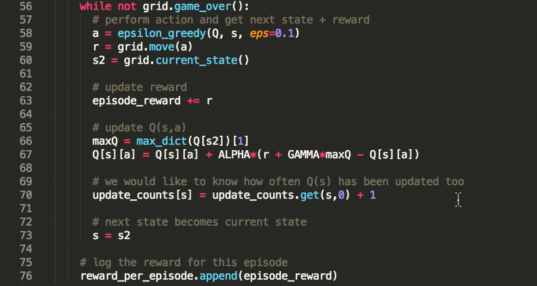

&nbsp;&nbsp;&nbsp;Next, we reach a point where all the episodes are complete. At this point, we can plot the reward_per_episode.  

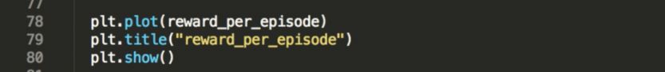

&nbsp;&nbsp;&nbsp;Next, we obtain the final policy in the final state value function derived from `Q`. So we loop through all the none-terminal states and for each of these states we index `Q`and call the max_dict function. This gives us back both the `arg max`, which is the optimal action and the max which gives us the optimal state value.  
Next, we print out the proportion of time we spend updating the values in each state. We start by grabbing the total number of updates, which is the sum of all the values in the dictionary. Then we loop through each state and divide the count by the total. Once we obtain our proportions, we call the print values function, which will print the proportion of time we spent updating each position on the grid. Next, As usual, we print the final optimal stay value and the final optimal policy. 

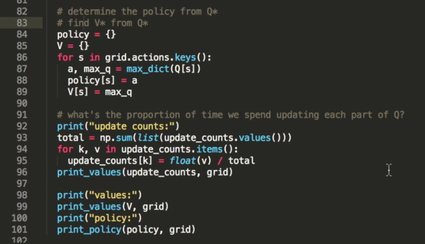

&nbsp;&nbsp;&nbsp;OK, so let's run this and see what we get.  
OK, so for the reward, we can see essentially the same pattern as before, the reward converges very quickly to its maximum, but fluctuates a bit due to the randomness and the epsilon greedy policy.

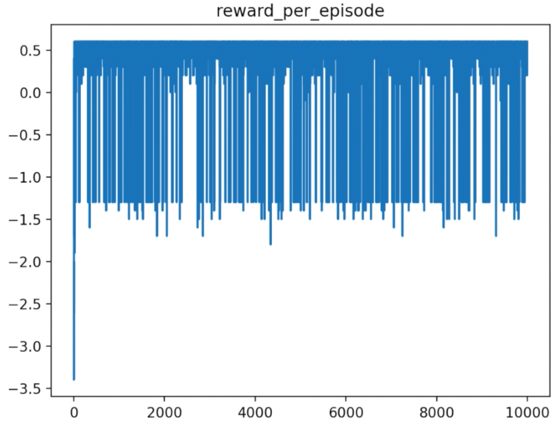

&nbsp;&nbsp;&nbsp;We can also see that our final policy makes sense. From each state, We know what to do in order to get to the goal, to maximize our reward. In order to make sense of the values, we can see that they generally decrease the further we get from the goal. You can also compare these values against what we found for SARSA.  
If you'd like to check how accurate these values are, I again recommend plugging in this policy into our dynamic programming script in order to get the exact answer.

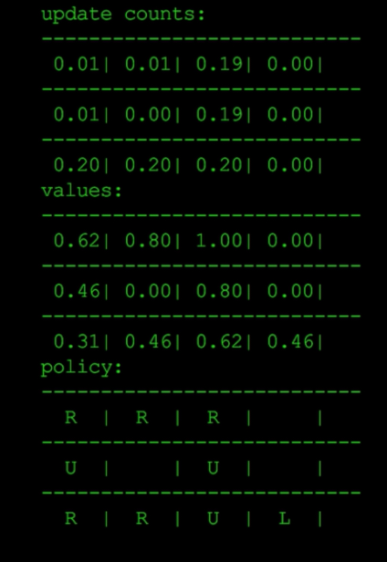

[Code_23](../code_files/23_q_learning/q_learning_test.py)

[Code_23_Org](../code_files/23_q_learning/q_learning.py)

# TD Learning Section Summary

&nbsp;&nbsp;&nbsp;OK, so now that you've learned how to do both prediction and control using temporal distance learning, it's time to summarize this section.  
This section was all about how to convert the Monte Carlo method into a one step update. To do this, we reacquainted ourselves with the Bellman equation. The definition of the value function has `G` inside the expected value, but the Bellman equation replaces `G` with `R + GAMMA * V(s')`. This makes it so that the value function depends on other values in the value function. And of course, this is easier to sample. In order to find `G`, we have to play an entire episode and sum up all the rewards. But finding `R + GAMMA * V(s')` only requires a single step into the next state `s'`.

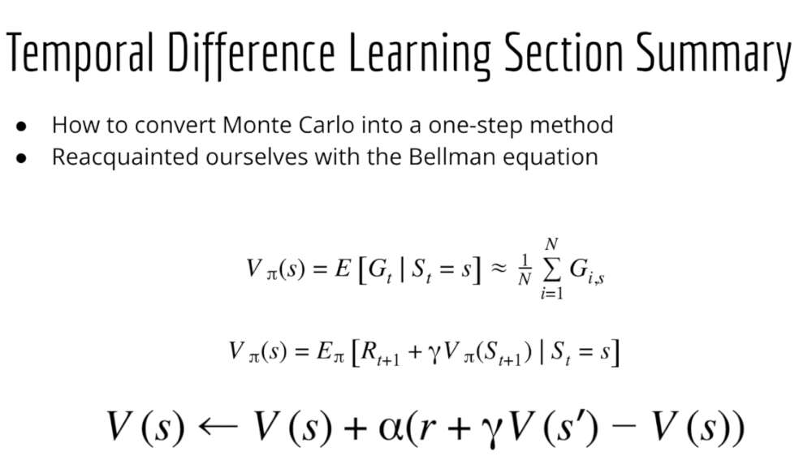

&nbsp;&nbsp;&nbsp;We can also make note of how temporal distance learning brings us back to the concept of bootstrapping, we first learned about bootstrapping in the context of dynamic programming, where we updated the value function using the existing value function. As we kept iterating, our estimate improved. The same thing happens with temporal difference learning. You can imagine that when you first start the so-called targeted`R + GAMMA * V(s')` is not accurate because we don't actually know `V(s')`. However, as you keep iterating, all the values become more accurate and this target two becomes more accurate.

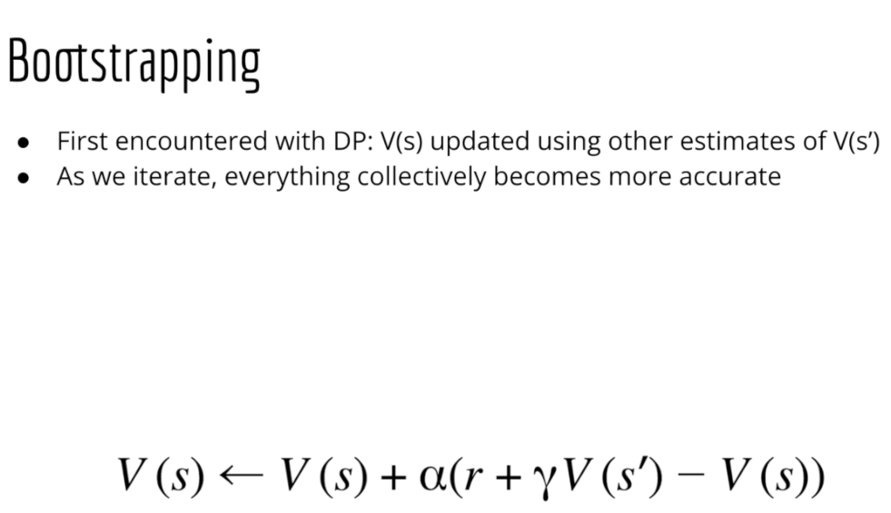

&nbsp;&nbsp;&nbsp;You also learned about the important difference between on-policy and off-policy methods. With on-policy methods like SARSA, our behavior policy and our target policy are the same. This means that if our behavior policy is suboptimal, as in epsilon greedy, then our target policy is also suboptimal. With off-policy methods like Q learning this need not be the case. Q Learning is one example of an off-policy method where a behavior policy does not need to match the target policy because our target in the Q` update always uses the max. We're effectively asking to learn the value for the greedy action rather than the action we actually took.

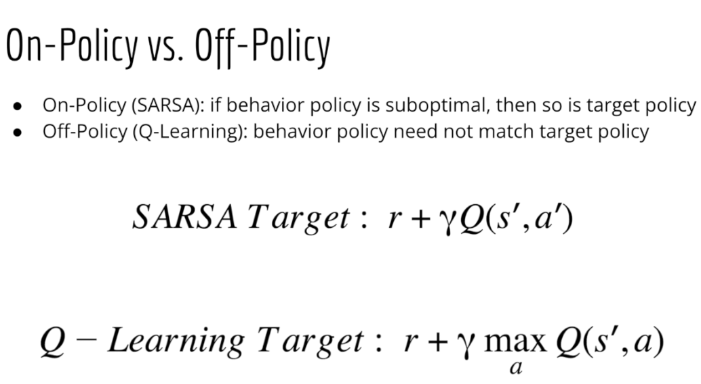

