# Approximation Methods Section Introduction

&nbsp;&nbsp;&nbsp;In this lecture will be introducing the next section of this course, which is all about approximation methods. Previously in this course we've studied reinforcement learning in the tabular case, the state value `V(s)` and the action value `Q(s,a)` were always tables. The key requirement for this was that the states and actions were both discrete and finite. This is why Grid World is such a nice environment to hone your reinforcement learning skills. But at some point we have to ask ourselves, is this practical?

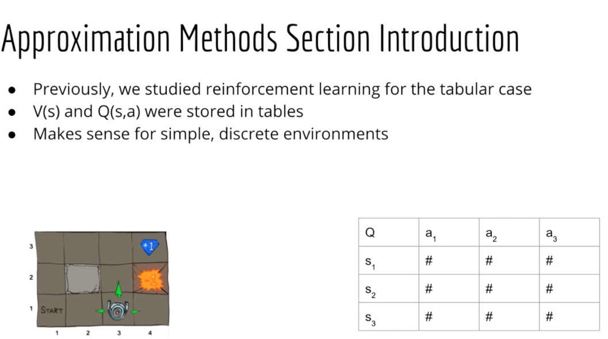

&nbsp;&nbsp;&nbsp;Imagine building a self-driving car. Your state may consist of LIDAR readings or images from the environment. These are both clearly continuous values. In computers, image pixel values are discrete, but in reality they are based on light intensity, which is, for all practical purposes, continuous.

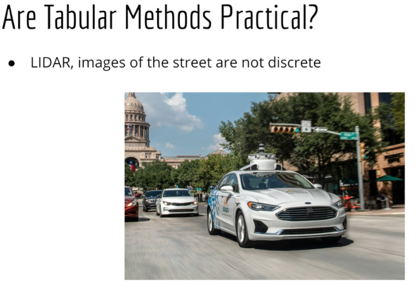

&nbsp;&nbsp;&nbsp;Or what if you were building a robot that walks? The state may consist of acceleration and force measurements on various joints as well as positions and velocities. Clearly, these are also continuous values.

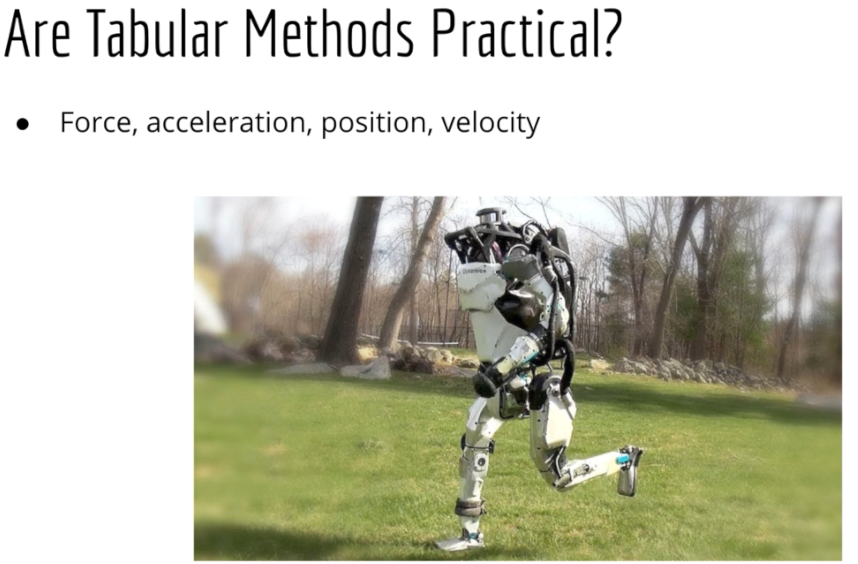

&nbsp;&nbsp;&nbsp;What if you are building an agent to play chess or go. In this case, the states are discrete and finite, but there are way too many of them to enumerate. In all of these cases, it would seem that tabular methods are too limited.

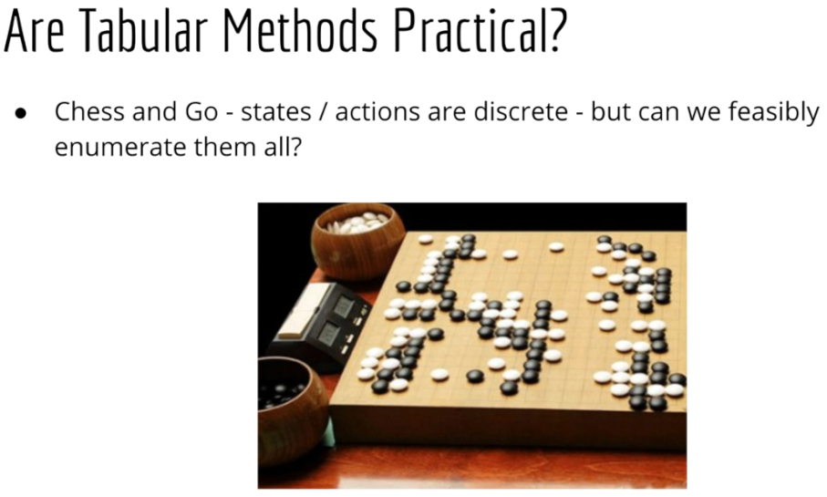

&nbsp;&nbsp;&nbsp;In this section, we'll study the concept of function approximation. This is the idea that instead of using a table to store the value function, we use, a function approximater. The models that we use come from supervised machine learning, for example, neural networks and K-nearest neighbor. So this is why I always recommend students to be familiar with supervised learning before they study reinforcement learning. It's because supervised learning is merely a part of reinforcement learning. You should be familiar enough that you feel comfortable applying those concepts to a new field.

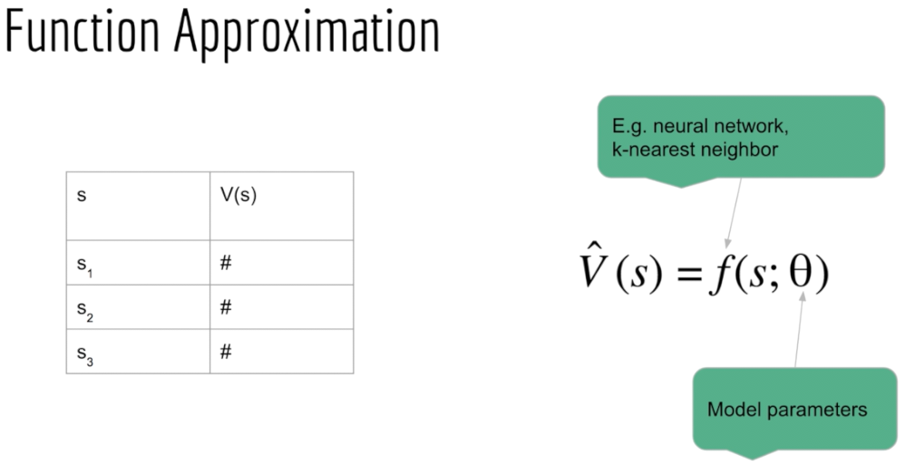

&nbsp;&nbsp;&nbsp;So the outline for this section is as follows :  
first, we're going to review linear regression and stochastic gradient descent. In this course, we'll be focused on linear models, although the concepts you will learn easily extend to neural networks and other nonlinear function approximations.  
Next, we'll look at feature engineering. This is a simple but very effective way of making a linear model approximate nonlinear functions.  
Next, we'll return to reinforcement learning and look at how function approximation can be used for prediction. As usual will well then turn our attention towards control with a focus on Q learning. However, note that all the methods you learned in the section can be applied to the previous sections of the course, such as MonteCarlo and SARSA.  
Finally, we will apply what we've learned to a new environment. Grid world is nice to start with because that's what we've been using all throughout this course. But it doesn't really show you the true power of function approximation. Because of this, We'll be looking at the Cartpole environment in OpenAI gym. Basically, your job is to build an agent that can balance a poll that sits on top of a moving car. Well, you will see is that the methods you have learned in this course are very general, will be able to apply what we've learned to this new environment, essentially without any change to the code. This is why I always repeat my famous motto. All data is the same.

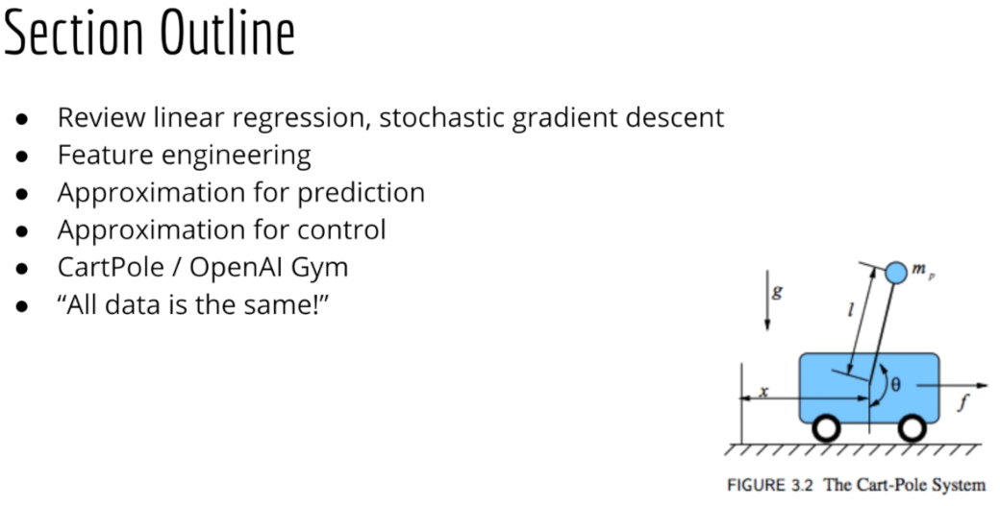

&nbsp;&nbsp;&nbsp;Normally, I discuss this in the context of supervised and unsupervised learning, but you'll see that this applies to reinforcement learning as well. How can the same code work for both grid World and Cartpole?  
The key is your computer sees only numbers. It doesn't know anything about cards and polls or physics or grid worlds. It just sees numbers. This is what we mean when we say all data is the same. What you've learned is very powerful because it means that you can apply it to any problem without having to learn new concepts or write new code.

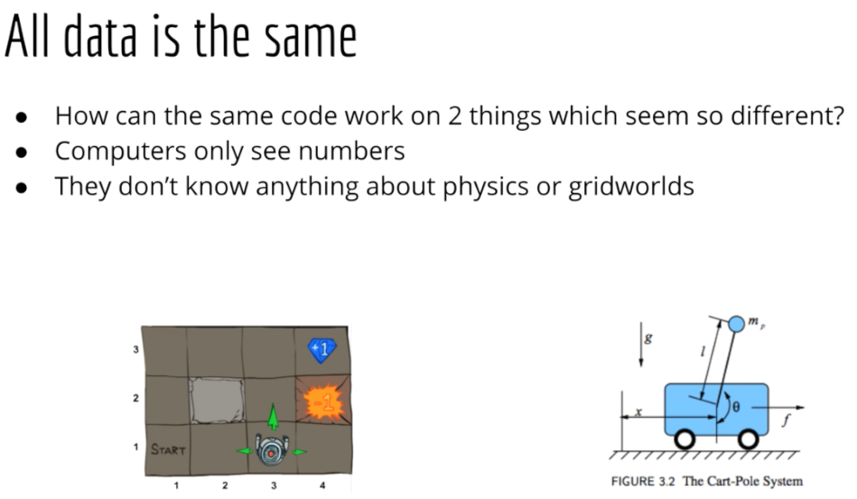

# Linear Models for Reinforcement Learning

&nbsp;&nbsp;&nbsp;In this lecture will be briefly reviewing linear regression as part of our progression into prediction and control with function approximation. Please note that if this is the first time you are seeing these concepts, you'll probably need to take some time to achieve a deeper understanding on your own. Now it's just my opinion, but from personal experience, if you don't already have this solid foundation, trying to do reinforcement learning will be pretty hard. So it would be my recommendation that if you are not very comfortable with what you see in this lecture, you may want to do some extra review by yourself.

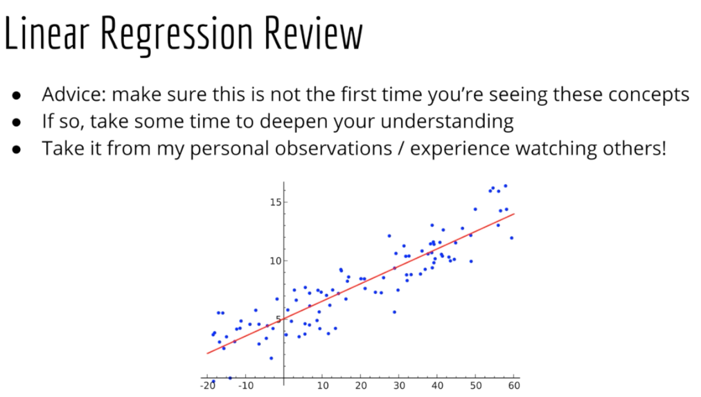

&nbsp;&nbsp;&nbsp;So let's start with the basics of linear regression. We'll start by assuming that we have some feature vector called X, imagine that we want to predict a students exam grade.  
In this case, X can represent something like how many hours the student studied and how many hours they slept the night before the exam. In this case, X would be a two dimensional vector. Then suppose that we want to model the exam grade as a linear function of X. To do this we say y^ is equal to W transpose X. We put a hat on top of Y because it's our prediction of the true exam grade, which we would call Y. Recall that W transpose X is the matrix notation for an inner product, when we convert it into scalar form. It simply means that we multiply each element of W by each element of X and then sum all the results together. in general will use the letter Big D to represent the dimensionality of X. And note that since W is being multiplied by X, it must have the same dimensionality as X.

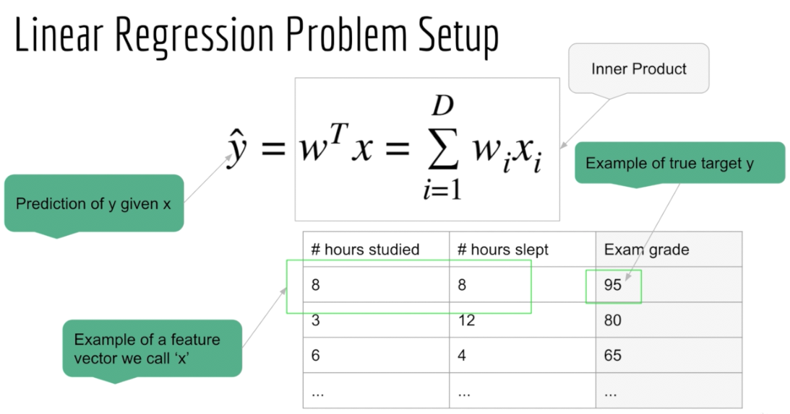

&nbsp;&nbsp;&nbsp;The key question we need to ask in linear regression is :  How do we find the weights, all of the supplies?  
in order to do this, we must have a data set to train our model on. Let's continue with our example of trying to predict a student's exam grades from how many hours they studied and how many hours they slept. In order to find W, we would have to do something like make a survey and collect answers from students. Once many students have filled out our survey, we would put them into an Excel spreadsheet and what we would have is a table of numbers. Basically for each vector X we have a corresponding Y that is for each student's inputs, for the number of hours they studied and the number of hours they slept, we also have a corresponding exam grade.  
The key point is we want to find w such that our predictions, the Y^ are close to the true Y's. This would of course mean that we have accurate model predictions.

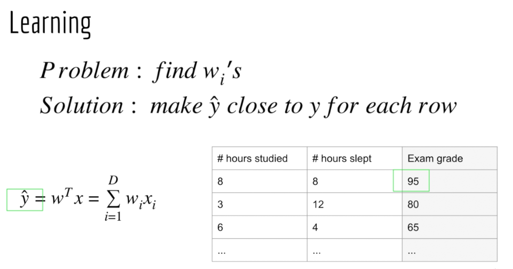

&nbsp;&nbsp;&nbsp;So the way we accomplish this is by creating a lost function. A lost function as a function that compares the predictions to the true targets, it up puts a large number if the predictions are not close to the targets and it outputs a smaller number when the predictions are close to the targets.  
So clearly, what we would like to do is minimize the loss. For regression, We normally use the squared error as our loss. Basically, it ensures that all the errors are positive, but it has other convenient properties too.  
So let's define a loss function J which is equal to the sum of squared errors between each true target yn and each corresponding prediction y^n.

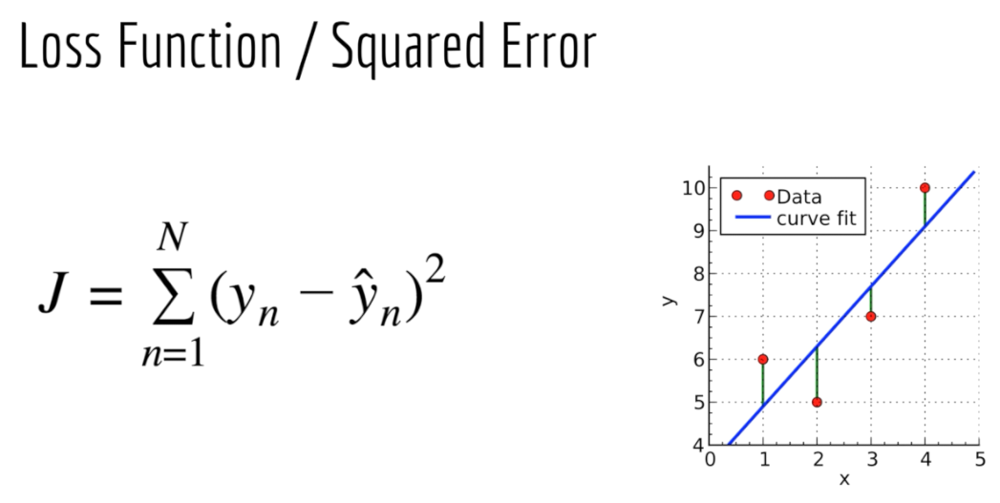

&nbsp;&nbsp;&nbsp;Now, solving for the weights w given the last J is pretty easy, in fact, no other machine learning model is as easy to optimize. Let's suppose that we take our table of inputs and we assign that to be a matrix called Big X. Big X is therefore a matrix of size N by D since there are N rows and D columns, let's call the vector of targets Y with an arrow on top to denote it as a vector. Clearly Y is a vector of size N by one, since it has N rows but only one column. Using basic vector calculus, you can minimize J with respect to the way vector w. Doing so, we arrive at the usual solution for W, which is what you see here.  
Now if you haven't seen this for a while and you need a refresher, I would strongly encourage you to try to derive this yourself without using any external resources. It should serve as a good exercise to prepare you for the rest of this section.

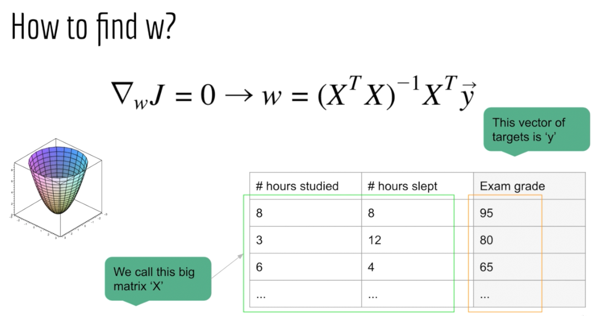

&nbsp;&nbsp;&nbsp;Now, in practice, modern problems do not have close form solutions. That is, we can't find W using a formula. There are a few reasons for this.  
Number one, there are other laws, functions we might use other than the squared error. The squared error is essentially the only lost function that has a nice closed form solution.  
Number two, you might use a model other than linear regression, such as a neural network, in this case, there won't be any closed from solution.  
And number three, you might be doing reinforcement learning where you'd like your agents who learn in an online fashion as in the temporal difference method. So in the general case, closed form solutions won't be used.

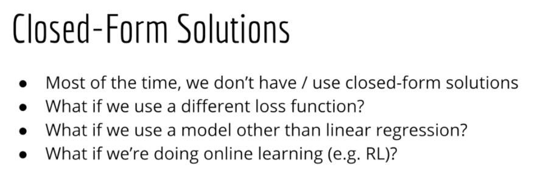

&nbsp;&nbsp;&nbsp;The alternative, of course, is gradient descent. In fact, in order to come up with the closed form solution, you would have had to compute the gradient anyway. So it's not any more complicated mathematically than what we already know. So the basic algorithm goes like this :  
For some number of iterations, we simply update the weights by taking the current value and subtracting a small number of alpha times the gradient. This small number, Alpha, is what we call the learning rate. Typically, it's a small number, like zero point one zero point zero one and so forth. The way that you would choose this learning rate is by trial and error or some variation thereof. Note that I typically drop the two from the gradient, which comes from the square term, since we have to choose the learning rate arbitrarily anyway, so it doesn't matter if we remove any constants in front of the gradient since they are absorbed into the learning rate.

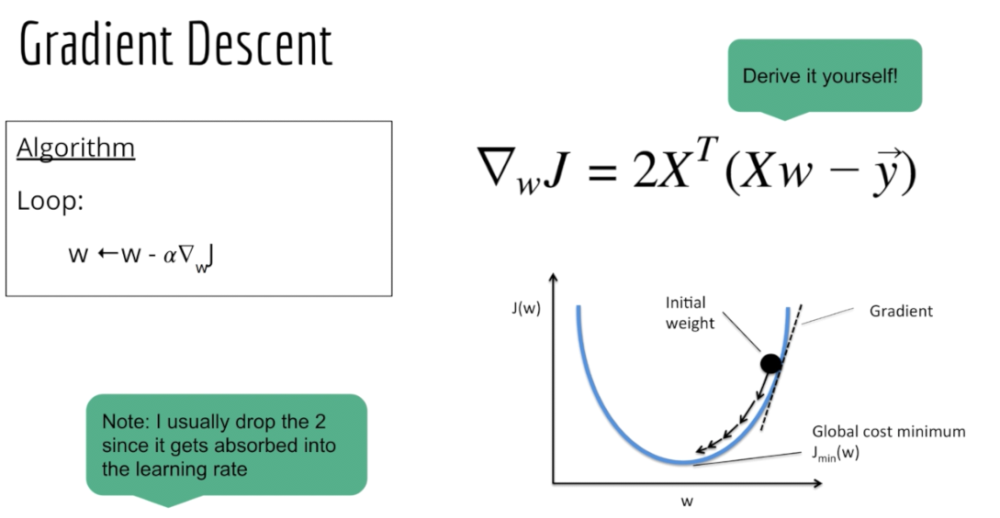

&nbsp;&nbsp;&nbsp;Now, one common point of confusion among beginners is the difference between gradient descent and gradient ascent. You should be able to see that if your lost function had been the negative of what it was before then we could do gradient ascent to find its maximum.  
To see a simple example of this, imagine minimizing a squared or maximizing minus X squared. Clearly, both of these have the same answer. The optimal value is found at X equals zero. The only difference between gradient descent and gradient ascent is where you put the negative side. But mathematically you're doing the exact same operation. Now, the reason I mention this is that in practice, we typically do gradient ascent and reinforcement learning, so don't be surprised if you see a plus sign in front of the learning rate instead of a negative sign.

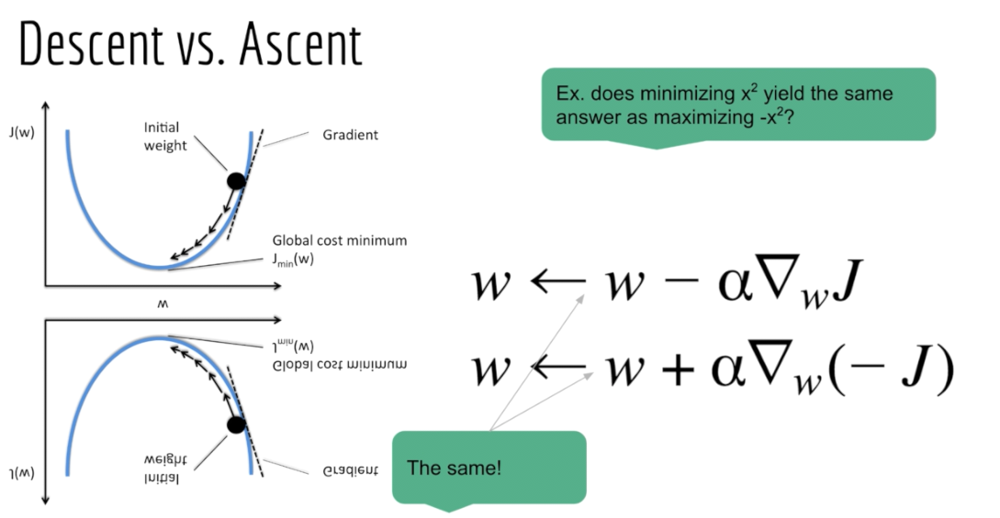

&nbsp;&nbsp;&nbsp;The next point to mention is that in practice, we're not going to see all the data points at once. In fact, you've seen that with temporal distance learning. We update our model after each step. So the supervised learning equivalent of this would be stochastic gradient descent. It essentially minimizes the same loss function on average, but it looks at one data point at a time instead of all end data points at once. So you can imagine that the pseudocode now looks like this.  
First, we have an outer loop that goes for some number of epochs, then we have an inner loop that goes through each N samples. At the little N sample, we do gradient descent or gradient ascent on the squared error for only that one sample. Over time, this will minimize the loss.  
In fact, sometimes it can do so faster than if you had used the full gradient descent. For example, when you have a very large data set. OK, so that's everything you need to know about linear regression for the purpose of reinforcement learning. In the next few lectures, we'll see how to apply these principles.

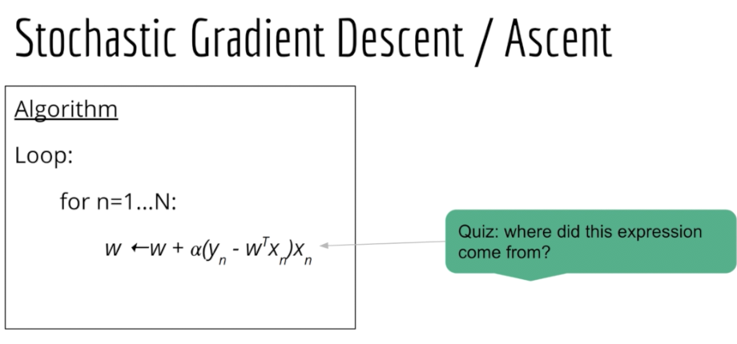

# Feature Engineering

&nbsp;&nbsp;&nbsp;In this lecture, we'll be looking at a concept called feature engineering. So what's their motivation for this?  
Well, essentially, linear regression by itself is not a very expressive model. Linear means that the model can only be a line, a plane or hyper plane, so it can approximate a curved function like this. And that's a problem if the true value function is actually a nonlinear function.

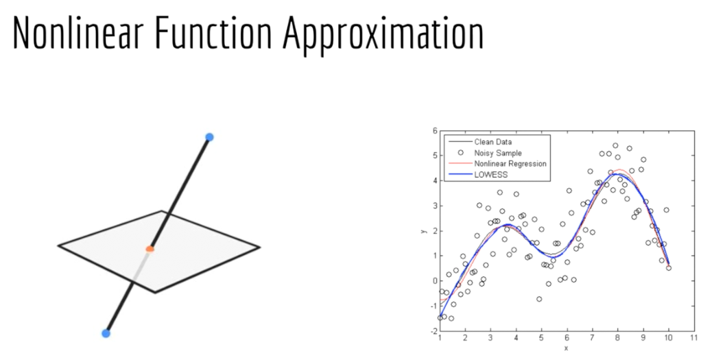

&nbsp;&nbsp;&nbsp;In fact, you should be able to convince yourself that even the value function for grid world is not linear.  
To see this, consider the policy shown here in the top row. The value function is always one because we go directly to the Gulf state. Note that this is without discounting and with a deterministic policy and environment. However, in the middle row, the value function as one on the left but minus one on the right. Since the policy there is to go into the losing state, so we can see that in the top row, the value function is constant, but in the middle row the value function decreases from left to right.  
In fact, it's actually a bit more complicated than this since the value function for the terminal states is zero. So clearly this is a non-linear function. It cannot be represented by a plane over the grid.

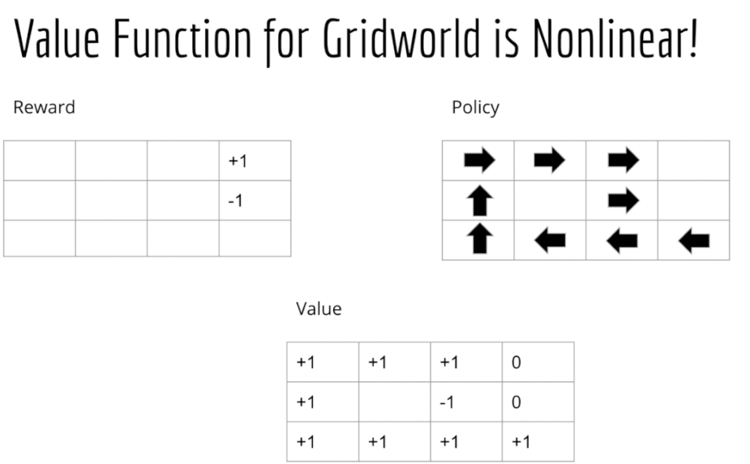

&nbsp;&nbsp;&nbsp;Now, one question you might have is, why do we need to use linear regression in the first place?  
There are plenty of other non-linear machine learning models like decision trees, support vector machines and so forth. In fact, not all models can do online updating, which is what we really need in order to do reinforcement learning.  
Gradient based methods that can learn using stochastic reading the same are ideal. So linear regression and deep neural networks are the most popular approaches. Note that for this course, neural networks will be considered outside the scope of this course, since I think this course has more than enough to cover already. Furthermore, it's already covered in several of the sequels to this course. But I hope it makes sense to you why neural networks would be too much considering everything we've done so far.  
In the context of this course, You should think of neural networks as like the next level, just like how you'd study Calculus two after you study Calculus one, but you wouldn't study them both at the same time. I also want to mention that if you already know how to build a neural network, there's really nothing stopping you from plugging one into the techniques you're already learning in this course. They're really separate topics. So if you've taken a course on neural networks in the past, then that should be enough in order to apply them to what you've learned in this course.  
For example, you could take a neural network, combine it with Q learning and function approximation and solve the cartpole environment in openAI gym. Basically, by the end of this course or even right now, you should be able to do that without any further knowledge. But in any case, I hope it makes sense that neural networks and reinforcement learning are actually two distinct topics which cannot and should not be covered in the same course.  

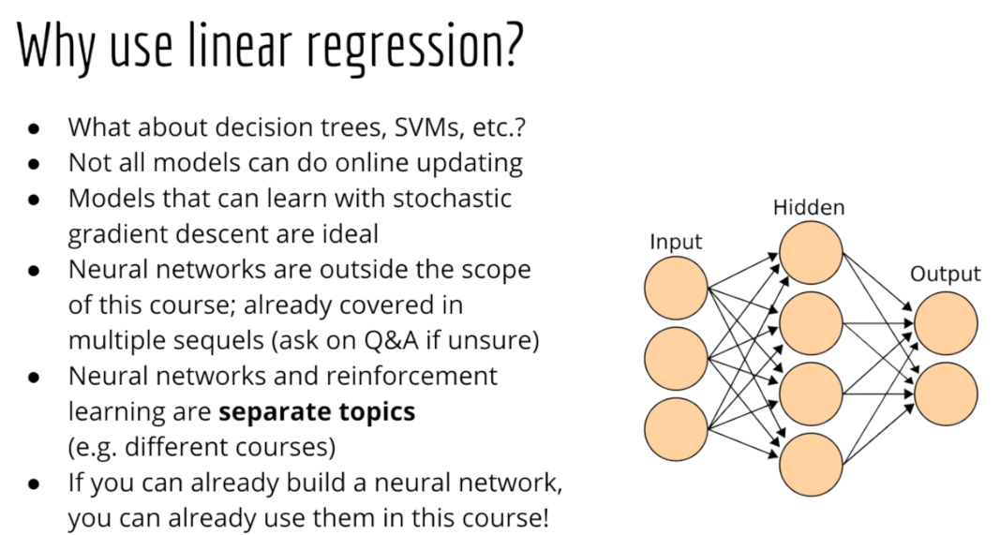

&nbsp;&nbsp;&nbsp;Now, that being said, there is an easy way to get a linear regression to model non-linear functions. In fact, you've most likely encountered it before if you've ever studied machine learning or applied machine learning in the real world. This is to do feature engineering.  
Often researchers and industry professionals have to apply machine learning to their domain of expertise. That might be something like drug discovery, reading MRI brain images, or trying to model automobile traffic in a city. In these scenarios, those working with machine learning often use their domain knowledge to come up with useful features after which they can apply linear regression.  
The key is they use their expertise in the domain to help them come up with features that are useful when using linear regression. So if you're working in drug discovery, you might apply your specialized knowledge of chemistry and biology to help you come up with useful features. But what if you are not an expert in such a domain? Are there any more generic methods of feature engineering?

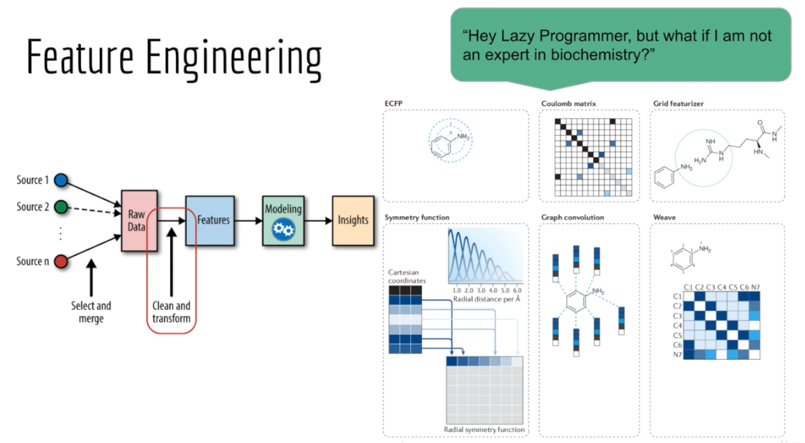

&nbsp;&nbsp;&nbsp;One common method that most students learn when they study linear regression is the use polynomials. So imagine that we have two features. X1 is how many hours a student has studied for an exam and X two is how many hours they slept the night before the exam. Instead of creating a linear regression model using `w1x1 + w2x2` we create polynomial features?  
For example, perhaps we believe there's a quadratic relationship between x1 and x2 and the exam grade. In this case we could use x1 squared and x2 squared along with X1 times x2. These are called the second order terms. We can also add a third, fourth and fifth order terms, although we generally don't go to large since these models tend to overfit.

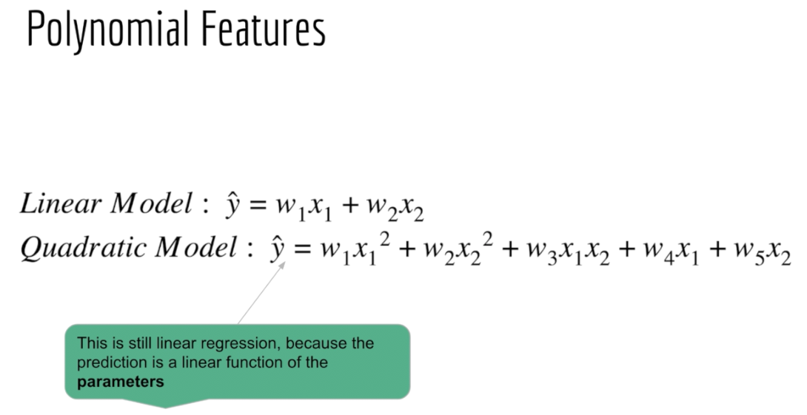

&nbsp;&nbsp;&nbsp;In general, we can think of a future expansion as a function `phy` applied to the input feature X. `phy` can be any function that maps any input to a real valued output vector, for example, sin(x1), cos(x2), sin(x1)*cos(x2) and so forth. Using this notation are linear regression model becomes Y^ equals W transpose times phy(x). So instead of being a linear model of X directly, it's now a linear model of phy(x). And since `phy` can be any function, this model can now be applied to model arbitrary, non-linear functions.

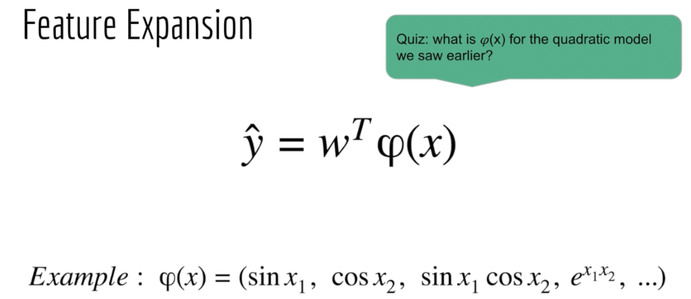

&nbsp;&nbsp;&nbsp;OK, so in practice, we don't actually use polynomials that often. You might see them in your statistics class, but in machine learning, they don't actually work that well.  
In this course, we'll study a kind of feature expansion that does tend to work well, called the `radio basis function`. So the intuition behind the `RBF` is this.  
Imagine that you have a space where your X  data points to live. Now, imagine that there are some important points in this space. We'll call them `landmarks` or `exemplars`. So suppose we have three landmarks. Let's call them L1, L2 and L3. The concept of the radial basis function is simple. To map a new input X to a feature vector. We just measure how close X is to each of these landmarks. Imagine that we have some similarity measure. So if X is really close to a landmark, then this similarity measure should return a number very close to one. If X is very far away from a landmark, then the similarity measure should return a number very close to zero. So for the X is shown here, since it's very close to L1, maybe its similarity is zero point nine. But since it's moderately far away from L2, it's similarity for that landmark is zero point three. Since it's very far away from L3, it's similarity for that landmark is zero point zero one.  
OK, so that's the basic idea. The feature transformation for X is then a vector containing the numbers zero point nine zero point three and zero point zero one.

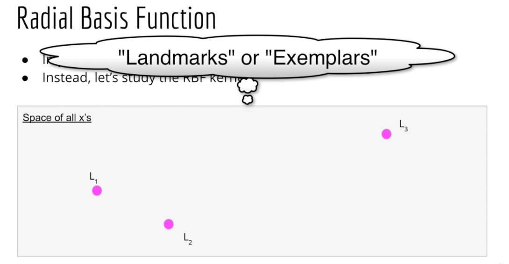

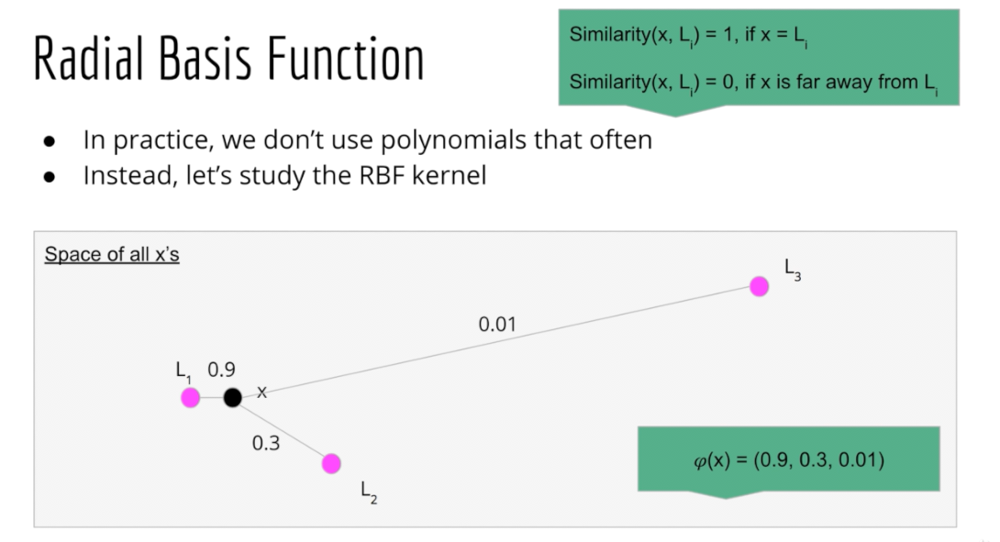

&nbsp;&nbsp;&nbsp;So what kind of similarity function do we use? Well, in this course, the details aren't too important since we'll be using a class from `skitlearn`. But if you're interested, here it is.  
So basically, the function is a Gaussian. We take the square to Euclidean distance between X and the landmark, weight that distance by some parameter Beta negate, and then take the exponential. You should recognize this function as being shaped like a bell curve. It's equal to one effect's is equal to the landmark, and it approaches zero. As the distance between X and the landmark approaches infinity.  
Beta controls how skinny or fat the Gaussian bell curve is. But again, unless you want to implement this yourself in Python, the details aren't too important as an exercise, you might actually want to try to implement this on your own. I've done it myself and I can tell you it should be doable. If you're taking this course for landmarks, you can simply choose positions on the grid or samples from the environment.

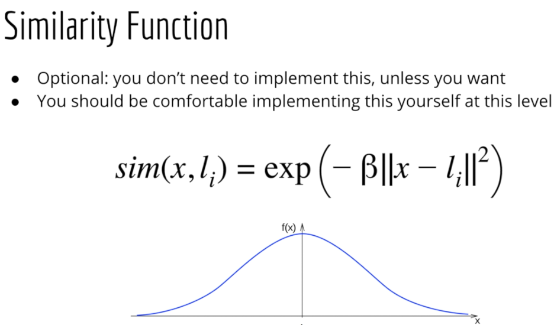

&nbsp;&nbsp;&nbsp;So in practice, since we don't want to have to worry about how our RBF are implemented in this course, we're going to use a `skitlearn `class called `RBFSampler`. Basically, it's an approximation to the RBF kernel that works well in practice and is much more efficient.  
As is typical, the `RBFsampler` has fit and transformed functions, so the way to use it is this. First you instantiate an object of type `RBFsampler`, then you gather a bunch of samples. So if you're doing supervised learning, then this would be your training set. And if it's reinforcement learning, they might be sample states from the environment. If we call that set of samples X, then we call the fit function passing in X. Then when we encounter new samples in the future, we can transform them by calling the transform function. OK, so pretty simple.

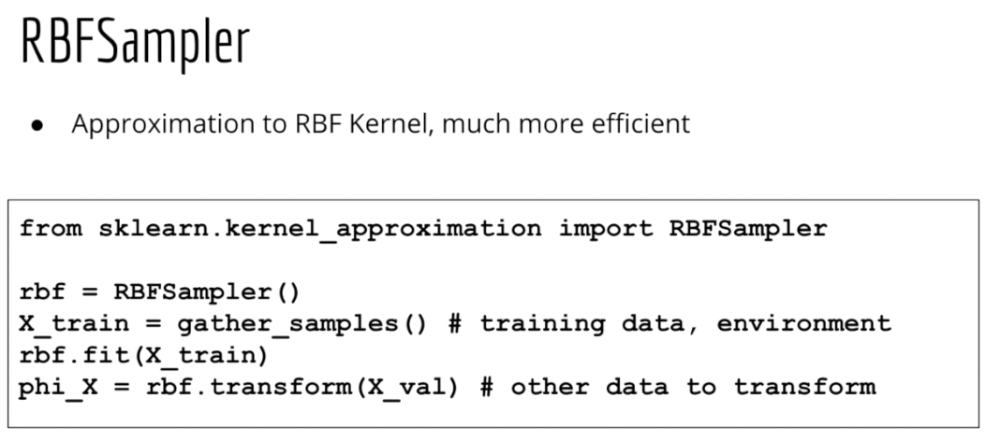

&nbsp;&nbsp;&nbsp;One caveat to the `RBFsamplers` there, although it seems like it should depend on X when you call the fit function, it actually doesn't. For those advanced students who want to research this further, I recommend looking up the technique called `random kitchen sinks`.  
This is outside the scope of this course and has nothing to do with reinforcement learning, but if you're interested, I think it's an interesting topic to read about. Now, of course, some students may ask, well, if the RBAsampler doesn't depend on the data you pass into the fit function, then what's the point of collecting data and calling the fit function? The answer is that you don't want to build a crappy program that only works for the RBAsampler.

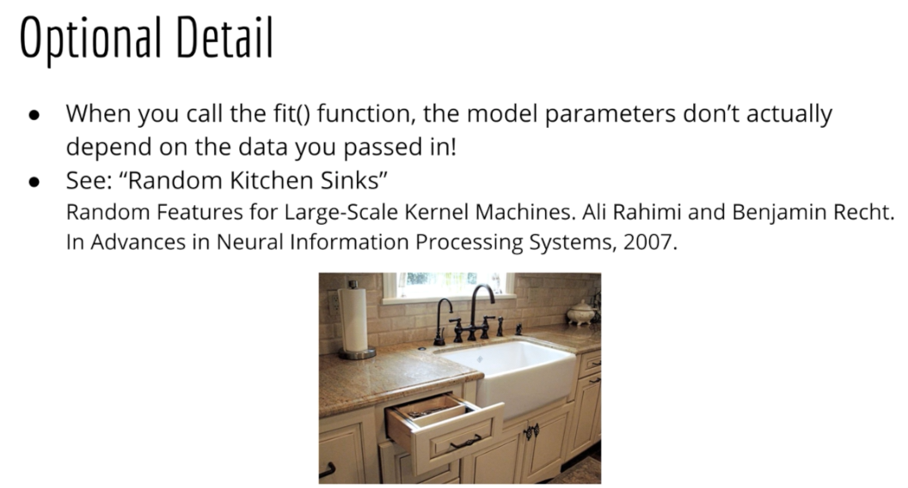

# Approximation Methods for Prediction

&nbsp;&nbsp;&nbsp;So in this lecture, we're going to return to reinforcement learning. Now that we understand the basics of function approximation, it's time to get back to our usual path of solving prediction and then control. So this lecture is about how to solve the prediction task using function approximation.  
To begin, let's assume that we have a feature expansion `phy` which is applied to the state `s`, we'll call the output of this feature Transformation X. So this is a bit different from before when we were discussing future expansions more generically. In that case, we thought of X as the input to `phy`. In any case, it's not that big of a deal. Just remember that `s` is the state, and we want to transform that into a feature vector using `PHY` and we call that feature Vector X.

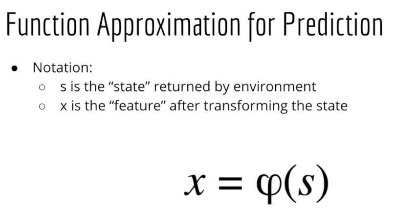

&nbsp;&nbsp;&nbsp;OK, so our model for the value function is then `V^pi(s)` is equal to  w transpose times  X, which is also equal to W transpose phy(s). So what does this mean?  
Well, recall that previously we thought of the value function as a table. If we wanted to look up the value function estimate for a specific state `s` we would just go into the table and plug in `s` to find the corresponding value. But this only works when `S` was discrete, in which case the table makes sense. In this case now `s` can be either discrete or continuous. When we want to find the value estimate for `s`, we first pass it through the function `phy` and then dot it with the weights W. So this is one big difference between how we obtain values given a state `s`. Previously we would just look it up in a table or dictionary. Now we plug it into a function approximate.

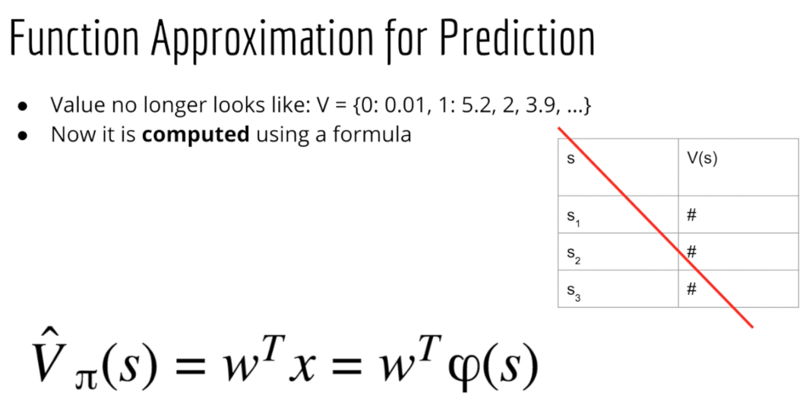

&nbsp;&nbsp;&nbsp;So how do we learn or in other words, improve our V^ estimates, as you recall, this can be done via stochastic gradient descent. So imagine that we've just obtained a sample return  `G` for a given state using some policy `pie`. How do we update the value for `s` given this new sample `G`?  
Well, more correctly, we are not updating the value itself. We are updating the weights w which in turn makes `V` had more accurate. So how do we do this? You recall that we use the squared error. So let's say `J` is equal to `(G - V^pi(s))^2`. What we would like to do is take one small step using gradient descent where the gradient is the gradient of `J` with respect to W.

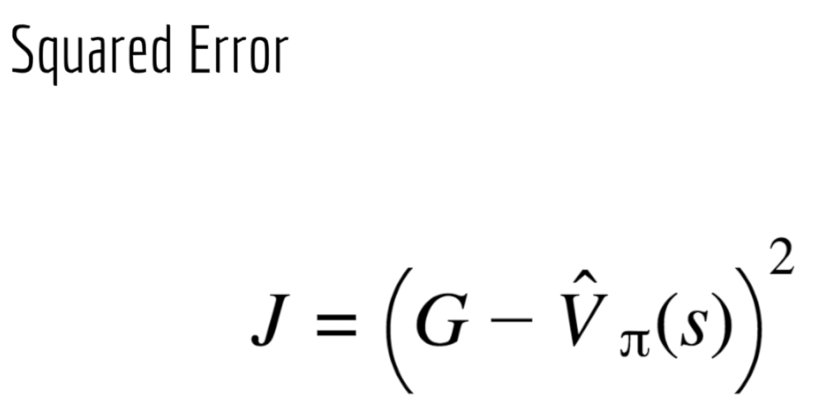

&nbsp;&nbsp;&nbsp;So after doing some basic calculus, we arrive at the following expression for the gradient. As an exercise, you may want to derive this on your own on paper if you can immediately see how we got this answer. And as usual, we normally drop the constant 2, for convenience. OK, so the gradient is equal to the prediction minus the target times the feature vector X.

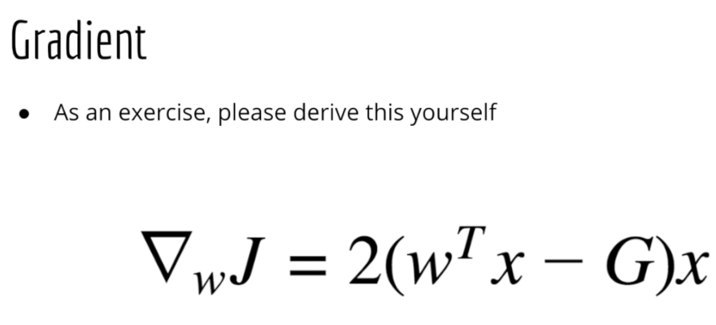

&nbsp;&nbsp;&nbsp;So if we apply this to our gradient descent step, here's what we get. We take the existing W, subtract the learning rate alpha and multiply by the gradient we found previously. And again, note that in reinforcement learning, we typically present this as gradient ascent and use plus alpha instead. This is because we get the target in front of the prediction, as we had earlier in the course. But either way, these two expressions yield the same results.

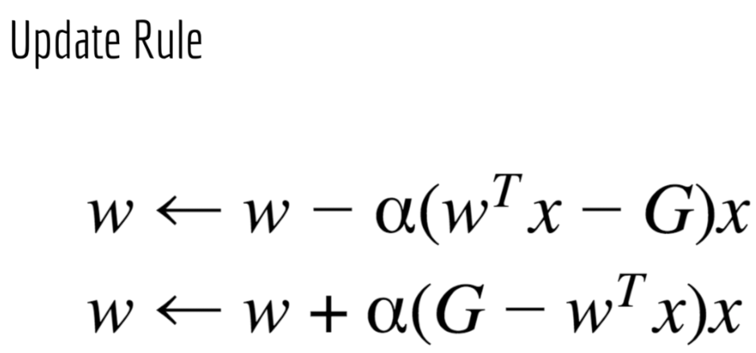

&nbsp;&nbsp;&nbsp;OK, so now that we have our update, we can look at the full pseudocode from MonteCarlo prediction using function approximation.  
So we're given as input some policy `pie` whose value we want to find. We then initialize a wave vector W, of the same size as our feature vectors. Let's call that size `D`. Then we play some number of episodes. Inside the Loop, We play an episode using our given policy, which gives us a sequence of states and rewards.  
Next, we initialize our return `G` to zero. Then we enter a loop from timestep big T minus one down to zero. Inside the loop we update `G` using the usual recursive formula.  
Next we find X, using our feature transformation function `phy`. Then we update the weight vector W using stochastic gradient descent.  
OK, so as you can see, this is essentially the same as the MontCarlo pseudocode we saw before, except that we've replaced the tabular update with gradient descent on W.

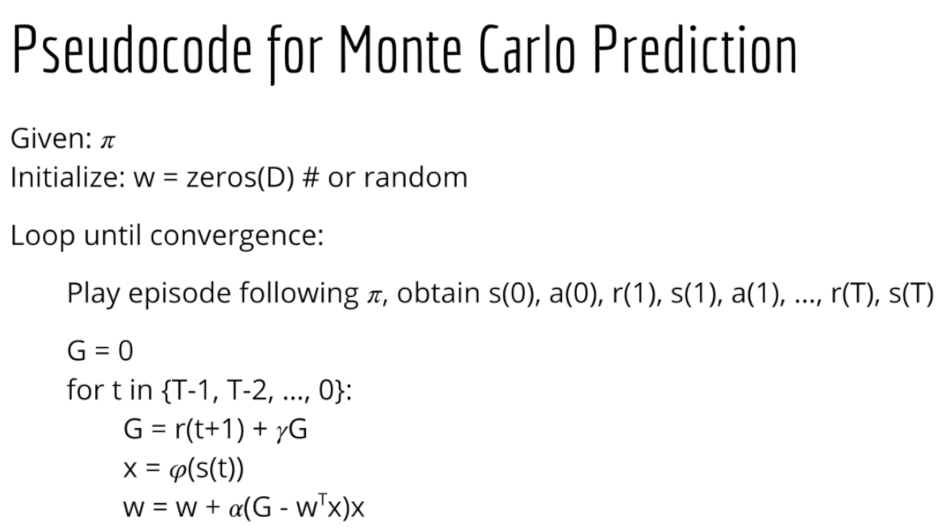

&nbsp;&nbsp;&nbsp;Now, in the coming code lectures, note that we're going to skip straight ahead to temporal difference learning. You may want to try to implement the MonteCarlo version as an exercise, but for this course, TRD learning will be the focus. Basically, the only difference between MonteCarlo and TD learning is that our target is now `r + GAMMA * V^pi(s')` instead of the full return `G`.  
One thing to be mindful of is that, when we do gradient descent, although the target depends on W, we do not differentiate the target when finding the gradient of the squared error. So we treat the target as a fixed value despite the fact that it depends on W. 

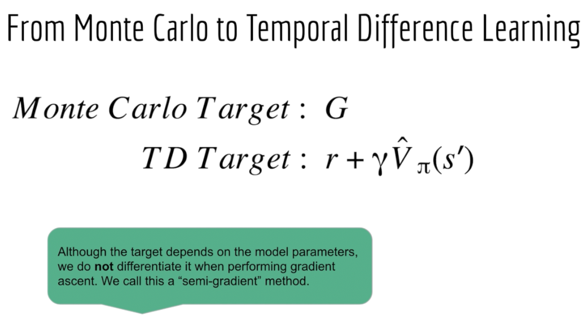

&nbsp;&nbsp;&nbsp;So here is the pseudocode for TD Learning. Again, we're given an input policy `pie` and we start by initializing a way to vector W.  
Next, we enter a loop that goes for some number of episodes. Inside the loop., We reset our environment and obtain the initial state `s`. Then we enter a second loop that exits when the episode is complete. Inside this loop, we use our policy to get our next action and then we perform this action in the environment. This gives us the reward `r`, and the next state `s'`.  
Next we assign the target value. If `s'` is a terminal state, then the target value is just the reward `r` since the value of terminal state `s`, is zero. Otherwise the target value is R plus gamma times V prime. Next we update W using gradient ascent. Lastly, we assign `s'` to be `s` for the next iteration of the loop. 

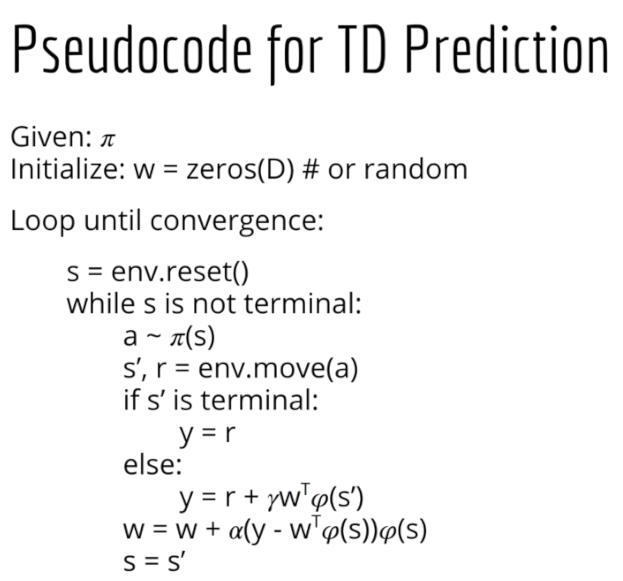

&nbsp;&nbsp;&nbsp;OK, so that's essentially it for prediction with function approximation. There are two final notes worth making. First, as you recall, with tabular methods when we updated `V` or `Q` these were only entries in a table, because of this When you do an update to `V(s)` for some state `s`, only the entry for that particular state will change. On the other hand, function approximation behaves differently. Now, when we update W, we can see that changing W affects the value estimate for all states. 

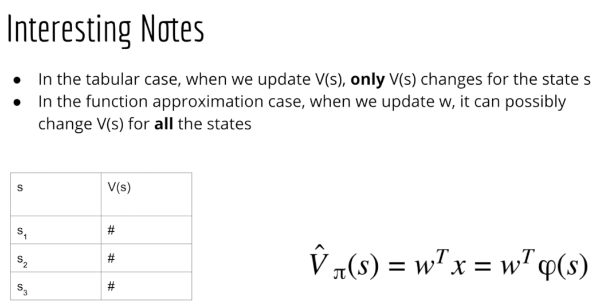

&nbsp;&nbsp;&nbsp;The second thing to notice is this. Suppose that our state places the St.  We can see that tabular methods are really just a special case, a function approximation. Imagine that we have these states simply called S1, S2, S3 all the way up to SD. Now, let's suppose that we do a very simple feature transformation called `one hot encoding`. So state number one, it just becomes the vector one zero zero zero zero and so forth. State number two becomes the vector zero one zero zero zero zero and so forth. And we repeat the pattern until we get to state D, which is all zeros and then a one at the end.

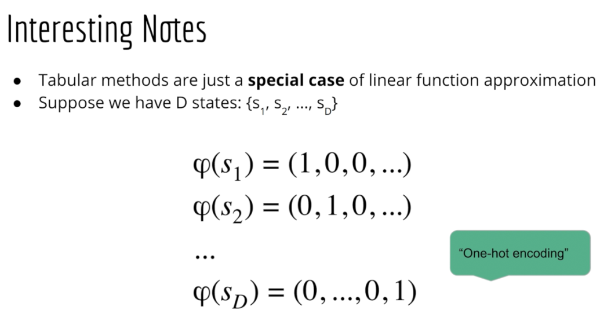

&nbsp;&nbsp;&nbsp;Now, what is our model? we have V^(s) is equal to W transpose phy(s), but since phy(s) is just a one hot encoding, What does this give us?  
Our prediction for state `s1` is just W1*1, which is one. Our prediction for state `s2` is W2*1, which is W2. So as you can see in this case, we just have a single parameter for estimating the value for each state, which is exactly the same as the tabular method. Updating W1 will update `V(s1)`, but this will have no effect on any of the other values. In fact, W1 is equal to `V(s1)`.

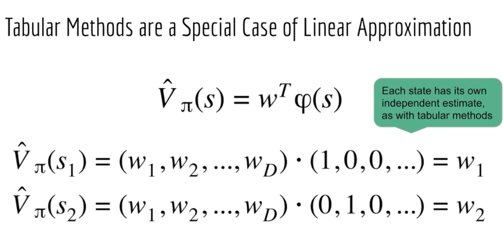

&nbsp;&nbsp;&nbsp;Furthermore, notice that the update rule reduces to what we have in the tabular case, since the gradient is just one for the state of interest and zero for all other states. To see this, we can first note that the update rule shown here is correct. The gradient is one for the particular state of interest. But recall that as we just showed, `Wi` is the same thing as `V(si)` . In other words, these weights are actually just the value function estimate for each state. Therefore, this update rule, which we derive by gradient descent, is actually the same as the update rule we already learned earlier for tabular methods. That's why earlier in this course I mentioned that the update rule for `V(s)` that looks like gradient descent actually is gradient descent.

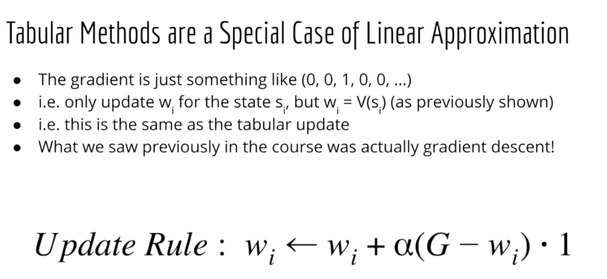

&nbsp;&nbsp;&nbsp;So this is actually pretty useful. Imagine that you're writing code and you can't get it to work. One way to debug your code is to use one hot encoding, which is equivalent to the tabular method. Then you can check whether your answer is the same as what you get if you implement the tabular method directly, if they are the same, and you can be more confident that your code is correct.

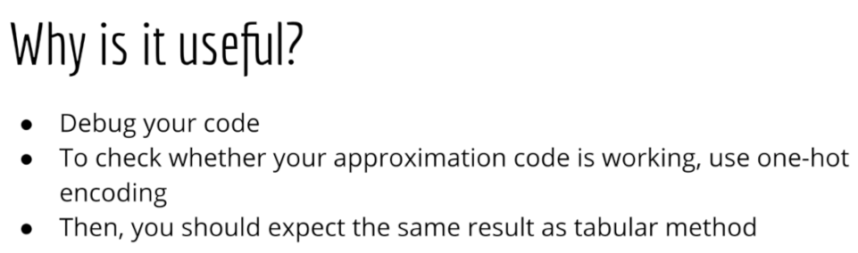

# Approximation Methods for Prediction Code

&nbsp;&nbsp;&nbsp;In this lecture, we will be implementing a function approximation for prediction. As mentioned in the theory lecture, we will be using temporal difference learning.  
To start, let's begin by looking at the imports. You can see that we are now importing `RBFsampler` from `Sklearn`. We'll be using this for a feature expansion. You can also see that I've imported another kernel approximate here called `Nystroem`. This is essentially an alternative way to approximate the RBF kernel. In my experience, the RB of sampler is faster, so that's what we're going to use.  
Next, we define `GAMMA`, the discount rate, `alpha`, the learning rate and the set of all possible actions.  
Next, we define our epsilon_greedy function, which is the same as before.  

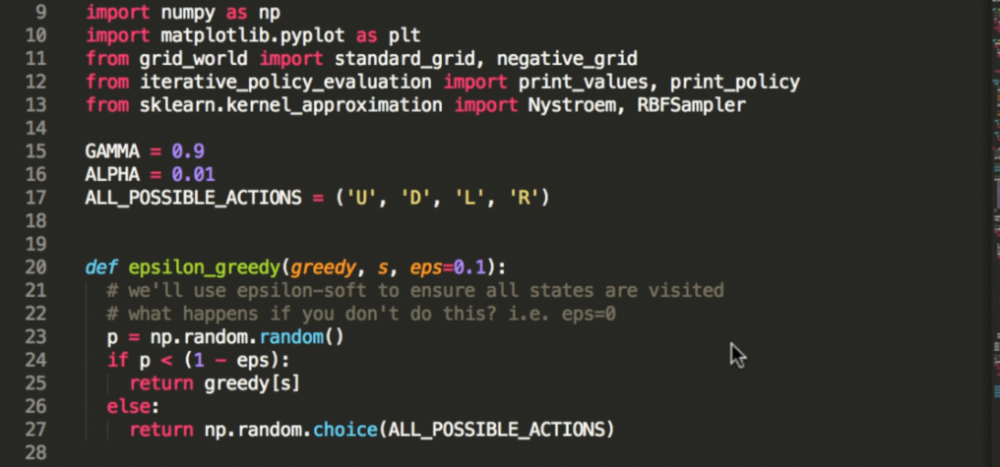

&nbsp;&nbsp;&nbsp;Next, we have a function to randomly gather samples from the state space. This is needed since we have to fit our feature expansion model on a data set. Now, remember that technically this function is not really needed for the `RBFsampler` since the implementation doesn't actually make use of samples. However, it would not be good practice not to include this, since we wouldn't be able to try other feature expansions. For example `Nystroem`.  
So in this function, we start by creating an empty list of samples.  
Next, we enter a loop that goes n_episodes times. Inside the Loop, We reset our environment and receive the initial state. Then we append the state to our list of samples.  
Next, we answer a second loop that quits only when the episode is over. Inside the loop, we randomly selected action. We then perform this action in the environment, which gives us our reward and our new state. We append the new state to our list of samples after both loops are complete. We return our list of samples.  

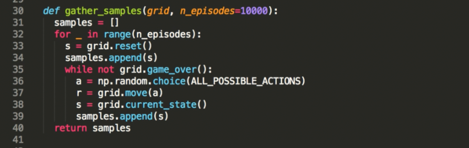

&nbsp;&nbsp;&nbsp;Next, we have our model class, this class essentially represents linear regression with the feature expansion. So first we have the constructor, which accepts a grid object as input. Inside the constructor, we call the gather_samples function passing in a grid object. This gives us back a list of samples.  
Next, we create an `RBFsampler` objects and assign this to the attribute `featureizer`.  
Next we call the fit function passing in our list of samples.   
Next, we get the dimensionality of the features.  
Next, we create an array of all zeros of size `dims`. These are the weights of our linear model.  
Next, we have the predicate function, this takes in a state `s` as input, we call our featureizer.Transform Function to get the feature vector X. Now, you might be wondering what all this weird indexing is. Remember that `Sklearn`  models all work on tables or in other words, two dimensional arrays. It expects the number of samples to be the number of rows and the number of input features to be the number of columns. But as is only a one dimensional array, in order to change it into a two dimensional array. We simply wrap it in a list with one element. The transform function also returns a two dimensional array. Since we only passed in a single sample, its shape is one by D. Therefore, in order to get D length one dimensional vector, we have to index the result at index zero.  
Next, we perform a DOT product between X and weights W.  
Next, we have the gradient function, this takes as input a state `s` and returns the corresponding gradient `V(s)`, which as we know, is just X.  

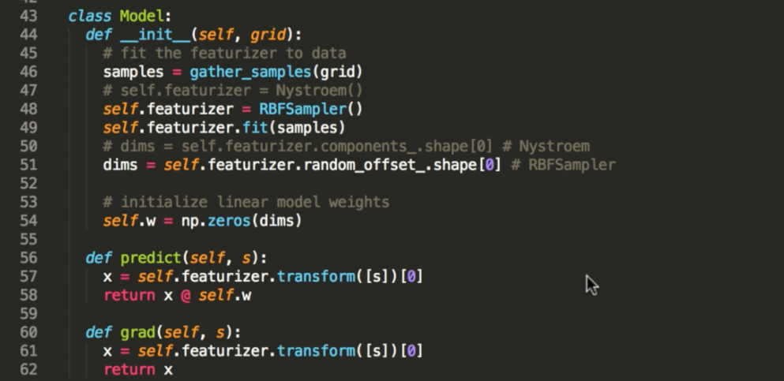

&nbsp;&nbsp;&nbsp;Next, we have the main section of this script. You'll notice that it's essentially the same as our previous code, except that we now update the model weights instead of the value table directly. So first we instantiate a standard grid object. Next, we print the grid rewards. 

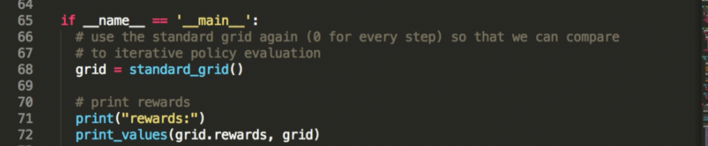

&nbsp;&nbsp;&nbsp;Next, we define a greedy policy. Feel free to change this, to experiment.  
Next, we create a model passing in our grid object. Next, we create an empty list which will store the mean square error per episode. 

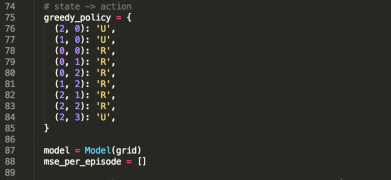

&nbsp;&nbsp;&nbsp;Next, we set n_episodes the number of episodes we want to learn from, and then we enter a loop for that number of episodes. Inside the loop, we reset our grid environment, which gives us our initial state `s`, then we call models predict, which gives us the predicted value for the state `s`. You see how this is used very shortly.   
Next, we define two new variables and n_steps, which measures how many steps we took in the episode and episode_err, which will store the total squared error in our estimates for the episode.  
Next, we enter a loop that quits when the episode ends inside the loop, we obtain an action by calling the Epsilon_greedy function. Next, we perform the action in the environment, which gives us our reward `r` and our next state `s2`.  
Next, we compute the target if the next state `s2` is terminal, then the target is just the reward `r` since the value of terminal states is zero. Otherwise, we calculate the value of `s2` using `model.predict()` then the target is `r + GAMMA * Vs2`

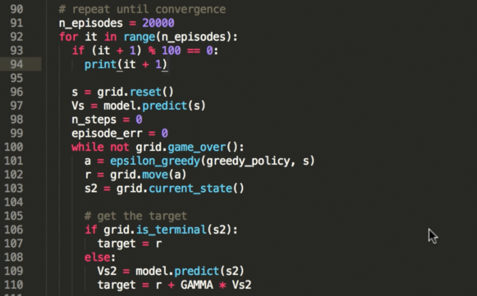

&nbsp;&nbsp;&nbsp;Next, we update our model. We start by computing the gradient of `Vs`, which is `modele.grad()` and then passing it `s`.  
Next, we calculate the TD error, note that this is why we previously stored `Vs`, if we had it, then we would need to call model.predict again, which would be inefficient.  
Next, we have the W using the formula we learned earlier. Next, we update and n_steps by incrementing it by one and we update episode_err by adding the square of the TD error.  
Next, we update the state `s` and the value `Vs`. by assigning `s2` to `s` and `Vs2` into `Vs`.  
Next, when we finish the episode, we calculate the mean squared error over the episode by taking the total episode error and dividing by the number of steps, then we append this to our list of mean squared errors.  
Next, we plot the mean squared error per episode. 

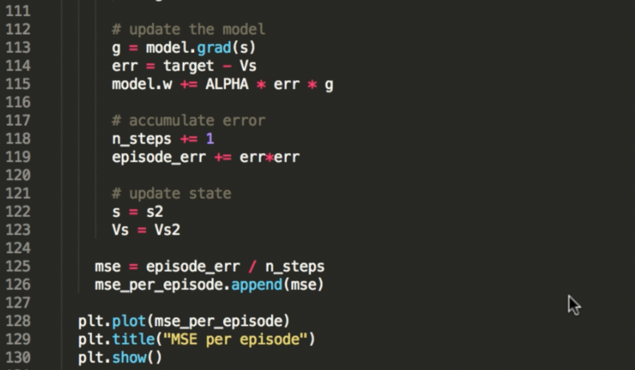

&nbsp;&nbsp;&nbsp;Next, we obtain the predicted value for each state. We do this by looping through each state and for those that are not terminal, we use model that predicts otherwise. We assign it to zero. Finally, we prince our predicted values along with the corresponding policy. 

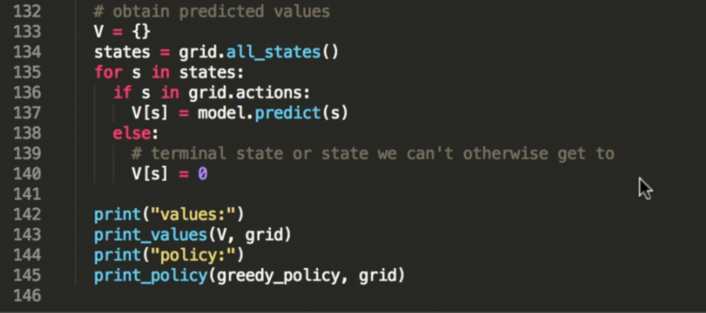

&nbsp;&nbsp;&nbsp;OK, so let's run this and see if we get.  
Now, you might notice something strange, which is that the mean square error doesn't seem to go down over time like you might expect in other applications, such as supervised learning. Of course, this is because we are using Epsilon Greedy, which sometimes brings us to different states which have different values than what is dictated by the greedy policy. But if we only acted according to the greedy policy, then we wouldn't be able to learn the values of some of those states.

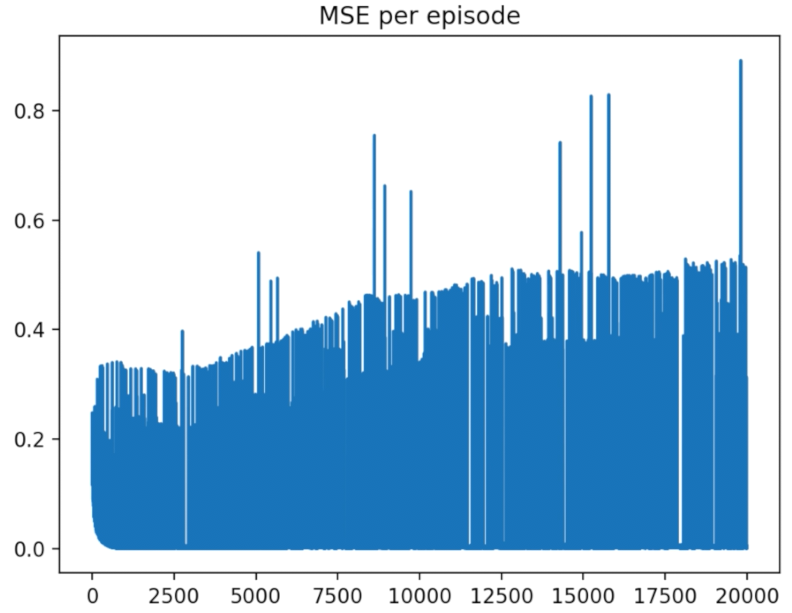

&nbsp;&nbsp;&nbsp;If we look at the learned value function, we can see that the values are pretty close to what we would expect. They are large going into the gold state and they decrease the further away you get. They are larger negative going toward the losing state. And they also decrease the further away you get. So the results make sense, even though the mean squared error does not decrease.

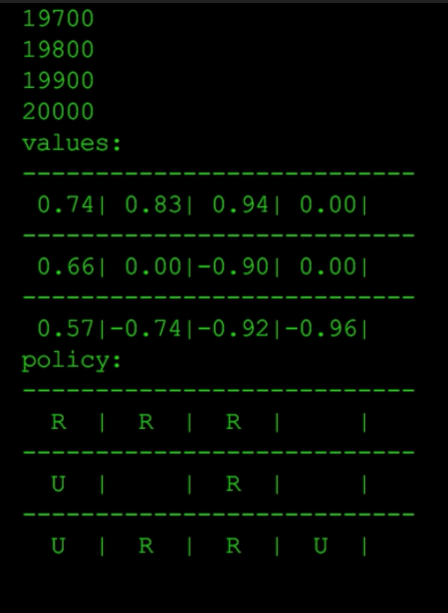

[Code_24](../code_files/24_approx_prediction/approx_prediction_test.py)

[Code_24_Org](../code_files/24_approx_prediction/approx_prediction.py)

# Approximation Methods for Control

&nbsp;&nbsp;&nbsp;In this lecture, we're going to continue our discussion about how to apply approximation methods and reinforcement learning.  
So we just learn how to use function approximation for approximating the state value `V(s)` . The next task for us is to consider how we will approximate the action value of `Q(s,a)`. Previously, our method was to apply some feature expansion `phy` to the state `s`. This would give us a new feature, Vector X, then we could take X dot with the way vector W and get an approximation for `V(s)`. But now things are a bit more complicated because of the action.  
In this case,  We're going to simply have a new feature expansion `phy` that transforms both the state and the action. Once we have that, we can again just dot it with a wave vector w to get our approximation of `Q(s,a)`.

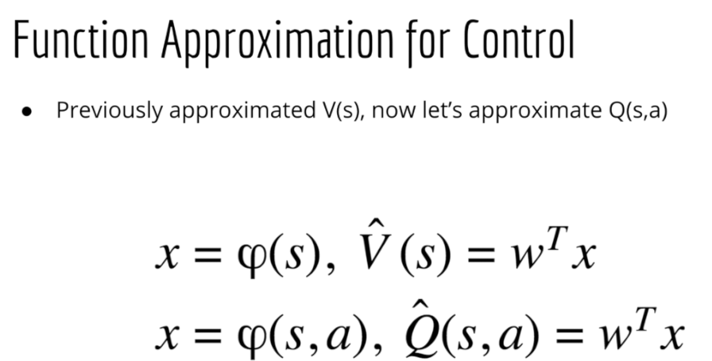

&nbsp;&nbsp;&nbsp;So let's consider how `phy` we can act on both the state and in action.  
In grid world, our actions are categorical up, down, left and right. In machine learning, One simple way to encode categorical variables is to use what is called `one hot encoding`. So since we have four actions, our actions will be encoded as four dimensional vectors. up might then be assigned to 1000, down could be 0100, left could be 0010 and right could be a 0001.  
OK, so pretty simple. Then we can make a new vector by simply concatenating the state vector and the actions. So far grid world position is two three and our action is up. Then the total concatenated vector would be two three one zero zero zero. And now we just have a simple vector so we can apply a feature expansion such as the RBF kernel as usual.

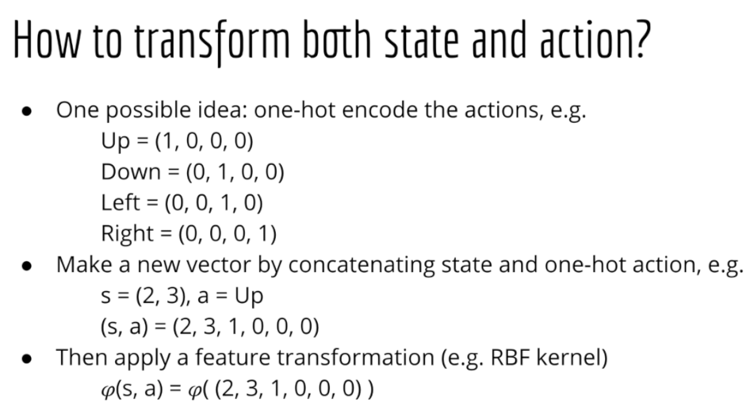

&nbsp;&nbsp;&nbsp;Once we've done that, the process of updating the wait vector W, is just as simple as it was for the state value. Again, we have some target `G` and we want to minimize the squared error using stochastic gradient descent. So for a single sample, our loss will be `(G - Q^(s,a))^2`. Then our gradient with respect to W is minus two times G minus the prediction times X, and at this point our gradient update rule is the same as usual. In fact, no different from before.

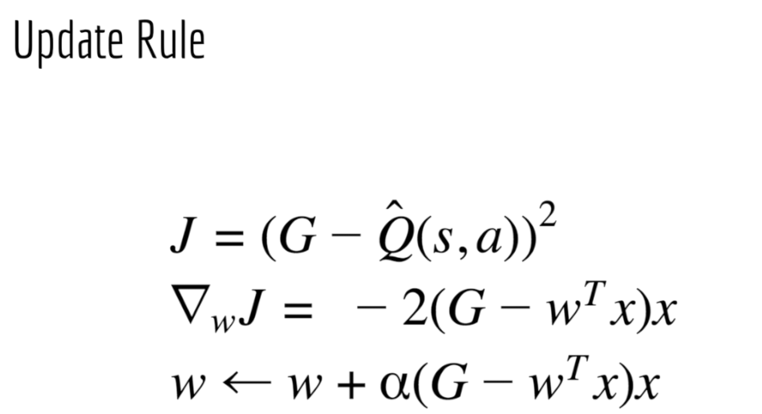

&nbsp;&nbsp;&nbsp;Again, a function approximation for control applies to all the methods we've learned previously in the course. So if you're doing Monte Carlo, then your target is the full return `G`. If you're doing SARSA, then your target is `R + GAMMA * Q(s', a')`. If you're doing Q learning, then your target is `R + GAMMA * max Q(s', a')` overall action `a'`.  
OK, so hopefully you can agree that this is pretty simple. In this course we'll be focusing on Q Learning, but as an exercise you'll be assigned to implement the other methods as well.

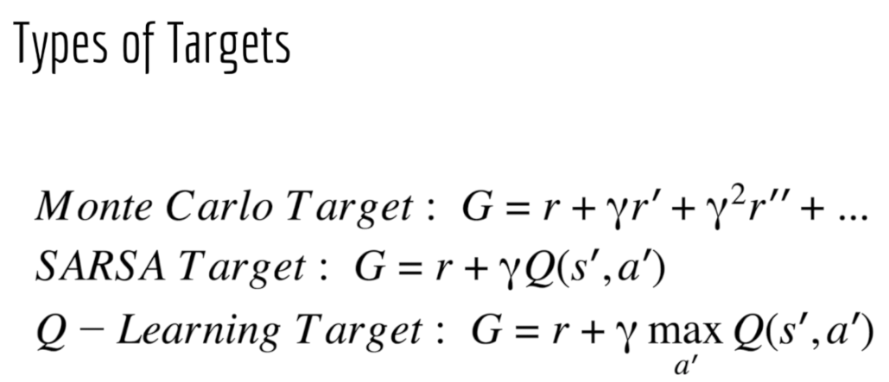

&nbsp;&nbsp;&nbsp;So although you can probably do this yourself by now, let's look at the pseudocode for completeness.  
To start, we initialize a random wait vector W, which is the same size as the concatenated vector of `s`, `a` together. This also effectively initializes a policy which is derived from Q.  
Next, we do a loop over some number of episodes. Inside the loop, we reset the environment and obtain the initial stage.  
Next, we enter an inner loop over each step of the episode. Inside this loop, we use Epsilon greedy to determine the next action to take. Then we perform this action in the environment. This gives us back the next state `s'` and the reward `r`. 
Next, we assigned the target value. If `s'` as a terminal state, then the target is just the reward `r` otherwise it's `R + GAMMA * max Q(s', a')` overall action `a'`.  
Next, we update you using our gradient ascent formula. Finally, we assign `s'` to be `s` for the next iteration of the loop. OK, so that's it for Q Learning with function approximation.

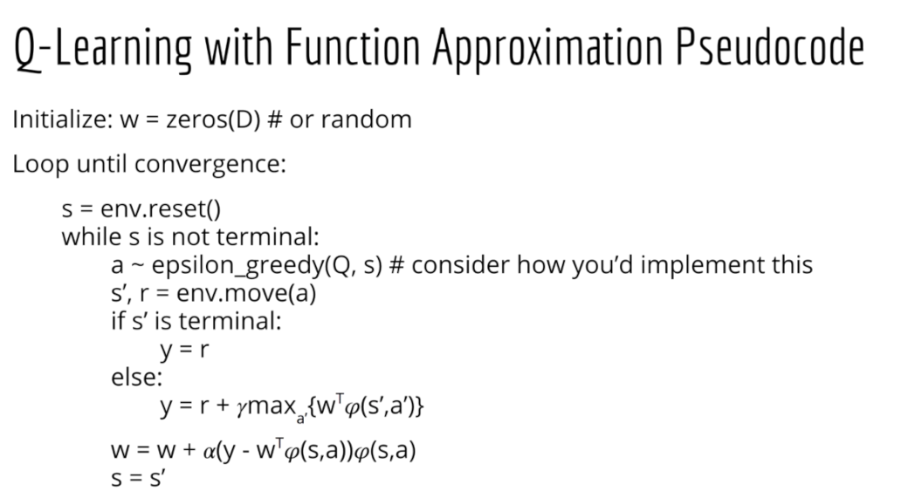

# Approximation Methods for Control Code

&nbsp;&nbsp;&nbsp;In this lecture, we'll be looking at how to implement function approximation for control. Specifically, we'll be looking at Q Learning, although, as mentioned, other methods are possible.  
So, again, the main thing that has changed about the imports is that we are now importing kernel approximation methods from skitlearn , such as the RBFsampler.  
Next, you'll see that we've defined the usual constants, such as Gamma Alpha and the list of actions. However, there are a few more here which will be useful in this script. Specifically, we have a mapping from actions to integers. This is basically the reverse mapping of the list of all possible actions. For example, if I index all possible actions at Index zero, that will return `U`, which means up. If I pass in the string `U` into this new dictionary `action2int`, I will get the integer zero. OK, so these are just the reverse of each other.  
Next, we have another mapping which maps an integer action to its corresponding one, hot encoding. You'll see that this uses the function which returns an identity matrix. You should be able to confirm that this behaves as expected. For example, if I index this array at row zero, I will get one zero zero zero. If I index this array at row one, I will get zero one zero zero and so forth.  

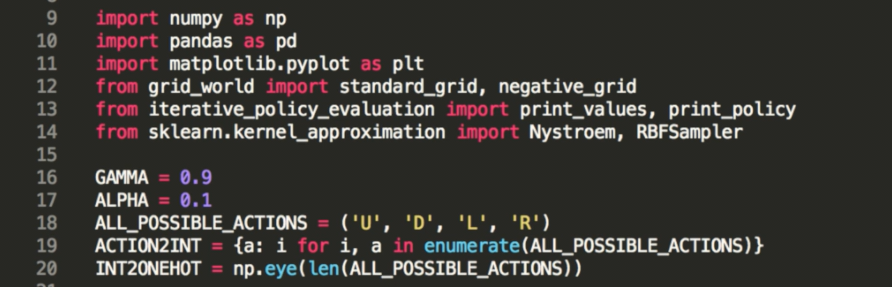

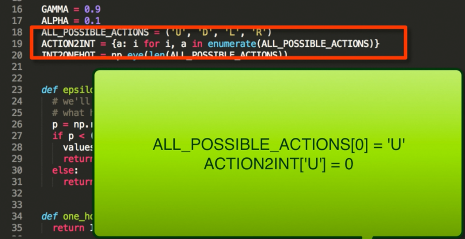

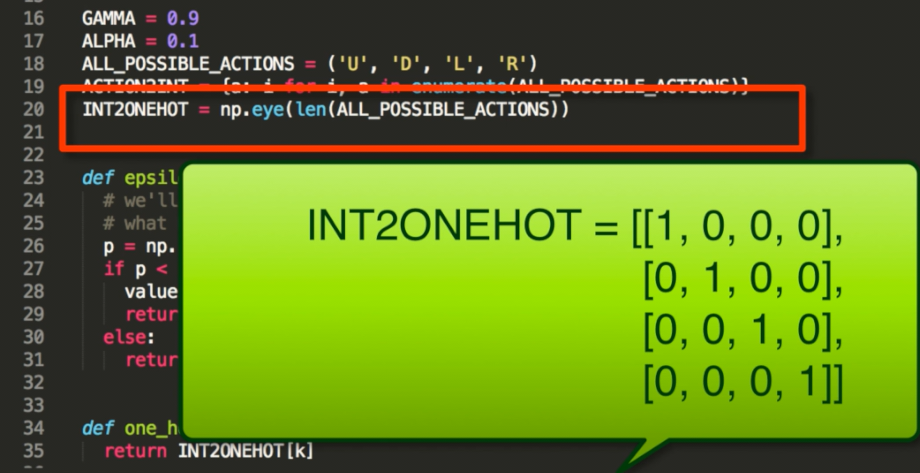

&nbsp;&nbsp;&nbsp;Next, we have our epsilon_greedy function, which is a bit different from before. Instead of taking in a Q table or a greedy policy, we now take in a model. Inside the function when we want to take a greedy action. We first have to call a function to get a prediction over all possible actions for a given state. This uses the function to predict all actions, which you will see shortly. This returns a list of values from which we can then take the `arg max`. However, the `arg max` returns an integer index. Luckily, we have something that can map an integer index to an action string, which is our list of all possible actions. So this is why it's useful to have all those action constants we defined above.  
Next, we have a function to return, the one hot encoding of an integer action. Basically, this just indexes the `int` to one hot array at row[K] and return is the result.  
Next, we have a function to merge a state action pair. This is needed before we perform a feature transformation. So the key step here is that we have to convert our action, which is a string representing up, down, left or right to a one hot array. To do this, we first pass in our action `a` into the `actiontoint` dictionary. This will return an integer. Then we can pass the result into the one hot function which returns a one hot encoding of that integer. Then we can concatenate the state with this one hot encoding of the action. 

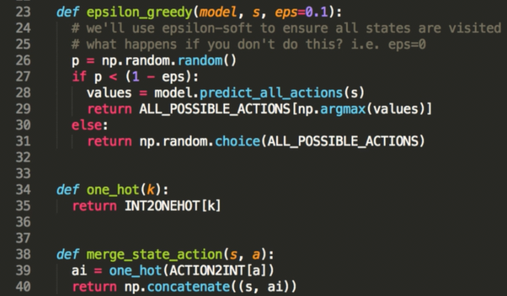

&nbsp;&nbsp;&nbsp;Next, we have the gather samples function, this is nearly the same as what you saw for the prediction code with one small difference. The main difference is that each sample is a state action pair rather than just the state. So inside the loop, we randomly select some action `a`. Then we merge the state and action into a vector called `sa`. Then we add `sa` to the list of samples.

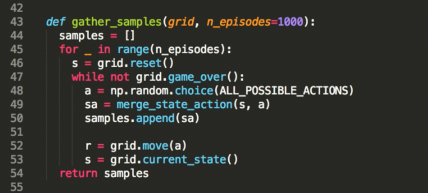

&nbsp;&nbsp;&nbsp;Next, we have the `Model` class. Again, this is nearly the same as before, the constructor is the same, so we won't discuss that again.  
The predicate function is slightly different, instead of taking in only state, it now takes in a state and action. After merging the state and action into a vector we call the transform function using our `featurizer` as before.  
Next, we have a function called Predict_All_Actions, so you've already seen why this is needed. Every time we choose a greedy action. We need to determine `Q` overa ll actions. Therefore, this loops through all possible actions, given a state `s` and computes the prediction for each state action pair.  
Next, we have the grad function, which, again, is only a bit different from before and now takes in state and action instead of just the state.

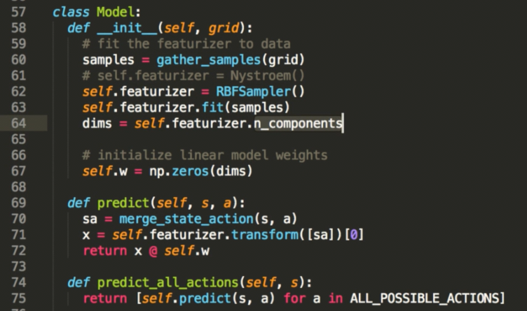

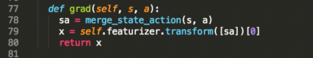

&nbsp;&nbsp;&nbsp;Next, we have the main section. We start by defining a grid environment.  
Next, we prints out the rewards on our grid.  
Next, we instantiate a model.  
Next, we create a list that will store the total reward per episode.  
Next, we have a dictionary for storing the number of times we visit each state. Since you've seen this before, you should have a pretty good idea of why we want to have this, basically because we're using Epsilon greedy. The number of times we visit each state will not be uniform. Some states will be visited only very rarely. And so their value estimates and maybe even the final policy for those states might not be optimal.  
Next, we set  n_episodes, the number of episodes we want to learn from. 

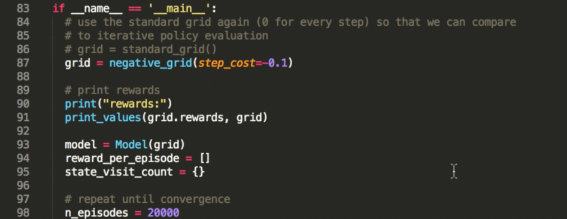

&nbsp;&nbsp;&nbsp;And then we enter a loop for that number of episodes. Inside the loop, we reset our environment, which puts us into the initial stage.  
Next, we update our visit state count for the state.  
Next, we initialize episode reward to zero.  
Next, we enter a loop that exits when the episode is over. Inside this loop, we use our epsilon_greedy function to select an action. Then we perform this action in the environment which yields the reward `r` in our next state `s2`.  
Next, we update our state visit count for the state `s2`.  
Next, we compute our target, if we're in a terminal state, then our target is just the reward. Otherwise, we have to compute the maximum value of the next state by first calling, predict _ll_actions on the next state `s2` then we take the max and add that to the reward to get the target. 

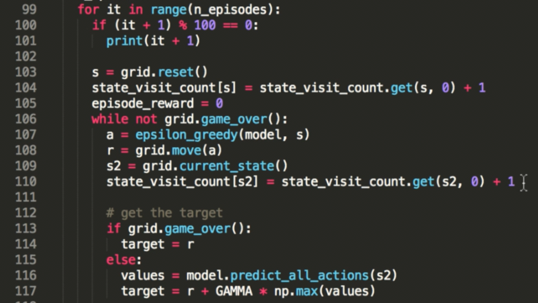

&nbsp;&nbsp;&nbsp;Next, we update our model. We start by computing the gradient for the state action pair by calling the `grad` function.  
Next, we calculate the TD error. Then we update W using stochastic gradient descent.  
Next, we add the reward `r` to a sum of total rewards. And we update the state `s` to be the next state `s2`.  
Next, when the episode is complete, we append the episode reward to our list of rewards.  
Next, when all episodes are complete, we plot the reward per episode. 

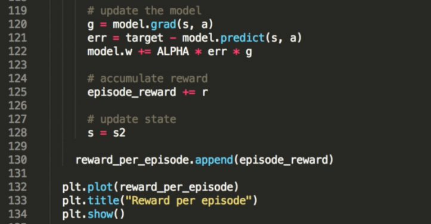

&nbsp;&nbsp;&nbsp;Next, we calculate `V*` and `pi*` using our model. So we first loop over each state in the state space if it's not a terminal state. Then we have to do a computation. Otherwise it's zero. So if we have to do a computation, we start by calling `model.predict_all_actions`, to get the value over all actions for a given state. Then `V*(s)` is the max over this list of values. The policy is the `arg max` but since we're using strings to represent our actions, we have to index our list of all_possible_actions using the integer version of the action.  
 Next, we print the value function and the policy that we just found.

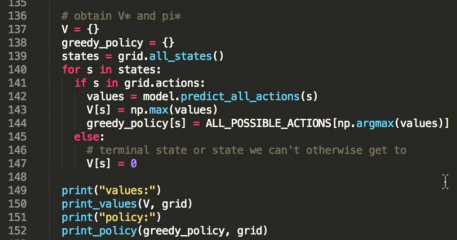

&nbsp;&nbsp;&nbsp;The last thing we do in the script is convert our account of state visits to a pan data frame, as you recall. This is just so that we can take advantage of the formatting that Pans does when it prints data frames out to the console. Since we've seen this code before, I won't explain it again. 

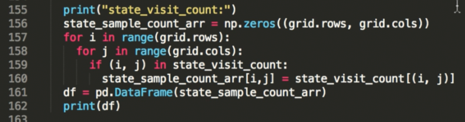

&nbsp;&nbsp;&nbsp;So let's run this and see what we get.  
OK, so as expected, we see that the episode reward quickly increases to the maximum value. In addition, our final value and corresponding policy makes sense.  
Note that sometimes the policy might not be sensible for the state at the bottom. Right. And of course, this is due to the fact that this state doesn't get visited very often during the training process.

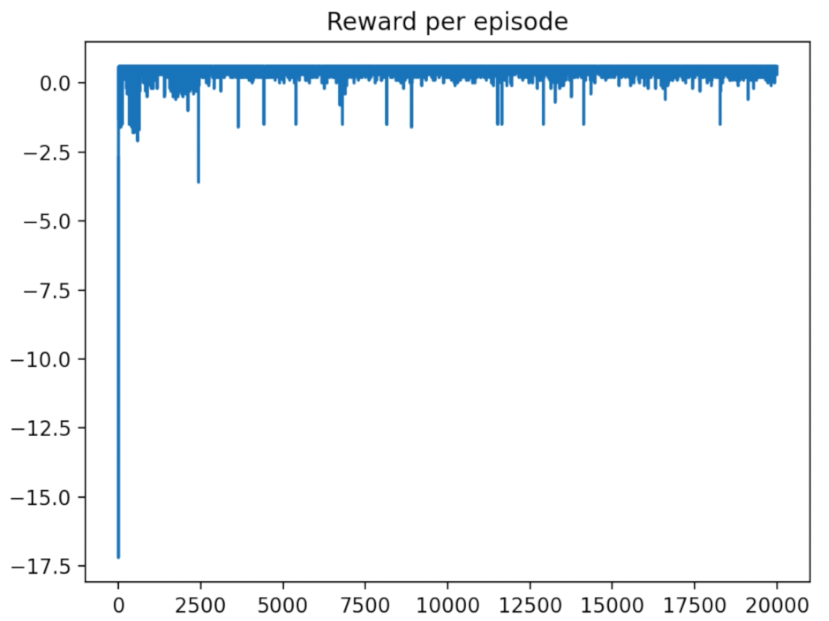

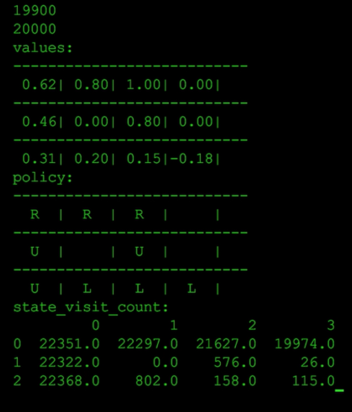

[Code_25](../code_files/25_approx_control/approx_control_test.py)

[Code_25_org](../code_files/25_approx_control/approx_control.py)

# CartPole

&nbsp;&nbsp;&nbsp;In this lecture, we'll be looking at Q Learning with function approximation again, but for a new environment. This lecture will look at the Cartpole environment, which is part of openAI gym. So before we look at the code, we're going to discuss some preliminary basics like what is gym, what is Cartpole and so forth. So first, if you've never heard of OpenAi Gym before, it's a Python library that contains many reinforcement learning environments from Cartpole to Atari games. Although if you want Atari games, you'll have to install some extra add ons. Getting gym is very easy. If you don't have it yet, simply use PIP install gym, as you normally would for any other Python library.

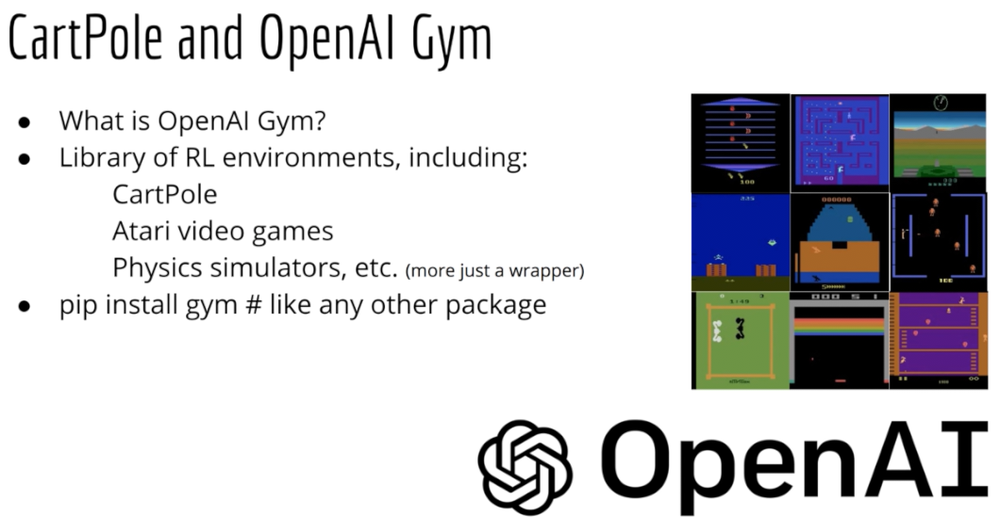

&nbsp;&nbsp;&nbsp;OK, so once you have GYM, you have access to carpool, but what is carpool? Carpool is an environment where your job is to balance a pole that sits on top of a car. You can imagine that this would be challenging for humans since the pole will just fall down. Note that the pole rotates around a pivot point where it is attached to the car. Now the card itself sits on a track, so it's limited to moving only left or right. In fact, this setup is a classic problem in control theory and reinforcement learning. If you ever have an opportunity to take a course and control theory, you'll get to work with Cartpole in the real world. That is a physical pool attached to a physical car that sits on a physical track. Your state vector consists of sensor readings and your actions are real instructions to make a motor spin one way or the other.

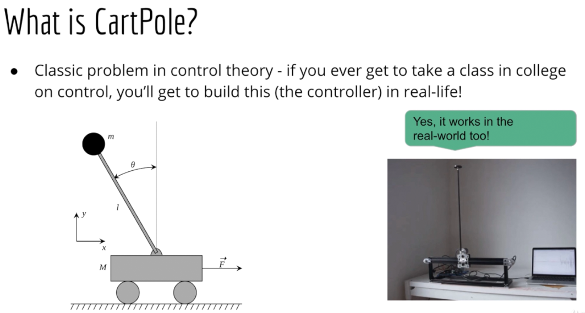

&nbsp;&nbsp;&nbsp;So in this virtual version of Cartpole, what are the state's actions and rewards?  
Well, you're encouraged to read the documentation for Cartpole, but here are the basics. The state is a four vector consisting of the Cartes position and velocity and the polls angle and angular velocity.  
The actions are to either push the cart left or right.  
The reward is plus one for every timestep that the Polan car stay within a certain range. When your pull falls down past a certain angle or the cart goes past a certain position, the episode will terminate and you'll stop receiving rewards.  
Note that in previous iterations of GYM, it was possible for this environment to go on indefinitely. However, for newer versions, the episode automatically ends after you reach two hundred steps. Therefore, the maximum reward you can achieve for episode is two hundred. There are ways to hack around the code to make it last forever, but we won't consider how to do that. So essentially the thing you should notice about Cartpole is that the state variables are now continuous values. This makes it the perfect candidate for function approximation.

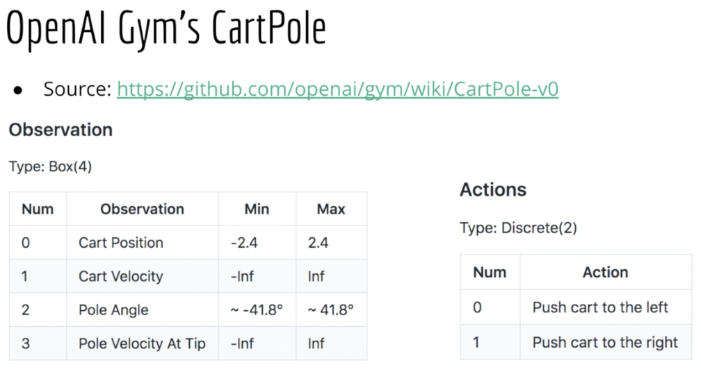

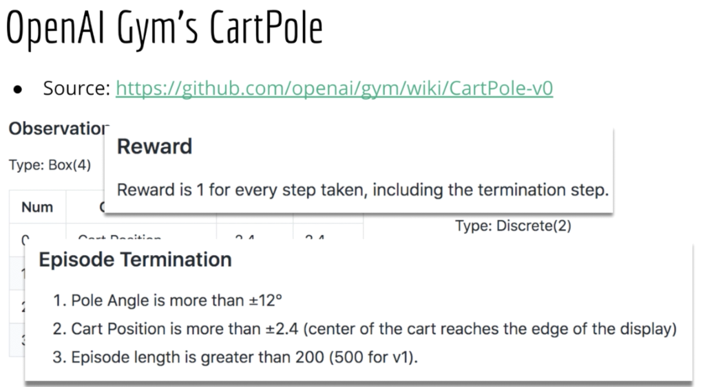

&nbsp;&nbsp;&nbsp;The next thing we're going to do is look at how to use GYM in Python code. You'll see that it's very similar to what we've done in this course. So the changes we need to make are minimal. And this example will assume that our policy is just to perform actions according to a uniform random distribution.  
So to start, we instantiate a new environment by calling `gym.make()` passing in the name of the environment. Again, note that you can get these names from the documentation.  
Next, we call `env.reset()`, which puts our agent back into the initial state, and this function also returns that state. So this is the same as the code in this course.  
Next, we set a boolean variable called Done to false. Will be updating this variable as we go along and this will become true when we reach a terminal state.  
Next, we enter a loop that exits when Done becomes true. Inside the loop, we call `env.action_space.sample()` in order to select a random action. Note that this is just one way of selecting an action. in gym, discrete actions are encoded as integers. So an alternative would have been to use numpy to select a random number from a set containing zero and one.  
Next, we call the function `env.step` passing an action `a`. Note that this is similar to our `grid.move()` function. The step function returns for items, the next state, the reward, the done flag and an info dictionary. Typically, this info dictionary is empty so it can be ignored.  
One optional step is to call the `env.render()` function. This will open a new window and show you visually the Cartpole environment. So you can actually see the card system move around on the track and how well your agent controls it. This also applies to video games. So if you have a video game environment, you can call `env.render()` and it will show you the frames of a video game. However, keep in mind that rendering video on your screen is slow, so you may not want to do this all the time, especially when your agent is training.  
Note that at this point, the Done flag is updated, so when this becomes true, our episode is terminated. OK, so that's the interface for OpenAI Gym environments. Hopefully you agree that it's nothing too unexpected.

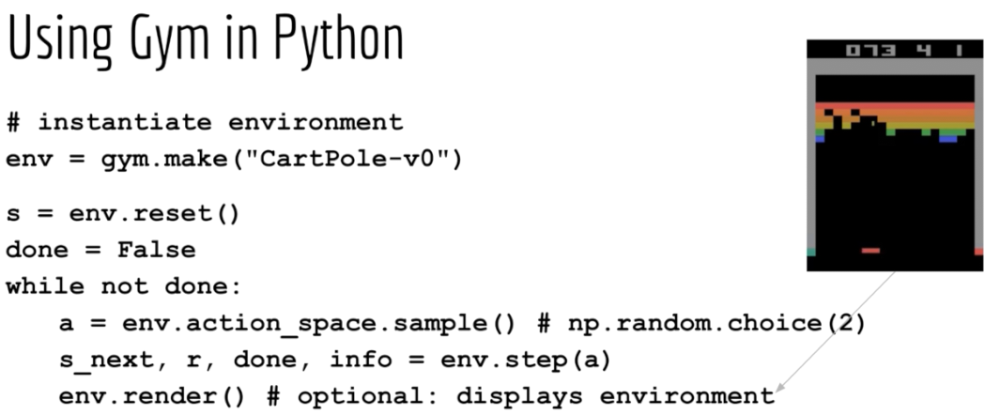

# CartPole Code

&nbsp;&nbsp;&nbsp;So next we're going to look at the code, which we'll find an optimal controller for CartPole. The thing I want to emphasize in this code is not how we're doing new stuff with a new environment, but how it's essentially the same as what we've already seen.  
So at the top we have all our standard imports, numpy, matplotlib, RBFSampler. And now GYM.  
Next, we set Gamma and Alpha, which are the same variables we had before. As always, you might want to tune these values to the environment you're working with. 

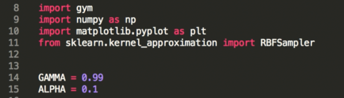

&nbsp;&nbsp;&nbsp;Next, we have the Epsilon_greedy function, which is the same as before.  
Next we have the gather_samples function, which is pretty much the same as before. The only difference now is that the input is a gym environment instead of our grid world. Note that when we want to concatenate the state end action into a single vector, there's no need to one hot encode the action. This is because the action is a binary variable which can only take on the values 011. So in this way, this script is even simpler than what we saw before. 

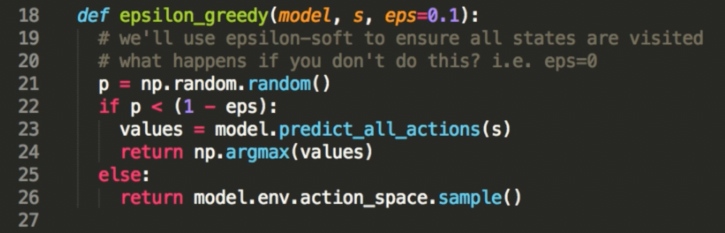

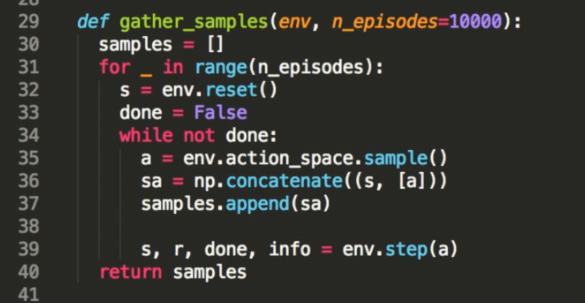

&nbsp;&nbsp;&nbsp;Next, we have the model class. Again, this is exactly the same as before. The main difference is that when we concatenate the state and action, we don't need to one hot encode the action as mentioned. Note that we do need to put the action into a list since you can't pass Scaler into the concatenate function.
 
Next, we have a function to test our agents. Now, this is because during training we're going to use Epsilon greedy. But it would be interesting to see what a reward would be if we took the greedy policy and perform that instead. So after we're finished training, we're going to set Epsilon to zero and play 20 episodes. This function will return the average reward per episode. Since this is all code you've seen before. There's nothing more to explain.
 
Next, we have a function called Watch Agents. This function plays a single episode with a greedy policy and calls the render function so that we can see what actually happens in the environment. Basically, the purpose of this function is for us to check how our agents is doing. So we're going to call this function before we start training to see that our agent does pretty bad. Then at the end of training, we're going to call this function again to see what our agent has learned to do. Again, there's nothing too surprising in this function, and the only real addition is that we're calling `env.render()`. 

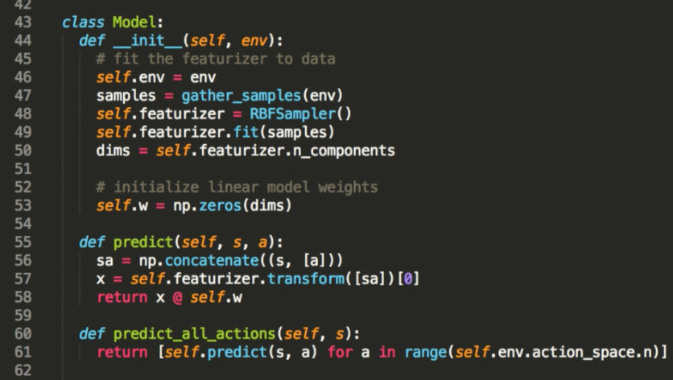

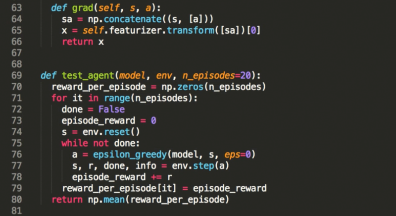

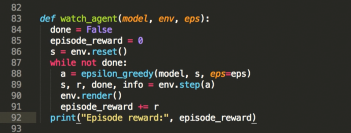

&nbsp;&nbsp;&nbsp;Okay, So next we have the main section. Again, I want you to notice that really nothing has changed between this code and the previous code. So we start by creating a new environment, by calling `gym.make()`.  
Next, we create a model passing in our environment.  
Next, we create an array to store the reward per episode.  
Next, we call the watch_agent function. This is for us to see how our agent performs without any training. 

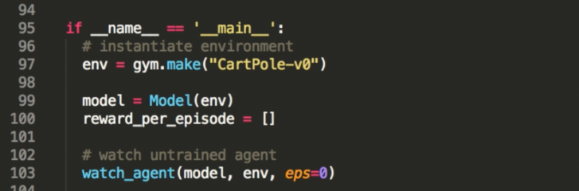

&nbsp;&nbsp;&nbsp;Next. We loop through 1500 episodes. Inside the Loop, we play an episode and perform our updates exactly the same way we did before. I'm not going to walk through this again since I want you to confirm that nothing has changed. The only difference is the gym API. So we now call `env.step()` and check the done flag to see when our episode is terminated. 

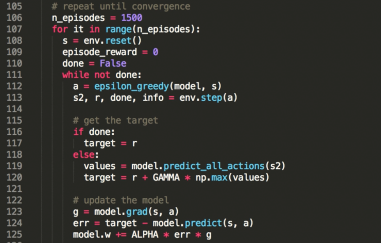

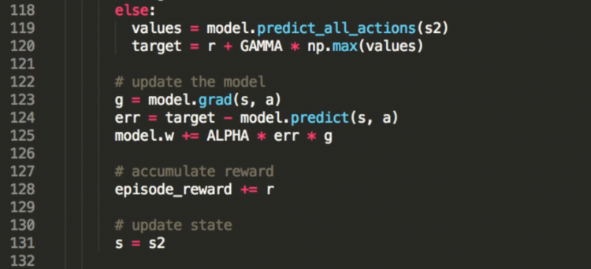

&nbsp;&nbsp;&nbsp;One small difference at the end of the loop is that we're going to let our agent exit early if we reach the desired level of performance. So this is going to check that the last 20 episode rewards were all equal to 200. And if this is the case, then we'll break out of the loop. At the end of our training loop, we're going to call the test_agent function and we'll print out the average reward over 20 episodes. We'll also plot the reward per episode so you can see how well our agent did as it learned. The last thing we'll do is call the watch_agent function once again with epsilon equals zero. So you can see how the agent performs yourself. 

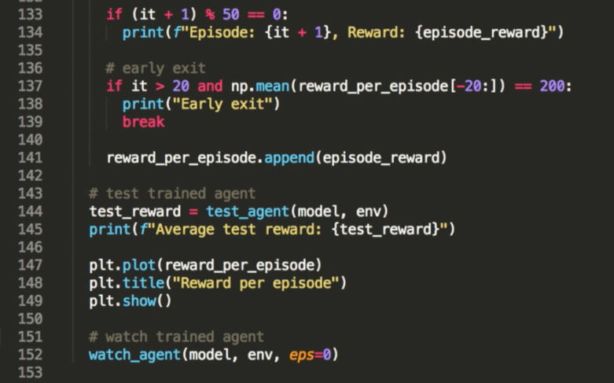

&nbsp;&nbsp;&nbsp;So let's run this and see what we get.  
Okay. So we can see that when our agent is initialized, it does not perform well. In fact, you may have to rewind this video to catch what actually happened, since it goes by very fast. Note that when the episode ends, the video freezes. So during training, nothing will happen inside this frame.  

Okay. So we can see that our agent has trained successfully and exited the training loop early. We can see that our average reward per episode during testing is 200, the maximum reward per episode.

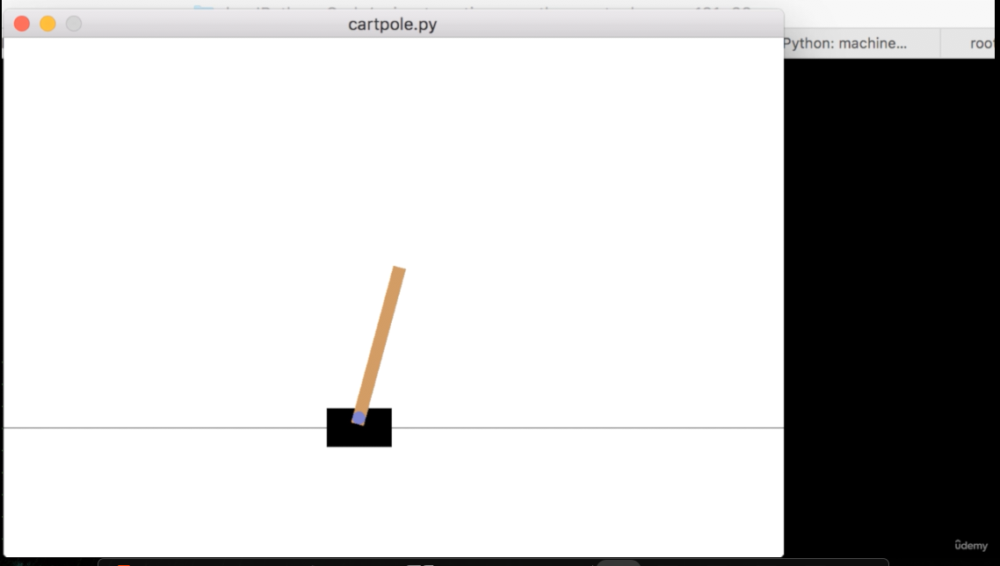

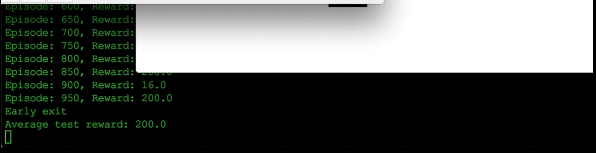

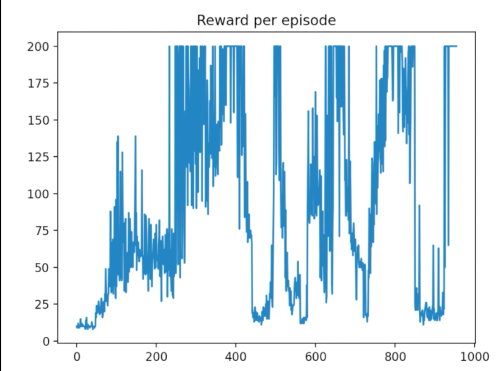

Finally, when we call watch agents again, we can see that it now performs a lot better than it did before. And it manages to balance the pull on top of the car.

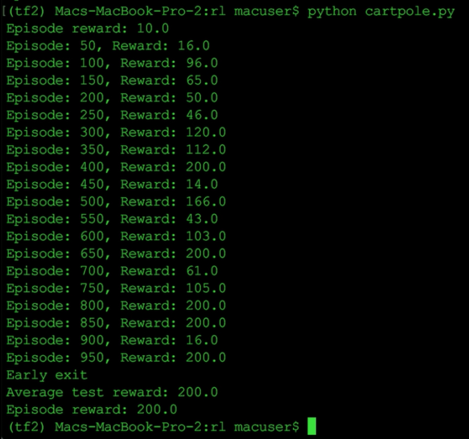

[Code_26](../code_files/26_cartpole/cartpole_test.py)

[Code_26_Org](../code_files/26_cartpole/cartpole.py)

# Approximation Methods Exercise

&nbsp;&nbsp;&nbsp;In this lecture, I'm going to assign some exercises to you to practice what you've learned in this section. Clearly, the concept of function approximation is very general. There are tons of combinations we could have tried. So in this lecture, I'm going to enumerate some of these things. And hopefully by doing these exercises, you will reinforce what you've learned in this course.  
OK, so the first thing you can try is other feature expansions, try polynomials of different degrees, have a look at skitlearn and see what other feature expansions are available.  

Number two, we discussed that there are many ways to form the target value. For example, Montecarlo and SARSA implement these. 

Number three, in this course, we used stochastic gradient descent, updating the weights for each separate target value, but how about batch gradient descent, for example, with Montecarlo This is natural because we effectively have all the returns at the same time after the episode is complete. 

Number four, if you know how to implement a neural network with Tesorflow or PyTorch or Keras or any other deep learning library, try using that instead of a static feature expansion. In this case, our gradient descent update looks more generic rather than using the gradient of a linear model, which is just the input feature X. We have the gradient of the model output with respect to the model parameters, which differs depending on which model you chose. Now, of course, you don't have to worry about what form this gradient takes since modern deep learning libraries take care of that for you. You also have access to other more advanced optimization techniques such as momentum atom and arms prop.

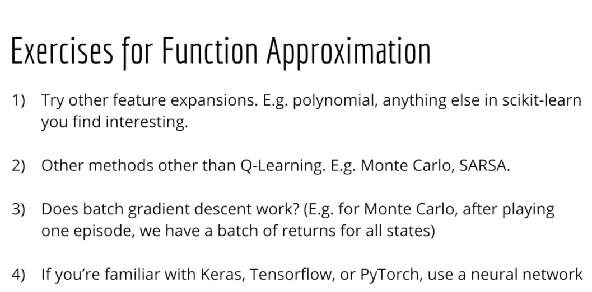

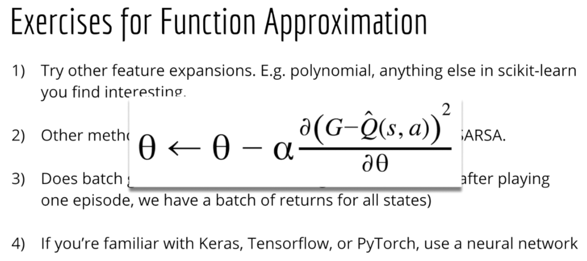

&nbsp;&nbsp;&nbsp;Number five, recall that in this section, we form the future expansion of the state action pair by one hot encoding the action and then concatenating that with the state. In practice, you actually have several options.

Another option is this. Suppose that we have `N` continuous variables and `K` possible discrete actions then to represent our state action pair as a vector, we could create a big vector of size N * K. If action one is chosen, then the first N elements would hold the state measurements and the rest would be zero. If action number two is chosen, then the next N elements would hold the state measurements and the rest would be zero. OK, so hopefully you get the idea the state gets put into different positions based on which action was chosen. So that's how we're able to differentiate between different actions.

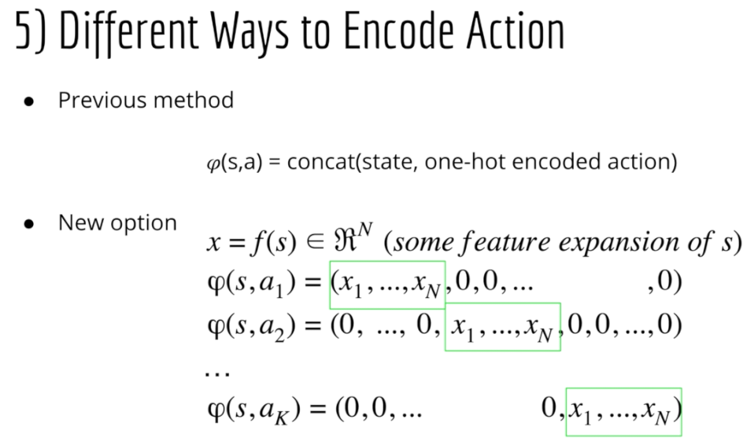

&nbsp;&nbsp;&nbsp;Yet another option is this. Instead of trying to combine the state inaction action into a single vector, just transform the state by itself, as we did for prediction. For the actions, simply create multiple outputs. For example, if we have `K` actions, then our model becomes `y^` equals big W times `phy(s)`.  
In this case, `y^` is no longer a scalar, but rather a vector of size `k`. The weight is now a matrix instead of just a vector of size `N` by `K`. So in this case each output prediction `y^` represents `Q(s,a)` for each possible action `a`.

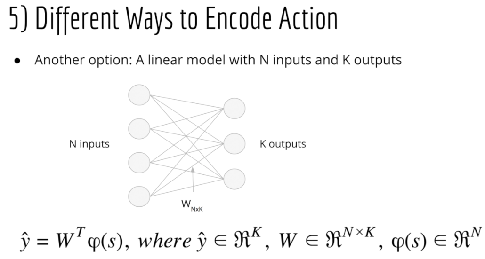

&nbsp;&nbsp;&nbsp;As part of this exercise, consider the pros and cons of each approach. 

which ones have more parameters and which ones have less, and if you're familiar with neural networks, consider this question both for linear models and neural networks.  
Which ones require more computation?  
Which ones can handle continuous actions? And if we do have continuous actions, what challenges? What do we have to overcome? 

OK, so please give these exercises a try and I'll see you in the next lecture.

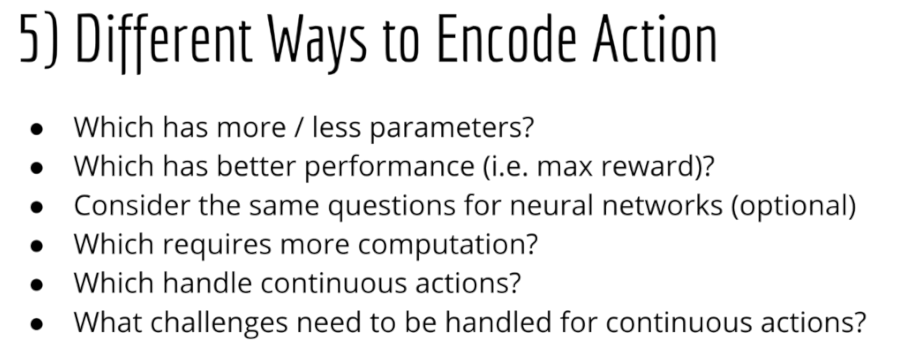

# Approximation Methods Section Summary

&nbsp;&nbsp;&nbsp;In this lecture, we will summarize everything we learned in this section. This section was all about function approximation for reinforcement learning. The motivation behind the section is clear.  
For modern problems like playing chess, go, video games and autonomous vehicles. The state spaces are too large or infinite in size. In these cases, tabular methods are limited. Now it's possible to take a continuous or infinite state space and simply democratize it into buckets. But even that will fail at some point. In practice, function approximation offers a reliable solution. It essentially allows us to compress the value function parameter space instead of having to enumerate all possible states. We only need to find a small number of parameters. This can help us predict the value even for states we have never seen before, as long as they are sufficiently similar to states that we have seen before.

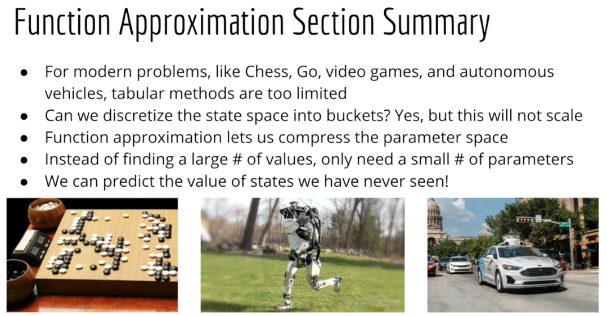

&nbsp;&nbsp;&nbsp;In this section, we first review linear models and how they learn via stochastic gradient descent. We then learn that linear models are actually not limited to modeling linear functions since we can use feature engineering. We considered polynomial feature expansions in the RBF Kernel.  
Next, we return to reinforcement learning and applied function approximation to prediction. This allowed us to find the value function of a given policy using a linear model.  
Next, we turned our attention to control and looked at Q learning with function approximation.  
Finally, we looked at a new environment called Cartpole, since this environment has a continuous state space. It allowed us to see the real power of approximation methods. Grid world is still a critical part of this course because it allows us to compare and contrast each method we learned while keeping the environment constant.

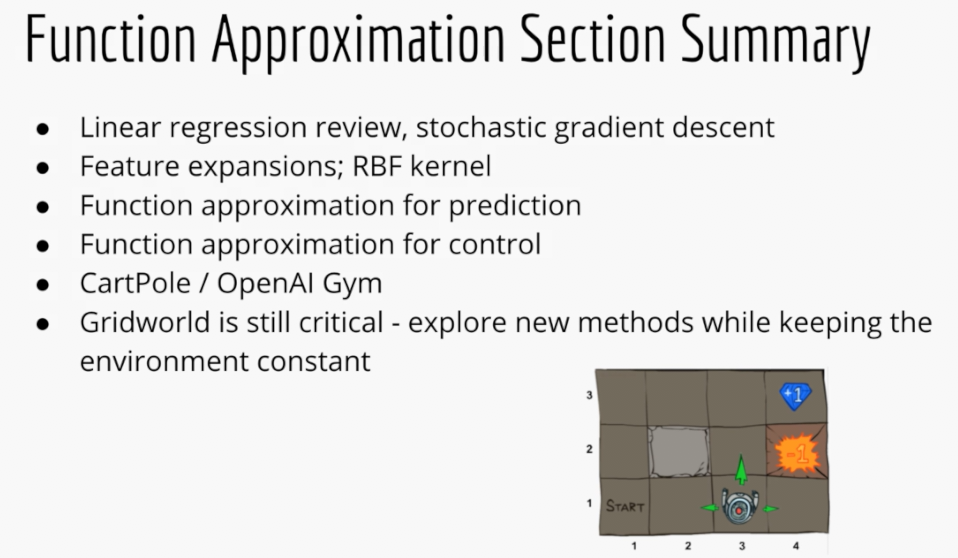

&nbsp;&nbsp;&nbsp;But CartPole allowed us to extend what we've learned with essentially zero effort. It lets you see what you're really capable of, despite the fact that grid world might seem overly simplistic. This is encapsulated in the rule. All data is the same. Using the exact same code, we were able to solve a much more complex environment with essentially zero effort. This is because, like all other machine learning algorithms, the same code works no matter the data.  
When we consider things from the perspective of the computer, we know that the computer doesn't know anything about CartPole or Newtonian physics or video games. All the computer can see is numbers. So for us, while it may seem like there's a big difference between Dataset one and data set two or Environment one and environment two, the computer says, well, to me it all just looks like numbers.

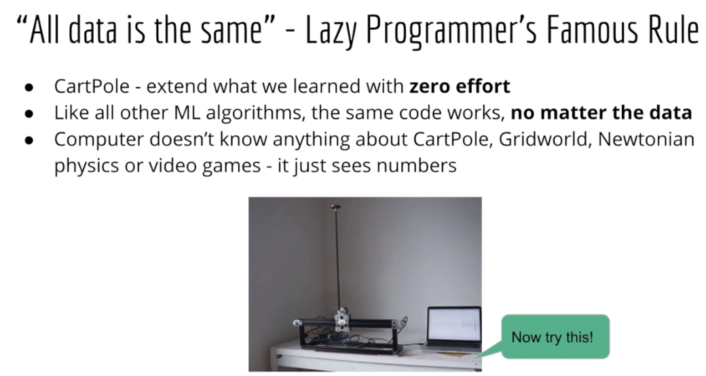

